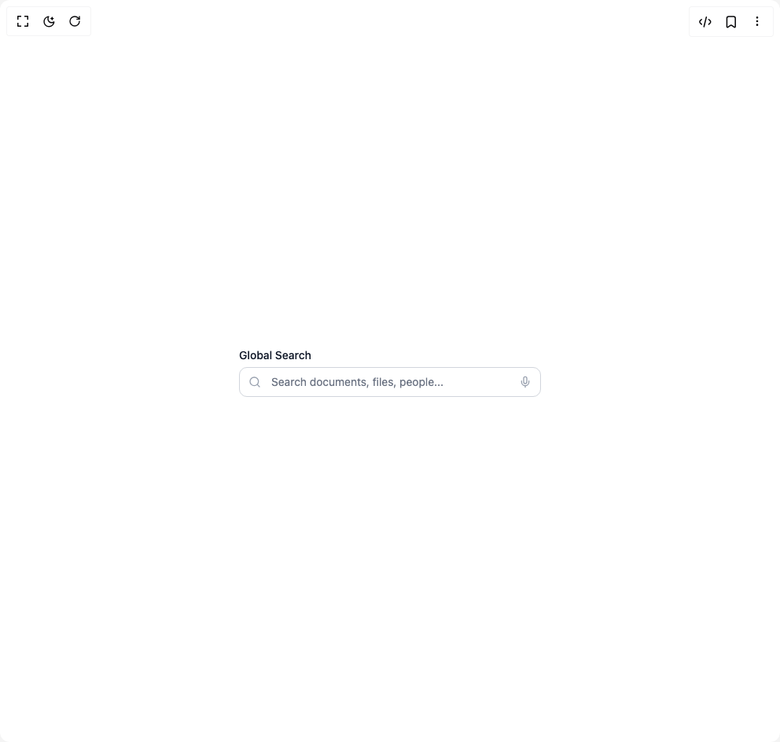

# Build Field Components in BuilderStudio

> Build this component in our Agentic IDE: [BuilderStudio](https://builderstudio.dev).
>
> Join the BuilderStudio community on [Discord](https://discord.gg/QdWeSGCqfe) and [Reddit](https://reddit.com/r/builderstudio).



## Component

- Author group: `anubra266`
- Component: `field-components`
- Variant: `loader-input`
- Rendered HTML snapshot: [`rendered.html`](rendered.html)

## BuilderStudio prompt

You are implementing a React component based on a component reference.

## Component identity

- Author: anubra266
- Component slug: field-components
- Demo slug: loader-input
- Title: field-components
- Description: 

## Goal

Recreate this component in a React + TypeScript + Tailwind CSS project. Preserve the visual layout, spacing, colors, border radius, shadows, interaction behavior, animation behavior, responsive behavior, and dark mode behavior shown in the rendered demo.

## Implementation requirements

- Use React and TypeScript.
- Use Tailwind CSS classes whenever possible.
- Keep the component self-contained unless the source files require helper components.
- If the source uses CSS variables, custom CSS, animations, or keyframes, include them.
- If the source uses external packages, list and use the required packages.
- Preserve accessibility attributes, button semantics, links, keyboard behavior, and ARIA attributes when visible in the source.
- Do not replace the component with a simplified placeholder.
- Return complete production-ready code.

## Dependencies

No reference metadata available.

## Rendered DOM snapshot

This is the rendered demo HTML extracted from the live preview. Use it to verify structure, class names, visible content, and layout.

```html
<div id="root"><div class="w-screen min-h-screen flex justify-center items-center"><div class="w-screen min-h-screen flex justify-center items-center"><div data-scope="field" data-part="root" id="field::«r0»" role="group" class="max-w-sm w-full"><label data-scope="field" data-part="label" id="field::«r0»::label" for="«r0»" class="text-sm font-medium text-gray-900 dark:text-gray-100">Global Search</label><div class="relative mt-1"><div class="absolute inset-y-0 left-0 flex items-center pl-3"><svg xmlns="http://www.w3.org/2000/svg" width="24" height="24" viewBox="0 0 24 24" fill="none" stroke="currentColor" stroke-width="2" stroke-linecap="round" stroke-linejoin="round" class="lucide lucide-search h-4 w-4 text-gray-400 dark:text-gray-500" aria-hidden="true"><circle cx="11" cy="11" r="8"></circle><path d="m21 21-4.3-4.3"></path></svg></div><input id="«r0»" data-scope="field" data-part="input" placeholder="Search documents, files, people..." class="block w-full rounded-lg border border-gray-300 dark:border-gray-600 bg-white dark:bg-gray-800 px-3 py-2 pl-10 pr-10 text-sm text-gray-900 dark:text-gray-100 placeholder-gray-500 dark:placeholder-gray-400 focus:border-gray-900 dark:focus:border-gray-100 focus:outline-hidden focus:ring-1 focus:ring-gray-900 dark:focus:ring-gray-100" type="search" value=""><div class="absolute inset-y-0 right-0 flex items-center pr-3"><svg xmlns="http://www.w3.org/2000/svg" width="24" height="24" viewBox="0 0 24 24" fill="none" stroke="currentColor" stroke-width="2" stroke-linecap="round" stroke-linejoin="round" class="lucide lucide-mic h-4 w-4 text-gray-400 dark:text-gray-500" aria-hidden="true"><path d="M12 2a3 3 0 0 0-3 3v7a3 3 0 0 0 6 0V5a3 3 0 0 0-3-3Z"></path><path d="M19 10v2a7 7 0 0 1-14 0v-2"></path><line x1="12" x2="12" y1="19" y2="22"></line></svg></div></div></div></div></div></div>
```

## Reference source files

No reference source files were available.
