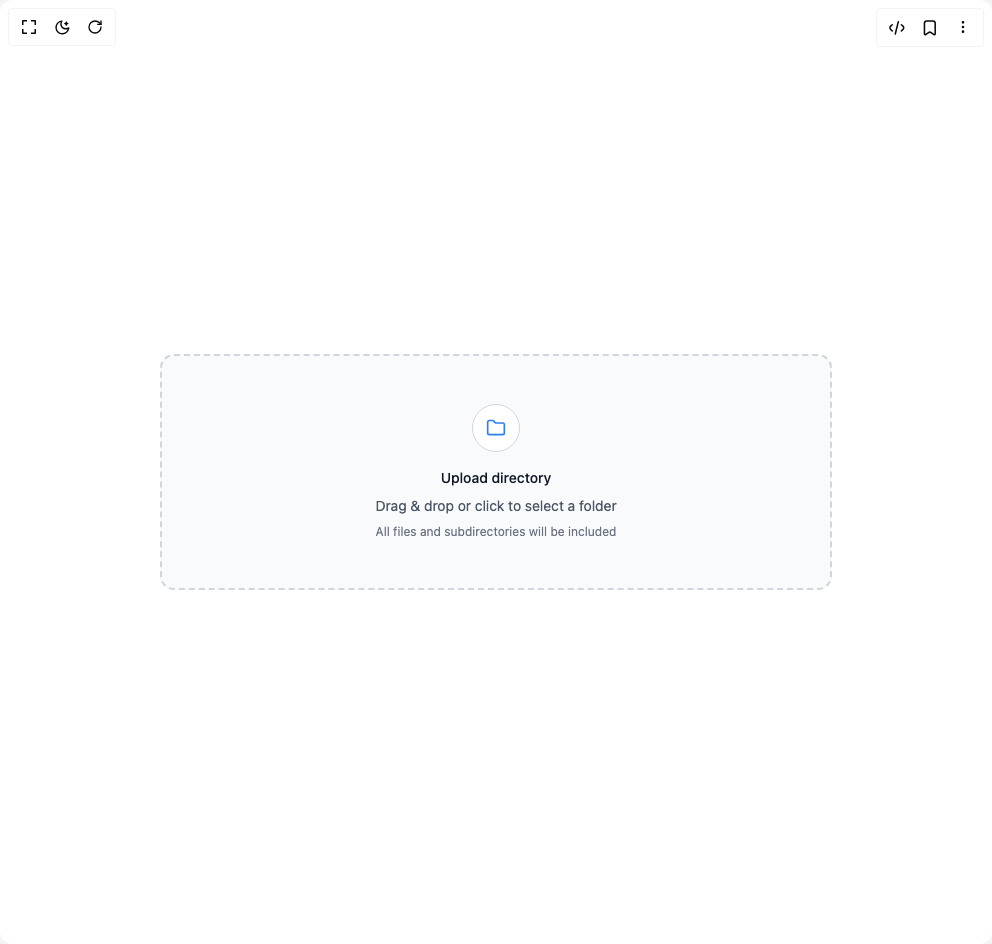

# Build File Upload 1 in BuilderStudio

> Build this component in our Agentic IDE: [BuilderStudio](https://builderstudio.dev).
>
> Join the BuilderStudio community on [Discord](https://discord.gg/QdWeSGCqfe) and [Reddit](https://reddit.com/r/builderstudio).



## Component

- Author group: `anubra266`
- Component: `file-upload-1`
- Variant: `directory-upload`
- Rendered HTML snapshot: [`rendered.html`](rendered.html)

## BuilderStudio prompt

You are implementing a React component based on a component reference.

## Component identity

- Author: anubra266
- Component slug: file-upload-1
- Demo slug: directory-upload
- Title: file-upload-1
- Description: 

## Goal

Recreate this component in a React + TypeScript + Tailwind CSS project. Preserve the visual layout, spacing, colors, border radius, shadows, interaction behavior, animation behavior, responsive behavior, and dark mode behavior shown in the rendered demo.

## Implementation requirements

- Use React and TypeScript.
- Use Tailwind CSS classes whenever possible.
- Keep the component self-contained unless the source files require helper components.
- If the source uses CSS variables, custom CSS, animations, or keyframes, include them.
- If the source uses external packages, list and use the required packages.
- Preserve accessibility attributes, button semantics, links, keyboard behavior, and ARIA attributes when visible in the source.
- Do not replace the component with a simplified placeholder.
- Return complete production-ready code.

## Dependencies

No reference metadata available.

## Rendered DOM snapshot

This is the rendered demo HTML extracted from the live preview. Use it to verify structure, class names, visible content, and layout.

```html
<div id="root"><div class="w-screen min-h-screen flex justify-center items-center"><div class="w-screen min-h-screen flex justify-center items-center"><div data-scope="file-upload" data-part="root" dir="ltr" id="file:«r0»" class="w-full max-w-2xl"><div class="space-y-4"><div data-scope="file-upload" data-part="dropzone" dir="ltr" id="file:«r0»:dropzone" tabindex="0" role="button" aria-label="dropzone" class="w-full border-2 border-dashed border-gray-300 dark:border-gray-600 rounded-xl bg-gray-50 dark:bg-gray-800 flex flex-col items-center justify-center py-12 px-6 hover:bg-gray-100 dark:hover:bg-gray-700 transition-colors cursor-pointer"><div class="w-12 h-12 rounded-full border border-gray-300 dark:border-gray-600 bg-white dark:bg-gray-900 flex items-center justify-center mb-4"><svg xmlns="http://www.w3.org/2000/svg" width="24" height="24" viewBox="0 0 24 24" fill="none" stroke="currentColor" stroke-width="2" stroke-linecap="round" stroke-linejoin="round" class="lucide lucide-folder w-5 h-5 text-blue-500 dark:text-blue-400" aria-hidden="true"><path d="M20 20a2 2 0 0 0 2-2V8a2 2 0 0 0-2-2h-7.9a2 2 0 0 1-1.69-.9L9.6 3.9A2 2 0 0 0 7.93 3H4a2 2 0 0 0-2 2v13a2 2 0 0 0 2 2Z"></path></svg></div><div class="text-center space-y-2"><h3 class="text-sm font-medium text-gray-900 dark:text-gray-100">Upload directory</h3><p class="text-sm text-gray-600 dark:text-gray-400">Drag &amp; drop or click to select a folder</p><p class="text-xs text-gray-500 dark:text-gray-400">All files and subdirectories will be included</p></div></div></div><input id="file:«r0»:input" tabindex="-1" webkitdirectory="" multiple="" type="file" style="border: 0px; clip: rect(0px, 0px, 0px, 0px); height: 1px; margin: -1px; overflow: hidden; padding: 0px; position: absolute; width: 1px; white-space: nowrap; overflow-wrap: normal;"></div></div></div></div>
```

## Reference source files

No reference source files were available.
