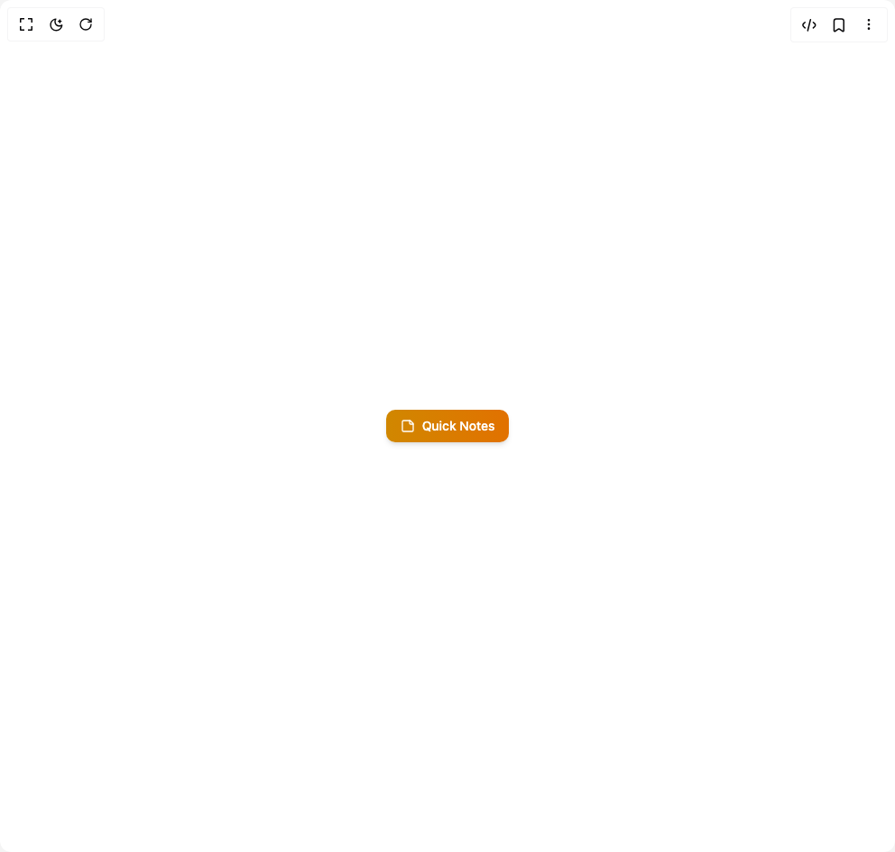

# Build Floating Panel in BuilderStudio

> Build this component in our Agentic IDE: [BuilderStudio](https://builderstudio.dev).
>
> Join the BuilderStudio community on [Discord](https://discord.gg/QdWeSGCqfe) and [Reddit](https://reddit.com/r/builderstudio).



## Component

- Author group: `anubra266`
- Component: `floating-panel`
- Variant: `notes-panel`
- Rendered HTML snapshot: [`rendered.html`](rendered.html)

## BuilderStudio prompt

You are implementing a React component based on a component reference.

## Component identity

- Author: anubra266
- Component slug: floating-panel
- Demo slug: notes-panel
- Title: floating-panel
- Description: 

## Goal

Recreate this component in a React + TypeScript + Tailwind CSS project. Preserve the visual layout, spacing, colors, border radius, shadows, interaction behavior, animation behavior, responsive behavior, and dark mode behavior shown in the rendered demo.

## Implementation requirements

- Use React and TypeScript.
- Use Tailwind CSS classes whenever possible.
- Keep the component self-contained unless the source files require helper components.
- If the source uses CSS variables, custom CSS, animations, or keyframes, include them.
- If the source uses external packages, list and use the required packages.
- Preserve accessibility attributes, button semantics, links, keyboard behavior, and ARIA attributes when visible in the source.
- Do not replace the component with a simplified placeholder.
- Return complete production-ready code.

## Dependencies

No reference metadata available.

## Rendered DOM snapshot

This is the rendered demo HTML extracted from the live preview. Use it to verify structure, class names, visible content, and layout.

```html
<div id="root"><div class="w-screen min-h-screen flex justify-center items-center"><div class="w-screen min-h-screen flex justify-center items-center"><button data-scope="floating-panel" data-part="trigger" type="button" id="float:«r0»:trigger" data-state="closed" aria-controls="float:«r0»:content" class="px-4 py-2 bg-linear-to-r from-yellow-600 to-amber-600 text-white text-sm font-medium rounded-lg hover:from-yellow-700 hover:to-amber-700 focus:outline-hidden focus:ring-2 focus:ring-yellow-500 focus:ring-offset-2 shadow-md flex items-center gap-2 transition-all"><svg xmlns="http://www.w3.org/2000/svg" width="24" height="24" viewBox="0 0 24 24" fill="none" stroke="currentColor" stroke-width="2" stroke-linecap="round" stroke-linejoin="round" class="lucide lucide-sticky-note w-4 h-4" aria-hidden="true"><path d="M16 3H5a2 2 0 0 0-2 2v14a2 2 0 0 0 2 2h14a2 2 0 0 0 2-2V8Z"></path><path d="M15 3v4a2 2 0 0 0 2 2h4"></path></svg>Quick Notes</button></div></div></div>
```

## Reference source files

No reference source files were available.
