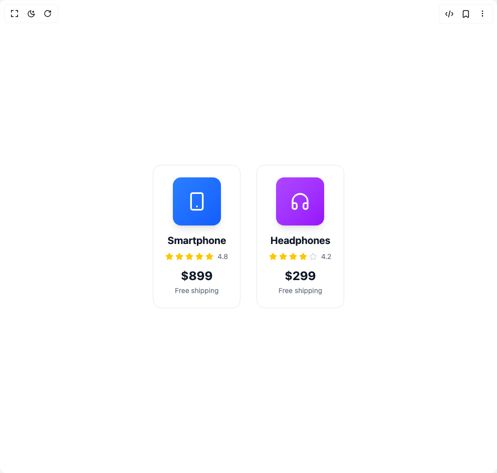

# Build Hover Card in BuilderStudio

> Build this component in our Agentic IDE: [BuilderStudio](https://builderstudio.dev).
>
> Join the BuilderStudio community on [Discord](https://discord.gg/QdWeSGCqfe) and [Reddit](https://reddit.com/r/builderstudio).



## Component

- Author group: `anubra266`
- Component: `hover-card`
- Variant: `product-info-card`
- Rendered HTML snapshot: [`rendered.html`](rendered.html)

## BuilderStudio prompt

You are implementing a React component based on a component reference.

## Component identity

- Author: anubra266
- Component slug: hover-card
- Demo slug: product-info-card
- Title: hover-card
- Description: 

## Goal

Recreate this component in a React + TypeScript + Tailwind CSS project. Preserve the visual layout, spacing, colors, border radius, shadows, interaction behavior, animation behavior, responsive behavior, and dark mode behavior shown in the rendered demo.

## Implementation requirements

- Use React and TypeScript.
- Use Tailwind CSS classes whenever possible.
- Keep the component self-contained unless the source files require helper components.
- If the source uses CSS variables, custom CSS, animations, or keyframes, include them.
- If the source uses external packages, list and use the required packages.
- Preserve accessibility attributes, button semantics, links, keyboard behavior, and ARIA attributes when visible in the source.
- Do not replace the component with a simplified placeholder.
- Return complete production-ready code.

## Dependencies

No reference metadata available.

## Rendered DOM snapshot

This is the rendered demo HTML extracted from the live preview. Use it to verify structure, class names, visible content, and layout.

```html
<div id="root"><div class="w-screen min-h-screen flex justify-center items-center"><div class="w-screen min-h-screen flex justify-center items-center"><div class="flex items-center justify-center min-h-32 p-4"><div class="grid grid-cols-2 gap-8 max-w-2xl"><button data-scope="hover-card" data-part="trigger" dir="ltr" id="hover-card:«r0»:trigger" data-state="closed" class="group cursor-pointer"><div class="bg-white dark:bg-gray-900 border border-gray-200 dark:border-gray-800 rounded-2xl p-6 hover:shadow-xl hover:scale-[1.02] transition-all duration-300 hover:border-blue-300 dark:hover:border-blue-600"><div class="w-24 h-24 mx-auto bg-linear-to-br from-blue-500 to-blue-600 rounded-2xl mb-4 flex items-center justify-center shadow-lg"><svg xmlns="http://www.w3.org/2000/svg" width="24" height="24" viewBox="0 0 24 24" fill="none" stroke="currentColor" stroke-width="2" stroke-linecap="round" stroke-linejoin="round" class="lucide lucide-smartphone w-10 h-10 text-white" aria-hidden="true"><rect width="14" height="20" x="5" y="2" rx="2" ry="2"></rect><path d="M12 18h.01"></path></svg></div><h3 class="text-xl font-bold text-gray-900 dark:text-gray-100 mb-2 group-hover:text-blue-600 dark:group-hover:text-blue-400 transition-colors">Smartphone</h3><div class="flex items-center gap-1 mb-3"><svg xmlns="http://www.w3.org/2000/svg" width="24" height="24" viewBox="0 0 24 24" fill="none" stroke="currentColor" stroke-width="2" stroke-linecap="round" stroke-linejoin="round" class="lucide lucide-star w-4 h-4 fill-yellow-400 text-yellow-400" aria-hidden="true"><path d="M11.525 2.295a.53.53 0 0 1 .95 0l2.31 4.679a2.123 2.123 0 0 0 1.595 1.16l5.166.756a.53.53 0 0 1 .294.904l-3.736 3.638a2.123 2.123 0 0 0-.611 1.878l.882 5.14a.53.53 0 0 1-.771.56l-4.618-2.428a2.122 2.122 0 0 0-1.973 0L6.396 21.01a.53.53 0 0 1-.77-.56l.881-5.139a2.122 2.122 0 0 0-.611-1.879L2.16 9.795a.53.53 0 0 1 .294-.906l5.165-.755a2.122 2.122 0 0 0 1.597-1.16z"></path></svg><svg xmlns="http://www.w3.org/2000/svg" width="24" height="24" viewBox="0 0 24 24" fill="none" stroke="currentColor" stroke-width="2" stroke-linecap="round" stroke-linejoin="round" class="lucide lucide-star w-4 h-4 fill-yellow-400 text-yellow-400" aria-hidden="true"><path d="M11.525 2.295a.53.53 0 0 1 .95 0l2.31 4.679a2.123 2.123 0 0 0 1.595 1.16l5.166.756a.53.53 0 0 1 .294.904l-3.736 3.638a2.123 2.123 0 0 0-.611 1.878l.882 5.14a.53.53 0 0 1-.771.56l-4.618-2.428a2.122 2.122 0 0 0-1.973 0L6.396 21.01a.53.53 0 0 1-.77-.56l.881-5.139a2.122 2.122 0 0 0-.611-1.879L2.16 9.795a.53.53 0 0 1 .294-.906l5.165-.755a2.122 2.122 0 0 0 1.597-1.16z"></path></svg><svg xmlns="http://www.w3.org/2000/svg" width="24" height="24" viewBox="0 0 24 24" fill="none" stroke="currentColor" stroke-width="2" stroke-linecap="round" stroke-linejoin="round" class="lucide lucide-star w-4 h-4 fill-yellow-400 text-yellow-400" aria-hidden="true"><path d="M11.525 2.295a.53.53 0 0 1 .95 0l2.31 4.679a2.123 2.123 0 0 0 1.595 1.16l5.166.756a.53.53 0 0 1 .294.904l-3.736 3.638a2.123 2.123 0 0 0-.611 1.878l.882 5.14a.53.53 0 0 1-.771.56l-4.618-2.428a2.122 2.122 0 0 0-1.973 0L6.396 21.01a.53.53 0 0 1-.77-.56l.881-5.139a2.122 2.122 0 0 0-.611-1.879L2.16 9.795a.53.53 0 0 1 .294-.906l5.165-.755a2.122 2.122 0 0 0 1.597-1.16z"></path></svg><svg xmlns="http://www.w3.org/2000/svg" width="24" height="24" viewBox="0 0 24 24" fill="none" stroke="currentColor" stroke-width="2" stroke-linecap="round" stroke-linejoin="round" class="lucide lucide-star w-4 h-4 fill-yellow-400 text-yellow-400" aria-hidden="true"><path d="M11.525 2.295a.53.53 0 0 1 .95 0l2.31 4.679a2.123 2.123 0 0 0 1.595 1.16l5.166.756a.53.53 0 0 1 .294.904l-3.736 3.638a2.123 2.123 0 0 0-.611 1.878l.882 5.14a.53.53 0 0 1-.771.56l-4.618-2.428a2.122 2.122 0 0 0-1.973 0L6.396 21.01a.53.53 0 0 1-.77-.56l.881-5.139a2.122 2.122 0 0 0-.611-1.879L2.16 9.795a.53.53 0 0 1 .294-.906l5.165-.755a2.122 2.122 0 0 0 1.597-1.16z"></path></svg><svg xmlns="http://www.w3.org/2000/svg" width="24" height="24" viewBox="0 0 24 24" fill="none" stroke="currentColor" stroke-width="2" stroke-linecap="round" stroke-linejoin="round" class="lucide lucide-star w-4 h-4 fill-yellow-400 text-yellow-400" aria-hidden="true"><path d="M11.525 2.295a.53.53 0 0 1 .95 0l2.31 4.679a2.123 2.123 0 0 0 1.595 1.16l5.166.756a.53.53 0 0 1 .294.904l-3.736 3.638a2.123 2.123 0 0 0-.611 1.878l.882 5.14a.53.53 0 0 1-.771.56l-4.618-2.428a2.122 2.122 0 0 0-1.973 0L6.396 21.01a.53.53 0 0 1-.77-.56l.881-5.139a2.122 2.122 0 0 0-.611-1.879L2.16 9.795a.53.53 0 0 1 .294-.906l5.165-.755a2.122 2.122 0 0 0 1.597-1.16z"></path></svg><span class="text-sm text-gray-500 dark:text-gray-400 ml-1">4.8</span></div><p class="text-2xl font-bold text-gray-900 dark:text-gray-100">$899</p><p class="text-sm text-gray-500 dark:text-gray-400 mt-1">Free shipping</p></div></button><button data-scope="hover-card" data-part="trigger" dir="ltr" id="hover-card:«r1»:trigger" data-state="closed" class="group cursor-pointer"><div class="bg-white dark:bg-gray-900 border border-gray-200 dark:border-gray-800 rounded-2xl p-6 hover:shadow-xl hover:scale-[1.02] transition-all duration-300 hover:border-purple-300 dark:hover:border-purple-600"><div class="w-24 h-24 mx-auto bg-linear-to-br from-purple-500 to-purple-600 rounded-2xl mb-4 flex items-center justify-center shadow-lg"><svg xmlns="http://www.w3.org/2000/svg" width="24" height="24" viewBox="0 0 24 24" fill="none" stroke="currentColor" stroke-width="2" stroke-linecap="round" stroke-linejoin="round" class="lucide lucide-headphones w-10 h-10 text-white" aria-hidden="true"><path d="M3 14h3a2 2 0 0 1 2 2v3a2 2 0 0 1-2 2H5a2 2 0 0 1-2-2v-7a9 9 0 0 1 18 0v7a2 2 0 0 1-2 2h-1a2 2 0 0 1-2-2v-3a2 2 0 0 1 2-2h3"></path></svg></div><h3 class="text-xl font-bold text-gray-900 dark:text-gray-100 mb-2 group-hover:text-purple-600 dark:group-hover:text-purple-400 transition-colors">Headphones</h3><div class="flex items-center gap-1 mb-3"><svg xmlns="http://www.w3.org/2000/svg" width="24" height="24" viewBox="0 0 24 24" fill="none" stroke="currentColor" stroke-width="2" stroke-linecap="round" stroke-linejoin="round" class="lucide lucide-star w-4 h-4 fill-yellow-400 text-yellow-400" aria-hidden="true"><path d="M11.525 2.295a.53.53 0 0 1 .95 0l2.31 4.679a2.123 2.123 0 0 0 1.595 1.16l5.166.756a.53.53 0 0 1 .294.904l-3.736 3.638a2.123 2.123 0 0 0-.611 1.878l.882 5.14a.53.53 0 0 1-.771.56l-4.618-2.428a2.122 2.122 0 0 0-1.973 0L6.396 21.01a.53.53 0 0 1-.77-.56l.881-5.139a2.122 2.122 0 0 0-.611-1.879L2.16 9.795a.53.53 0 0 1 .294-.906l5.165-.755a2.122 2.122 0 0 0 1.597-1.16z"></path></svg><svg xmlns="http://www.w3.org/2000/svg" width="24" height="24" viewBox="0 0 24 24" fill="none" stroke="currentColor" stroke-width="2" stroke-linecap="round" stroke-linejoin="round" class="lucide lucide-star w-4 h-4 fill-yellow-400 text-yellow-400" aria-hidden="true"><path d="M11.525 2.295a.53.53 0 0 1 .95 0l2.31 4.679a2.123 2.123 0 0 0 1.595 1.16l5.166.756a.53.53 0 0 1 .294.904l-3.736 3.638a2.123 2.123 0 0 0-.611 1.878l.882 5.14a.53.53 0 0 1-.771.56l-4.618-2.428a2.122 2.122 0 0 0-1.973 0L6.396 21.01a.53.53 0 0 1-.77-.56l.881-5.139a2.122 2.122 0 0 0-.611-1.879L2.16 9.795a.53.53 0 0 1 .294-.906l5.165-.755a2.122 2.122 0 0 0 1.597-1.16z"></path></svg><svg xmlns="http://www.w3.org/2000/svg" width="24" height="24" viewBox="0 0 24 24" fill="none" stroke="currentColor" stroke-width="2" stroke-linecap="round" stroke-linejoin="round" class="lucide lucide-star w-4 h-4 fill-yellow-400 text-yellow-400" aria-hidden="true"><path d="M11.525 2.295a.53.53 0 0 1 .95 0l2.31 4.679a2.123 2.123 0 0 0 1.595 1.16l5.166.756a.53.53 0 0 1 .294.904l-3.736 3.638a2.123 2.123 0 0 0-.611 1.878l.882 5.14a.53.53 0 0 1-.771.56l-4.618-2.428a2.122 2.122 0 0 0-1.973 0L6.396 21.01a.53.53 0 0 1-.77-.56l.881-5.139a2.122 2.122 0 0 0-.611-1.879L2.16 9.795a.53.53 0 0 1 .294-.906l5.165-.755a2.122 2.122 0 0 0 1.597-1.16z"></path></svg><svg xmlns="http://www.w3.org/2000/svg" width="24" height="24" viewBox="0 0 24 24" fill="none" stroke="currentColor" stroke-width="2" stroke-linecap="round" stroke-linejoin="round" class="lucide lucide-star w-4 h-4 fill-yellow-400 text-yellow-400" aria-hidden="true"><path d="M11.525 2.295a.53.53 0 0 1 .95 0l2.31 4.679a2.123 2.123 0 0 0 1.595 1.16l5.166.756a.53.53 0 0 1 .294.904l-3.736 3.638a2.123 2.123 0 0 0-.611 1.878l.882 5.14a.53.53 0 0 1-.771.56l-4.618-2.428a2.122 2.122 0 0 0-1.973 0L6.396 21.01a.53.53 0 0 1-.77-.56l.881-5.139a2.122 2.122 0 0 0-.611-1.879L2.16 9.795a.53.53 0 0 1 .294-.906l5.165-.755a2.122 2.122 0 0 0 1.597-1.16z"></path></svg><svg xmlns="http://www.w3.org/2000/svg" width="24" height="24" viewBox="0 0 24 24" fill="none" stroke="currentColor" stroke-width="2" stroke-linecap="round" stroke-linejoin="round" class="lucide lucide-star w-4 h-4 text-gray-300" aria-hidden="true"><path d="M11.525 2.295a.53.53 0 0 1 .95 0l2.31 4.679a2.123 2.123 0 0 0 1.595 1.16l5.166.756a.53.53 0 0 1 .294.904l-3.736 3.638a2.123 2.123 0 0 0-.611 1.878l.882 5.14a.53.53 0 0 1-.771.56l-4.618-2.428a2.122 2.122 0 0 0-1.973 0L6.396 21.01a.53.53 0 0 1-.77-.56l.881-5.139a2.122 2.122 0 0 0-.611-1.879L2.16 9.795a.53.53 0 0 1 .294-.906l5.165-.755a2.122 2.122 0 0 0 1.597-1.16z"></path></svg><span class="text-sm text-gray-500 dark:text-gray-400 ml-1">4.2</span></div><p class="text-2xl font-bold text-gray-900 dark:text-gray-100">$299</p><p class="text-sm text-gray-500 dark:text-gray-400 mt-1">Free shipping</p></div></button></div></div></div></div></div>
```

## Reference source files

No reference source files were available.
