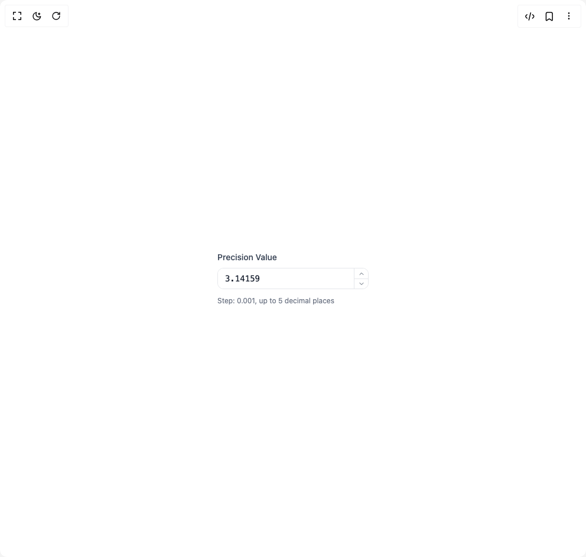

# Build Number Input in BuilderStudio

> Build this component in our Agentic IDE: [BuilderStudio](https://builderstudio.dev).
>
> Join the BuilderStudio community on [Discord](https://discord.gg/QdWeSGCqfe) and [Reddit](https://reddit.com/r/builderstudio).



## Component

- Author group: `anubra266`
- Component: `number-input`
- Variant: `price-decimal`
- Rendered HTML snapshot: [`rendered.html`](rendered.html)

## BuilderStudio prompt

You are implementing a React component based on a component reference.

## Component identity

- Author: anubra266
- Component slug: number-input
- Demo slug: price-decimal
- Title: number-input
- Description: 

## Goal

Recreate this component in a React + TypeScript + Tailwind CSS project. Preserve the visual layout, spacing, colors, border radius, shadows, interaction behavior, animation behavior, responsive behavior, and dark mode behavior shown in the rendered demo.

## Implementation requirements

- Use React and TypeScript.
- Use Tailwind CSS classes whenever possible.
- Keep the component self-contained unless the source files require helper components.
- If the source uses CSS variables, custom CSS, animations, or keyframes, include them.
- If the source uses external packages, list and use the required packages.
- Preserve accessibility attributes, button semantics, links, keyboard behavior, and ARIA attributes when visible in the source.
- Do not replace the component with a simplified placeholder.
- Return complete production-ready code.

## Dependencies

No reference metadata available.

## Rendered DOM snapshot

This is the rendered demo HTML extracted from the live preview. Use it to verify structure, class names, visible content, and layout.

```html
<div id="root"><div class="w-screen min-h-screen flex justify-center items-center"><div class="w-screen min-h-screen flex justify-center items-center"><div class="flex items-center justify-center min-h-32"><div id="number-input:«r0»" data-scope="number-input" data-part="root" dir="ltr" class="w-64"><label data-scope="number-input" data-part="label" dir="ltr" id="number-input:«r0»:label" for="number-input:«r0»:input" class="text-sm font-medium text-gray-700 dark:text-gray-300 mb-2 block">Precision Value</label><div data-scope="number-input" data-part="control" dir="ltr" role="group" aria-disabled="false" class="border border-gray-200 dark:border-gray-700 rounded-lg h-9 overflow-hidden grid grid-cols-[1fr_24px] grid-rows-2 focus-within:ring-2 focus-within:ring-blue-500/50 dark:focus-within:ring-blue-400/50 focus-within:border-blue-500/50 dark:focus-within:border-blue-400/50 transition-all"><input data-scope="number-input" data-part="input" dir="ltr" id="number-input:«r0»:input" role="spinbutton" pattern="-?[0-9]*(.[0-9]+)?" inputmode="decimal" autocomplete="off" autocorrect="off" spellcheck="false" aria-roledescription="numberfield" aria-valuemin="-9007199254740991" aria-valuemax="9007199254740991" aria-valuenow="3.14159" class="bg-white dark:bg-gray-900 text-gray-900 dark:text-gray-100 font-mono text-sm px-3 py-1 row-span-2 border-none outline-hidden focus:outline-hidden focus-visible:outline-hidden" type="text" value="3.14159"><button data-scope="number-input" data-part="increment-trigger" dir="ltr" id="number-input:«r0»:inc" aria-label="increment value" type="button" tabindex="-1" aria-controls="number-input:«r0»:input" class="flex items-center justify-center bg-white dark:bg-gray-900 text-gray-600 dark:text-gray-400 hover:bg-gray-50 dark:hover:bg-gray-800 hover:text-gray-900 dark:hover:text-gray-100 transition-colors cursor-pointer border-l border-gray-200 dark:border-gray-700"><svg xmlns="http://www.w3.org/2000/svg" width="24" height="24" viewBox="0 0 24 24" fill="none" stroke="currentColor" stroke-width="2" stroke-linecap="round" stroke-linejoin="round" class="lucide lucide-chevron-up w-3 h-3" aria-hidden="true"><path d="m18 15-6-6-6 6"></path></svg></button><button data-scope="number-input" data-part="decrement-trigger" dir="ltr" id="number-input:«r0»:dec" aria-label="decrease value" type="button" tabindex="-1" aria-controls="number-input:«r0»:input" class="flex items-center justify-center bg-white dark:bg-gray-900 text-gray-600 dark:text-gray-400 hover:bg-gray-50 dark:hover:bg-gray-800 hover:text-gray-900 dark:hover:text-gray-100 transition-colors cursor-pointer border-l border-t border-gray-200 dark:border-gray-700"><svg xmlns="http://www.w3.org/2000/svg" width="24" height="24" viewBox="0 0 24 24" fill="none" stroke="currentColor" stroke-width="2" stroke-linecap="round" stroke-linejoin="round" class="lucide lucide-chevron-down w-3 h-3" aria-hidden="true"><path d="m6 9 6 6 6-6"></path></svg></button></div><div class="text-xs text-gray-500 dark:text-gray-400 mt-3">Step: 0.001, up to 5 decimal places</div></div></div></div></div></div>
```

## Reference source files

No reference source files were available.
