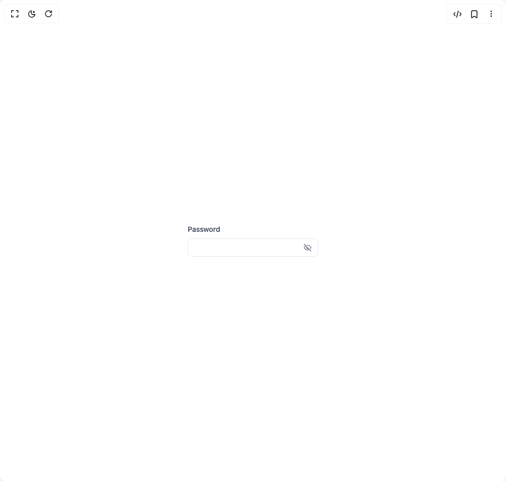

# Build Password Input in BuilderStudio

> Build this component in our Agentic IDE: [BuilderStudio](https://builderstudio.dev).
>
> Join the BuilderStudio community on [Discord](https://discord.gg/QdWeSGCqfe) and [Reddit](https://reddit.com/r/builderstudio).



## Component

- Author group: `anubra266`
- Component: `password-input`
- Variant: `default`
- Rendered HTML snapshot: [`rendered.html`](rendered.html)

## BuilderStudio prompt

You are implementing a React component based on a component reference.

## Component identity

- Author: anubra266
- Component slug: password-input
- Demo slug: default
- Title: password-input
- Description: 

## Goal

Recreate this component in a React + TypeScript + Tailwind CSS project. Preserve the visual layout, spacing, colors, border radius, shadows, interaction behavior, animation behavior, responsive behavior, and dark mode behavior shown in the rendered demo.

## Implementation requirements

- Use React and TypeScript.
- Use Tailwind CSS classes whenever possible.
- Keep the component self-contained unless the source files require helper components.
- If the source uses CSS variables, custom CSS, animations, or keyframes, include them.
- If the source uses external packages, list and use the required packages.
- Preserve accessibility attributes, button semantics, links, keyboard behavior, and ARIA attributes when visible in the source.
- Do not replace the component with a simplified placeholder.
- Return complete production-ready code.

## Dependencies

No reference metadata available.

## Rendered DOM snapshot

This is the rendered demo HTML extracted from the live preview. Use it to verify structure, class names, visible content, and layout.

```html
<div id="root"><div class="w-screen min-h-screen flex justify-center items-center"><div class="w-screen min-h-screen flex justify-center items-center"><div class="flex items-center justify-center min-h-32"><div data-scope="password-input" data-part="root" dir="ltr" class="w-64"><label data-scope="password-input" data-part="label" for="p-input-«r0»-input" class="text-sm font-medium text-gray-700 dark:text-gray-300 mb-2 block">Password</label><div data-scope="password-input" data-part="control" class="relative h-9 border border-gray-200 dark:border-gray-700 rounded-lg overflow-hidden focus-within:ring-2 focus-within:ring-blue-500/50 dark:focus-within:ring-blue-400/50 focus-within:border-blue-500 dark:focus-within:border-blue-400 transition-all"><input data-scope="password-input" data-part="input" id="p-input-«r0»-input" autocapitalize="off" autocomplete="current-password" spellcheck="false" data-state="hidden" class="w-full h-full bg-white dark:bg-gray-900 text-gray-900 dark:text-gray-100 px-3 pr-10 border-none outline-hidden focus:outline-hidden focus-visible:outline-hidden" type="password"><button data-scope="password-input" data-part="visibility-trigger" type="button" tabindex="-1" aria-controls="p-input-«r0»-input" aria-expanded="false" data-state="hidden" aria-label="Show password" class="absolute right-3 top-1/2 -translate-y-1/2 text-gray-500 dark:text-gray-400 hover:text-gray-700 dark:hover:text-gray-300 transition-colors"><span data-scope="password-input" data-part="indicator" aria-hidden="true" data-state="hidden" fallback="[object Object]"><svg xmlns="http://www.w3.org/2000/svg" width="24" height="24" viewBox="0 0 24 24" fill="none" stroke="currentColor" stroke-width="2" stroke-linecap="round" stroke-linejoin="round" class="lucide lucide-eye-off w-4 h-4" aria-hidden="true"><path d="M10.733 5.076a10.744 10.744 0 0 1 11.205 6.575 1 1 0 0 1 0 .696 10.747 10.747 0 0 1-1.444 2.49"></path><path d="M14.084 14.158a3 3 0 0 1-4.242-4.242"></path><path d="M17.479 17.499a10.75 10.75 0 0 1-15.417-5.151 1 1 0 0 1 0-.696 10.75 10.75 0 0 1 4.446-5.143"></path><path d="m2 2 20 20"></path></svg></span></button></div></div></div></div></div></div>
```

## Reference source files

No reference source files were available.
