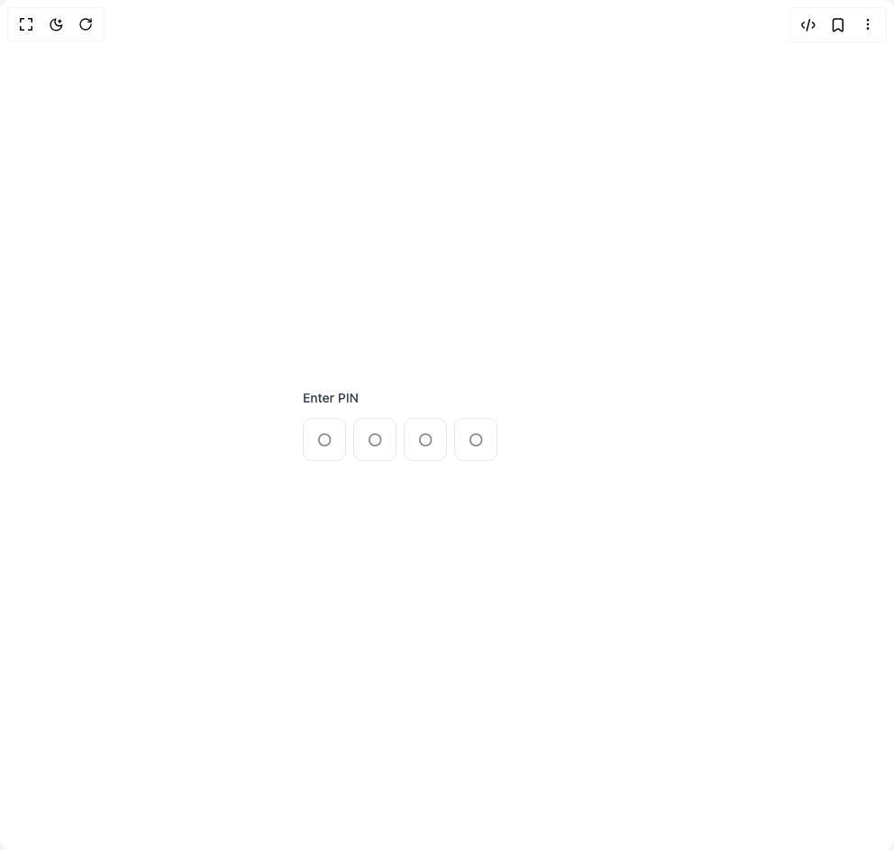

# Build Pin Input in BuilderStudio

> Build this component in our Agentic IDE: [BuilderStudio](https://builderstudio.dev).
>
> Join the BuilderStudio community on [Discord](https://discord.gg/QdWeSGCqfe) and [Reddit](https://reddit.com/r/builderstudio).



## Component

- Author group: `anubra266`
- Component: `pin-input`
- Variant: `default`
- Rendered HTML snapshot: [`rendered.html`](rendered.html)

## BuilderStudio prompt

You are implementing a React component based on a component reference.

## Component identity

- Author: anubra266
- Component slug: pin-input
- Demo slug: default
- Title: pin-input
- Description: 

## Goal

Recreate this component in a React + TypeScript + Tailwind CSS project. Preserve the visual layout, spacing, colors, border radius, shadows, interaction behavior, animation behavior, responsive behavior, and dark mode behavior shown in the rendered demo.

## Implementation requirements

- Use React and TypeScript.
- Use Tailwind CSS classes whenever possible.
- Keep the component self-contained unless the source files require helper components.
- If the source uses CSS variables, custom CSS, animations, or keyframes, include them.
- If the source uses external packages, list and use the required packages.
- Preserve accessibility attributes, button semantics, links, keyboard behavior, and ARIA attributes when visible in the source.
- Do not replace the component with a simplified placeholder.
- Return complete production-ready code.

## Dependencies

No reference metadata available.

## Rendered DOM snapshot

This is the rendered demo HTML extracted from the live preview. Use it to verify structure, class names, visible content, and layout.

```html
<div id="root"><div class="w-screen min-h-screen flex justify-center items-center"><div class="w-screen min-h-screen flex justify-center items-center"><div class="flex items-center justify-center min-h-32"><div class="w-80"><div dir="ltr" data-scope="pin-input" data-part="root" id="pin-input:«r0»"><label data-scope="pin-input" data-part="label" dir="ltr" for="pin-input:«r0»:hidden" id="pin-input:«r0»:label" class="text-sm font-medium text-gray-700 dark:text-gray-300 mb-3 block">Enter PIN</label><div data-scope="pin-input" data-part="control" dir="ltr" id="pin-input:«r0»:control" class="flex gap-2"><input data-scope="pin-input" data-part="input" dir="ltr" id="pin-input:«r0»:0" data-index="0" data-ownedby="pin-input:«r0»" aria-label="pin code 1 of 4" inputmode="numeric" autocapitalize="none" autocomplete="off" placeholder="○" class="w-12 h-12 text-center text-lg font-medium border border-gray-200 dark:border-gray-700 rounded-lg bg-white dark:bg-gray-900 text-gray-900 dark:text-gray-100 focus:outline-hidden focus:ring-2 focus:ring-blue-500/50 dark:focus:ring-blue-400/50 focus:border-blue-500 dark:focus:border-blue-400 transition-all" type="tel" value=""><input data-scope="pin-input" data-part="input" dir="ltr" id="pin-input:«r0»:1" data-index="1" data-ownedby="pin-input:«r0»" aria-label="pin code 2 of 4" inputmode="numeric" autocapitalize="none" autocomplete="off" placeholder="○" class="w-12 h-12 text-center text-lg font-medium border border-gray-200 dark:border-gray-700 rounded-lg bg-white dark:bg-gray-900 text-gray-900 dark:text-gray-100 focus:outline-hidden focus:ring-2 focus:ring-blue-500/50 dark:focus:ring-blue-400/50 focus:border-blue-500 dark:focus:border-blue-400 transition-all" type="tel" value=""><input data-scope="pin-input" data-part="input" dir="ltr" id="pin-input:«r0»:2" data-index="2" data-ownedby="pin-input:«r0»" aria-label="pin code 3 of 4" inputmode="numeric" autocapitalize="none" autocomplete="off" placeholder="○" class="w-12 h-12 text-center text-lg font-medium border border-gray-200 dark:border-gray-700 rounded-lg bg-white dark:bg-gray-900 text-gray-900 dark:text-gray-100 focus:outline-hidden focus:ring-2 focus:ring-blue-500/50 dark:focus:ring-blue-400/50 focus:border-blue-500 dark:focus:border-blue-400 transition-all" type="tel" value=""><input data-scope="pin-input" data-part="input" dir="ltr" id="pin-input:«r0»:3" data-index="3" data-ownedby="pin-input:«r0»" aria-label="pin code 4 of 4" inputmode="numeric" autocapitalize="none" autocomplete="off" placeholder="○" class="w-12 h-12 text-center text-lg font-medium border border-gray-200 dark:border-gray-700 rounded-lg bg-white dark:bg-gray-900 text-gray-900 dark:text-gray-100 focus:outline-hidden focus:ring-2 focus:ring-blue-500/50 dark:focus:ring-blue-400/50 focus:border-blue-500 dark:focus:border-blue-400 transition-all" type="tel" value=""></div><input aria-hidden="true" tabindex="-1" id="pin-input:«r0»:hidden" maxlength="4" type="text" value="" style="border: 0px; clip: rect(0px, 0px, 0px, 0px); height: 1px; margin: -1px; overflow: hidden; padding: 0px; position: absolute; width: 1px; white-space: nowrap; overflow-wrap: normal;"></div></div></div></div></div></div>
```

## Reference source files

No reference source files were available.
