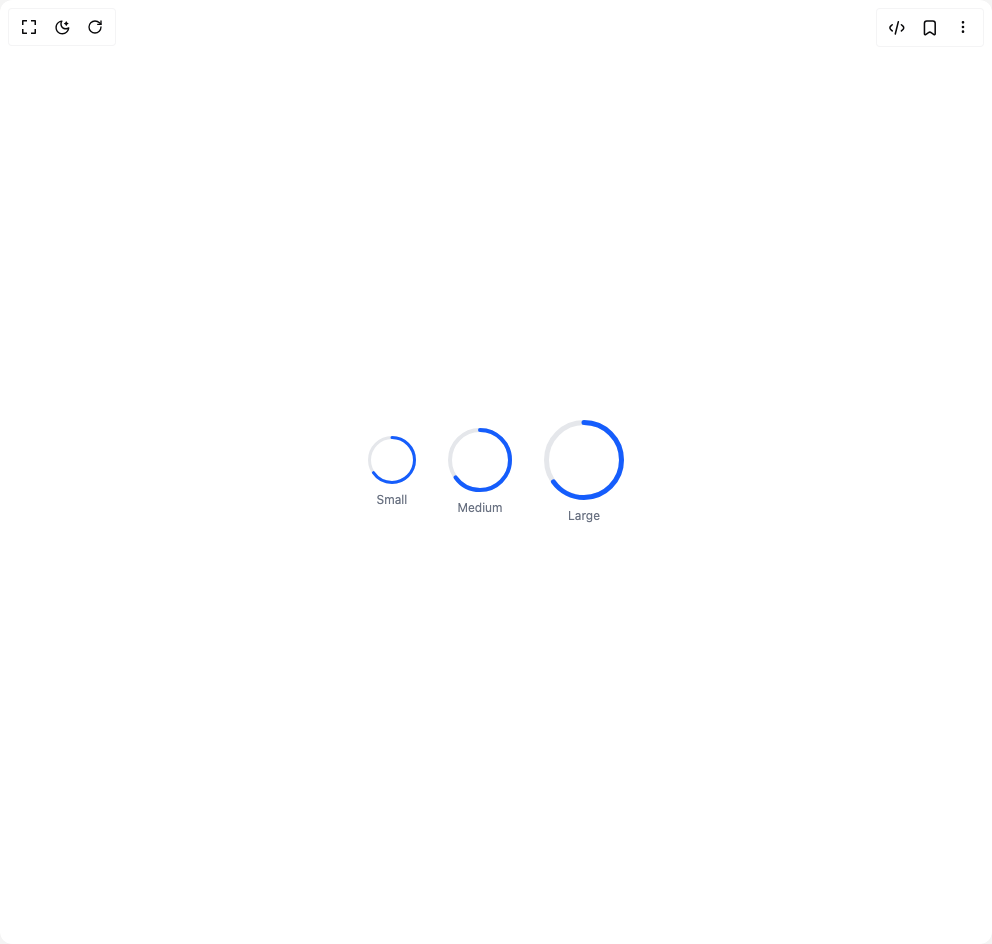

# Build Progress 1 in BuilderStudio

> Build this component in our Agentic IDE: [BuilderStudio](https://builderstudio.dev).
>
> Join the BuilderStudio community on [Discord](https://discord.gg/QdWeSGCqfe) and [Reddit](https://reddit.com/r/builderstudio).



## Component

- Author group: `anubra266`
- Component: `progress-1`
- Variant: `circular-sizes-progress`
- Rendered HTML snapshot: [`rendered.html`](rendered.html)

## BuilderStudio prompt

You are implementing a React component based on a component reference.

## Component identity

- Author: anubra266
- Component slug: progress-1
- Demo slug: circular-sizes-progress
- Title: progress-1
- Description: 

## Goal

Recreate this component in a React + TypeScript + Tailwind CSS project. Preserve the visual layout, spacing, colors, border radius, shadows, interaction behavior, animation behavior, responsive behavior, and dark mode behavior shown in the rendered demo.

## Implementation requirements

- Use React and TypeScript.
- Use Tailwind CSS classes whenever possible.
- Keep the component self-contained unless the source files require helper components.
- If the source uses CSS variables, custom CSS, animations, or keyframes, include them.
- If the source uses external packages, list and use the required packages.
- Preserve accessibility attributes, button semantics, links, keyboard behavior, and ARIA attributes when visible in the source.
- Do not replace the component with a simplified placeholder.
- Return complete production-ready code.

## Dependencies

No reference metadata available.

## Rendered DOM snapshot

This is the rendered demo HTML extracted from the live preview. Use it to verify structure, class names, visible content, and layout.

```html
<div id="root"><div class="w-screen min-h-screen flex justify-center items-center"><div class="w-screen min-h-screen flex justify-center items-center"><div class="flex items-center justify-center gap-8"><div dir="ltr" data-scope="progress" data-part="root" id="progress-«r0»" data-max="100" data-value="65" data-state="loading" data-orientation="horizontal" class="flex flex-col items-center space-y-2" style="--percent: 65;"><svg dir="ltr" id="progress-«r0»-circle" data-scope="progress" data-part="circle" role="progressbar" aria-label="65%" data-max="100" aria-valuemin="0" aria-valuemax="100" aria-valuenow="65" data-orientation="horizontal" data-state="loading" class="w-12 h-12 [--size:48px] [--thickness:3px]" style="width: var(--size); height: var(--size);"><circle dir="ltr" data-orientation="horizontal" data-scope="progress" data-part="circle-track" class="stroke-gray-200 dark:stroke-gray-700" stroke-width="3" fill="none" style="--radius: calc(var(--size) / 2 - var(--thickness) / 2); cx: calc(var(--size) / 2); cy: calc(var(--size) / 2); r: var(--radius); fill: transparent; stroke-width: var(--thickness);"></circle><circle dir="ltr" data-scope="progress" data-part="circle-range" data-state="loading" class="stroke-blue-600 dark:stroke-blue-500 transition-all duration-300 ease-out" stroke-width="3" fill="none" stroke-linecap="round" style="--radius: calc(var(--size) / 2 - var(--thickness) / 2); cx: calc(var(--size) / 2); cy: calc(var(--size) / 2); r: var(--radius); fill: transparent; stroke-width: var(--thickness); --percent: 65; --circumference: calc(2 * 3.14159 * var(--radius)); --offset: calc(var(--circumference) * (100 - var(--percent)) / 100); stroke-dashoffset: calc(var(--circumference) * ((100 - var(--percent)) / 100)); stroke-dasharray: var(--circumference); transform-origin: center center; transform: rotate(-90deg);"></circle></svg><span class="text-xs text-gray-500 dark:text-gray-400">Small</span></div><div dir="ltr" data-scope="progress" data-part="root" id="progress-«r1»" data-max="100" data-value="65" data-state="loading" data-orientation="horizontal" class="flex flex-col items-center space-y-2" style="--percent: 65;"><svg dir="ltr" id="progress-«r1»-circle" data-scope="progress" data-part="circle" role="progressbar" aria-label="65%" data-max="100" aria-valuemin="0" aria-valuemax="100" aria-valuenow="65" data-orientation="horizontal" data-state="loading" class="w-16 h-16 [--size:64px] [--thickness:4px]" style="width: var(--size); height: var(--size);"><circle dir="ltr" data-orientation="horizontal" data-scope="progress" data-part="circle-track" class="stroke-gray-200 dark:stroke-gray-700" stroke-width="4" fill="none" style="--radius: calc(var(--size) / 2 - var(--thickness) / 2); cx: calc(var(--size) / 2); cy: calc(var(--size) / 2); r: var(--radius); fill: transparent; stroke-width: var(--thickness);"></circle><circle dir="ltr" data-scope="progress" data-part="circle-range" data-state="loading" class="stroke-blue-600 dark:stroke-blue-500 transition-all duration-300 ease-out" stroke-width="4" fill="none" stroke-linecap="round" style="--radius: calc(var(--size) / 2 - var(--thickness) / 2); cx: calc(var(--size) / 2); cy: calc(var(--size) / 2); r: var(--radius); fill: transparent; stroke-width: var(--thickness); --percent: 65; --circumference: calc(2 * 3.14159 * var(--radius)); --offset: calc(var(--circumference) * (100 - var(--percent)) / 100); stroke-dashoffset: calc(var(--circumference) * ((100 - var(--percent)) / 100)); stroke-dasharray: var(--circumference); transform-origin: center center; transform: rotate(-90deg);"></circle></svg><span class="text-xs text-gray-500 dark:text-gray-400">Medium</span></div><div dir="ltr" data-scope="progress" data-part="root" id="progress-«r2»" data-max="100" data-value="65" data-state="loading" data-orientation="horizontal" class="flex flex-col items-center space-y-2" style="--percent: 65;"><svg dir="ltr" id="progress-«r2»-circle" data-scope="progress" data-part="circle" role="progressbar" aria-label="65%" data-max="100" aria-valuemin="0" aria-valuemax="100" aria-valuenow="65" data-orientation="horizontal" data-state="loading" class="w-20 h-20 [--size:80px] [--thickness:5px]" style="width: var(--size); height: var(--size);"><circle dir="ltr" data-orientation="horizontal" data-scope="progress" data-part="circle-track" class="stroke-gray-200 dark:stroke-gray-700" stroke-width="5" fill="none" style="--radius: calc(var(--size) / 2 - var(--thickness) / 2); cx: calc(var(--size) / 2); cy: calc(var(--size) / 2); r: var(--radius); fill: transparent; stroke-width: var(--thickness);"></circle><circle dir="ltr" data-scope="progress" data-part="circle-range" data-state="loading" class="stroke-blue-600 dark:stroke-blue-500 transition-all duration-300 ease-out" stroke-width="5" fill="none" stroke-linecap="round" style="--radius: calc(var(--size) / 2 - var(--thickness) / 2); cx: calc(var(--size) / 2); cy: calc(var(--size) / 2); r: var(--radius); fill: transparent; stroke-width: var(--thickness); --percent: 65; --circumference: calc(2 * 3.14159 * var(--radius)); --offset: calc(var(--circumference) * (100 - var(--percent)) / 100); stroke-dashoffset: calc(var(--circumference) * ((100 - var(--percent)) / 100)); stroke-dasharray: var(--circumference); transform-origin: center center; transform: rotate(-90deg);"></circle></svg><span class="text-xs text-gray-500 dark:text-gray-400">Large</span></div></div></div></div></div>
```

## Reference source files

No reference source files were available.
