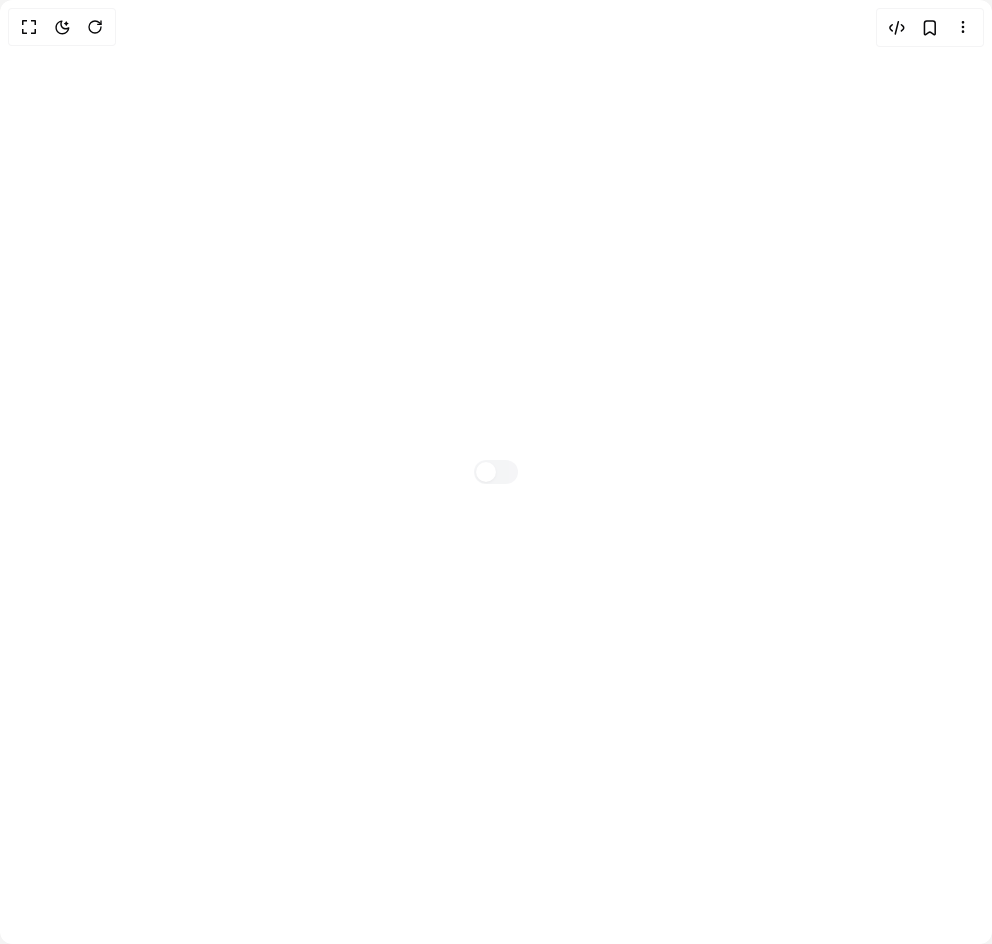

# Build Switch 1 in BuilderStudio

> Build this component in our Agentic IDE: [BuilderStudio](https://builderstudio.dev).
>
> Join the BuilderStudio community on [Discord](https://discord.gg/QdWeSGCqfe) and [Reddit](https://reddit.com/r/builderstudio).



## Component

- Author group: `anubra266`
- Component: `switch-1`
- Variant: `switch-disabler`
- Rendered HTML snapshot: [`rendered.html`](rendered.html)

## BuilderStudio prompt

You are implementing a React component based on a component reference.

## Component identity

- Author: anubra266
- Component slug: switch-1
- Demo slug: switch-disabler
- Title: switch-1
- Description: 

## Goal

Recreate this component in a React + TypeScript + Tailwind CSS project. Preserve the visual layout, spacing, colors, border radius, shadows, interaction behavior, animation behavior, responsive behavior, and dark mode behavior shown in the rendered demo.

## Implementation requirements

- Use React and TypeScript.
- Use Tailwind CSS classes whenever possible.
- Keep the component self-contained unless the source files require helper components.
- If the source uses CSS variables, custom CSS, animations, or keyframes, include them.
- If the source uses external packages, list and use the required packages.
- Preserve accessibility attributes, button semantics, links, keyboard behavior, and ARIA attributes when visible in the source.
- Do not replace the component with a simplified placeholder.
- Return complete production-ready code.

## Dependencies

No reference metadata available.

## Rendered DOM snapshot

This is the rendered demo HTML extracted from the live preview. Use it to verify structure, class names, visible content, and layout.

```html
<div id="root"><div class="w-screen min-h-screen flex justify-center items-center"><div class="w-screen min-h-screen flex justify-center items-center"><div class="bg-white dark:bg-gray-800 w-full px-4 py-12 rounded-xl flex items-center justify-center"><label data-scope="switch" data-part="root" data-disabled="" data-state="unchecked" dir="ltr" id="switch:«r0»" for="switch:«r0»:input" class="flex items-center gap-3"><span data-scope="switch" data-part="control" data-disabled="" data-state="unchecked" dir="ltr" id="switch:«r0»:control" aria-hidden="true" class="relative inline-flex w-11 p-0.5 items-center rounded-full bg-gray-200 transition-colors duration-200 ease-in-out data-[state=checked]:bg-gray-400 data-focus-visible:ring-2 data-focus-visible:ring-gray-400/50 opacity-40 cursor-not-allowed dark:bg-gray-700 dark:data-[state=checked]:bg-gray-600"><span data-scope="switch" data-part="thumb" data-disabled="" data-state="unchecked" dir="ltr" id="switch:«r0»:thumb" aria-hidden="true" class="w-5 h-5 rounded-full bg-white shadow-sm transition-transform duration-200 ease-in-out data-[state=checked]:translate-x-full"></span></span><input id="switch:«r0»:input" disabled="" aria-labelledby="switch:«r0»:label" type="checkbox" value="on" style="border: 0px; clip: rect(0px, 0px, 0px, 0px); height: 1px; margin: -1px; overflow: hidden; padding: 0px; position: absolute; width: 1px; white-space: nowrap; overflow-wrap: normal;"></label></div></div></div></div>
```

## Reference source files

No reference source files were available.
