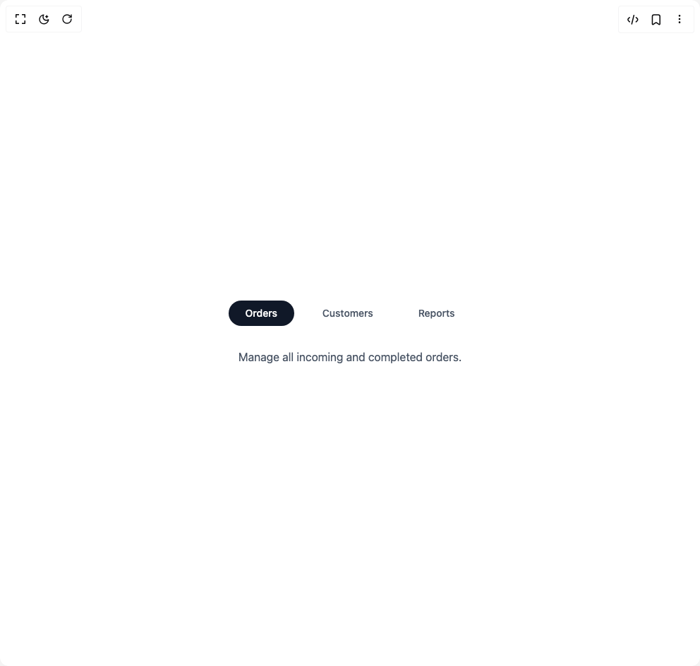

# Build Tabs Component in BuilderStudio

> Build this component in our Agentic IDE: [BuilderStudio](https://builderstudio.dev).
>
> Join the BuilderStudio community on [Discord](https://discord.gg/QdWeSGCqfe) and [Reddit](https://reddit.com/r/builderstudio).



## Component

- Author group: `anubra266`
- Component: `tabs-component`
- Variant: `tabs-pills`
- Rendered HTML snapshot: [`rendered.html`](rendered.html)

## BuilderStudio prompt

You are implementing a React component based on a component reference.

## Component identity

- Author: anubra266
- Component slug: tabs-component
- Demo slug: tabs-pills
- Title: tabs-component
- Description: 

## Goal

Recreate this component in a React + TypeScript + Tailwind CSS project. Preserve the visual layout, spacing, colors, border radius, shadows, interaction behavior, animation behavior, responsive behavior, and dark mode behavior shown in the rendered demo.

## Implementation requirements

- Use React and TypeScript.
- Use Tailwind CSS classes whenever possible.
- Keep the component self-contained unless the source files require helper components.
- If the source uses CSS variables, custom CSS, animations, or keyframes, include them.
- If the source uses external packages, list and use the required packages.
- Preserve accessibility attributes, button semantics, links, keyboard behavior, and ARIA attributes when visible in the source.
- Do not replace the component with a simplified placeholder.
- Return complete production-ready code.

## Dependencies

No reference metadata available.

## Rendered DOM snapshot

This is the rendered demo HTML extracted from the live preview. Use it to verify structure, class names, visible content, and layout.

```html
<div id="root"><div class="w-screen min-h-screen flex justify-center items-center"><div class="w-screen min-h-screen flex justify-center items-center"><div class="bg-white dark:bg-gray-800 w-full px-4 py-12 rounded-xl flex flex-col items-center"><div data-scope="tabs" data-part="root" id="tabs:«r0»" data-orientation="horizontal" dir="ltr" class="w-full flex flex-col items-center"><div data-scope="tabs" data-part="list" id="tabs:«r0»:list" role="tablist" dir="ltr" aria-orientation="horizontal" data-orientation="horizontal" class="flex gap-4 mb-8"><button data-scope="tabs" data-part="trigger" role="tab" type="button" dir="ltr" data-orientation="horizontal" data-value="tab1" aria-selected="true" data-selected="" data-focus="" aria-controls="tabs:«r0»:content-tab1" data-ownedby="tabs:«r0»:list" id="tabs:«r0»:trigger-tab1" tabindex="0" class="px-6 py-2 text-sm font-medium text-gray-600 rounded-full transition-all data-selected:bg-gray-900 data-selected:text-white hover:text-gray-800 dark:text-gray-300 dark:data-selected:bg-gray-100 dark:data-selected:text-gray-900 dark:hover:text-gray-100">Orders</button><button data-scope="tabs" data-part="trigger" role="tab" type="button" dir="ltr" data-orientation="horizontal" data-value="tab2" aria-selected="false" data-ownedby="tabs:«r0»:list" id="tabs:«r0»:trigger-tab2" tabindex="-1" class="px-6 py-2 text-sm font-medium text-gray-600 rounded-full transition-all data-selected:bg-gray-900 data-selected:text-white hover:text-gray-800 dark:text-gray-300 dark:data-selected:bg-gray-100 dark:data-selected:text-gray-900 dark:hover:text-gray-100">Customers</button><button data-scope="tabs" data-part="trigger" role="tab" type="button" dir="ltr" data-orientation="horizontal" data-value="tab3" aria-selected="false" data-ownedby="tabs:«r0»:list" id="tabs:«r0»:trigger-tab3" tabindex="-1" class="px-6 py-2 text-sm font-medium text-gray-600 rounded-full transition-all data-selected:bg-gray-900 data-selected:text-white hover:text-gray-800 dark:text-gray-300 dark:data-selected:bg-gray-100 dark:data-selected:text-gray-900 dark:hover:text-gray-100">Reports</button></div><div data-scope="tabs" data-part="content" dir="ltr" id="tabs:«r0»:content-tab1" tabindex="0" aria-labelledby="tabs:«r0»:trigger-tab1" role="tabpanel" data-ownedby="tabs:«r0»:list" data-selected="" data-orientation="horizontal" data-state="open" class="text-center text-gray-600 dark:text-gray-300">Manage all incoming and completed orders.</div><div data-scope="tabs" data-part="content" dir="ltr" id="tabs:«r0»:content-tab2" tabindex="0" aria-labelledby="tabs:«r0»:trigger-tab2" role="tabpanel" data-ownedby="tabs:«r0»:list" data-orientation="horizontal" hidden="" data-state="closed" class="text-center text-gray-600 dark:text-gray-300">View customer profiles and contact details.</div><div data-scope="tabs" data-part="content" dir="ltr" id="tabs:«r0»:content-tab3" tabindex="0" aria-labelledby="tabs:«r0»:trigger-tab3" role="tabpanel" data-ownedby="tabs:«r0»:list" data-orientation="horizontal" hidden="" data-state="closed" class="text-center text-gray-600 dark:text-gray-300">Generate sales and performance reports.</div></div></div></div></div></div>
```

## Reference source files

No reference source files were available.
