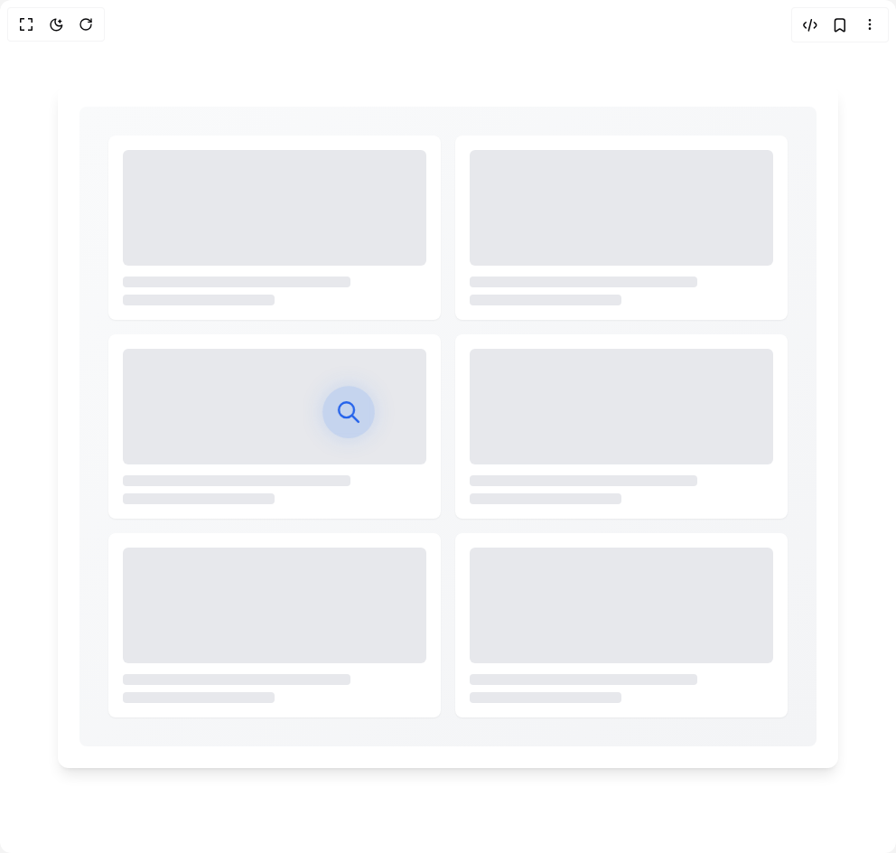

# Build Animated Loading Skeleton in BuilderStudio

> Build this component in our Agentic IDE: [BuilderStudio](https://builderstudio.dev).
>
> Join the BuilderStudio community on [Discord](https://discord.gg/QdWeSGCqfe) and [Reddit](https://reddit.com/r/builderstudio).



## Component

- Author group: `anurag-mishra22`
- Component: `animated-loading-skeleton`
- Variant: `default`
- Rendered HTML snapshot: [`rendered.html`](rendered.html)

## BuilderStudio prompt

You are implementing a React component based on a component reference.

## Component identity

- Author: anurag-mishra22
- Component slug: animated-loading-skeleton
- Demo slug: default
- Title: animated-loading-skeleton
- Description: 

## Goal

Recreate this component in a React + TypeScript + Tailwind CSS project. Preserve the visual layout, spacing, colors, border radius, shadows, interaction behavior, animation behavior, responsive behavior, and dark mode behavior shown in the rendered demo.

## Implementation requirements

- Use React and TypeScript.
- Use Tailwind CSS classes whenever possible.
- Keep the component self-contained unless the source files require helper components.
- If the source uses CSS variables, custom CSS, animations, or keyframes, include them.
- If the source uses external packages, list and use the required packages.
- Preserve accessibility attributes, button semantics, links, keyboard behavior, and ARIA attributes when visible in the source.
- Do not replace the component with a simplified placeholder.
- Return complete production-ready code.

## Dependencies

No reference metadata available.

## Rendered DOM snapshot

This is the rendered demo HTML extracted from the live preview. Use it to verify structure, class names, visible content, and layout.

```html
<div id="root"><div class="relative flex items-center justify-center h-screen w-full m-auto p-16 bg-background text-foreground"><div class="absolute lab-bg inset-0 size-full"><div class="absolute inset-0 bg-[radial-gradient(#00000021_1px,transparent_1px)] dark:bg-[radial-gradient(#ffffff22_1px,transparent_1px)]"></div></div><div class="flex w-full justify-center relative"><div class="w-full max-w-4xl mx-auto p-6 bg-white rounded-xl shadow-lg" style="opacity: 1; transform: none;"><div class="relative overflow-hidden rounded-lg bg-gradient-to-br from-gray-50 to-gray-100 p-8"><div class="absolute z-10 pointer-events-none" style="left: 24px; top: 24px; transform: translateX(250px) translateY(289.995px) scale(1.2);"><div class="bg-blue-500/20 p-3 rounded-full backdrop-blur-sm" style="box-shadow: rgba(59, 130, 246, 0.2) 0px 0px 20.002px; transform: scale(1.00001);"><svg class="w-6 h-6 text-blue-600" fill="none" stroke="currentColor" viewBox="0 0 24 24"><path stroke-linecap="round" stroke-linejoin="round" stroke-width="2" d="M21 21l-6-6m2-5a7 7 0 11-14 0 7 7 0 0114 0z"></path></svg></div></div><div class="grid grid-cols-1 sm:grid-cols-2 lg:grid-cols-3 gap-4"><div class="bg-white rounded-lg shadow-sm p-4" style="opacity: 1; transform: none;"><div class="h-32 bg-gray-200 rounded-md mb-3" style="background: rgb(231, 233, 237);"></div><div class="h-3 w-3/4 bg-gray-200 rounded mb-2" style="background: rgb(231, 233, 237);"></div><div class="h-3 w-1/2 bg-gray-200 rounded" style="background: rgb(231, 233, 237);"></div></div><div class="bg-white rounded-lg shadow-sm p-4" style="opacity: 1; transform: none;"><div class="h-32 bg-gray-200 rounded-md mb-3" style="background: rgb(231, 233, 237);"></div><div class="h-3 w-3/4 bg-gray-200 rounded mb-2" style="background: rgb(231, 233, 237);"></div><div class="h-3 w-1/2 bg-gray-200 rounded" style="background: rgb(231, 233, 237);"></div></div><div class="bg-white rounded-lg shadow-sm p-4" style="opacity: 1; transform: none;"><div class="h-32 bg-gray-200 rounded-md mb-3" style="background: rgb(231, 233, 237);"></div><div class="h-3 w-3/4 bg-gray-200 rounded mb-2" style="background: rgb(231, 233, 237);"></div><div class="h-3 w-1/2 bg-gray-200 rounded" style="background: rgb(231, 233, 237);"></div></div><div class="bg-white rounded-lg shadow-sm p-4" style="opacity: 1; transform: none;"><div class="h-32 bg-gray-200 rounded-md mb-3" style="background: rgb(231, 233, 237);"></div><div class="h-3 w-3/4 bg-gray-200 rounded mb-2" style="background: rgb(231, 233, 237);"></div><div class="h-3 w-1/2 bg-gray-200 rounded" style="background: rgb(231, 233, 237);"></div></div><div class="bg-white rounded-lg shadow-sm p-4" style="opacity: 1; transform: none;"><div class="h-32 bg-gray-200 rounded-md mb-3" style="background: rgb(231, 233, 237);"></div><div class="h-3 w-3/4 bg-gray-200 rounded mb-2" style="background: rgb(231, 233, 237);"></div><div class="h-3 w-1/2 bg-gray-200 rounded" style="background: rgb(231, 233, 237);"></div></div><div class="bg-white rounded-lg shadow-sm p-4" style="opacity: 1; transform: none;"><div class="h-32 bg-gray-200 rounded-md mb-3" style="background: rgb(231, 233, 237);"></div><div class="h-3 w-3/4 bg-gray-200 rounded mb-2" style="background: rgb(231, 233, 237);"></div><div class="h-3 w-1/2 bg-gray-200 rounded" style="background: rgb(231, 233, 237);"></div></div></div></div></div></div></div></div>
```

## Reference source files

No reference source files were available.
