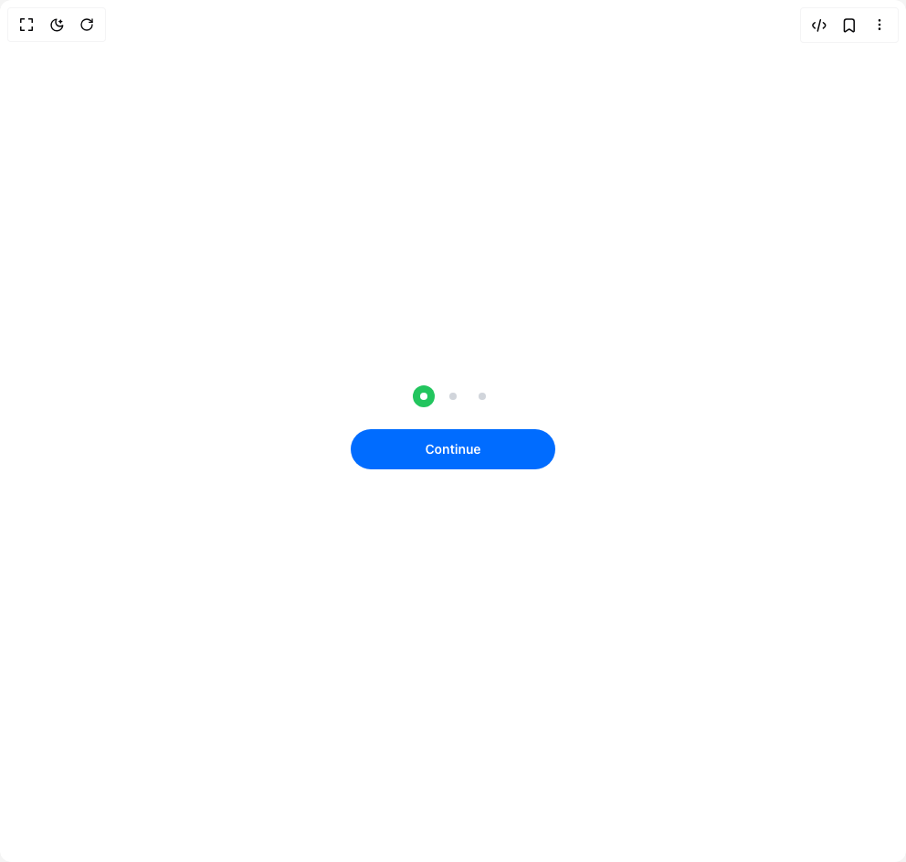

# Build Progress Indicator in BuilderStudio

> Build this component in our Agentic IDE: [BuilderStudio](https://builderstudio.dev).
>
> Join the BuilderStudio community on [Discord](https://discord.gg/QdWeSGCqfe) and [Reddit](https://reddit.com/r/builderstudio).



## Component

- Author group: `anurag-mishra22`
- Component: `progress-indicator`
- Variant: `default`
- Rendered HTML snapshot: [`rendered.html`](rendered.html)

## BuilderStudio prompt

You are implementing a React component based on a component reference.

## Component identity

- Author: anurag-mishra22
- Component slug: progress-indicator
- Demo slug: default
- Title: progress-indicator
- Description: 

## Goal

Recreate this component in a React + TypeScript + Tailwind CSS project. Preserve the visual layout, spacing, colors, border radius, shadows, interaction behavior, animation behavior, responsive behavior, and dark mode behavior shown in the rendered demo.

## Implementation requirements

- Use React and TypeScript.
- Use Tailwind CSS classes whenever possible.
- Keep the component self-contained unless the source files require helper components.
- If the source uses CSS variables, custom CSS, animations, or keyframes, include them.
- If the source uses external packages, list and use the required packages.
- Preserve accessibility attributes, button semantics, links, keyboard behavior, and ARIA attributes when visible in the source.
- Do not replace the component with a simplified placeholder.
- Return complete production-ready code.

## Dependencies

No reference metadata available.

## Rendered DOM snapshot

This is the rendered demo HTML extracted from the live preview. Use it to verify structure, class names, visible content, and layout.

```html
<div id="root"><div class="relative flex items-center justify-center h-screen w-full m-auto p-16 bg-background text-foreground"><div class="absolute lab-bg inset-0 size-full"><div class="absolute inset-0 bg-[radial-gradient(#00000021_1px,transparent_1px)] dark:bg-[radial-gradient(#ffffff22_1px,transparent_1px)]"></div></div><div class="flex w-full justify-center relative"><div class="flex flex-col items-center justify-center gap-8"><div class="flex items-center gap-6 relative"><div class="w-2 h-2 rounded-full relative z-10 bg-white"></div><div class="w-2 h-2 rounded-full relative z-10 bg-gray-300"></div><div class="w-2 h-2 rounded-full relative z-10 bg-gray-300"></div><div class="absolute -left-[8px] -top-[8px] -translate-y-1/2 h-3 bg-green-500 rounded-full" style="width: 24px; height: 24px; transform: none;"></div></div><div class="w-full max-w-sm"><div class="flex items-center gap-1" style="justify-content: stretch;"><button class="px-4 py-3 rounded-full text-white bg-[#006cff] transition-colors flex-1 w-56" style="flex: 1 1 0%;"><div class="flex items-center font-[600] justify-center gap-2 text-sm">Continue</div></button></div></div></div></div></div></div>
```

## Reference source files

No reference source files were available.
