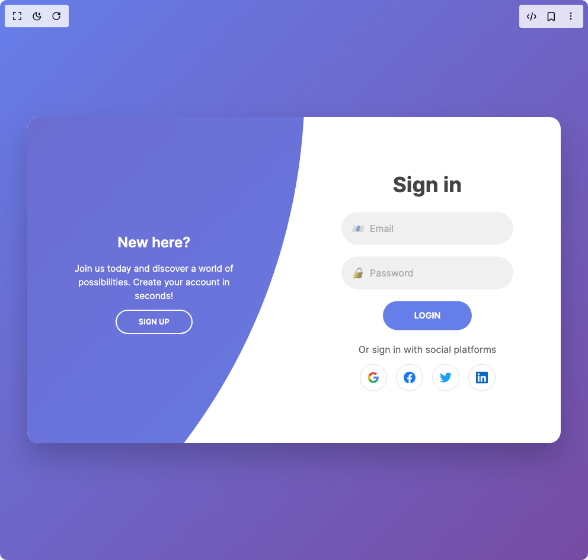

# Build Auth Switch in BuilderStudio

> Build this component in our Agentic IDE: [BuilderStudio](https://builderstudio.dev).
>
> Join the BuilderStudio community on [Discord](https://discord.gg/QdWeSGCqfe) and [Reddit](https://reddit.com/r/builderstudio).



## Component

- Author group: `appvibed01`
- Component: `auth-switch`
- Variant: `auth-switch`
- Rendered HTML snapshot: [`rendered.html`](rendered.html)

## BuilderStudio prompt

You are implementing a React component based on a component reference.

## Component identity

- Author: appvibed01
- Component slug: auth-switch
- Demo slug: auth-switch
- Title: auth-switch
- Description: 

## Goal

Recreate this component in a React + TypeScript + Tailwind CSS project. Preserve the visual layout, spacing, colors, border radius, shadows, interaction behavior, animation behavior, responsive behavior, and dark mode behavior shown in the rendered demo.

## Implementation requirements

- Use React and TypeScript.
- Use Tailwind CSS classes whenever possible.
- Keep the component self-contained unless the source files require helper components.
- If the source uses CSS variables, custom CSS, animations, or keyframes, include them.
- If the source uses external packages, list and use the required packages.
- Preserve accessibility attributes, button semantics, links, keyboard behavior, and ARIA attributes when visible in the source.
- Do not replace the component with a simplified placeholder.
- Return complete production-ready code.

## Dependencies

No reference metadata available.

## Rendered DOM snapshot

This is the rendered demo HTML extracted from the live preview. Use it to verify structure, class names, visible content, and layout.

```html
<div id="root"><div class="w-screen min-h-screen flex justify-center items-center"><div class="w-screen min-h-screen flex justify-center items-center"><style>
        * {
          margin: 0;
          padding: 0;
          box-sizing: border-box;
        }

        body {
          font-family: 'Inter', -apple-system, BlinkMacSystemFont, 'Segoe UI', sans-serif;
          background: linear-gradient(135deg, #667eea 0%, #764ba2 100%);
          min-height: 100vh;
          display: flex;
          justify-content: center;
          align-items: center;
          padding: 20px;
        }

        .container {
          position: relative;
          width: 100%;
          max-width: 900px;
          height: 550px;
          background: white;
          border-radius: 20px;
          box-shadow: 0 25px 50px rgba(0, 0, 0, 0.2);
          overflow: hidden;
        }

        .forms-container {
          position: absolute;
          width: 100%;
          height: 100%;
          top: 0;
          left: 0;
        }

        .signin-signup {
          position: absolute;
          top: 50%;
          transform: translate(-50%, -50%);
          left: 75%;
          width: 50%;
          transition: 1s 0.7s ease-in-out;
          display: grid;
          grid-template-columns: 1fr;
          z-index: 5;
        }

        form {
          display: flex;
          align-items: center;
          justify-content: center;
          flex-direction: column;
          padding: 0 5rem;
          transition: all 0.2s 0.7s;
          overflow: hidden;
          grid-column: 1 / 2;
          grid-row: 1 / 2;
        }

        form.sign-up-form {
          opacity: 0;
          z-index: 1;
        }

        form.sign-in-form {
          z-index: 2;
        }

        .title {
          font-size: 2.2rem;
          color: #444;
          margin-bottom: 10px;
          font-weight: 700;
        }

        .input-field {
          max-width: 380px;
          width: 100%;
          background-color: #f0f0f0;
          margin: 10px 0;
          height: 55px;
          border-radius: 55px;
          display: grid;
          grid-template-columns: 15% 85%;
          padding: 0 0.4rem;
          position: relative;
          transition: 0.3s;
        }

        .input-field:focus-within {
          background-color: #e8e8e8;
          box-shadow: 0 0 0 2px #667eea;
        }

        .input-field i {
          text-align: center;
          line-height: 55px;
          color: #666;
          transition: 0.5s;
          font-size: 1.1rem;
        }

        .input-field input {
          background: none;
          outline: none;
          border: none;
          line-height: 1;
          font-weight: 500;
          font-size: 1rem;
          color: #333;
          width: 100%;
        }

        .input-field input::placeholder {
          color: #aaa;
          font-weight: 400;
        }

        .btn {
          width: 150px;
          background-color: #667eea;
          border: none;
          outline: none;
          height: 49px;
          border-radius: 49px;
          color: #fff;
          text-transform: uppercase;
          font-weight: 600;
          margin: 10px 0;
          cursor: pointer;
          transition: 0.5s;
          font-size: 0.9rem;
        }

        .btn:hover {
          background-color: #5568d3;
          transform: translateY(-2px);
          box-shadow: 0 5px 15px rgba(102, 126, 234, 0.4);
        }

        .panels-container {
          position: absolute;
          height: 100%;
          width: 100%;
          top: 0;
          left: 0;
          display: grid;
          grid-template-columns: repeat(2, 1fr);
        }

        .panel {
          display: flex;
          flex-direction: column;
          align-items: flex-end;
          justify-content: space-around;
          text-align: center;
          z-index: 6;
        }

        .left-panel {
          pointer-events: all;
          padding: 3rem 17% 2rem 12%;
        }

        .right-panel {
          pointer-events: none;
          padding: 3rem 12% 2rem 17%;
        }

        .panel .content {
          color: #fff;
          transition: transform 0.9s ease-in-out;
          transition-delay: 0.6s;
        }

        .panel h3 {
          font-weight: 600;
          line-height: 1;
          font-size: 1.5rem;
          margin-bottom: 10px;
        }

        .panel p {
          font-size: 0.95rem;
          padding: 0.7rem 0;
        }

        .btn.transparent {
          margin: 0;
          background: none;
          border: 2px solid #fff;
          width: 130px;
          height: 41px;
          font-weight: 600;
          font-size: 0.8rem;
        }

        .btn.transparent:hover {
          background: rgba(255, 255, 255, 0.1);
          transform: translateY(-2px);
        }

        .right-panel .content {
          transform: translateX(800px);
        }

        .container.sign-up-mode:before {
          transform: translate(100%, -50%);
          right: 52%;
        }

        .container.sign-up-mode .left-panel .content {
          transform: translateX(-800px);
        }

        .container.sign-up-mode .signin-signup {
          left: 25%;
        }

        .container.sign-up-mode form.sign-up-form {
          opacity: 1;
          z-index: 2;
        }

        .container.sign-up-mode form.sign-in-form {
          opacity: 0;
          z-index: 1;
        }

        .container.sign-up-mode .right-panel .content {
          transform: translateX(0%);
        }

        .container.sign-up-mode .left-panel {
          pointer-events: none;
        }

        .container.sign-up-mode .right-panel {
          pointer-events: all;
        }

        .container:before {
          content: "";
          position: absolute;
          height: 2000px;
          width: 2000px;
          top: -10%;
          right: 48%;
          transform: translateY(-50%);
          background: linear-gradient(-45deg, #667eea 0%, #764ba2 100%);
          transition: 1.8s ease-in-out;
          border-radius: 50%;
          z-index: 6;
        }

        .social-text {
          padding: 0.7rem 0;
          font-size: 1rem;
          color: #666;
        }

        .social-media {
          display: flex;
          justify-content: center;
          gap: 15px;
        }

        .social-icon {
          height: 46px;
          width: 46px;
          display: flex;
          justify-content: center;
          align-items: center;
          border: 1px solid #ddd;
          border-radius: 50%;
          color: #667eea;
          font-size: 1.2rem;
          transition: 0.3s;
          cursor: pointer;
        }

        .social-icon:hover {
          border-color: #764ba2;
          transform: translateY(-3px);
          box-shadow: 0 5px 15px rgba(0, 0, 0, 0.1);
        }

        .social-icon svg {
          transition: 0.3s;
        }

        @media (max-width: 870px) {
          .container {
            min-height: 800px;
            height: 100vh;
          }
          .signin-signup {
            width: 100%;
            top: 95%;
            transform: translate(-50%, -100%);
            transition: 1s 0.8s ease-in-out;
          }
          .signin-signup,
          .container.sign-up-mode .signin-signup {
            left: 50%;
          }
          .panels-container {
            grid-template-columns: 1fr;
            grid-template-rows: 1fr 2fr 1fr;
          }
          .panel {
            flex-direction: row;
            justify-content: space-around;
            align-items: center;
            padding: 2.5rem 8%;
            grid-column: 1 / 2;
          }
          .right-panel {
            grid-row: 3 / 4;
          }
          .left-panel {
            grid-row: 1 / 2;
          }
          .panel .content {
            padding-right: 15%;
            transition: transform 0.9s ease-in-out;
            transition-delay: 0.8s;
          }
          .panel h3 {
            font-size: 1.2rem;
          }
          .panel p {
            font-size: 0.7rem;
            padding: 0.5rem 0;
          }
          .btn.transparent {
            width: 110px;
            height: 35px;
            font-size: 0.7rem;
          }
          .container:before {
            width: 1500px;
            height: 1500px;
            transform: translateX(-50%);
            left: 30%;
            bottom: 68%;
            right: initial;
            top: initial;
            transition: 2s ease-in-out;
          }
          .container.sign-up-mode:before {
            transform: translate(-50%, 100%);
            bottom: 32%;
            right: initial;
          }
          .container.sign-up-mode .left-panel .content {
            transform: translateY(-300px);
          }
          .container.sign-up-mode .right-panel .content {
            transform: translateY(0px);
          }
          .right-panel .content {
            transform: translateY(300px);
          }
          .container.sign-up-mode .signin-signup {
            top: 5%;
            transform: translate(-50%, 0);
          }
        }

        @media (max-width: 570px) {
          form {
            padding: 0 1.5rem;
          }
          .panel .content {
            padding: 0.5rem 1rem;
          }
        }
      </style><div class="container"><div class="forms-container"><div class="signin-signup"><form class="sign-in-form"><h2 class="title">Sign in</h2><div class="input-field"><i>📧</i><input placeholder="Email" type="email"></div><div class="input-field"><i>🔒</i><input placeholder="Password" type="password"></div><input class="btn solid" type="submit" value="Login"><p class="social-text">Or sign in with social platforms</p><div class="social-media"><a href="#" class="social-icon"><svg xmlns="http://www.w3.org/2000/svg" width="20" height="20" viewBox="0 0 24 24" fill="currentColor"><path d="M22.56 12.25c0-.78-.07-1.53-.2-2.25H12v4.26h5.92c-.26 1.37-1.04 2.53-2.21 3.31v2.77h3.57c2.08-1.92 3.28-4.74 3.28-8.09z" fill="#4285F4"></path><path d="M12 23c2.97 0 5.46-.98 7.28-2.66l-3.57-2.77c-.98.66-2.23 1.06-3.71 1.06-2.86 0-5.29-1.93-6.16-4.53H2.18v2.84C3.99 20.53 7.7 23 12 23z" fill="#34A853"></path><path d="M5.84 14.09c-.22-.66-.35-1.36-.35-2.09s.13-1.43.35-2.09V7.07H2.18C1.43 8.55 1 10.22 1 12s.43 3.45 1.18 4.93l2.85-2.22.81-.62z" fill="#FBBC05"></path><path d="M12 5.38c1.62 0 3.06.56 4.21 1.64l3.15-3.15C17.45 2.09 14.97 1 12 1 7.7 1 3.99 3.47 2.18 7.07l3.66 2.84c.87-2.6 3.3-4.53 6.16-4.53z" fill="#EA4335"></path></svg></a><a href="#" class="social-icon"><svg xmlns="http://www.w3.org/2000/svg" width="20" height="20" viewBox="0 0 24 24" fill="#1877F2"><path d="M24 12.073c0-6.627-5.373-12-12-12s-12 5.373-12 12c0 5.99 4.388 10.954 10.125 11.854v-8.385H7.078v-3.47h3.047V9.43c0-3.007 1.792-4.669 4.533-4.669 1.312 0 2.686.235 2.686.235v2.953H15.83c-1.491 0-1.956.925-1.956 1.874v2.25h3.328l-.532 3.47h-2.796v8.385C19.612 23.027 24 18.062 24 12.073z"></path></svg></a><a href="#" class="social-icon"><svg xmlns="http://www.w3.org/2000/svg" width="20" height="20" viewBox="0 0 24 24" fill="#1DA1F2"><path d="M23.953 4.57a10 10 0 01-2.825.775 4.958 4.958 0 002.163-2.723c-.951.555-2.005.959-3.127 1.184a4.92 4.92 0 00-8.384 4.482C7.69 8.095 4.067 6.13 1.64 3.162a4.822 4.822 0 00-.666 2.475c0 1.71.87 3.213 2.188 4.096a4.904 4.904 0 01-2.228-.616v.06a4.923 4.923 0 003.946 4.827 4.996 4.996 0 01-2.212.085 4.936 4.936 0 004.604 3.417 9.867 9.867 0 01-6.102 2.105c-.39 0-.779-.023-1.17-.067a13.995 13.995 0 007.557 2.209c9.053 0 13.998-7.496 13.998-13.985 0-.21 0-.42-.015-.63A9.935 9.935 0 0024 4.59z"></path></svg></a><a href="#" class="social-icon"><svg xmlns="http://www.w3.org/2000/svg" width="20" height="20" viewBox="0 0 24 24" fill="#0A66C2"><path d="M20.447 20.452h-3.554v-5.569c0-1.328-.027-3.037-1.852-3.037-1.853 0-2.136 1.445-2.136 2.939v5.667H9.351V9h3.414v1.561h.046c.477-.9 1.637-1.85 3.37-1.85 3.601 0 4.267 2.37 4.267 5.455v6.286zM5.337 7.433c-1.144 0-2.063-.926-2.063-2.065 0-1.138.92-2.063 2.063-2.063 1.14 0 2.064.925 2.064 2.063 0 1.139-.925 2.065-2.064 2.065zm1.782 13.019H3.555V9h3.564v11.452zM22.225 0H1.771C.792 0 0 .774 0 1.729v20.542C0 23.227.792 24 1.771 24h20.451C23.2 24 24 23.227 24 22.271V1.729C24 .774 23.2 0 22.222 0h.003z"></path></svg></a></div></form><form class="sign-up-form"><h2 class="title">Sign up</h2><div class="input-field"><i>👤</i><input placeholder="Username" type="text"></div><div class="input-field"><i>📧</i><input placeholder="Email" type="email"></div><div class="input-field"><i>🔒</i><input placeholder="Password" type="password"></div><input class="btn" type="submit" value="Sign up"><p class="social-text">Or sign up with social platforms</p><div class="social-media"><a href="#" class="social-icon"><svg xmlns="http://www.w3.org/2000/svg" width="20" height="20" viewBox="0 0 24 24" fill="currentColor"><path d="M22.56 12.25c0-.78-.07-1.53-.2-2.25H12v4.26h5.92c-.26 1.37-1.04 2.53-2.21 3.31v2.77h3.57c2.08-1.92 3.28-4.74 3.28-8.09z" fill="#4285F4"></path><path d="M12 23c2.97 0 5.46-.98 7.28-2.66l-3.57-2.77c-.98.66-2.23 1.06-3.71 1.06-2.86 0-5.29-1.93-6.16-4.53H2.18v2.84C3.99 20.53 7.7 23 12 23z" fill="#34A853"></path><path d="M5.84 14.09c-.22-.66-.35-1.36-.35-2.09s.13-1.43.35-2.09V7.07H2.18C1.43 8.55 1 10.22 1 12s.43 3.45 1.18 4.93l2.85-2.22.81-.62z" fill="#FBBC05"></path><path d="M12 5.38c1.62 0 3.06.56 4.21 1.64l3.15-3.15C17.45 2.09 14.97 1 12 1 7.7 1 3.99 3.47 2.18 7.07l3.66 2.84c.87-2.6 3.3-4.53 6.16-4.53z" fill="#EA4335"></path></svg></a><a href="#" class="social-icon"><svg xmlns="http://www.w3.org/2000/svg" width="20" height="20" viewBox="0 0 24 24" fill="#1877F2"><path d="M24 12.073c0-6.627-5.373-12-12-12s-12 5.373-12 12c0 5.99 4.388 10.954 10.125 11.854v-8.385H7.078v-3.47h3.047V9.43c0-3.007 1.792-4.669 4.533-4.669 1.312 0 2.686.235 2.686.235v2.953H15.83c-1.491 0-1.956.925-1.956 1.874v2.25h3.328l-.532 3.47h-2.796v8.385C19.612 23.027 24 18.062 24 12.073z"></path></svg></a><a href="#" class="social-icon"><svg xmlns="http://www.w3.org/2000/svg" width="20" height="20" viewBox="0 0 24 24" fill="#1DA1F2"><path d="M23.953 4.57a10 10 0 01-2.825.775 4.958 4.958 0 002.163-2.723c-.951.555-2.005.959-3.127 1.184a4.92 4.92 0 00-8.384 4.482C7.69 8.095 4.067 6.13 1.64 3.162a4.822 4.822 0 00-.666 2.475c0 1.71.87 3.213 2.188 4.096a4.904 4.904 0 01-2.228-.616v.06a4.923 4.923 0 003.946 4.827 4.996 4.996 0 01-2.212.085 4.936 4.936 0 004.604 3.417 9.867 9.867 0 01-6.102 2.105c-.39 0-.779-.023-1.17-.067a13.995 13.995 0 007.557 2.209c9.053 0 13.998-7.496 13.998-13.985 0-.21 0-.42-.015-.63A9.935 9.935 0 0024 4.59z"></path></svg></a><a href="#" class="social-icon"><svg xmlns="http://www.w3.org/2000/svg" width="20" height="20" viewBox="0 0 24 24" fill="#0A66C2"><path d="M20.447 20.452h-3.554v-5.569c0-1.328-.027-3.037-1.852-3.037-1.853 0-2.136 1.445-2.136 2.939v5.667H9.351V9h3.414v1.561h.046c.477-.9 1.637-1.85 3.37-1.85 3.601 0 4.267 2.37 4.267 5.455v6.286zM5.337 7.433c-1.144 0-2.063-.926-2.063-2.065 0-1.138.92-2.063 2.063-2.063 1.14 0 2.064.925 2.064 2.063 0 1.139-.925 2.065-2.064 2.065zm1.782 13.019H3.555V9h3.564v11.452zM22.225 0H1.771C.792 0 0 .774 0 1.729v20.542C0 23.227.792 24 1.771 24h20.451C23.2 24 24 23.227 24 22.271V1.729C24 .774 23.2 0 22.222 0h.003z"></path></svg></a></div></form></div></div><div class="panels-container"><div class="panel left-panel"><div class="content"><h3>New here?</h3><p>Join us today and discover a world of possibilities. Create your account in seconds!</p><button class="btn transparent">Sign up</button></div></div><div class="panel right-panel"><div class="content"><h3>One of us?</h3><p>Welcome back! Sign in to continue your journey with us.</p><button class="btn transparent">Sign in</button></div></div></div></div></div></div></div>
```

## Reference source files

No reference source files were available.
