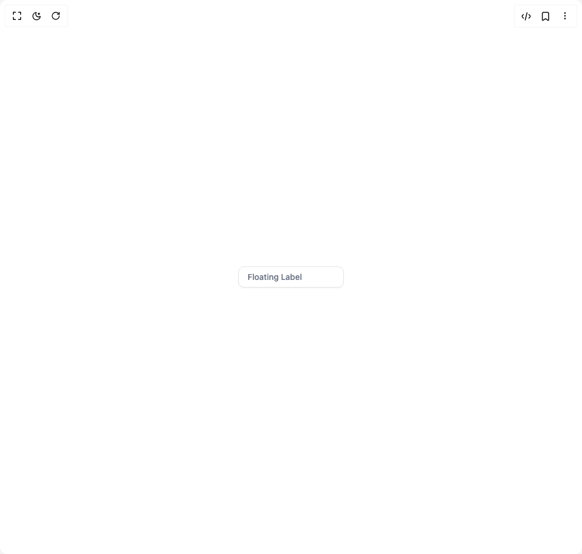

# Build Floating Label in BuilderStudio

> Build this component in our Agentic IDE: [BuilderStudio](https://builderstudio.dev).
>
> Join the BuilderStudio community on [Discord](https://discord.gg/QdWeSGCqfe) and [Reddit](https://reddit.com/r/builderstudio).



## Component

- Author group: `arihantcodes_1f7b8c4d`
- Component: `floating-label`
- Variant: `default`
- Rendered HTML snapshot: [`rendered.html`](rendered.html)

## BuilderStudio prompt

You are implementing a React component based on a component reference.

## Component identity

- Author: arihantcodes_1f7b8c4d
- Component slug: floating-label
- Demo slug: default
- Title: floating-label
- Description: 

## Goal

Recreate this component in a React + TypeScript + Tailwind CSS project. Preserve the visual layout, spacing, colors, border radius, shadows, interaction behavior, animation behavior, responsive behavior, and dark mode behavior shown in the rendered demo.

## Implementation requirements

- Use React and TypeScript.
- Use Tailwind CSS classes whenever possible.
- Keep the component self-contained unless the source files require helper components.
- If the source uses CSS variables, custom CSS, animations, or keyframes, include them.
- If the source uses external packages, list and use the required packages.
- Preserve accessibility attributes, button semantics, links, keyboard behavior, and ARIA attributes when visible in the source.
- Do not replace the component with a simplified placeholder.
- Return complete production-ready code.

## Dependencies

No reference metadata available.

## Rendered DOM snapshot

This is the rendered demo HTML extracted from the live preview. Use it to verify structure, class names, visible content, and layout.

```html
<div id="root"><div class="w-screen min-h-screen flex justify-center items-center"><div class="w-screen min-h-screen flex justify-center items-center"><div class="flex w-full h-screen justify-center items-center"><div class="relative"><input class="flex h-9 w-full rounded-lg border border-input bg-background px-3 py-2 text-sm text-foreground shadow-sm shadow-black/5 transition-shadow placeholder:text-muted-foreground/70 focus-visible:border-ring focus-visible:outline-none focus-visible:ring-[3px] focus-visible:ring-ring/20 disabled:cursor-not-allowed disabled:opacity-50 peer" placeholder=" " id="demo-input"><label class="font-medium peer-disabled:cursor-not-allowed peer-disabled:opacity-70 peer-focus:secondary peer-focus:dark:secondary absolute start-2 top-2 z-10 origin-[0] -translate-y-4 scale-75 transform bg-background px-2 text-sm text-gray-500 duration-300 peer-placeholder-shown:top-1/2 peer-placeholder-shown:-translate-y-1/2 peer-placeholder-shown:scale-100 peer-focus:top-2 peer-focus:-translate-y-4 peer-focus:scale-75 peer-focus:px-2 dark:bg-background rtl:peer-focus:left-auto rtl:peer-focus:translate-x-1/4 cursor-text" for="demo-input">Floating Label</label></div></div></div></div></div>
```

## Reference source files

No reference source files were available.
