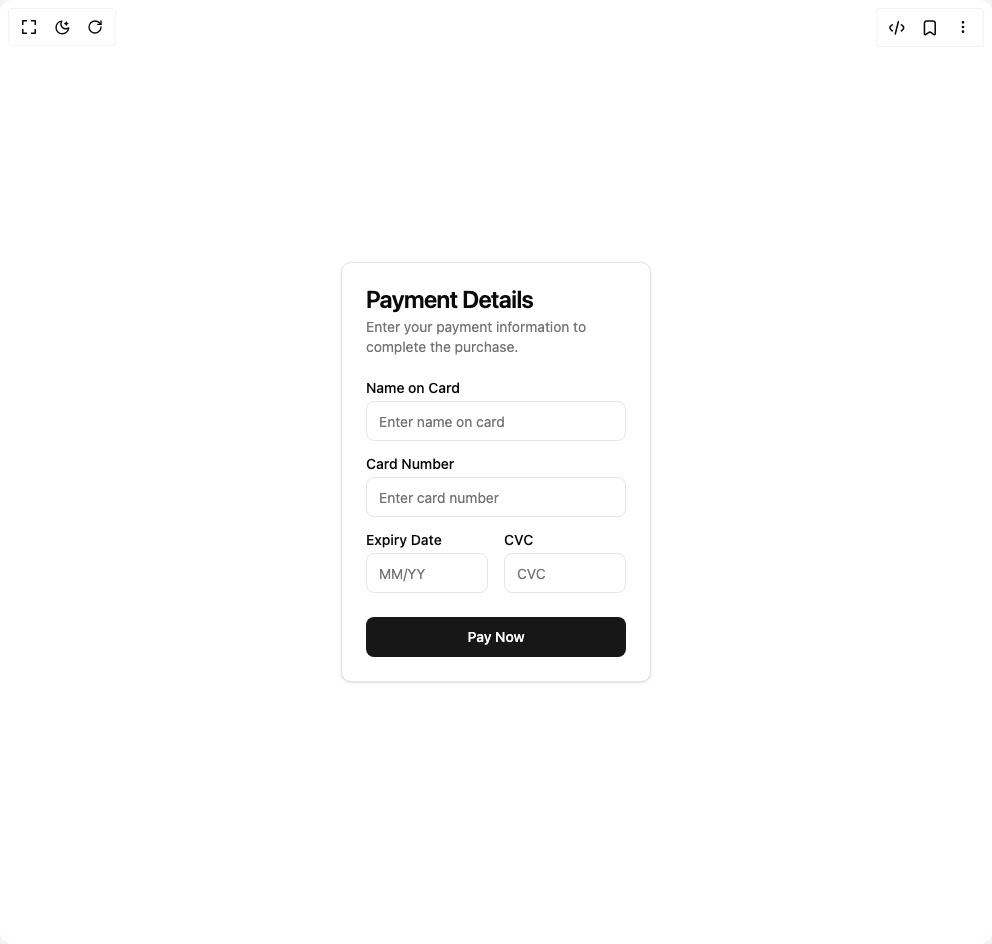

# Build Login Card 1 in BuilderStudio

> Build this component in our Agentic IDE: [BuilderStudio](https://builderstudio.dev).
>
> Join the BuilderStudio community on [Discord](https://discord.gg/QdWeSGCqfe) and [Reddit](https://reddit.com/r/builderstudio).



## Component

- Author group: `arihantcodes_1f7b8c4d`
- Component: `login-card-1`
- Variant: `payements-details-card`
- Rendered HTML snapshot: [`rendered.html`](rendered.html)

## BuilderStudio prompt

You are implementing a React component based on a component reference.

## Component identity

- Author: arihantcodes_1f7b8c4d
- Component slug: login-card-1
- Demo slug: payements-details-card
- Title: login-card-1
- Description: 

## Goal

Recreate this component in a React + TypeScript + Tailwind CSS project. Preserve the visual layout, spacing, colors, border radius, shadows, interaction behavior, animation behavior, responsive behavior, and dark mode behavior shown in the rendered demo.

## Implementation requirements

- Use React and TypeScript.
- Use Tailwind CSS classes whenever possible.
- Keep the component self-contained unless the source files require helper components.
- If the source uses CSS variables, custom CSS, animations, or keyframes, include them.
- If the source uses external packages, list and use the required packages.
- Preserve accessibility attributes, button semantics, links, keyboard behavior, and ARIA attributes when visible in the source.
- Do not replace the component with a simplified placeholder.
- Return complete production-ready code.

## Dependencies

No reference metadata available.

## Rendered DOM snapshot

This is the rendered demo HTML extracted from the live preview. Use it to verify structure, class names, visible content, and layout.

```html
<div id="root"><div class="w-screen min-h-screen flex justify-center items-center"><div class="w-screen min-h-screen flex justify-center items-center"><div class="rounded-lg border bg-card text-card-foreground shadow-sm w-[310px]"><div class="flex flex-col space-y-1.5 p-6"><h3 class="text-2xl font-semibold leading-none tracking-tight">Payment Details</h3><p class="text-sm text-muted-foreground">Enter your payment information to complete the purchase.</p></div><div class="p-6 pt-0"><form><div class="grid w-full items-center gap-4"><div class="flex flex-col space-y-1.5"><label class="text-sm font-medium leading-none peer-disabled:cursor-not-allowed peer-disabled:opacity-70" for="cardName">Name on Card</label><input class="flex h-10 w-full rounded-md border border-input bg-background px-3 py-2 text-sm ring-offset-background file:border-0 file:bg-transparent file:text-sm file:font-medium file:text-foreground placeholder:text-muted-foreground focus-visible:outline-none focus-visible:ring-2 focus-visible:ring-ring focus-visible:ring-offset-2 disabled:cursor-not-allowed disabled:opacity-50" id="cardName" placeholder="Enter name on card"></div><div class="flex flex-col space-y-1.5"><label class="text-sm font-medium leading-none peer-disabled:cursor-not-allowed peer-disabled:opacity-70" for="cardNumber">Card Number</label><input class="flex h-10 w-full rounded-md border border-input bg-background px-3 py-2 text-sm ring-offset-background file:border-0 file:bg-transparent file:text-sm file:font-medium file:text-foreground placeholder:text-muted-foreground focus-visible:outline-none focus-visible:ring-2 focus-visible:ring-ring focus-visible:ring-offset-2 disabled:cursor-not-allowed disabled:opacity-50" id="cardNumber" placeholder="Enter card number"></div><div class="flex space-x-4"><div class="flex flex-col space-y-1.5 flex-1"><label class="text-sm font-medium leading-none peer-disabled:cursor-not-allowed peer-disabled:opacity-70" for="expiry">Expiry Date</label><input class="flex h-10 w-full rounded-md border border-input bg-background px-3 py-2 text-sm ring-offset-background file:border-0 file:bg-transparent file:text-sm file:font-medium file:text-foreground placeholder:text-muted-foreground focus-visible:outline-none focus-visible:ring-2 focus-visible:ring-ring focus-visible:ring-offset-2 disabled:cursor-not-allowed disabled:opacity-50" id="expiry" placeholder="MM/YY"></div><div class="flex flex-col space-y-1.5 flex-1"><label class="text-sm font-medium leading-none peer-disabled:cursor-not-allowed peer-disabled:opacity-70" for="cvc">CVC</label><input class="flex h-10 w-full rounded-md border border-input bg-background px-3 py-2 text-sm ring-offset-background file:border-0 file:bg-transparent file:text-sm file:font-medium file:text-foreground placeholder:text-muted-foreground focus-visible:outline-none focus-visible:ring-2 focus-visible:ring-ring focus-visible:ring-offset-2 disabled:cursor-not-allowed disabled:opacity-50" id="cvc" placeholder="CVC"></div></div></div></form></div><div class="flex items-center p-6 pt-0"><button class="inline-flex items-center justify-center whitespace-nowrap rounded-md text-sm font-medium ring-offset-background transition-colors focus-visible:outline-none focus-visible:ring-2 focus-visible:ring-ring focus-visible:ring-offset-2 disabled:pointer-events-none disabled:opacity-50 bg-primary text-primary-foreground hover:bg-primary/90 h-10 px-4 py-2 w-full">Pay Now</button></div></div></div></div></div>
```

## Reference source files

No reference source files were available.
