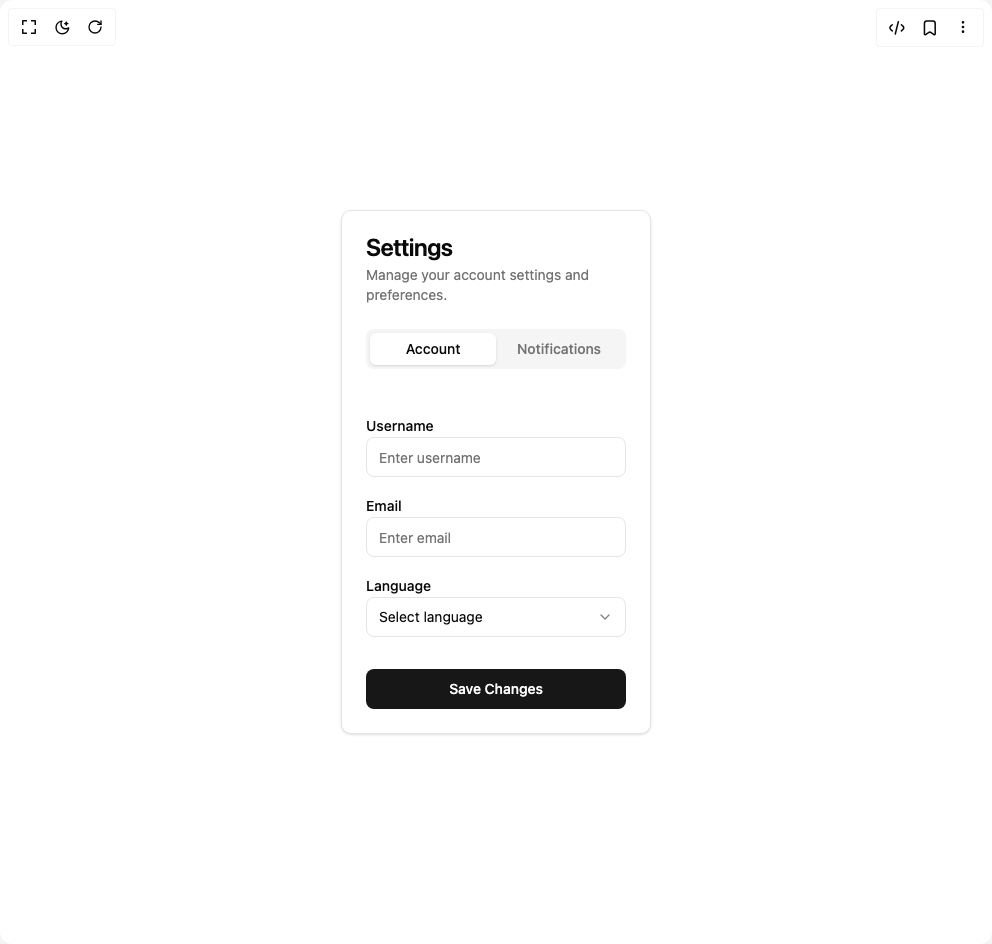

# Build Login Card 1 in BuilderStudio

> Build this component in our Agentic IDE: [BuilderStudio](https://builderstudio.dev).
>
> Join the BuilderStudio community on [Discord](https://discord.gg/QdWeSGCqfe) and [Reddit](https://reddit.com/r/builderstudio).



## Component

- Author group: `arihantcodes_1f7b8c4d`
- Component: `login-card-1`
- Variant: `settings-card`
- Rendered HTML snapshot: [`rendered.html`](rendered.html)

## BuilderStudio prompt

You are implementing a React component based on a component reference.

## Component identity

- Author: arihantcodes_1f7b8c4d
- Component slug: login-card-1
- Demo slug: settings-card
- Title: login-card-1
- Description: 

## Goal

Recreate this component in a React + TypeScript + Tailwind CSS project. Preserve the visual layout, spacing, colors, border radius, shadows, interaction behavior, animation behavior, responsive behavior, and dark mode behavior shown in the rendered demo.

## Implementation requirements

- Use React and TypeScript.
- Use Tailwind CSS classes whenever possible.
- Keep the component self-contained unless the source files require helper components.
- If the source uses CSS variables, custom CSS, animations, or keyframes, include them.
- If the source uses external packages, list and use the required packages.
- Preserve accessibility attributes, button semantics, links, keyboard behavior, and ARIA attributes when visible in the source.
- Do not replace the component with a simplified placeholder.
- Return complete production-ready code.

## Dependencies

No reference metadata available.

## Rendered DOM snapshot

This is the rendered demo HTML extracted from the live preview. Use it to verify structure, class names, visible content, and layout.

```html
<div id="root"><div class="w-screen min-h-screen flex justify-center items-center"><div class="w-screen min-h-screen flex justify-center items-center"><div class="rounded-lg border bg-card text-card-foreground shadow-sm w-[310px]"><div class="flex flex-col space-y-1.5 p-6"><h3 class="text-2xl font-semibold leading-none tracking-tight">Settings</h3><p class="text-sm text-muted-foreground">Manage your account settings and preferences.</p></div><div class="p-6 pt-0"><div dir="ltr" data-orientation="horizontal" class="w-full"><div role="tablist" aria-orientation="horizontal" class="h-10 items-center justify-center rounded-md bg-muted p-1 text-muted-foreground grid w-full grid-cols-2 mb-4" tabindex="0" data-orientation="horizontal" style="outline: none;"><button type="button" role="tab" aria-selected="true" aria-controls="radix-«r0»-content-account" data-state="active" id="radix-«r0»-trigger-account" class="inline-flex items-center justify-center whitespace-nowrap rounded-sm px-3 py-1.5 text-sm font-medium ring-offset-background transition-all focus-visible:outline-none focus-visible:ring-2 focus-visible:ring-ring focus-visible:ring-offset-2 disabled:pointer-events-none disabled:opacity-50 data-[state=active]:bg-background data-[state=active]:text-foreground data-[state=active]:shadow-sm" tabindex="-1" data-orientation="horizontal" data-radix-collection-item="">Account</button><button type="button" role="tab" aria-selected="false" aria-controls="radix-«r0»-content-notifications" data-state="inactive" id="radix-«r0»-trigger-notifications" class="inline-flex items-center justify-center whitespace-nowrap rounded-sm px-3 py-1.5 text-sm font-medium ring-offset-background transition-all focus-visible:outline-none focus-visible:ring-2 focus-visible:ring-ring focus-visible:ring-offset-2 disabled:pointer-events-none disabled:opacity-50 data-[state=active]:bg-background data-[state=active]:text-foreground data-[state=active]:shadow-sm" tabindex="-1" data-orientation="horizontal" data-radix-collection-item="">Notifications</button></div><div data-state="active" data-orientation="horizontal" role="tabpanel" aria-labelledby="radix-«r0»-trigger-account" id="radix-«r0»-content-account" tabindex="0" class="mt-2 ring-offset-background focus-visible:outline-none focus-visible:ring-2 focus-visible:ring-ring focus-visible:ring-offset-2" style="animation-duration: 0s;"><div class="space-y-4 py-2 "><div class="space-y-2 mt-5"><label class="text-sm font-medium leading-none peer-disabled:cursor-not-allowed peer-disabled:opacity-70" for="username">Username</label><input class="flex h-10 w-full rounded-md border border-input bg-background px-3 py-2 text-sm ring-offset-background file:border-0 file:bg-transparent file:text-sm file:font-medium file:text-foreground placeholder:text-muted-foreground focus-visible:outline-none focus-visible:ring-2 focus-visible:ring-ring focus-visible:ring-offset-2 disabled:cursor-not-allowed disabled:opacity-50" id="username" placeholder="Enter username"></div><div class="space-y-2"><label class="text-sm font-medium leading-none peer-disabled:cursor-not-allowed peer-disabled:opacity-70" for="email">Email</label><input class="flex h-10 w-full rounded-md border border-input bg-background px-3 py-2 text-sm ring-offset-background file:border-0 file:bg-transparent file:text-sm file:font-medium file:text-foreground placeholder:text-muted-foreground focus-visible:outline-none focus-visible:ring-2 focus-visible:ring-ring focus-visible:ring-offset-2 disabled:cursor-not-allowed disabled:opacity-50" id="email" placeholder="Enter email" type="email"></div><div class="space-y-2"><label class="text-sm font-medium leading-none peer-disabled:cursor-not-allowed peer-disabled:opacity-70" for="language">Language</label><button type="button" role="combobox" aria-controls="radix-«r3»" aria-expanded="false" aria-autocomplete="none" dir="ltr" data-state="closed" data-placeholder="" class="flex h-10 w-full items-center justify-between rounded-md border border-input bg-background px-3 py-2 text-sm ring-offset-background placeholder:text-muted-foreground focus:outline-none focus:ring-2 focus:ring-ring focus:ring-offset-2 disabled:cursor-not-allowed disabled:opacity-50 [&amp;&gt;span]:line-clamp-1" id="language"><span style="pointer-events: none;">Select language</span><svg xmlns="http://www.w3.org/2000/svg" width="24" height="24" viewBox="0 0 24 24" fill="none" stroke="currentColor" stroke-width="2" stroke-linecap="round" stroke-linejoin="round" class="lucide lucide-chevron-down h-4 w-4 opacity-50" aria-hidden="true"><path d="m6 9 6 6 6-6"></path></svg></button></div></div></div><div data-state="inactive" data-orientation="horizontal" role="tabpanel" aria-labelledby="radix-«r0»-trigger-notifications" hidden="" id="radix-«r0»-content-notifications" tabindex="0" class="mt-2 ring-offset-background focus-visible:outline-none focus-visible:ring-2 focus-visible:ring-ring focus-visible:ring-offset-2"></div></div></div><div class="flex items-center p-6 pt-0"><button class="inline-flex items-center justify-center whitespace-nowrap rounded-md text-sm font-medium ring-offset-background transition-colors focus-visible:outline-none focus-visible:ring-2 focus-visible:ring-ring focus-visible:ring-offset-2 disabled:pointer-events-none disabled:opacity-50 bg-primary text-primary-foreground hover:bg-primary/90 h-10 px-4 py-2 w-full">Save Changes</button></div></div></div></div></div>
```

## Reference source files

No reference source files were available.
