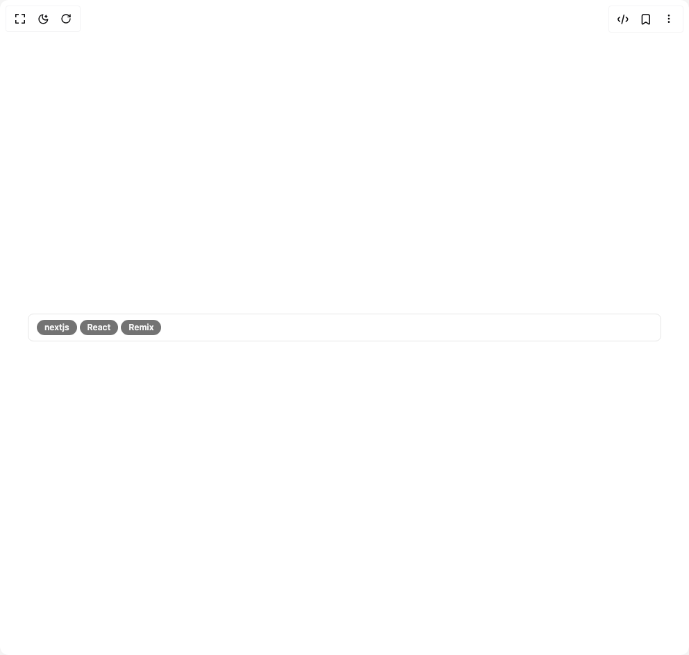

# Build Multiple Selector in BuilderStudio

> Build this component in our Agentic IDE: [BuilderStudio](https://builderstudio.dev).
>
> Join the BuilderStudio community on [Discord](https://discord.gg/QdWeSGCqfe) and [Reddit](https://reddit.com/r/builderstudio).



## Component

- Author group: `arihantcodes_1f7b8c4d`
- Component: `multiple-selector`
- Variant: `disabled-selector`
- Rendered HTML snapshot: [`rendered.html`](rendered.html)

## BuilderStudio prompt

You are implementing a React component based on a component reference.

## Component identity

- Author: arihantcodes_1f7b8c4d
- Component slug: multiple-selector
- Demo slug: disabled-selector
- Title: multiple-selector
- Description: 

## Goal

Recreate this component in a React + TypeScript + Tailwind CSS project. Preserve the visual layout, spacing, colors, border radius, shadows, interaction behavior, animation behavior, responsive behavior, and dark mode behavior shown in the rendered demo.

## Implementation requirements

- Use React and TypeScript.
- Use Tailwind CSS classes whenever possible.
- Keep the component self-contained unless the source files require helper components.
- If the source uses CSS variables, custom CSS, animations, or keyframes, include them.
- If the source uses external packages, list and use the required packages.
- Preserve accessibility attributes, button semantics, links, keyboard behavior, and ARIA attributes when visible in the source.
- Do not replace the component with a simplified placeholder.
- Return complete production-ready code.

## Dependencies

No reference metadata available.

## Rendered DOM snapshot

This is the rendered demo HTML extracted from the live preview. Use it to verify structure, class names, visible content, and layout.

```html
<div id="root"><div class="w-screen min-h-screen flex justify-center items-center"><div class="w-screen min-h-screen flex justify-center items-center"><div class="w-full px-10"><div tabindex="-1" class="flex w-full flex-col rounded-md text-popover-foreground h-auto overflow-visible bg-transparent" cmdk-root=""><label cmdk-label="" for="radix-«r2»" id="radix-«r1»" style="position: absolute; width: 1px; height: 1px; padding: 0px; margin: -1px; overflow: hidden; clip: rect(0px, 0px, 0px, 0px); white-space: nowrap; border-width: 0px;"></label><div class="min-h-10 rounded-md border border-input text-sm ring-offset-background focus-within:ring-2 focus-within:ring-ring focus-within:ring-offset-2 px-3 py-2"><div class="relative flex flex-wrap gap-1"><div class="inline-flex items-center rounded-full border px-2.5 py-0.5 text-xs font-semibold transition-colors focus:outline-none focus:ring-2 focus:ring-ring focus:ring-offset-2 border-transparent bg-primary text-primary-foreground hover:bg-primary/80 data-[disabled]:bg-muted-foreground data-[disabled]:text-muted data-[disabled]:hover:bg-muted-foreground data-[fixed]:bg-muted-foreground data-[fixed]:text-muted data-[fixed]:hover:bg-muted-foreground" data-disabled="true">nextjs<button class="ml-1 rounded-full outline-none ring-offset-background focus:ring-2 focus:ring-ring focus:ring-offset-2 hidden"><svg xmlns="http://www.w3.org/2000/svg" width="24" height="24" viewBox="0 0 24 24" fill="none" stroke="currentColor" stroke-width="2" stroke-linecap="round" stroke-linejoin="round" class="lucide lucide-x h-3 w-3 text-muted-foreground hover:text-foreground" aria-hidden="true"><path d="M18 6 6 18"></path><path d="m6 6 12 12"></path></svg></button></div><div class="inline-flex items-center rounded-full border px-2.5 py-0.5 text-xs font-semibold transition-colors focus:outline-none focus:ring-2 focus:ring-ring focus:ring-offset-2 border-transparent bg-primary text-primary-foreground hover:bg-primary/80 data-[disabled]:bg-muted-foreground data-[disabled]:text-muted data-[disabled]:hover:bg-muted-foreground data-[fixed]:bg-muted-foreground data-[fixed]:text-muted data-[fixed]:hover:bg-muted-foreground" data-disabled="true">React<button class="ml-1 rounded-full outline-none ring-offset-background focus:ring-2 focus:ring-ring focus:ring-offset-2 hidden"><svg xmlns="http://www.w3.org/2000/svg" width="24" height="24" viewBox="0 0 24 24" fill="none" stroke="currentColor" stroke-width="2" stroke-linecap="round" stroke-linejoin="round" class="lucide lucide-x h-3 w-3 text-muted-foreground hover:text-foreground" aria-hidden="true"><path d="M18 6 6 18"></path><path d="m6 6 12 12"></path></svg></button></div><div class="inline-flex items-center rounded-full border px-2.5 py-0.5 text-xs font-semibold transition-colors focus:outline-none focus:ring-2 focus:ring-ring focus:ring-offset-2 border-transparent bg-primary text-primary-foreground hover:bg-primary/80 data-[disabled]:bg-muted-foreground data-[disabled]:text-muted data-[disabled]:hover:bg-muted-foreground data-[fixed]:bg-muted-foreground data-[fixed]:text-muted data-[fixed]:hover:bg-muted-foreground" data-disabled="true">Remix<button class="ml-1 rounded-full outline-none ring-offset-background focus:ring-2 focus:ring-ring focus:ring-offset-2 hidden"><svg xmlns="http://www.w3.org/2000/svg" width="24" height="24" viewBox="0 0 24 24" fill="none" stroke="currentColor" stroke-width="2" stroke-linecap="round" stroke-linejoin="round" class="lucide lucide-x h-3 w-3 text-muted-foreground hover:text-foreground" aria-hidden="true"><path d="M18 6 6 18"></path><path d="m6 6 12 12"></path></svg></button></div><input disabled="" placeholder="" class="flex-1 bg-transparent outline-none placeholder:text-muted-foreground w-full ml-1" cmdk-input="" autocomplete="off" autocorrect="off" spellcheck="false" aria-autocomplete="list" role="combobox" aria-expanded="true" aria-controls="radix-«r0»" aria-labelledby="radix-«r1»" id="radix-«r2»" type="text" value=""><button type="button" class="absolute right-0 h-6 w-6 p-0 hidden"><svg xmlns="http://www.w3.org/2000/svg" width="24" height="24" viewBox="0 0 24 24" fill="none" stroke="currentColor" stroke-width="2" stroke-linecap="round" stroke-linejoin="round" class="lucide lucide-x" aria-hidden="true"><path d="M18 6 6 18"></path><path d="m6 6 12 12"></path></svg></button></div></div><div class="relative"></div></div></div></div></div></div>
```

## Reference source files

No reference source files were available.
