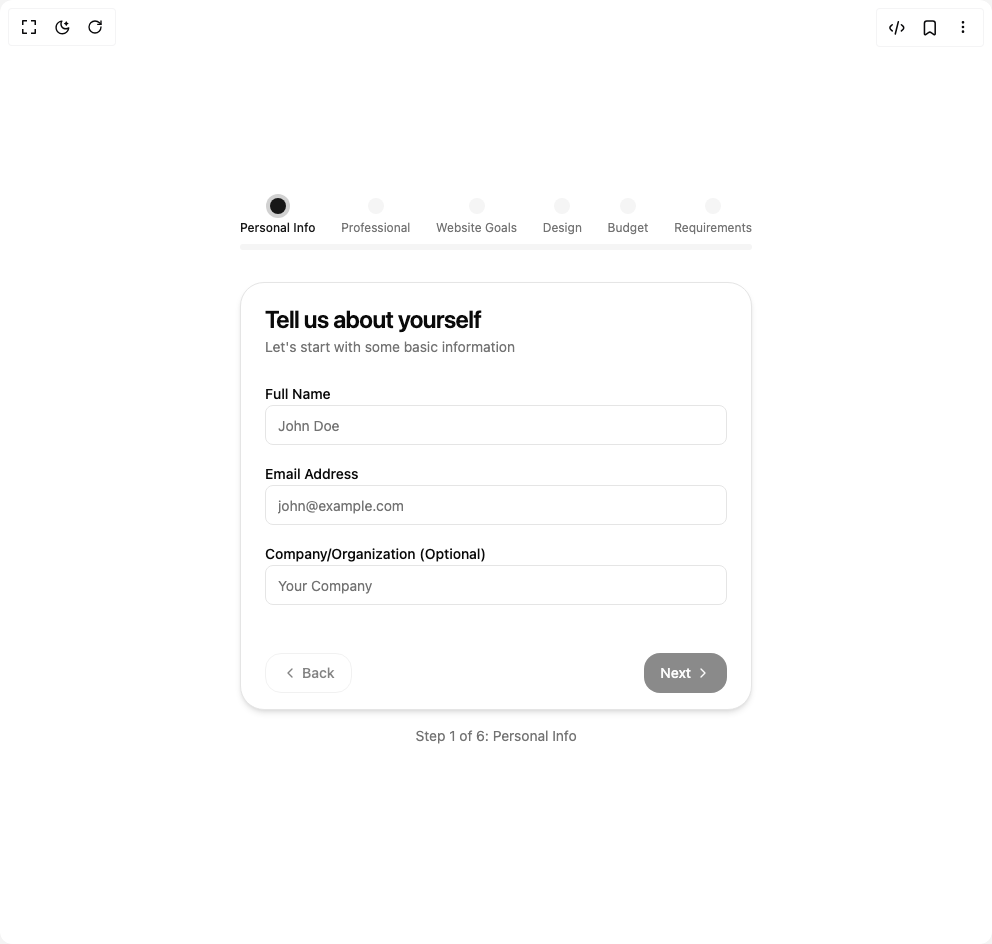

# Build Multistep Form in BuilderStudio

> Build this component in our Agentic IDE: [BuilderStudio](https://builderstudio.dev).
>
> Join the BuilderStudio community on [Discord](https://discord.gg/QdWeSGCqfe) and [Reddit](https://reddit.com/r/builderstudio).



## Component

- Author group: `arihantcodes_1f7b8c4d`
- Component: `multistep-form`
- Variant: `default`
- Rendered HTML snapshot: [`rendered.html`](rendered.html)

## BuilderStudio prompt

You are implementing a React component based on a component reference.

## Component identity

- Author: arihantcodes_1f7b8c4d
- Component slug: multistep-form
- Demo slug: default
- Title: multistep-form
- Description: 

## Goal

Recreate this component in a React + TypeScript + Tailwind CSS project. Preserve the visual layout, spacing, colors, border radius, shadows, interaction behavior, animation behavior, responsive behavior, and dark mode behavior shown in the rendered demo.

## Implementation requirements

- Use React and TypeScript.
- Use Tailwind CSS classes whenever possible.
- Keep the component self-contained unless the source files require helper components.
- If the source uses CSS variables, custom CSS, animations, or keyframes, include them.
- If the source uses external packages, list and use the required packages.
- Preserve accessibility attributes, button semantics, links, keyboard behavior, and ARIA attributes when visible in the source.
- Do not replace the component with a simplified placeholder.
- Return complete production-ready code.

## Dependencies

No reference metadata available.

## Rendered DOM snapshot

This is the rendered demo HTML extracted from the live preview. Use it to verify structure, class names, visible content, and layout.

```html
<div id="root"><div class="w-screen min-h-screen flex justify-center items-center"><div class="w-screen min-h-screen flex justify-center items-center"><div class="w-full max-w-lg mx-auto py-8"><div class="mb-8" style="opacity: 1; transform: none;"><div class="flex justify-between mb-2"><div class="flex flex-col items-center"><div class="w-4 h-4 rounded-full cursor-pointer transition-colors duration-300 bg-primary ring-4 ring-primary/20" tabindex="0"></div><span class="text-xs mt-1.5 hidden sm:block text-primary font-medium">Personal Info</span></div><div class="flex flex-col items-center"><div class="w-4 h-4 rounded-full cursor-pointer transition-colors duration-300 bg-muted" tabindex="0"></div><span class="text-xs mt-1.5 hidden sm:block text-muted-foreground">Professional</span></div><div class="flex flex-col items-center"><div class="w-4 h-4 rounded-full cursor-pointer transition-colors duration-300 bg-muted" tabindex="0"></div><span class="text-xs mt-1.5 hidden sm:block text-muted-foreground">Website Goals</span></div><div class="flex flex-col items-center"><div class="w-4 h-4 rounded-full cursor-pointer transition-colors duration-300 bg-muted" tabindex="0"></div><span class="text-xs mt-1.5 hidden sm:block text-muted-foreground">Design</span></div><div class="flex flex-col items-center"><div class="w-4 h-4 rounded-full cursor-pointer transition-colors duration-300 bg-muted" tabindex="0"></div><span class="text-xs mt-1.5 hidden sm:block text-muted-foreground">Budget</span></div><div class="flex flex-col items-center"><div class="w-4 h-4 rounded-full cursor-pointer transition-colors duration-300 bg-muted" tabindex="0"></div><span class="text-xs mt-1.5 hidden sm:block text-muted-foreground">Requirements</span></div></div><div class="w-full bg-muted h-1.5 rounded-full overflow-hidden mt-2"><div class="h-full bg-primary" style="width: 0%;"></div></div></div><div style="opacity: 1; transform: none;"><div class="bg-card text-card-foreground border shadow-md rounded-3xl overflow-hidden"><div><div style="opacity: 1; transform: none;"><div class="flex flex-col space-y-1.5 p-6"><h3 class="text-2xl font-semibold leading-none tracking-tight">Tell us about yourself</h3><p class="text-sm text-muted-foreground">Let's start with some basic information</p></div><div class="p-6 pt-0 space-y-4"><div class="space-y-2" style="opacity: 1; transform: none;"><label class="text-sm font-medium leading-none peer-disabled:cursor-not-allowed peer-disabled:opacity-70" for="name">Full Name</label><input class="flex h-10 w-full rounded-md border border-input bg-background px-3 py-2 text-sm ring-offset-background file:border-0 file:bg-transparent file:text-sm file:font-medium file:text-foreground placeholder:text-muted-foreground focus-visible:outline-none focus-visible:ring-2 focus-visible:ring-ring focus-visible:ring-offset-2 disabled:cursor-not-allowed disabled:opacity-50 transition-all duration-300 focus:ring-2 focus:ring-primary/20 focus:border-primary" id="name" placeholder="John Doe" value=""></div><div class="space-y-2" style="opacity: 1; transform: none;"><label class="text-sm font-medium leading-none peer-disabled:cursor-not-allowed peer-disabled:opacity-70" for="email">Email Address</label><input class="flex h-10 w-full rounded-md border border-input bg-background px-3 py-2 text-sm ring-offset-background file:border-0 file:bg-transparent file:text-sm file:font-medium file:text-foreground placeholder:text-muted-foreground focus-visible:outline-none focus-visible:ring-2 focus-visible:ring-ring focus-visible:ring-offset-2 disabled:cursor-not-allowed disabled:opacity-50 transition-all duration-300 focus:ring-2 focus:ring-primary/20 focus:border-primary" id="email" placeholder="john@example.com" type="email" value=""></div><div class="space-y-2" style="opacity: 1; transform: none;"><label class="text-sm font-medium leading-none peer-disabled:cursor-not-allowed peer-disabled:opacity-70" for="company">Company/Organization (Optional)</label><input class="flex h-10 w-full rounded-md border border-input bg-background px-3 py-2 text-sm ring-offset-background file:border-0 file:bg-transparent file:text-sm file:font-medium file:text-foreground placeholder:text-muted-foreground focus-visible:outline-none focus-visible:ring-2 focus-visible:ring-ring focus-visible:ring-offset-2 disabled:cursor-not-allowed disabled:opacity-50 transition-all duration-300 focus:ring-2 focus:ring-primary/20 focus:border-primary" id="company" placeholder="Your Company" value=""></div></div></div><div class="items-center p-6 flex justify-between pt-6 pb-4"><div tabindex="0"><button class="justify-center whitespace-nowrap text-sm font-medium ring-offset-background focus-visible:outline-none focus-visible:ring-2 focus-visible:ring-ring focus-visible:ring-offset-2 disabled:pointer-events-none disabled:opacity-50 border border-input bg-background hover:bg-accent hover:text-accent-foreground h-10 px-4 py-2 flex items-center gap-1 transition-all duration-300 rounded-2xl" type="button" disabled=""><svg xmlns="http://www.w3.org/2000/svg" width="24" height="24" viewBox="0 0 24 24" fill="none" stroke="currentColor" stroke-width="2" stroke-linecap="round" stroke-linejoin="round" class="lucide lucide-chevron-left h-4 w-4" aria-hidden="true"><path d="m15 18-6-6 6-6"></path></svg> Back</button></div><div tabindex="0"><button class="justify-center whitespace-nowrap text-sm font-medium ring-offset-background focus-visible:outline-none focus-visible:ring-2 focus-visible:ring-ring focus-visible:ring-offset-2 disabled:pointer-events-none disabled:opacity-50 bg-primary text-primary-foreground hover:bg-primary/90 h-10 px-4 py-2 flex items-center gap-1 transition-all duration-300 rounded-2xl" type="button" disabled="">Next<svg xmlns="http://www.w3.org/2000/svg" width="24" height="24" viewBox="0 0 24 24" fill="none" stroke="currentColor" stroke-width="2" stroke-linecap="round" stroke-linejoin="round" class="lucide lucide-chevron-right h-4 w-4" aria-hidden="true"><path d="m9 18 6-6-6-6"></path></svg></button></div></div></div></div></div><div class="mt-4 text-center text-sm text-muted-foreground" style="opacity: 1;">Step 1 of 6: Personal Info</div></div></div></div></div>
```

## Reference source files

No reference source files were available.
