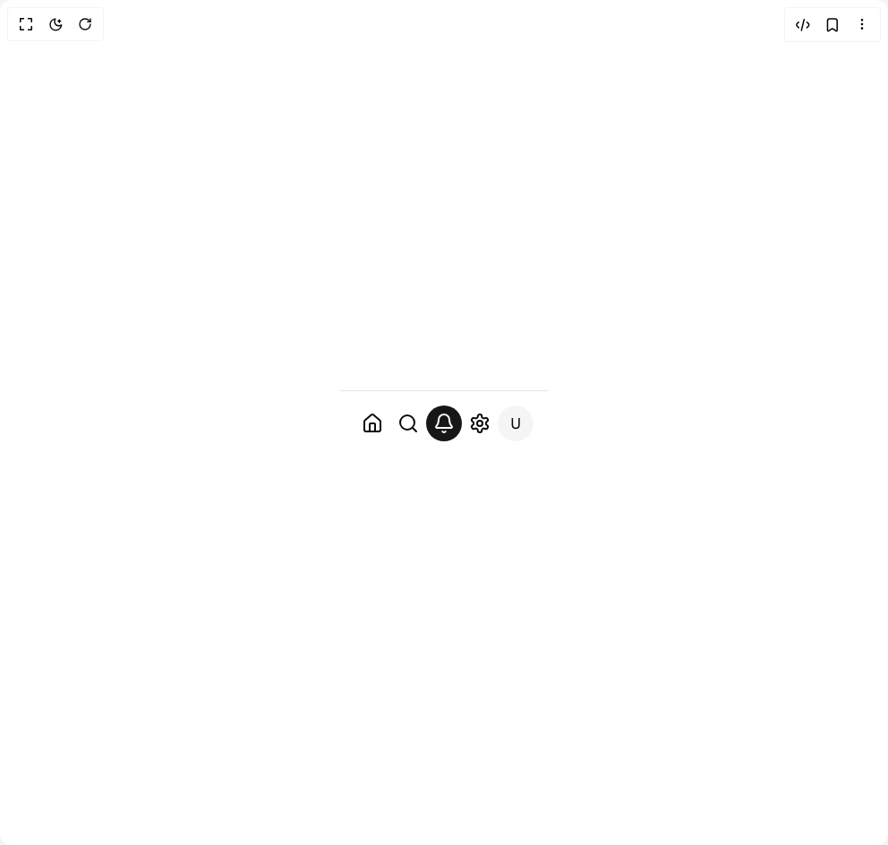

# Build Navbars in BuilderStudio

> Build this component in our Agentic IDE: [BuilderStudio](https://builderstudio.dev).
>
> Join the BuilderStudio community on [Discord](https://discord.gg/QdWeSGCqfe) and [Reddit](https://reddit.com/r/builderstudio).



## Component

- Author group: `arihantcodes_1f7b8c4d`
- Component: `navbars`
- Variant: `circular-navbar`
- Rendered HTML snapshot: [`rendered.html`](rendered.html)

## BuilderStudio prompt

You are implementing a React component based on a component reference.

## Component identity

- Author: arihantcodes_1f7b8c4d
- Component slug: navbars
- Demo slug: circular-navbar
- Title: navbars
- Description: 

## Goal

Recreate this component in a React + TypeScript + Tailwind CSS project. Preserve the visual layout, spacing, colors, border radius, shadows, interaction behavior, animation behavior, responsive behavior, and dark mode behavior shown in the rendered demo.

## Implementation requirements

- Use React and TypeScript.
- Use Tailwind CSS classes whenever possible.
- Keep the component self-contained unless the source files require helper components.
- If the source uses CSS variables, custom CSS, animations, or keyframes, include them.
- If the source uses external packages, list and use the required packages.
- Preserve accessibility attributes, button semantics, links, keyboard behavior, and ARIA attributes when visible in the source.
- Do not replace the component with a simplified placeholder.
- Return complete production-ready code.

## Dependencies

No reference metadata available.

## Rendered DOM snapshot

This is the rendered demo HTML extracted from the live preview. Use it to verify structure, class names, visible content, and layout.

```html
<div id="root"><div class="w-screen min-h-screen flex justify-center items-center"><div class="w-screen min-h-screen flex justify-center items-center"><nav class=" bottom-0 left-0 right-0 border-t bg-background p-4 backdrop-blur-sm"><div class="container mx-auto flex items-center justify-between"><button class="inline-flex items-center justify-center whitespace-nowrap text-sm font-medium ring-offset-background transition-colors focus-visible:outline-none focus-visible:ring-2 focus-visible:ring-ring focus-visible:ring-offset-2 disabled:pointer-events-none disabled:opacity-50 hover:bg-accent hover:text-accent-foreground h-10 w-10 rounded-full"><svg xmlns="http://www.w3.org/2000/svg" width="24" height="24" viewBox="0 0 24 24" fill="none" stroke="currentColor" stroke-width="2" stroke-linecap="round" stroke-linejoin="round" class="lucide lucide-house h-6 w-6" aria-hidden="true"><path d="M15 21v-8a1 1 0 0 0-1-1h-4a1 1 0 0 0-1 1v8"></path><path d="M3 10a2 2 0 0 1 .709-1.528l7-5.999a2 2 0 0 1 2.582 0l7 5.999A2 2 0 0 1 21 10v9a2 2 0 0 1-2 2H5a2 2 0 0 1-2-2z"></path></svg><span class="sr-only">Home</span></button><button class="inline-flex items-center justify-center whitespace-nowrap text-sm font-medium ring-offset-background transition-colors focus-visible:outline-none focus-visible:ring-2 focus-visible:ring-ring focus-visible:ring-offset-2 disabled:pointer-events-none disabled:opacity-50 hover:bg-accent hover:text-accent-foreground h-10 w-10 rounded-full"><svg xmlns="http://www.w3.org/2000/svg" width="24" height="24" viewBox="0 0 24 24" fill="none" stroke="currentColor" stroke-width="2" stroke-linecap="round" stroke-linejoin="round" class="lucide lucide-search h-6 w-6" aria-hidden="true"><circle cx="11" cy="11" r="8"></circle><path d="m21 21-4.3-4.3"></path></svg><span class="sr-only">Search</span></button><button class="inline-flex items-center justify-center whitespace-nowrap text-sm font-medium ring-offset-background transition-colors focus-visible:outline-none focus-visible:ring-2 focus-visible:ring-ring focus-visible:ring-offset-2 disabled:pointer-events-none disabled:opacity-50 hover:bg-primary/90 h-10 w-10 rounded-full bg-primary text-primary-foreground"><svg xmlns="http://www.w3.org/2000/svg" width="24" height="24" viewBox="0 0 24 24" fill="none" stroke="currentColor" stroke-width="2" stroke-linecap="round" stroke-linejoin="round" class="lucide lucide-bell h-6 w-6" aria-hidden="true"><path d="M10.268 21a2 2 0 0 0 3.464 0"></path><path d="M3.262 15.326A1 1 0 0 0 4 17h16a1 1 0 0 0 .74-1.673C19.41 13.956 18 12.499 18 8A6 6 0 0 0 6 8c0 4.499-1.411 5.956-2.738 7.326"></path></svg><span class="sr-only">Notifications</span></button><button class="inline-flex items-center justify-center whitespace-nowrap text-sm font-medium ring-offset-background transition-colors focus-visible:outline-none focus-visible:ring-2 focus-visible:ring-ring focus-visible:ring-offset-2 disabled:pointer-events-none disabled:opacity-50 hover:bg-accent hover:text-accent-foreground h-10 w-10 rounded-full"><svg xmlns="http://www.w3.org/2000/svg" width="24" height="24" viewBox="0 0 24 24" fill="none" stroke="currentColor" stroke-width="2" stroke-linecap="round" stroke-linejoin="round" class="lucide lucide-settings h-6 w-6" aria-hidden="true"><path d="M12.22 2h-.44a2 2 0 0 0-2 2v.18a2 2 0 0 1-1 1.73l-.43.25a2 2 0 0 1-2 0l-.15-.08a2 2 0 0 0-2.73.73l-.22.38a2 2 0 0 0 .73 2.73l.15.1a2 2 0 0 1 1 1.72v.51a2 2 0 0 1-1 1.74l-.15.09a2 2 0 0 0-.73 2.73l.22.38a2 2 0 0 0 2.73.73l.15-.08a2 2 0 0 1 2 0l.43.25a2 2 0 0 1 1 1.73V20a2 2 0 0 0 2 2h.44a2 2 0 0 0 2-2v-.18a2 2 0 0 1 1-1.73l.43-.25a2 2 0 0 1 2 0l.15.08a2 2 0 0 0 2.73-.73l.22-.39a2 2 0 0 0-.73-2.73l-.15-.08a2 2 0 0 1-1-1.74v-.5a2 2 0 0 1 1-1.74l.15-.09a2 2 0 0 0 .73-2.73l-.22-.38a2 2 0 0 0-2.73-.73l-.15.08a2 2 0 0 1-2 0l-.43-.25a2 2 0 0 1-1-1.73V4a2 2 0 0 0-2-2z"></path><circle cx="12" cy="12" r="3"></circle></svg><span class="sr-only">Settings</span></button><span class="relative flex h-10 w-10 shrink-0 overflow-hidden rounded-full"><span class="flex h-full w-full items-center justify-center rounded-full bg-muted">U</span></span></div></nav></div></div></div>
```

## Reference source files

No reference source files were available.
