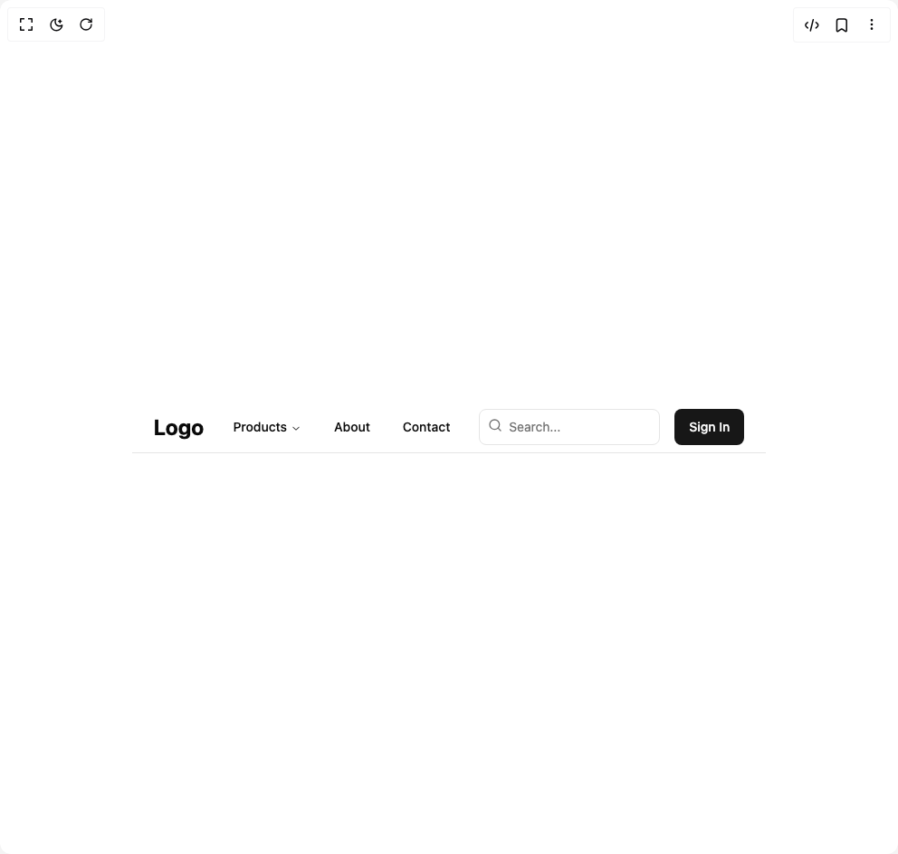

# Build Navbars in BuilderStudio

> Build this component in our Agentic IDE: [BuilderStudio](https://builderstudio.dev).
>
> Join the BuilderStudio community on [Discord](https://discord.gg/QdWeSGCqfe) and [Reddit](https://reddit.com/r/builderstudio).



## Component

- Author group: `arihantcodes_1f7b8c4d`
- Component: `navbars`
- Variant: `tab-navbar`
- Rendered HTML snapshot: [`rendered.html`](rendered.html)

## BuilderStudio prompt

You are implementing a React component based on a component reference.

## Component identity

- Author: arihantcodes_1f7b8c4d
- Component slug: navbars
- Demo slug: tab-navbar
- Title: navbars
- Description: 

## Goal

Recreate this component in a React + TypeScript + Tailwind CSS project. Preserve the visual layout, spacing, colors, border radius, shadows, interaction behavior, animation behavior, responsive behavior, and dark mode behavior shown in the rendered demo.

## Implementation requirements

- Use React and TypeScript.
- Use Tailwind CSS classes whenever possible.
- Keep the component self-contained unless the source files require helper components.
- If the source uses CSS variables, custom CSS, animations, or keyframes, include them.
- If the source uses external packages, list and use the required packages.
- Preserve accessibility attributes, button semantics, links, keyboard behavior, and ARIA attributes when visible in the source.
- Do not replace the component with a simplified placeholder.
- Return complete production-ready code.

## Dependencies

No reference metadata available.

## Rendered DOM snapshot

This is the rendered demo HTML extracted from the live preview. Use it to verify structure, class names, visible content, and layout.

```html
<div id="root"><div class="w-screen min-h-screen flex justify-center items-center"><div class="w-screen min-h-screen flex justify-center items-center"><nav class="border-b"><div class="container mx-auto flex items-center space-x-4 justify-between px-4 py-2 sm:px-6 lg:px-8"><div class="flex items-center space-x-4"><a href="#" class="text-2xl font-bold">Logo</a><nav aria-label="Main" data-orientation="horizontal" dir="ltr" class="relative z-10 flex max-w-max flex-1 items-center justify-center"><div style="position: relative;"><ul data-orientation="horizontal" class="group flex flex-1 list-none items-center justify-center space-x-1" dir="ltr"><li><button id="radix-«r0»-trigger-radix-«r1»" data-state="closed" aria-expanded="false" aria-controls="radix-«r0»-content-radix-«r1»" class="group inline-flex h-9 w-max items-center justify-center rounded-md bg-background px-4 py-2 text-sm font-medium transition-colors hover:bg-accent hover:text-accent-foreground focus:bg-accent focus:text-accent-foreground focus:outline-none disabled:pointer-events-none disabled:opacity-50 data-[active]:bg-accent/50 data-[state=open]:bg-accent/50 group" data-radix-collection-item="">Products <svg width="15" height="15" viewBox="0 0 15 15" fill="none" xmlns="http://www.w3.org/2000/svg" class="relative top-[1px] ml-1 h-3 w-3 transition duration-300 group-data-[state=open]:rotate-180" aria-hidden="true"><path d="M3.13523 6.15803C3.3241 5.95657 3.64052 5.94637 3.84197 6.13523L7.5 9.56464L11.158 6.13523C11.3595 5.94637 11.6759 5.95657 11.8648 6.15803C12.0536 6.35949 12.0434 6.67591 11.842 6.86477L7.84197 10.6148C7.64964 10.7951 7.35036 10.7951 7.15803 10.6148L3.15803 6.86477C2.95657 6.67591 2.94637 6.35949 3.13523 6.15803Z" fill="currentColor" fill-rule="evenodd" clip-rule="evenodd"></path></svg></button></li><li><a class="group inline-flex h-9 w-max items-center justify-center rounded-md bg-background px-4 py-2 text-sm font-medium transition-colors hover:bg-accent hover:text-accent-foreground focus:bg-accent focus:text-accent-foreground focus:outline-none disabled:pointer-events-none disabled:opacity-50 data-[active]:bg-accent/50 data-[state=open]:bg-accent/50" href="#" data-radix-collection-item="">About</a></li><li><a class="group inline-flex h-9 w-max items-center justify-center rounded-md bg-background px-4 py-2 text-sm font-medium transition-colors hover:bg-accent hover:text-accent-foreground focus:bg-accent focus:text-accent-foreground focus:outline-none disabled:pointer-events-none disabled:opacity-50 data-[active]:bg-accent/50 data-[state=open]:bg-accent/50" href="#" data-radix-collection-item="">Contact</a></li></ul></div><div class="absolute left-0 top-full flex justify-center"></div></nav></div><div class="flex items-center space-x-4"><form class="relative"><svg xmlns="http://www.w3.org/2000/svg" width="24" height="24" viewBox="0 0 24 24" fill="none" stroke="currentColor" stroke-width="2" stroke-linecap="round" stroke-linejoin="round" class="lucide lucide-search absolute left-2.5 top-2.5 h-4 w-4 text-muted-foreground" aria-hidden="true"><circle cx="11" cy="11" r="8"></circle><path d="m21 21-4.3-4.3"></path></svg><input class="flex h-10 w-full rounded-md border border-input bg-background px-3 py-2 text-sm ring-offset-background file:border-0 file:bg-transparent file:text-sm file:font-medium file:text-foreground placeholder:text-muted-foreground focus-visible:outline-none focus-visible:ring-2 focus-visible:ring-ring focus-visible:ring-offset-2 disabled:cursor-not-allowed disabled:opacity-50 pl-8" placeholder="Search..." type="search"></form><button class="inline-flex items-center justify-center whitespace-nowrap rounded-md text-sm font-medium ring-offset-background transition-colors focus-visible:outline-none focus-visible:ring-2 focus-visible:ring-ring focus-visible:ring-offset-2 disabled:pointer-events-none disabled:opacity-50 bg-primary text-primary-foreground hover:bg-primary/90 h-10 px-4 py-2">Sign In</button></div></div></nav></div></div></div>
```

## Reference source files

No reference source files were available.
