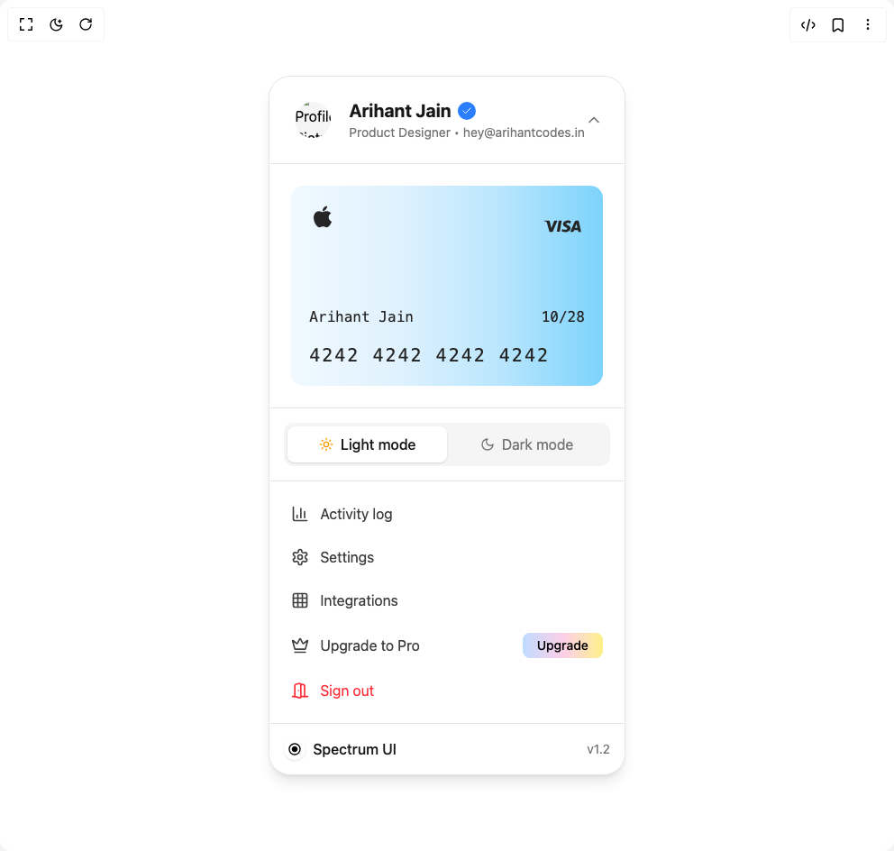

# Build Profile Dropdown in BuilderStudio

> Build this component in our Agentic IDE: [BuilderStudio](https://builderstudio.dev).
>
> Join the BuilderStudio community on [Discord](https://discord.gg/QdWeSGCqfe) and [Reddit](https://reddit.com/r/builderstudio).



## Component

- Author group: `arihantcodes_1f7b8c4d`
- Component: `profile-dropdown`
- Variant: `default`
- Rendered HTML snapshot: [`rendered.html`](rendered.html)

## BuilderStudio prompt

You are implementing a React component based on a component reference.

## Component identity

- Author: arihantcodes_1f7b8c4d
- Component slug: profile-dropdown
- Demo slug: default
- Title: profile-dropdown
- Description: 

## Goal

Recreate this component in a React + TypeScript + Tailwind CSS project. Preserve the visual layout, spacing, colors, border radius, shadows, interaction behavior, animation behavior, responsive behavior, and dark mode behavior shown in the rendered demo.

## Implementation requirements

- Use React and TypeScript.
- Use Tailwind CSS classes whenever possible.
- Keep the component self-contained unless the source files require helper components.
- If the source uses CSS variables, custom CSS, animations, or keyframes, include them.
- If the source uses external packages, list and use the required packages.
- Preserve accessibility attributes, button semantics, links, keyboard behavior, and ARIA attributes when visible in the source.
- Do not replace the component with a simplified placeholder.
- Return complete production-ready code.

## Dependencies

No reference metadata available.

## Rendered DOM snapshot

This is the rendered demo HTML extracted from the live preview. Use it to verify structure, class names, visible content, and layout.

```html
<div id="root"><div class="w-screen min-h-screen flex justify-center items-center"><div class="w-screen min-h-screen flex justify-center items-center"><div class="flex w-full h-screen justify-center items-center"><div class="flex items-center justify-center min-h-screen"><div class="w-full max-w-md mx-auto overflow-hidden rounded-3xl bg-white shadow-lg dark:bg-neutral-800 border border-neutral-200 dark:border-neutral-700" style="opacity: 1; transform: none;"><div class="p-6 border-b border-neutral-200 dark:border-neutral-700 hover:bg-neutral-50 dark:hover:bg-neutral-900 transition-colors duration-200"><div class="flex items-center"><div class="relative w-12 h-12 mr-4"><div class="absolute inset-1 rounded-full overflow-hidden"><div class="w-full h-full bg-neutral-100 dark:bg-neutral-800 flex items-center justify-center"></div></div></div><div class="flex-1"><div class="flex items-center"><h2 class="text-xl font-bold text-neutral-900 dark:text-white">Arihant Jain</h2><div class="ml-2 flex items-center justify-center w-5 h-5 bg-blue-500 rounded-full"><svg xmlns="http://www.w3.org/2000/svg" width="24" height="24" viewBox="0 0 24 24" fill="none" stroke="currentColor" stroke-width="2" stroke-linecap="round" stroke-linejoin="round" class="lucide lucide-check w-3 h-3 text-white" aria-hidden="true"><path d="M20 6 9 17l-5-5"></path></svg></div></div><p class="text-neutral-500 dark:text-neutral-400 text-sm">Product Designer • hey@arihantcodes.in</p></div><button class="text-neutral-500 dark:text-neutral-400" tabindex="0"><div style="transform: none;"><svg xmlns="http://www.w3.org/2000/svg" width="24" height="24" viewBox="0 0 24 24" fill="none" stroke="currentColor" stroke-width="2" stroke-linecap="round" stroke-linejoin="round" class="lucide lucide-chevron-up w-5 h-5" aria-hidden="true"><path d="m18 15-6-6-6 6"></path></svg></div></button></div></div><div style="opacity: 1; height: auto;"><div class="p-6 border-b border-neutral-200 dark:border-neutral-700"><div class="rounded-xl p-5 overflow-hidden relative transition-transform duration-300 hover:scale-[1.02]" style="background: linear-gradient(to right, rgb(240, 249, 255), rgb(224, 242, 254), rgb(186, 230, 253), rgb(125, 211, 252));"><div class="flex justify-between mb-16"><div class="text-neutral-800"><svg fill="currentColor" width="30px" height="30px" viewBox="0 0 24 24" xmlns="http://www.w3.org/2000/svg"><path d="M19.665 16.811a10.316 10.316 0 0 1-1.021 1.837c-.537.767-.978 1.297-1.316 1.592-.525.482-1.089.73-1.692.744-.432 0-.954-.123-1.562-.373-.61-.249-1.17-.371-1.683-.371-.537 0-1.113.122-1.73.371-.616.25-1.114.381-1.495.393-.577.025-1.154-.229-1.729-.764-.367-.32-.826-.87-1.377-1.648-.59-.829-1.075-1.794-1.455-2.891-.407-1.187-.611-2.335-.611-3.447 0-1.273.275-2.372.826-3.292a4.857 4.857 0 0 1 1.73-1.751 4.65 4.65 0 0 1 2.34-.662c.46 0 1.063.142 1.81.422s1.227.422 1.436.422c.158 0 .689-.167 1.593-.498.853-.307 1.573-.434 2.163-.384 1.6.129 2.801.759 3.6 1.895-1.43.867-2.137 2.08-2.123 3.637.012 1.213.453 2.222 1.317 3.023a4.33 4.33 0 0 0 1.315.863c-.106.307-.218.6-.336.882zM15.998 2.38c0 .95-.348 1.838-1.039 2.659-.836.976-1.846 1.541-2.941 1.452a2.955 2.955 0 0 1-.021-.36c0-.913.396-1.889 1.103-2.688.352-.404.8-.741 1.343-1.009.542-.264 1.054-.41 1.536-.435.013.128.019.255.019.381z"></path></svg></div><div class="text-neutral-800"><svg fill="currentColor" width="50px" height="50px" viewBox="0 0 24 24" xmlns="http://www.w3.org/2000/svg"><path d="M16.539 9.186a4.155 4.155 0 0 0-1.451-.251c-1.6 0-2.73.806-2.738 1.963-.01.85.803 1.329 1.418 1.613.631.292.842.476.84.737-.004.397-.504.577-.969.577-.639 0-.988-.089-1.525-.312l-.199-.093-.227 1.332c.389.162 1.09.301 1.814.313 1.701 0 2.813-.801 2.826-2.032.014-.679-.426-1.192-1.352-1.616-.563-.275-.912-.459-.912-.738 0-.247.299-.511.924-.511a2.95 2.95 0 0 1 1.213.229l.15.067.227-1.287-.039.009zm4.152-.143h-1.25c-.389 0-.682.107-.852.493l-2.404 5.446h1.701l.34-.893 2.076.002c.049.209.199.891.199.891h1.5l-1.31-5.939zm-10.642-.05h1.621l-1.014 5.942H9.037l1.012-5.944v.002zm-4.115 3.275.168.825 1.584-4.05h1.717l-2.551 5.931H5.139l-1.4-5.022a.339.339 0 0 0-.149-.199 6.948 6.948 0 0 0-1.592-.589l.022-.125h2.609c.354.014.639.125.734.503l.57 2.729v-.003zm12.757.606.646-1.662c-.008.018.133-.343.215-.566l.111.513.375 1.714H18.69v.001h.001z"></path></svg></div></div><div class="flex items-center mb-4"><div class="font-mono text-neutral-800">Arihant Jain</div><div class="ml-auto font-mono text-neutral-800">10/28</div></div><div class="font-mono text-xl tracking-widest text-neutral-800">4242 4242 4242 4242</div></div></div><div class="p-4 border-b border-neutral-200 dark:border-neutral-700"><div class="flex bg-neutral-100 dark:bg-neutral-700 rounded-lg p-1"><button class="flex-1 flex items-center justify-center py-2 px-4 rounded-md bg-white dark:bg-neutral-600 shadow-sm" tabindex="0"><svg xmlns="http://www.w3.org/2000/svg" width="24" height="24" viewBox="0 0 24 24" fill="none" stroke="currentColor" stroke-width="2" stroke-linecap="round" stroke-linejoin="round" class="lucide lucide-sun w-4 h-4 mr-2 text-amber-500" aria-hidden="true"><circle cx="12" cy="12" r="4"></circle><path d="M12 2v2"></path><path d="M12 20v2"></path><path d="m4.93 4.93 1.41 1.41"></path><path d="m17.66 17.66 1.41 1.41"></path><path d="M2 12h2"></path><path d="M20 12h2"></path><path d="m6.34 17.66-1.41 1.41"></path><path d="m19.07 4.93-1.41 1.41"></path></svg><span class="text-neutral-900 dark:text-white font-medium">Light mode</span></button><button class="flex-1 flex items-center justify-center py-2 px-4 rounded-md " tabindex="0"><svg xmlns="http://www.w3.org/2000/svg" width="24" height="24" viewBox="0 0 24 24" fill="none" stroke="currentColor" stroke-width="2" stroke-linecap="round" stroke-linejoin="round" class="lucide lucide-moon w-4 h-4 mr-2 text-neutral-500 dark:text-neutral-400" aria-hidden="true"><path d="M12 3a6 6 0 0 0 9 9 9 9 0 1 1-9-9Z"></path></svg><span class="text-neutral-500 dark:text-neutral-400">Dark mode</span></button></div></div><div class="p-4 space-y-2 border-b border-neutral-200 dark:border-neutral-700"><div class="flex items-center justify-between p-2 rounded-lg transition-all duration-200 text-neutral-700 dark:text-neutral-300 hover:bg-neutral-100 dark:hover:bg-neutral-700/50 hover:pl-6" tabindex="0"><div class="flex items-center"><span class="mr-3"><svg xmlns="http://www.w3.org/2000/svg" width="24" height="24" viewBox="0 0 24 24" fill="none" stroke="currentColor" stroke-width="2" stroke-linecap="round" stroke-linejoin="round" class="lucide lucide-chart-column w-5 h-5" aria-hidden="true"><path d="M3 3v16a2 2 0 0 0 2 2h16"></path><path d="M18 17V9"></path><path d="M13 17V5"></path><path d="M8 17v-3"></path></svg></span><span>Activity log</span></div></div><div class="flex items-center justify-between p-2 rounded-lg transition-all duration-200 text-neutral-700 dark:text-neutral-300 hover:bg-neutral-100 dark:hover:bg-neutral-700/50 hover:pl-6" tabindex="0"><div class="flex items-center"><span class="mr-3"><svg xmlns="http://www.w3.org/2000/svg" width="24" height="24" viewBox="0 0 24 24" fill="none" stroke="currentColor" stroke-width="2" stroke-linecap="round" stroke-linejoin="round" class="lucide lucide-settings w-5 h-5" aria-hidden="true"><path d="M12.22 2h-.44a2 2 0 0 0-2 2v.18a2 2 0 0 1-1 1.73l-.43.25a2 2 0 0 1-2 0l-.15-.08a2 2 0 0 0-2.73.73l-.22.38a2 2 0 0 0 .73 2.73l.15.1a2 2 0 0 1 1 1.72v.51a2 2 0 0 1-1 1.74l-.15.09a2 2 0 0 0-.73 2.73l.22.38a2 2 0 0 0 2.73.73l.15-.08a2 2 0 0 1 2 0l.43.25a2 2 0 0 1 1 1.73V20a2 2 0 0 0 2 2h.44a2 2 0 0 0 2-2v-.18a2 2 0 0 1 1-1.73l.43-.25a2 2 0 0 1 2 0l.15.08a2 2 0 0 0 2.73-.73l.22-.39a2 2 0 0 0-.73-2.73l-.15-.08a2 2 0 0 1-1-1.74v-.5a2 2 0 0 1 1-1.74l.15-.09a2 2 0 0 0 .73-2.73l-.22-.38a2 2 0 0 0-2.73-.73l-.15.08a2 2 0 0 1-2 0l-.43-.25a2 2 0 0 1-1-1.73V4a2 2 0 0 0-2-2z"></path><circle cx="12" cy="12" r="3"></circle></svg></span><span>Settings</span></div></div><div class="flex items-center justify-between p-2 rounded-lg transition-all duration-200 text-neutral-700 dark:text-neutral-300 hover:bg-neutral-100 dark:hover:bg-neutral-700/50 hover:pl-6" tabindex="0"><div class="flex items-center"><span class="mr-3"><svg xmlns="http://www.w3.org/2000/svg" width="24" height="24" viewBox="0 0 24 24" fill="none" stroke="currentColor" stroke-width="2" stroke-linecap="round" stroke-linejoin="round" class="lucide lucide-grid3x3 lucide-grid-3x3 w-5 h-5" aria-hidden="true"><rect width="18" height="18" x="3" y="3" rx="2"></rect><path d="M3 9h18"></path><path d="M3 15h18"></path><path d="M9 3v18"></path><path d="M15 3v18"></path></svg></span><span>Integrations</span></div></div><div class="flex items-center justify-between p-2 rounded-lg transition-all duration-200 text-neutral-700 dark:text-neutral-300 hover:bg-neutral-100 dark:hover:bg-neutral-700/50 hover:pl-6" tabindex="0"><div class="flex items-center"><span class="mr-3"><svg xmlns="http://www.w3.org/2000/svg" width="24" height="24" viewBox="0 0 24 24" fill="none" stroke="currentColor" stroke-width="2" stroke-linecap="round" stroke-linejoin="round" class="lucide lucide-crown w-5 h-5" aria-hidden="true"><path d="M11.562 3.266a.5.5 0 0 1 .876 0L15.39 8.87a1 1 0 0 0 1.516.294L21.183 5.5a.5.5 0 0 1 .798.519l-2.834 10.246a1 1 0 0 1-.956.734H5.81a1 1 0 0 1-.957-.734L2.02 6.02a.5.5 0 0 1 .798-.519l4.276 3.664a1 1 0 0 0 1.516-.294z"></path><path d="M5 21h14"></path></svg></span><span>Upgrade to Pro</span></div><button class="px-4 py-1 rounded-md bg-gradient-to-r from-blue-200 via-pink-200 to-yellow-200 dark:bg-[linear-gradient(to_right,_#B2D0F9,_#F08878,_#FDC3B6,_#FFDB9A)] text-black  font-medium text-sm" tabindex="0">Upgrade</button></div><div class="flex items-center justify-between p-2 rounded-lg transition-all duration-200 text-red-500 hover:bg-red-50 dark:hover:bg-red-900/20 hover:pl-6" tabindex="0"><div class="flex items-center"><span class="mr-3"><svg xmlns="http://www.w3.org/2000/svg" width="24" height="24" viewBox="0 0 24 24" fill="none" stroke="currentColor" stroke-width="2" stroke-linecap="round" stroke-linejoin="round" class="lucide lucide-door-open w-5 h-5" aria-hidden="true"><path d="M13 4h3a2 2 0 0 1 2 2v14"></path><path d="M2 20h3"></path><path d="M13 20h9"></path><path d="M10 12v.01"></path><path d="M13 4.562v16.157a1 1 0 0 1-1.242.97L5 20V5.562a2 2 0 0 1 1.515-1.94l4-1A2 2 0 0 1 13 4.561Z"></path></svg></span><span>Sign out</span></div></div></div><div class="p-4 flex items-center justify-between hover:bg-neutral-50 dark:hover:bg-neutral-900 transition-colors duration-200"><div class="flex items-center"><div class="w-6 h-6 mr-2 bg-white dark:bg-neutral-700 rounded-full flex items-center justify-center shadow-sm"><svg width="16" height="16" viewBox="0 0 24 24" fill="none" xmlns="http://www.w3.org/2000/svg"><path d="M12 2C6.48 2 2 6.48 2 12C2 17.52 6.48 22 12 22C17.52 22 22 17.52 22 12C22 6.48 17.52 2 12 2ZM12 20C7.59 20 4 16.41 4 12C4 7.59 7.59 4 12 4C16.41 4 20 7.59 20 12C20 16.41 16.41 20 12 20Z" fill="black"></path><path d="M12 17C14.7614 17 17 14.7614 17 12C17 9.23858 14.7614 7 12 7C9.23858 7 7 9.23858 7 12C7 14.7614 9.23858 17 12 17Z" fill="black"></path></svg></div><span class="text-neutral-900 dark:text-white font-medium">Spectrum UI</span></div><div class="text-neutral-500 dark:text-neutral-400 text-sm">v1.2</div></div></div></div></div></div></div></div></div>
```

## Reference source files

No reference source files were available.
