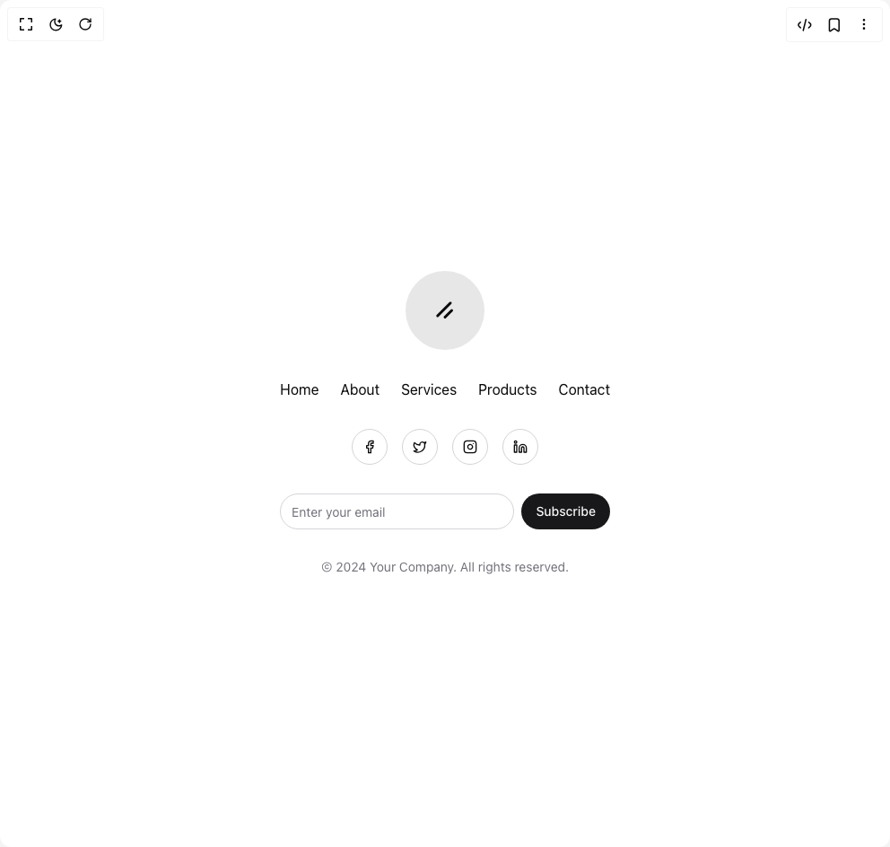

# Build Stacked Circular Footer in BuilderStudio

> Build this component in our Agentic IDE: [BuilderStudio](https://builderstudio.dev).
>
> Join the BuilderStudio community on [Discord](https://discord.gg/QdWeSGCqfe) and [Reddit](https://reddit.com/r/builderstudio).



## Component

- Author group: `arihantcodes_1f7b8c4d`
- Component: `stacked-circular-footer`
- Variant: `default`
- Rendered HTML snapshot: [`rendered.html`](rendered.html)

## BuilderStudio prompt

You are implementing a React component based on a component reference.

## Component identity

- Author: arihantcodes_1f7b8c4d
- Component slug: stacked-circular-footer
- Demo slug: default
- Title: stacked-circular-footer
- Description: 

## Goal

Recreate this component in a React + TypeScript + Tailwind CSS project. Preserve the visual layout, spacing, colors, border radius, shadows, interaction behavior, animation behavior, responsive behavior, and dark mode behavior shown in the rendered demo.

## Implementation requirements

- Use React and TypeScript.
- Use Tailwind CSS classes whenever possible.
- Keep the component self-contained unless the source files require helper components.
- If the source uses CSS variables, custom CSS, animations, or keyframes, include them.
- If the source uses external packages, list and use the required packages.
- Preserve accessibility attributes, button semantics, links, keyboard behavior, and ARIA attributes when visible in the source.
- Do not replace the component with a simplified placeholder.
- Return complete production-ready code.

## Dependencies

No reference metadata available.

## Rendered DOM snapshot

This is the rendered demo HTML extracted from the live preview. Use it to verify structure, class names, visible content, and layout.

```html
<div id="root"><div class="relative flex items-center justify-center h-screen w-full m-auto p-16 bg-background text-foreground"><div class="absolute lab-bg inset-0 size-full"><div class="absolute inset-0 bg-[radial-gradient(#00000021_1px,transparent_1px)] dark:bg-[radial-gradient(#ffffff22_1px,transparent_1px)]"></div></div><div class="flex w-full justify-center relative"><div class="block"><footer class="bg-background py-12"><div class="container mx-auto px-4 md:px-6"><div class="flex flex-col items-center"><div class="mb-8 rounded-full bg-primary/10 p-8"><svg xmlns="http://www.w3.org/2000/svg" viewBox="0 0 256 256" class="icon-class w-6"><rect width="256" height="256" fill="none"></rect><line x1="208" y1="128" x2="128" y2="208" fill="none" stroke="currentColor" stroke-linecap="round" stroke-linejoin="round" stroke-width="32"></line><line x1="192" y1="40" x2="40" y2="192" fill="none" stroke="currentColor" stroke-linecap="round" stroke-linejoin="round" stroke-width="32"></line></svg></div><nav class="mb-8 flex flex-wrap justify-center gap-6"><a href="#" class="hover:text-primary">Home</a><a href="#" class="hover:text-primary">About</a><a href="#" class="hover:text-primary">Services</a><a href="#" class="hover:text-primary">Products</a><a href="#" class="hover:text-primary">Contact</a></nav><div class="mb-8 flex space-x-4"><button class="inline-flex items-center justify-center whitespace-nowrap text-sm font-medium ring-offset-background transition-colors focus-visible:outline-none focus-visible:ring-2 focus-visible:ring-ring focus-visible:ring-offset-2 disabled:pointer-events-none disabled:opacity-50 border border-input bg-background hover:bg-accent hover:text-accent-foreground h-10 w-10 rounded-full"><svg xmlns="http://www.w3.org/2000/svg" width="24" height="24" viewBox="0 0 24 24" fill="none" stroke="currentColor" stroke-width="2" stroke-linecap="round" stroke-linejoin="round" class="lucide lucide-facebook h-4 w-4" aria-hidden="true"><path d="M18 2h-3a5 5 0 0 0-5 5v3H7v4h3v8h4v-8h3l1-4h-4V7a1 1 0 0 1 1-1h3z"></path></svg><span class="sr-only">Facebook</span></button><button class="inline-flex items-center justify-center whitespace-nowrap text-sm font-medium ring-offset-background transition-colors focus-visible:outline-none focus-visible:ring-2 focus-visible:ring-ring focus-visible:ring-offset-2 disabled:pointer-events-none disabled:opacity-50 border border-input bg-background hover:bg-accent hover:text-accent-foreground h-10 w-10 rounded-full"><svg xmlns="http://www.w3.org/2000/svg" width="24" height="24" viewBox="0 0 24 24" fill="none" stroke="currentColor" stroke-width="2" stroke-linecap="round" stroke-linejoin="round" class="lucide lucide-twitter h-4 w-4" aria-hidden="true"><path d="M22 4s-.7 2.1-2 3.4c1.6 10-9.4 17.3-18 11.6 2.2.1 4.4-.6 6-2C3 15.5.5 9.6 3 5c2.2 2.6 5.6 4.1 9 4-.9-4.2 4-6.6 7-3.8 1.1 0 3-1.2 3-1.2z"></path></svg><span class="sr-only">Twitter</span></button><button class="inline-flex items-center justify-center whitespace-nowrap text-sm font-medium ring-offset-background transition-colors focus-visible:outline-none focus-visible:ring-2 focus-visible:ring-ring focus-visible:ring-offset-2 disabled:pointer-events-none disabled:opacity-50 border border-input bg-background hover:bg-accent hover:text-accent-foreground h-10 w-10 rounded-full"><svg xmlns="http://www.w3.org/2000/svg" width="24" height="24" viewBox="0 0 24 24" fill="none" stroke="currentColor" stroke-width="2" stroke-linecap="round" stroke-linejoin="round" class="lucide lucide-instagram h-4 w-4" aria-hidden="true"><rect width="20" height="20" x="2" y="2" rx="5" ry="5"></rect><path d="M16 11.37A4 4 0 1 1 12.63 8 4 4 0 0 1 16 11.37z"></path><line x1="17.5" x2="17.51" y1="6.5" y2="6.5"></line></svg><span class="sr-only">Instagram</span></button><button class="inline-flex items-center justify-center whitespace-nowrap text-sm font-medium ring-offset-background transition-colors focus-visible:outline-none focus-visible:ring-2 focus-visible:ring-ring focus-visible:ring-offset-2 disabled:pointer-events-none disabled:opacity-50 border border-input bg-background hover:bg-accent hover:text-accent-foreground h-10 w-10 rounded-full"><svg xmlns="http://www.w3.org/2000/svg" width="24" height="24" viewBox="0 0 24 24" fill="none" stroke="currentColor" stroke-width="2" stroke-linecap="round" stroke-linejoin="round" class="lucide lucide-linkedin h-4 w-4" aria-hidden="true"><path d="M16 8a6 6 0 0 1 6 6v7h-4v-7a2 2 0 0 0-2-2 2 2 0 0 0-2 2v7h-4v-7a6 6 0 0 1 6-6z"></path><rect width="4" height="12" x="2" y="9"></rect><circle cx="4" cy="4" r="2"></circle></svg><span class="sr-only">LinkedIn</span></button></div><div class="mb-8 w-full max-w-md"><form class="flex space-x-2"><div class="flex-grow"><label class="text-sm font-medium leading-none peer-disabled:cursor-not-allowed peer-disabled:opacity-70 sr-only" for="email">Email</label><input class="flex h-10 w-full border border-input bg-background px-3 py-2 text-sm ring-offset-background file:border-0 file:bg-transparent file:text-sm file:font-medium file:text-foreground placeholder:text-muted-foreground focus-visible:outline-none focus-visible:ring-2 focus-visible:ring-ring focus-visible:ring-offset-2 disabled:cursor-not-allowed disabled:opacity-50 rounded-full" id="email" placeholder="Enter your email" type="email"></div><button class="inline-flex items-center justify-center whitespace-nowrap text-sm font-medium ring-offset-background transition-colors focus-visible:outline-none focus-visible:ring-2 focus-visible:ring-ring focus-visible:ring-offset-2 disabled:pointer-events-none disabled:opacity-50 bg-primary text-primary-foreground hover:bg-primary/90 h-10 px-4 py-2 rounded-full" type="submit">Subscribe</button></form></div><div class="text-center"><p class="text-sm text-muted-foreground">© 2024 Your Company. All rights reserved.</p></div></div></div></footer></div></div></div></div>
```

## Reference source files

No reference source files were available.
