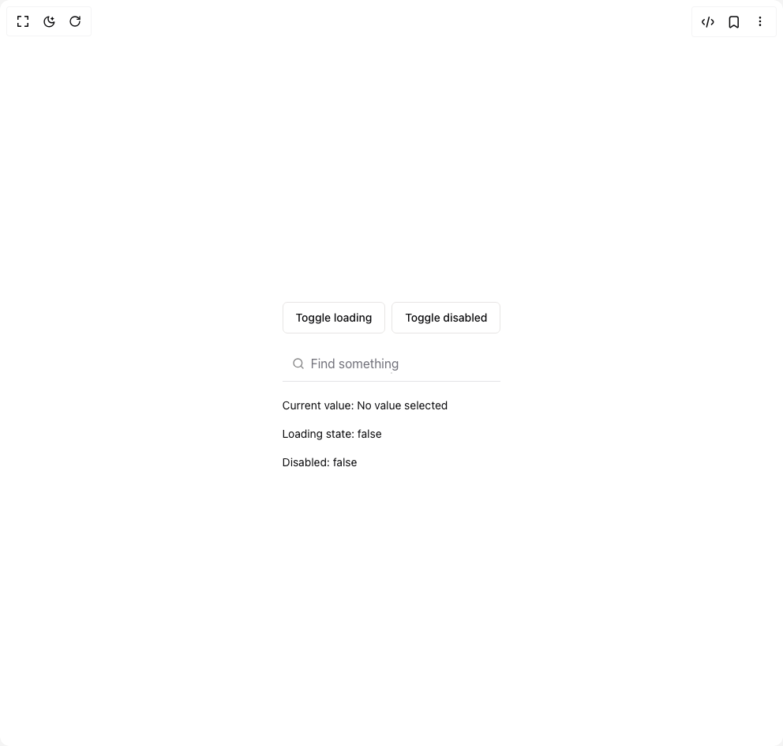

# Build Autocomplete in BuilderStudio

> Build this component in our Agentic IDE: [BuilderStudio](https://builderstudio.dev).
>
> Join the BuilderStudio community on [Discord](https://discord.gg/QdWeSGCqfe) and [Reddit](https://reddit.com/r/builderstudio).



## Component

- Author group: `armandsalle`
- Component: `autocomplete`
- Variant: `default`
- Rendered HTML snapshot: [`rendered.html`](rendered.html)

## BuilderStudio prompt

You are implementing a React component based on a component reference.

## Component identity

- Author: armandsalle
- Component slug: autocomplete
- Demo slug: default
- Title: autocomplete
- Description: 

## Goal

Recreate this component in a React + TypeScript + Tailwind CSS project. Preserve the visual layout, spacing, colors, border radius, shadows, interaction behavior, animation behavior, responsive behavior, and dark mode behavior shown in the rendered demo.

## Implementation requirements

- Use React and TypeScript.
- Use Tailwind CSS classes whenever possible.
- Keep the component self-contained unless the source files require helper components.
- If the source uses CSS variables, custom CSS, animations, or keyframes, include them.
- If the source uses external packages, list and use the required packages.
- Preserve accessibility attributes, button semantics, links, keyboard behavior, and ARIA attributes when visible in the source.
- Do not replace the component with a simplified placeholder.
- Return complete production-ready code.

## Dependencies

No reference metadata available.

## Rendered DOM snapshot

This is the rendered demo HTML extracted from the live preview. Use it to verify structure, class names, visible content, and layout.

```html
<div id="root"><div class="relative flex items-center justify-center h-screen w-full m-auto p-16 bg-background text-foreground"><div class="absolute lab-bg inset-0 size-full"><div class="absolute inset-0 bg-[radial-gradient(#00000021_1px,transparent_1px)] dark:bg-[radial-gradient(#ffffff22_1px,transparent_1px)]"></div></div><div class="flex w-full justify-center relative"><div class="not-prose mt-8 flex flex-col gap-4"><div class="flex items-center gap-2"><button class="inline-flex h-10 items-center justify-center rounded-md border border-stone-200 bg-white px-4 py-2 text-sm font-medium ring-offset-white transition-colors hover:bg-stone-100 hover:text-slate-900 focus-visible:outline-none focus-visible:ring-2 focus-visible:ring-slate-400 focus-visible:ring-offset-2 disabled:pointer-events-none disabled:opacity-50">Toggle loading</button><button class="inline-flex h-10 items-center justify-center rounded-md border border-stone-200 bg-white px-4 py-2 text-sm font-medium ring-offset-white transition-colors hover:bg-stone-100 hover:text-slate-900 focus-visible:outline-none focus-visible:ring-2 focus-visible:ring-slate-400 focus-visible:ring-offset-2 disabled:pointer-events-none disabled:opacity-50">Toggle disabled</button></div><div tabindex="-1" cmdk-root=""><label cmdk-label="" for="radix-«r2»" id="radix-«r1»" style="position: absolute; width: 1px; height: 1px; padding: 0px; margin: -1px; overflow: hidden; clip: rect(0px, 0px, 0px, 0px); white-space: nowrap; border-width: 0px;"></label><div><div class="flex items-center border-b px-3" cmdk-input-wrapper=""><svg xmlns="http://www.w3.org/2000/svg" width="24" height="24" viewBox="0 0 24 24" fill="none" stroke="currentColor" stroke-width="2" stroke-linecap="round" stroke-linejoin="round" class="lucide lucide-search mr-2 h-4 w-4 shrink-0 opacity-50" aria-hidden="true"><path d="m21 21-4.34-4.34"></path><circle cx="11" cy="11" r="8"></circle></svg><input class="flex h-11 w-full rounded-md bg-transparent py-3 outline-none placeholder:text-muted-foreground disabled:cursor-not-allowed disabled:opacity-50 text-base" placeholder="Find something" cmdk-input="" autocomplete="off" autocorrect="off" spellcheck="false" aria-autocomplete="list" role="combobox" aria-expanded="true" aria-controls="radix-«r0»" aria-labelledby="radix-«r1»" id="radix-«r2»" type="text" value=""></div></div><div class="relative mt-1"><div class="animate-in fade-in-0 zoom-in-95 absolute top-0 z-10 w-full rounded-xl bg-white outline-none hidden"><div class="max-h-[300px] overflow-y-auto overflow-x-hidden rounded-lg ring-1 ring-slate-200" cmdk-list="" role="listbox" tabindex="-1" aria-label="Suggestions" id="radix-«r0»" style="--cmdk-list-height: 0.0px;"><div cmdk-list-sizer=""><div class="overflow-hidden p-1 text-foreground [&amp;_[cmdk-group-heading]]:px-2 [&amp;_[cmdk-group-heading]]:py-1.5 [&amp;_[cmdk-group-heading]]:text-xs [&amp;_[cmdk-group-heading]]:font-medium [&amp;_[cmdk-group-heading]]:text-muted-foreground" cmdk-group="" role="presentation" data-value="undefined"><div cmdk-group-items="" role="group"><div class="relative cursor-default select-none rounded-sm px-2 py-1.5 text-sm outline-none data-[disabled=true]:pointer-events-none data-[selected='true']:bg-accent data-[selected=true]:text-accent-foreground data-[disabled=true]:opacity-50 flex w-full items-center gap-2 pl-8" id="radix-«r5»" cmdk-item="" role="option" aria-disabled="false" aria-selected="true" data-disabled="false" data-selected="true" data-value="Next.js">Next.js</div><div class="relative cursor-default select-none rounded-sm px-2 py-1.5 text-sm outline-none data-[disabled=true]:pointer-events-none data-[selected='true']:bg-accent data-[selected=true]:text-accent-foreground data-[disabled=true]:opacity-50 flex w-full items-center gap-2 pl-8" id="radix-«r6»" cmdk-item="" role="option" aria-disabled="false" aria-selected="false" data-disabled="false" data-selected="false" data-value="SvelteKit">SvelteKit</div><div class="relative cursor-default select-none rounded-sm px-2 py-1.5 text-sm outline-none data-[disabled=true]:pointer-events-none data-[selected='true']:bg-accent data-[selected=true]:text-accent-foreground data-[disabled=true]:opacity-50 flex w-full items-center gap-2 pl-8" id="radix-«r7»" cmdk-item="" role="option" aria-disabled="false" aria-selected="false" data-disabled="false" data-selected="false" data-value="Nuxt.js">Nuxt.js</div><div class="relative cursor-default select-none rounded-sm px-2 py-1.5 text-sm outline-none data-[disabled=true]:pointer-events-none data-[selected='true']:bg-accent data-[selected=true]:text-accent-foreground data-[disabled=true]:opacity-50 flex w-full items-center gap-2 pl-8" id="radix-«r8»" cmdk-item="" role="option" aria-disabled="false" aria-selected="false" data-disabled="false" data-selected="false" data-value="Remix">Remix</div><div class="relative cursor-default select-none rounded-sm px-2 py-1.5 text-sm outline-none data-[disabled=true]:pointer-events-none data-[selected='true']:bg-accent data-[selected=true]:text-accent-foreground data-[disabled=true]:opacity-50 flex w-full items-center gap-2 pl-8" id="radix-«r9»" cmdk-item="" role="option" aria-disabled="false" aria-selected="false" data-disabled="false" data-selected="false" data-value="Astro">Astro</div><div class="relative cursor-default select-none rounded-sm px-2 py-1.5 text-sm outline-none data-[disabled=true]:pointer-events-none data-[selected='true']:bg-accent data-[selected=true]:text-accent-foreground data-[disabled=true]:opacity-50 flex w-full items-center gap-2 pl-8" id="radix-«ra»" cmdk-item="" role="option" aria-disabled="false" aria-selected="false" data-disabled="false" data-selected="false" data-value="WordPress">WordPress</div><div class="relative cursor-default select-none rounded-sm px-2 py-1.5 text-sm outline-none data-[disabled=true]:pointer-events-none data-[selected='true']:bg-accent data-[selected=true]:text-accent-foreground data-[disabled=true]:opacity-50 flex w-full items-center gap-2 pl-8" id="radix-«rb»" cmdk-item="" role="option" aria-disabled="false" aria-selected="false" data-disabled="false" data-selected="false" data-value="Express.js">Express.js</div><div class="relative cursor-default select-none rounded-sm px-2 py-1.5 text-sm outline-none data-[disabled=true]:pointer-events-none data-[selected='true']:bg-accent data-[selected=true]:text-accent-foreground data-[disabled=true]:opacity-50 flex w-full items-center gap-2 pl-8" id="radix-«rc»" cmdk-item="" role="option" aria-disabled="false" aria-selected="false" data-disabled="false" data-selected="false" data-value="Nest.js">Nest.js</div></div></div></div></div></div></div></div><span class="text-sm">Current value: No value selected</span><span class="text-sm">Loading state: false</span><span class="text-sm">Disabled: false</span></div></div></div></div>
```

## Reference source files

No reference source files were available.
