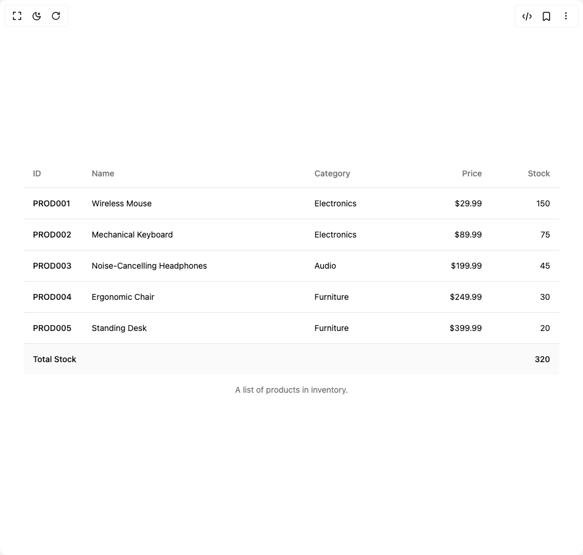

# Build Animated Table in BuilderStudio

> Build this component in our Agentic IDE: [BuilderStudio](https://builderstudio.dev).
>
> Join the BuilderStudio community on [Discord](https://discord.gg/QdWeSGCqfe) and [Reddit](https://reddit.com/r/builderstudio).



## Component

- Author group: `arunachalam0606`
- Component: `animated-table`
- Variant: `default`
- Rendered HTML snapshot: [`rendered.html`](rendered.html)

## BuilderStudio prompt

You are implementing a React component based on a component reference.

## Component identity

- Author: arunachalam0606
- Component slug: animated-table
- Demo slug: default
- Title: animated-table
- Description: 

## Goal

Recreate this component in a React + TypeScript + Tailwind CSS project. Preserve the visual layout, spacing, colors, border radius, shadows, interaction behavior, animation behavior, responsive behavior, and dark mode behavior shown in the rendered demo.

## Implementation requirements

- Use React and TypeScript.
- Use Tailwind CSS classes whenever possible.
- Keep the component self-contained unless the source files require helper components.
- If the source uses CSS variables, custom CSS, animations, or keyframes, include them.
- If the source uses external packages, list and use the required packages.
- Preserve accessibility attributes, button semantics, links, keyboard behavior, and ARIA attributes when visible in the source.
- Do not replace the component with a simplified placeholder.
- Return complete production-ready code.

## Dependencies

No reference metadata available.

## Rendered DOM snapshot

This is the rendered demo HTML extracted from the live preview. Use it to verify structure, class names, visible content, and layout.

```html
<div id="root"><div class="w-screen min-h-screen flex justify-center items-center"><div class="w-screen min-h-screen flex justify-center items-center"><div class="w-full px-10"><div class="relative w-full overflow-auto"><table class="w-full caption-bottom text-sm"><caption class="mt-4 text-sm text-muted-foreground">A list of products in inventory.</caption><thead class="[&amp;_tr]:border-b"><tr class="border-b transition-colors hover:bg-muted/50 data-[state=selected]:bg-muted"><th class="h-12 px-4 text-left align-middle font-medium text-muted-foreground [&amp;:has([role=checkbox])]:pr-0 w-[100px]">ID</th><th class="h-12 px-4 text-left align-middle font-medium text-muted-foreground [&amp;:has([role=checkbox])]:pr-0">Name</th><th class="h-12 px-4 text-left align-middle font-medium text-muted-foreground [&amp;:has([role=checkbox])]:pr-0">Category</th><th class="h-12 px-4 align-middle font-medium text-muted-foreground [&amp;:has([role=checkbox])]:pr-0 text-right">Price</th><th class="h-12 px-4 align-middle font-medium text-muted-foreground [&amp;:has([role=checkbox])]:pr-0 text-right">Stock</th></tr></thead><tbody class="[&amp;_tr:last-child]:border-0"><tr class="border-b transition-colors hover:bg-muted/50" style="opacity: 1; transform: none;"><td class="p-4 align-middle [&amp;:has([role=checkbox])]:pr-0 font-medium">PROD001</td><td class="p-4 align-middle [&amp;:has([role=checkbox])]:pr-0">Wireless Mouse</td><td class="p-4 align-middle [&amp;:has([role=checkbox])]:pr-0">Electronics</td><td class="p-4 align-middle [&amp;:has([role=checkbox])]:pr-0 text-right">$29.99</td><td class="p-4 align-middle [&amp;:has([role=checkbox])]:pr-0 text-right">150</td></tr><tr class="border-b transition-colors hover:bg-muted/50" style="opacity: 1; transform: none;"><td class="p-4 align-middle [&amp;:has([role=checkbox])]:pr-0 font-medium">PROD002</td><td class="p-4 align-middle [&amp;:has([role=checkbox])]:pr-0">Mechanical Keyboard</td><td class="p-4 align-middle [&amp;:has([role=checkbox])]:pr-0">Electronics</td><td class="p-4 align-middle [&amp;:has([role=checkbox])]:pr-0 text-right">$89.99</td><td class="p-4 align-middle [&amp;:has([role=checkbox])]:pr-0 text-right">75</td></tr><tr class="border-b transition-colors hover:bg-muted/50" style="opacity: 1; transform: none;"><td class="p-4 align-middle [&amp;:has([role=checkbox])]:pr-0 font-medium">PROD003</td><td class="p-4 align-middle [&amp;:has([role=checkbox])]:pr-0">Noise-Cancelling Headphones</td><td class="p-4 align-middle [&amp;:has([role=checkbox])]:pr-0">Audio</td><td class="p-4 align-middle [&amp;:has([role=checkbox])]:pr-0 text-right">$199.99</td><td class="p-4 align-middle [&amp;:has([role=checkbox])]:pr-0 text-right">45</td></tr><tr class="border-b transition-colors hover:bg-muted/50" style="opacity: 1; transform: none;"><td class="p-4 align-middle [&amp;:has([role=checkbox])]:pr-0 font-medium">PROD004</td><td class="p-4 align-middle [&amp;:has([role=checkbox])]:pr-0">Ergonomic Chair</td><td class="p-4 align-middle [&amp;:has([role=checkbox])]:pr-0">Furniture</td><td class="p-4 align-middle [&amp;:has([role=checkbox])]:pr-0 text-right">$249.99</td><td class="p-4 align-middle [&amp;:has([role=checkbox])]:pr-0 text-right">30</td></tr><tr class="border-b transition-colors hover:bg-muted/50" style="opacity: 1; transform: none;"><td class="p-4 align-middle [&amp;:has([role=checkbox])]:pr-0 font-medium">PROD005</td><td class="p-4 align-middle [&amp;:has([role=checkbox])]:pr-0">Standing Desk</td><td class="p-4 align-middle [&amp;:has([role=checkbox])]:pr-0">Furniture</td><td class="p-4 align-middle [&amp;:has([role=checkbox])]:pr-0 text-right">$399.99</td><td class="p-4 align-middle [&amp;:has([role=checkbox])]:pr-0 text-right">20</td></tr></tbody><tfoot class="border-t bg-muted/50 font-medium [&amp;&gt;tr]:last:border-b-0"><tr class="border-b transition-colors hover:bg-muted/50 data-[state=selected]:bg-muted"><td class="p-4 align-middle [&amp;:has([role=checkbox])]:pr-0" colspan="4">Total Stock</td><td class="p-4 align-middle [&amp;:has([role=checkbox])]:pr-0 text-right">320</td></tr></tfoot></table></div></div></div></div></div>
```

## Reference source files

No reference source files were available.
