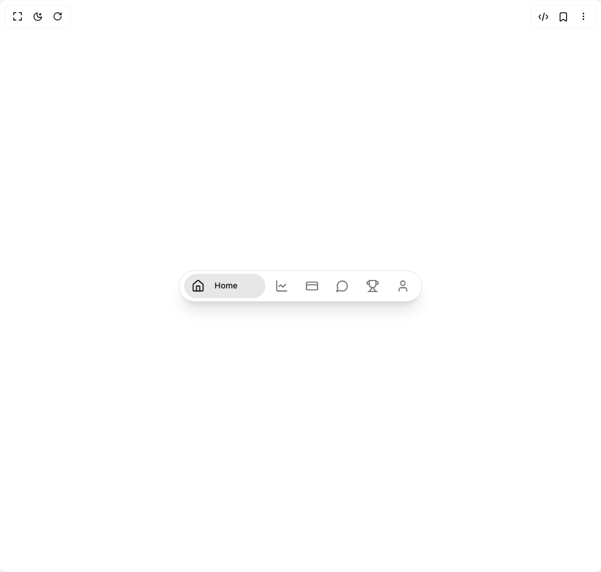

# Build Bottom Nav Bar in BuilderStudio

> Build this component in our Agentic IDE: [BuilderStudio](https://builderstudio.dev).
>
> Join the BuilderStudio community on [Discord](https://discord.gg/QdWeSGCqfe) and [Reddit](https://reddit.com/r/builderstudio).



## Component

- Author group: `arunachalam0606`
- Component: `bottom-nav-bar`
- Variant: `default`
- Rendered HTML snapshot: [`rendered.html`](rendered.html)

## BuilderStudio prompt

You are implementing a React component based on a component reference.

## Component identity

- Author: arunachalam0606
- Component slug: bottom-nav-bar
- Demo slug: default
- Title: bottom-nav-bar
- Description: 

## Goal

Recreate this component in a React + TypeScript + Tailwind CSS project. Preserve the visual layout, spacing, colors, border radius, shadows, interaction behavior, animation behavior, responsive behavior, and dark mode behavior shown in the rendered demo.

## Implementation requirements

- Use React and TypeScript.
- Use Tailwind CSS classes whenever possible.
- Keep the component self-contained unless the source files require helper components.
- If the source uses CSS variables, custom CSS, animations, or keyframes, include them.
- If the source uses external packages, list and use the required packages.
- Preserve accessibility attributes, button semantics, links, keyboard behavior, and ARIA attributes when visible in the source.
- Do not replace the component with a simplified placeholder.
- Return complete production-ready code.

## Dependencies

No reference metadata available.

## Rendered DOM snapshot

This is the rendered demo HTML extracted from the live preview. Use it to verify structure, class names, visible content, and layout.

```html
<div id="root"><div class="w-screen min-h-screen flex justify-center items-center"><div class="w-screen min-h-screen flex justify-center items-center"><nav role="navigation" aria-label="Bottom Navigation" class="bg-card dark:bg-card border border-border dark:border-sidebar-border rounded-full flex items-center p-2 shadow-xl space-x-1 min-w-[320px] max-w-[95vw] h-[52px]" style="opacity: 1; transform: none;"><button class="flex items-center px-3 py-2 rounded-full transition-colors duration-200 relative h-10 min-w-[44px] min-h-[40px] max-h-[44px] bg-primary/10 dark:bg-primary/15 text-primary dark:text-primary gap-2 focus:outline-none focus-visible:ring-0" aria-label="Home" type="button" tabindex="0"><svg xmlns="http://www.w3.org/2000/svg" width="22" height="22" viewBox="0 0 24 24" fill="none" stroke="currentColor" stroke-width="2" stroke-linecap="round" stroke-linejoin="round" class="lucide lucide-house transition-colors duration-200" aria-hidden="true"><path d="M15 21v-8a1 1 0 0 0-1-1h-4a1 1 0 0 0-1 1v8"></path><path d="M3 10a2 2 0 0 1 .709-1.528l7-5.999a2 2 0 0 1 2.582 0l7 5.999A2 2 0 0 1 21 10v9a2 2 0 0 1-2 2H5a2 2 0 0 1-2-2z"></path></svg><div class="overflow-hidden flex items-center max-w-[72px]" style="width: 72px; opacity: 1; margin-left: 8px;"><span class="font-medium whitespace-nowrap select-none transition-opacity duration-200 overflow-hidden text-ellipsis text-[clamp(0.625rem,0.5263rem+0.5263vw,1rem)] leading-[1.9] text-primary dark:text-primary" title="Home">Home</span></div></button><button class="flex items-center gap-0 px-3 py-2 rounded-full transition-colors duration-200 relative h-10 min-w-[44px] min-h-[40px] max-h-[44px] bg-transparent text-muted-foreground dark:text-muted-foreground hover:bg-muted dark:hover:bg-muted focus:outline-none focus-visible:ring-0" aria-label="Portfolio" type="button" tabindex="0"><svg xmlns="http://www.w3.org/2000/svg" width="22" height="22" viewBox="0 0 24 24" fill="none" stroke="currentColor" stroke-width="2" stroke-linecap="round" stroke-linejoin="round" class="lucide lucide-chart-line transition-colors duration-200" aria-hidden="true"><path d="M3 3v16a2 2 0 0 0 2 2h16"></path><path d="m19 9-5 5-4-4-3 3"></path></svg><div class="overflow-hidden flex items-center max-w-[72px]" style="width: 0px; opacity: 0; margin-left: 0px;"><span class="font-medium whitespace-nowrap select-none transition-opacity duration-200 overflow-hidden text-ellipsis text-[clamp(0.625rem,0.5263rem+0.5263vw,1rem)] leading-[1.9] opacity-0" title="Portfolio">Portfolio</span></div></button><button class="flex items-center gap-0 px-3 py-2 rounded-full transition-colors duration-200 relative h-10 min-w-[44px] min-h-[40px] max-h-[44px] bg-transparent text-muted-foreground dark:text-muted-foreground hover:bg-muted dark:hover:bg-muted focus:outline-none focus-visible:ring-0" aria-label="Transactions" type="button" tabindex="0"><svg xmlns="http://www.w3.org/2000/svg" width="22" height="22" viewBox="0 0 24 24" fill="none" stroke="currentColor" stroke-width="2" stroke-linecap="round" stroke-linejoin="round" class="lucide lucide-credit-card transition-colors duration-200" aria-hidden="true"><rect width="20" height="14" x="2" y="5" rx="2"></rect><line x1="2" x2="22" y1="10" y2="10"></line></svg><div class="overflow-hidden flex items-center max-w-[72px]" style="width: 0px; opacity: 0; margin-left: 0px;"><span class="font-medium whitespace-nowrap select-none transition-opacity duration-200 overflow-hidden text-ellipsis text-[clamp(0.625rem,0.5263rem+0.5263vw,1rem)] leading-[1.9] opacity-0" title="Transactions">Transactions</span></div></button><button class="flex items-center gap-0 px-3 py-2 rounded-full transition-colors duration-200 relative h-10 min-w-[44px] min-h-[40px] max-h-[44px] bg-transparent text-muted-foreground dark:text-muted-foreground hover:bg-muted dark:hover:bg-muted focus:outline-none focus-visible:ring-0" aria-label="Messages" type="button" tabindex="0"><svg xmlns="http://www.w3.org/2000/svg" width="22" height="22" viewBox="0 0 24 24" fill="none" stroke="currentColor" stroke-width="2" stroke-linecap="round" stroke-linejoin="round" class="lucide lucide-message-circle transition-colors duration-200" aria-hidden="true"><path d="M7.9 20A9 9 0 1 0 4 16.1L2 22Z"></path></svg><div class="overflow-hidden flex items-center max-w-[72px]" style="width: 0px; opacity: 0; margin-left: 0px;"><span class="font-medium whitespace-nowrap select-none transition-opacity duration-200 overflow-hidden text-ellipsis text-[clamp(0.625rem,0.5263rem+0.5263vw,1rem)] leading-[1.9] opacity-0" title="Messages">Messages</span></div></button><button class="flex items-center gap-0 px-3 py-2 rounded-full transition-colors duration-200 relative h-10 min-w-[44px] min-h-[40px] max-h-[44px] bg-transparent text-muted-foreground dark:text-muted-foreground hover:bg-muted dark:hover:bg-muted focus:outline-none focus-visible:ring-0" aria-label="Rewards" type="button" tabindex="0"><svg xmlns="http://www.w3.org/2000/svg" width="22" height="22" viewBox="0 0 24 24" fill="none" stroke="currentColor" stroke-width="2" stroke-linecap="round" stroke-linejoin="round" class="lucide lucide-trophy transition-colors duration-200" aria-hidden="true"><path d="M6 9H4.5a2.5 2.5 0 0 1 0-5H6"></path><path d="M18 9h1.5a2.5 2.5 0 0 0 0-5H18"></path><path d="M4 22h16"></path><path d="M10 14.66V17c0 .55-.47.98-.97 1.21C7.85 18.75 7 20.24 7 22"></path><path d="M14 14.66V17c0 .55.47.98.97 1.21C16.15 18.75 17 20.24 17 22"></path><path d="M18 2H6v7a6 6 0 0 0 12 0V2Z"></path></svg><div class="overflow-hidden flex items-center max-w-[72px]" style="width: 0px; opacity: 0; margin-left: 0px;"><span class="font-medium whitespace-nowrap select-none transition-opacity duration-200 overflow-hidden text-ellipsis text-[clamp(0.625rem,0.5263rem+0.5263vw,1rem)] leading-[1.9] opacity-0" title="Rewards">Rewards</span></div></button><button class="flex items-center gap-0 px-3 py-2 rounded-full transition-colors duration-200 relative h-10 min-w-[44px] min-h-[40px] max-h-[44px] bg-transparent text-muted-foreground dark:text-muted-foreground hover:bg-muted dark:hover:bg-muted focus:outline-none focus-visible:ring-0" aria-label="Profile" type="button" tabindex="0"><svg xmlns="http://www.w3.org/2000/svg" width="22" height="22" viewBox="0 0 24 24" fill="none" stroke="currentColor" stroke-width="2" stroke-linecap="round" stroke-linejoin="round" class="lucide lucide-user transition-colors duration-200" aria-hidden="true"><path d="M19 21v-2a4 4 0 0 0-4-4H9a4 4 0 0 0-4 4v2"></path><circle cx="12" cy="7" r="4"></circle></svg><div class="overflow-hidden flex items-center max-w-[72px]" style="width: 0px; opacity: 0; margin-left: 0px;"><span class="font-medium whitespace-nowrap select-none transition-opacity duration-200 overflow-hidden text-ellipsis text-[clamp(0.625rem,0.5263rem+0.5263vw,1rem)] leading-[1.9] opacity-0" title="Profile">Profile</span></div></button></nav></div></div></div>
```

## Reference source files

No reference source files were available.
