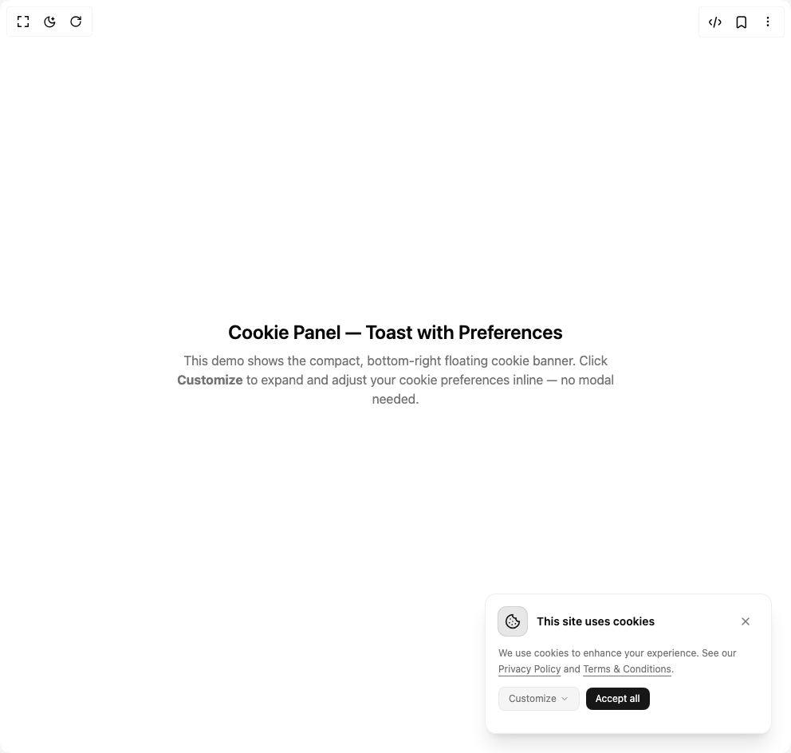

# Build Cookie Banner 1 in BuilderStudio

> Build this component in our Agentic IDE: [BuilderStudio](https://builderstudio.dev).
>
> Join the BuilderStudio community on [Discord](https://discord.gg/QdWeSGCqfe) and [Reddit](https://reddit.com/r/builderstudio).



## Component

- Author group: `arunachalam0606`
- Component: `cookie-banner-1`
- Variant: `default`
- Rendered HTML snapshot: [`rendered.html`](rendered.html)

## BuilderStudio prompt

You are implementing a React component based on a component reference.

## Component identity

- Author: arunachalam0606
- Component slug: cookie-banner-1
- Demo slug: default
- Title: cookie-banner-1
- Description: 

## Goal

Recreate this component in a React + TypeScript + Tailwind CSS project. Preserve the visual layout, spacing, colors, border radius, shadows, interaction behavior, animation behavior, responsive behavior, and dark mode behavior shown in the rendered demo.

## Implementation requirements

- Use React and TypeScript.
- Use Tailwind CSS classes whenever possible.
- Keep the component self-contained unless the source files require helper components.
- If the source uses CSS variables, custom CSS, animations, or keyframes, include them.
- If the source uses external packages, list and use the required packages.
- Preserve accessibility attributes, button semantics, links, keyboard behavior, and ARIA attributes when visible in the source.
- Do not replace the component with a simplified placeholder.
- Return complete production-ready code.

## Dependencies

No reference metadata available.

## Rendered DOM snapshot

This is the rendered demo HTML extracted from the live preview. Use it to verify structure, class names, visible content, and layout.

```html
<div id="root"><div class="w-screen min-h-screen flex justify-center items-center"><div class="w-screen min-h-screen flex justify-center items-center"><main class="min-h-screen grid place-items-center bg-background text-foreground p-8"><div class="m-auto max-w-xl text-center"><h1 class="text-2xl font-semibold mb-2">Cookie Panel — Toast with Preferences</h1><p class="text-muted-foreground mb-8">This demo shows the compact, bottom‑right floating cookie banner. Click <strong>Customize</strong> to expand and adjust your cookie preferences inline — no modal needed.</p></div><div role="dialog" aria-live="polite" aria-label="Cookie consent" class="fixed right-4 bottom-4 md:right-6 md:bottom-6 z-50 w-[360px] max-w-[90vw]"><div class="relative border border-border/70 rounded-xl bg-card/95 text-card-foreground shadow-xl backdrop-blur p-4 flex flex-col gap-3 animate-in fade-in slide-in-from-bottom-8 duration-300 ease-out"><div class="flex items-center gap-3"><span class="inline-flex size-9 items-center justify-center rounded-lg bg-primary/10 text-primary ring-1 ring-primary/20"><svg xmlns="http://www.w3.org/2000/svg" width="24" height="24" viewBox="0 0 24 24" fill="none" stroke="currentColor" stroke-width="2" stroke-linecap="round" stroke-linejoin="round" class="lucide lucide-cookie size-5" aria-hidden="true"><path d="M12 2a10 10 0 1 0 10 10 4 4 0 0 1-5-5 4 4 0 0 1-5-5"></path><path d="M8.5 8.5v.01"></path><path d="M16 15.5v.01"></path><path d="M12 12v.01"></path><path d="M11 17v.01"></path><path d="M7 14v.01"></path></svg></span><h2 class="text-sm font-semibold leading-5">This site uses cookies</h2><button type="button" class="ml-auto inline-flex size-8 items-center justify-center rounded-md hover:bg-foreground/5 cursor-pointer" aria-label="Close cookie banner"><svg xmlns="http://www.w3.org/2000/svg" width="24" height="24" viewBox="0 0 24 24" fill="none" stroke="currentColor" stroke-width="2" stroke-linecap="round" stroke-linejoin="round" class="lucide lucide-x size-4 text-muted-foreground" aria-hidden="true"><path d="M18 6 6 18"></path><path d="m6 6 12 12"></path></svg></button></div><p class="text-xs leading-5 text-muted-foreground">We use cookies to enhance your experience. See our <a href="/privacy" class="underline underline-offset-4 hover:text-foreground cursor-pointer">Privacy Policy</a> and <a href="/terms" class="underline underline-offset-4 hover:text-foreground cursor-pointer">Terms &amp; Conditions</a>.</p><div class="flex items-center gap-2"><button type="button" class="px-3 py-1.5 rounded-md border border-border/70 cursor-pointer bg-muted text-muted-foreground text-xs hover:bg-muted/80 transition-colors flex items-center gap-1" aria-expanded="false" aria-controls="cookie-preferences-inline">Customize<svg xmlns="http://www.w3.org/2000/svg" width="24" height="24" viewBox="0 0 24 24" fill="none" stroke="currentColor" stroke-width="2" stroke-linecap="round" stroke-linejoin="round" class="lucide lucide-chevron-down size-3" aria-hidden="true"><path d="m6 9 6 6 6-6"></path></svg></button><button type="button" class="px-3 py-1.5 rounded-md text-xs cursor-pointer bg-primary text-primary-foreground hover:bg-primary/90 transition-colors">Accept all</button></div><div id="cookie-preferences-inline" class="overflow-hidden transition-[height] duration-300 ease-out will-change-[height]" style="height: 0px;"></div></div></div></main></div></div></div>
```

## Reference source files

No reference source files were available.
