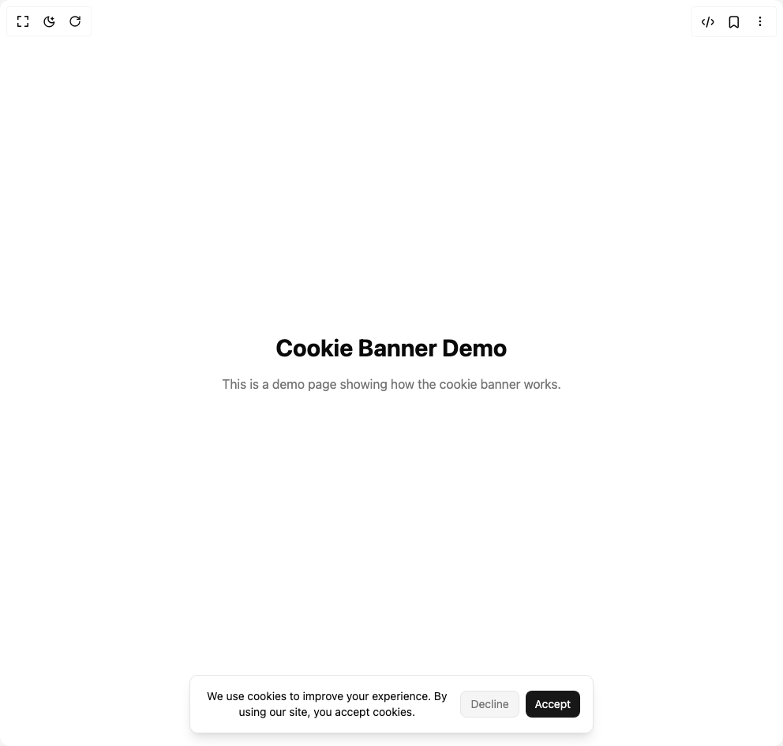

# Build Cookie Banner in BuilderStudio

> Build this component in our Agentic IDE: [BuilderStudio](https://builderstudio.dev).
>
> Join the BuilderStudio community on [Discord](https://discord.gg/QdWeSGCqfe) and [Reddit](https://reddit.com/r/builderstudio).



## Component

- Author group: `arunachalam0606`
- Component: `cookie-banner`
- Variant: `default`
- Rendered HTML snapshot: [`rendered.html`](rendered.html)

## BuilderStudio prompt

You are implementing a React component based on a component reference.

## Component identity

- Author: arunachalam0606
- Component slug: cookie-banner
- Demo slug: default
- Title: cookie-banner
- Description: 

## Goal

Recreate this component in a React + TypeScript + Tailwind CSS project. Preserve the visual layout, spacing, colors, border radius, shadows, interaction behavior, animation behavior, responsive behavior, and dark mode behavior shown in the rendered demo.

## Implementation requirements

- Use React and TypeScript.
- Use Tailwind CSS classes whenever possible.
- Keep the component self-contained unless the source files require helper components.
- If the source uses CSS variables, custom CSS, animations, or keyframes, include them.
- If the source uses external packages, list and use the required packages.
- Preserve accessibility attributes, button semantics, links, keyboard behavior, and ARIA attributes when visible in the source.
- Do not replace the component with a simplified placeholder.
- Return complete production-ready code.

## Dependencies

No reference metadata available.

## Rendered DOM snapshot

This is the rendered demo HTML extracted from the live preview. Use it to verify structure, class names, visible content, and layout.

```html
<div id="root"><div class="w-screen min-h-screen flex justify-center items-center"><div class="w-screen min-h-screen flex justify-center items-center"><main class="flex min-h-screen items-center justify-center bg-background text-foreground p-8"><div class="text-center max-w-md"><h1 class="text-3xl font-bold mb-4">Cookie Banner Demo</h1><p class="mb-6 text-muted-foreground">This is a demo page showing how the cookie banner works.</p><div role="dialog" aria-live="polite" aria-label="Cookie consent" class="fixed left-1/2 z-50 w-[95%] max-w-lg -translate-x-1/2 bottom-4"><div class="border border-border rounded-lg bg-card text-card-foreground shadow-lg p-4 flex flex-col sm:flex-row items-center gap-3 animate-in fade-in slide-in-from-bottom-8 duration-300 ease-out"><p class="text-sm flex-1">We use cookies to improve your experience. By using our site, you accept cookies.</p><div class="flex gap-2 shrink-0"><button type="button" class="cursor-pointer px-3 py-1.5 rounded-md border border-border bg-muted text-muted-foreground text-sm transition-colors duration-200 hover:bg-muted/70">Decline</button><button type="button" class="cursor-pointer px-3 py-1.5 rounded-md bg-primary text-primary-foreground text-sm transition-colors duration-200 hover:bg-primary/90">Accept</button></div></div></div></div></main></div></div></div>
```

## Reference source files

No reference source files were available.
