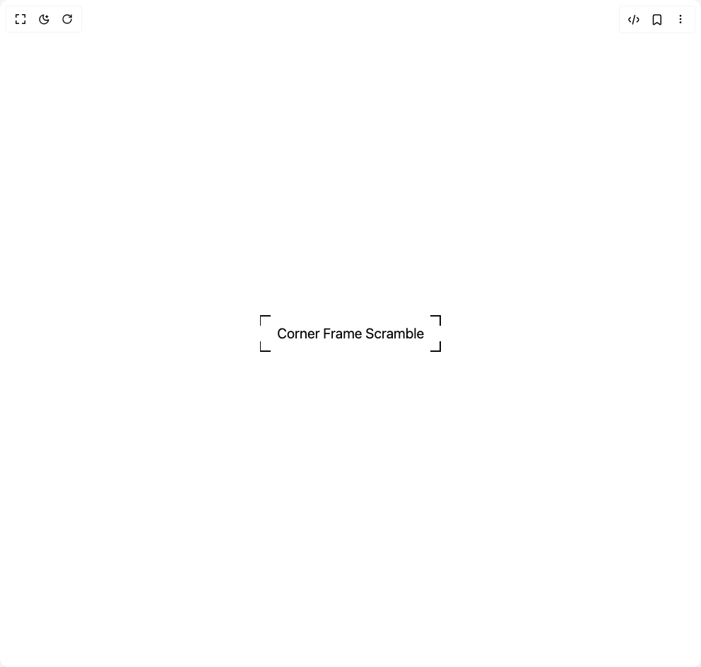

# Build Corner Frame Scramble Text in BuilderStudio

> Build this component in our Agentic IDE: [BuilderStudio](https://builderstudio.dev).
>
> Join the BuilderStudio community on [Discord](https://discord.gg/QdWeSGCqfe) and [Reddit](https://reddit.com/r/builderstudio).



## Component

- Author group: `arunachalam0606`
- Component: `corner-frame-scramble-text`
- Variant: `default`
- Rendered HTML snapshot: [`rendered.html`](rendered.html)

## BuilderStudio prompt

You are implementing a React component based on a component reference.

## Component identity

- Author: arunachalam0606
- Component slug: corner-frame-scramble-text
- Demo slug: default
- Title: corner-frame-scramble-text
- Description: 

## Goal

Recreate this component in a React + TypeScript + Tailwind CSS project. Preserve the visual layout, spacing, colors, border radius, shadows, interaction behavior, animation behavior, responsive behavior, and dark mode behavior shown in the rendered demo.

## Implementation requirements

- Use React and TypeScript.
- Use Tailwind CSS classes whenever possible.
- Keep the component self-contained unless the source files require helper components.
- If the source uses CSS variables, custom CSS, animations, or keyframes, include them.
- If the source uses external packages, list and use the required packages.
- Preserve accessibility attributes, button semantics, links, keyboard behavior, and ARIA attributes when visible in the source.
- Do not replace the component with a simplified placeholder.
- Return complete production-ready code.

## Dependencies

No reference metadata available.

## Rendered DOM snapshot

This is the rendered demo HTML extracted from the live preview. Use it to verify structure, class names, visible content, and layout.

```html
<div id="root"><div class="w-screen min-h-screen flex justify-center items-center"><div class="w-screen min-h-screen flex justify-center items-center"><div class="relative inline-block px-6 py-3 bg-[linear-gradient(to_right,var(--foreground)_1.5px,transparent_1.5px),linear-gradient(to_right,var(--foreground)_1.5px,transparent_1.5px),linear-gradient(to_left,var(--foreground)_1.5px,transparent_1.5px),linear-gradient(to_left,var(--foreground)_1.5px,transparent_1.5px),linear-gradient(to_bottom,var(--foreground)_1.5px,transparent_1.5px),linear-gradient(to_bottom,var(--foreground)_1.5px,transparent_1.5px),linear-gradient(to_top,var(--foreground)_1.5px,transparent_1.5px),linear-gradient(to_top,var(--foreground)_1.5px,transparent_1.5px)] bg-[length:15px_15px] bg-no-repeat bg-[position:0_0,0_100%,100%_0,100%_100%,0_0,100%_0,0_100%,100%_100%] text-xl text-foreground"><h5 class="relative z-10">Corner Frame Scramble</h5></div></div></div></div>
```

## Reference source files

No reference source files were available.
