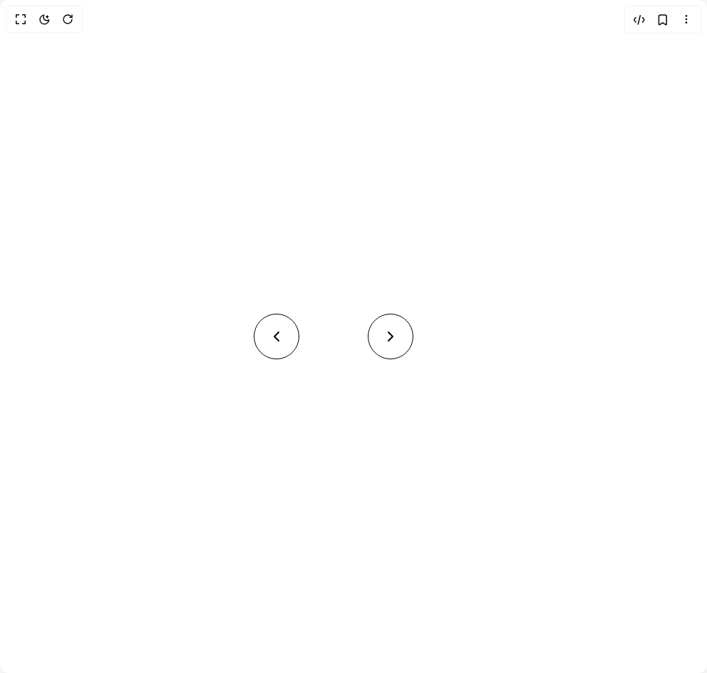

# Build Morphing Arrow Button in BuilderStudio

> Build this component in our Agentic IDE: [BuilderStudio](https://builderstudio.dev).
>
> Join the BuilderStudio community on [Discord](https://discord.gg/QdWeSGCqfe) and [Reddit](https://reddit.com/r/builderstudio).



## Component

- Author group: `arunachalam0606`
- Component: `morphing-arrow-button`
- Variant: `default`
- Rendered HTML snapshot: [`rendered.html`](rendered.html)

## BuilderStudio prompt

You are implementing a React component based on a component reference.

## Component identity

- Author: arunachalam0606
- Component slug: morphing-arrow-button
- Demo slug: default
- Title: morphing-arrow-button
- Description: 

## Goal

Recreate this component in a React + TypeScript + Tailwind CSS project. Preserve the visual layout, spacing, colors, border radius, shadows, interaction behavior, animation behavior, responsive behavior, and dark mode behavior shown in the rendered demo.

## Implementation requirements

- Use React and TypeScript.
- Use Tailwind CSS classes whenever possible.
- Keep the component self-contained unless the source files require helper components.
- If the source uses CSS variables, custom CSS, animations, or keyframes, include them.
- If the source uses external packages, list and use the required packages.
- Preserve accessibility attributes, button semantics, links, keyboard behavior, and ARIA attributes when visible in the source.
- Do not replace the component with a simplified placeholder.
- Return complete production-ready code.

## Dependencies

No reference metadata available.

## Rendered DOM snapshot

This is the rendered demo HTML extracted from the live preview. Use it to verify structure, class names, visible content, and layout.

```html
<div id="root"><div class="w-screen min-h-screen flex justify-center items-center"><div class="w-screen min-h-screen flex justify-center items-center"><div class="h-screen w-screen flex items-center justify-center gap-10 p-4"><div class="inline-block w-[120px] overflow-visible"><div class="flex items-center justify-end" style="width: 64px; transform: none;"><button class="w-full flex items-center justify-center border border-black dark:border-white relative overflow-hidden cursor-pointer bg-transparent" style="border-radius: 50%; height: 64px; padding: 0px;"><div class="relative w-full h-full flex items-center"><div class="h-0.5 bg-black dark:bg-white absolute top-1/2 -translate-y-1/2 right-5" style="width: 0px;"></div><div class="absolute top-1/2 left-1/2 -translate-y-1/2" style="transform: translateX(-50%);"><svg xmlns="http://www.w3.org/2000/svg" width="24" height="24" viewBox="0 0 24 24" fill="none" stroke="currentColor" stroke-width="2" stroke-linecap="round" stroke-linejoin="round" class="lucide lucide-chevron-left w-6 h-6 text-black dark:text-white" aria-hidden="true"><path d="m15 18-6-6 6-6"></path></svg></div></div></button></div></div><div class="inline-block w-[120px] overflow-visible"><div class="flex items-center justify-start" style="width: 64px; transform: none;"><button class="w-full flex items-center justify-center border border-black dark:border-white relative overflow-hidden cursor-pointer bg-transparent" style="border-radius: 50%; height: 64px; padding: 0px;"><div class="relative w-full h-full flex items-center"><div class="h-0.5 bg-black dark:bg-white absolute top-1/2 -translate-y-1/2 left-5" style="width: 0px;"></div><div class="absolute top-1/2 left-1/2 -translate-y-1/2" style="transform: translateX(-50%);"><svg xmlns="http://www.w3.org/2000/svg" width="24" height="24" viewBox="0 0 24 24" fill="none" stroke="currentColor" stroke-width="2" stroke-linecap="round" stroke-linejoin="round" class="lucide lucide-chevron-right w-6 h-6 text-black dark:text-white" aria-hidden="true"><path d="m9 18 6-6-6-6"></path></svg></div></div></button></div></div></div></div></div></div>
```

## Reference source files

No reference source files were available.
