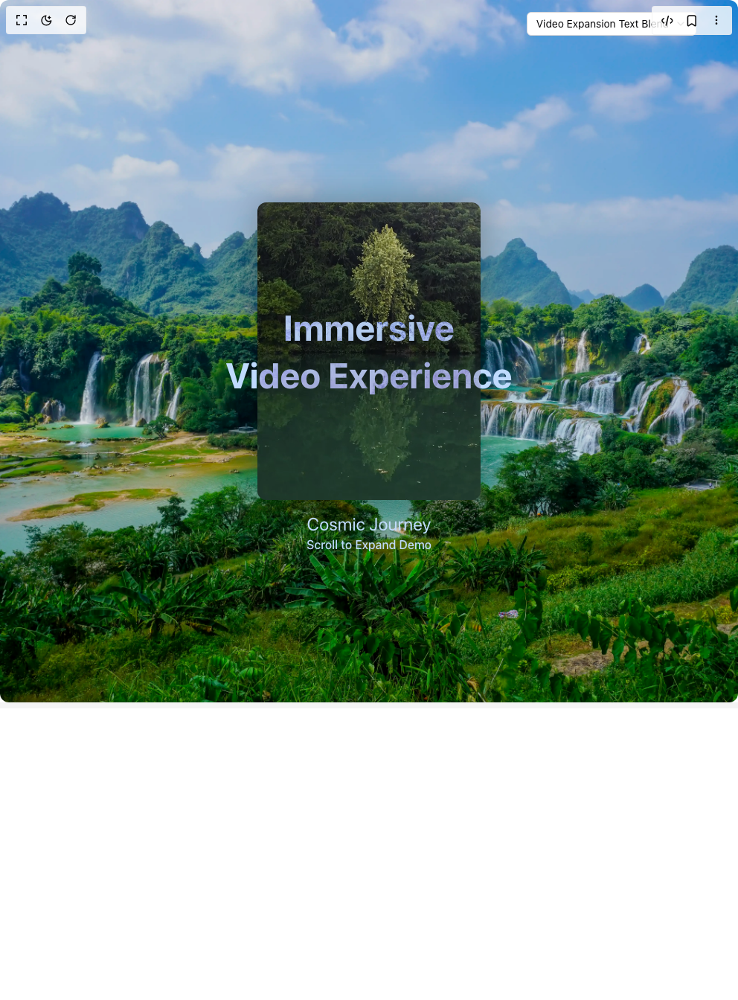

# Build Scroll Expansion Hero in BuilderStudio

> Build this component in our Agentic IDE: [BuilderStudio](https://builderstudio.dev).
>
> Join the BuilderStudio community on [Discord](https://discord.gg/QdWeSGCqfe) and [Reddit](https://reddit.com/r/builderstudio).



## Component

- Author group: `arunachalam0606`
- Component: `scroll-expansion-hero`
- Variant: `default`
- Rendered HTML snapshot: [`rendered.html`](rendered.html)

## BuilderStudio prompt

You are implementing a React component based on a component reference.

## Component identity

- Author: arunachalam0606
- Component slug: scroll-expansion-hero
- Demo slug: default
- Title: scroll-expansion-hero
- Description: 

## Goal

Recreate this component in a React + TypeScript + Tailwind CSS project. Preserve the visual layout, spacing, colors, border radius, shadows, interaction behavior, animation behavior, responsive behavior, and dark mode behavior shown in the rendered demo.

## Implementation requirements

- Use React and TypeScript.
- Use Tailwind CSS classes whenever possible.
- Keep the component self-contained unless the source files require helper components.
- If the source uses CSS variables, custom CSS, animations, or keyframes, include them.
- If the source uses external packages, list and use the required packages.
- Preserve accessibility attributes, button semantics, links, keyboard behavior, and ARIA attributes when visible in the source.
- Do not replace the component with a simplified placeholder.
- Return complete production-ready code.

## Dependencies

No reference metadata available.

## Rendered DOM snapshot

This is the rendered demo HTML extracted from the live preview. Use it to verify structure, class names, visible content, and layout.

```html
<div id="root"><div class="bg-background text-foreground"><div class="absolute z-10 top-4 right-14 flex flex-col items-end gap-1"><button type="button" role="combobox" aria-controls="radix-«r0»" aria-expanded="false" aria-autocomplete="none" dir="ltr" data-state="closed" class="flex w-full items-center justify-between rounded-md border border-input bg-background px-3 py-2 text-sm ring-offset-background placeholder:text-muted-foreground focus:outline-none focus:ring-2 focus:ring-ring focus:ring-offset-2 disabled:cursor-not-allowed disabled:opacity-50 [&amp;&gt;span]:line-clamp-1 gap-2 h-8"><span style="pointer-events: none;">Video Expansion Text Blend</span><svg xmlns="http://www.w3.org/2000/svg" width="24" height="24" viewBox="0 0 24 24" fill="none" stroke="currentColor" stroke-width="2" stroke-linecap="round" stroke-linejoin="round" class="lucide lucide-chevron-down h-4 w-4 opacity-50" aria-hidden="true"><path d="m6 9 6 6 6-6"></path></svg></button></div><div class="w-full"><div class="min-h-screen"><div class="transition-colors duration-700 ease-in-out overflow-x-hidden"><section class="relative flex flex-col items-center justify-start min-h-[100dvh]"><div class="relative w-full flex flex-col items-center min-h-[100dvh]"><div class="absolute inset-0 z-0 h-full" style="opacity: 1;"><div class="absolute inset-0 bg-black/10"></div></div><div class="container mx-auto flex flex-col items-center justify-start relative z-10"><div class="flex flex-col items-center justify-center w-full h-[100dvh] relative"><div class="absolute z-0 top-1/2 left-1/2 transform -translate-x-1/2 -translate-y-1/2 transition-none rounded-2xl" style="width: 300px; height: 400px; max-width: 95vw; max-height: 85vh; box-shadow: rgba(0, 0, 0, 0.3) 0px 0px 50px;"><div class="relative w-full h-full pointer-events-none"><video src="https://me7aitdbxq.ufs.sh/f/2wsMIGDMQRdYuZ5R8ahEEZ4aQK56LizRdfBSqeDMsmUIrJN1" poster="https://images.pexels.com/videos/5752729/space-earth-universe-cosmos-5752729.jpeg" autoplay="" loop="" playsinline="" preload="auto" class="w-full h-full object-cover rounded-xl" disablepictureinpicture="" disableremoteplayback=""></video><div class="absolute inset-0 z-10" style="pointer-events: none;"></div><div class="absolute inset-0 bg-black/30 rounded-xl" style="opacity: 0.5;"></div></div><div class="flex flex-col items-center text-center relative z-10 mt-4 transition-none"><p class="text-2xl text-blue-200" style="transform: translateX(0vw);">Cosmic Journey</p><p class="text-blue-200 font-medium text-center" style="transform: translateX(0vw);">Scroll to Expand Demo</p></div></div><div class="flex items-center justify-center text-center gap-4 w-full relative z-10 transition-none flex-col mix-blend-difference"><h2 class="text-4xl md:text-5xl lg:text-6xl font-bold text-blue-200 transition-none" style="transform: translateX(0vw);">Immersive</h2><h2 class="text-4xl md:text-5xl lg:text-6xl font-bold text-center text-blue-200 transition-none" style="transform: translateX(0vw);">Video Experience</h2></div></div><section class="flex flex-col w-full px-8 py-10 md:px-16 lg:py-20" style="opacity: 0;"><div class="max-w-4xl mx-auto"><h2 class="text-3xl font-bold mb-6 text-black dark:text-white">About This Component</h2><p class="text-lg mb-8 text-black dark:text-white">This is a demonstration of the ScrollExpandMedia component with a video. As you scroll, the video expands to fill more of the screen, creating an immersive experience. This component is perfect for showcasing video content in a modern, interactive way.</p><p class="text-lg mb-8 text-black dark:text-white">The ScrollExpandMedia component provides a unique way to engage users with your content through interactive scrolling. Try switching between video and image modes to see different implementations.</p></div></section></div></div></section></div></div></div></div></div>
```

## Reference source files

No reference source files were available.
