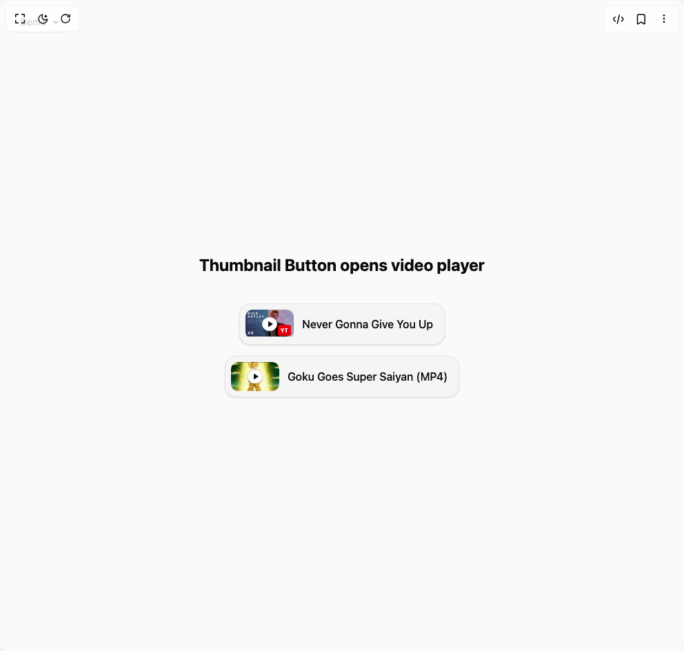

# Build Thumbnail Button Video Player in BuilderStudio

> Build this component in our Agentic IDE: [BuilderStudio](https://builderstudio.dev).
>
> Join the BuilderStudio community on [Discord](https://discord.gg/QdWeSGCqfe) and [Reddit](https://reddit.com/r/builderstudio).



## Component

- Author group: `arunachalam0606`
- Component: `thumbnail-button-video-player`
- Variant: `default`
- Rendered HTML snapshot: [`rendered.html`](rendered.html)

## BuilderStudio prompt

You are implementing a React component based on a component reference.

## Component identity

- Author: arunachalam0606
- Component slug: thumbnail-button-video-player
- Demo slug: default
- Title: thumbnail-button-video-player
- Description: 

## Goal

Recreate this component in a React + TypeScript + Tailwind CSS project. Preserve the visual layout, spacing, colors, border radius, shadows, interaction behavior, animation behavior, responsive behavior, and dark mode behavior shown in the rendered demo.

## Implementation requirements

- Use React and TypeScript.
- Use Tailwind CSS classes whenever possible.
- Keep the component self-contained unless the source files require helper components.
- If the source uses CSS variables, custom CSS, animations, or keyframes, include them.
- If the source uses external packages, list and use the required packages.
- Preserve accessibility attributes, button semantics, links, keyboard behavior, and ARIA attributes when visible in the source.
- Do not replace the component with a simplified placeholder.
- Return complete production-ready code.

## Dependencies

No reference metadata available.

## Rendered DOM snapshot

This is the rendered demo HTML extracted from the live preview. Use it to verify structure, class names, visible content, and layout.

```html
<div id="root"><div class="fixed top-4 left-4 z-10"><select class="appearance-none h-8 max-w-[200px] text-sm leading-tight rounded-lg pl-3 pr-7 py-0 border bg-background focus:outline-none focus:ring-0"><option value="default_Demo">Demo</option></select><div class="absolute top-1/2 transform -translate-y-1/2 right-2 pointer-events-none"><svg class="w-4 h-4 fill-current" viewBox="0 0 20 20"><path d="M5.516 7.548c.436-.446 1.043-.48 1.576 0L10 10.405l2.908-2.857c.533-.48 1.14-.446 1.576 0 .436.445.408 1.197 0 1.615l-3.734 3.705c-.533.534-1.39.534-1.923 0l-3.734-3.705c-.408-.418-.436-1.17 0-1.615z"></path></svg></div></div><div class="w-screen min-h-screen flex justify-center items-center"><div class="min-h-screen w-screen flex items-center justify-center bg-gray-50 dark:bg-zinc-950 transition-colors duration-500"><div class="flex flex-col gap-6 p-8"><h1 class="text-2xl font-bold text-center text-foreground mb-4">Thumbnail Button opens video player</h1><div class="flex flex-col items-center gap-4 max-w-md"><button class="
          relative overflow-hidden rounded-2xl bg-muted dark:bg-card 
          shadow-sm hover:shadow-md transition-all duration-200
          group focus:outline-none focus:ring-2 focus:ring-ring/50
          p-2 w-max border border-border hover:cursor-pointer
          
        " aria-label="Never Gonna Give You Up" tabindex="0" style="transform: none;"><div class="flex items-center"><div class="relative w-[70px] h-[42px] rounded-lg overflow-hidden flex-shrink-0"><div class="absolute inset-0 flex items-center justify-center"><div class="p-1 rounded-full bg-background shadow-sm border border-border"><svg xmlns="http://www.w3.org/2000/svg" width="10" height="10" viewBox="0 0 24 24" fill="none" stroke="currentColor" stroke-width="2" stroke-linecap="round" stroke-linejoin="round" class="lucide lucide-play fill-foreground text-foreground ml-0.5" aria-hidden="true"><polygon points="6 3 20 12 6 21 6 3"></polygon></svg></div></div><div class="absolute bottom-1 right-1 bg-red-600 text-white text-[8px] font-bold px-1 py-0.5 rounded">YT</div></div><p class="pl-3 pr-2 text-foreground font-medium text-base">Never Gonna Give You Up</p></div></button><button class="
          relative overflow-hidden rounded-2xl bg-muted dark:bg-card 
          shadow-sm hover:shadow-md transition-all duration-200
          group focus:outline-none focus:ring-2 focus:ring-ring/50
          p-2 w-max border border-border hover:cursor-pointer
          
        " aria-label="Goku Goes Super Saiyan (MP4)" tabindex="0" style="transform: none;"><div class="flex items-center"><div class="relative w-[70px] h-[42px] rounded-lg overflow-hidden flex-shrink-0"><div class="absolute inset-0 flex items-center justify-center"><div class="p-1 rounded-full bg-background shadow-sm border border-border"><svg xmlns="http://www.w3.org/2000/svg" width="10" height="10" viewBox="0 0 24 24" fill="none" stroke="currentColor" stroke-width="2" stroke-linecap="round" stroke-linejoin="round" class="lucide lucide-play fill-foreground text-foreground ml-0.5" aria-hidden="true"><polygon points="6 3 20 12 6 21 6 3"></polygon></svg></div></div></div><p class="pl-3 pr-2 text-foreground font-medium text-base">Goku Goes Super Saiyan (MP4)</p></div></button></div></div></div></div></div>
```

## Reference source files

No reference source files were available.
