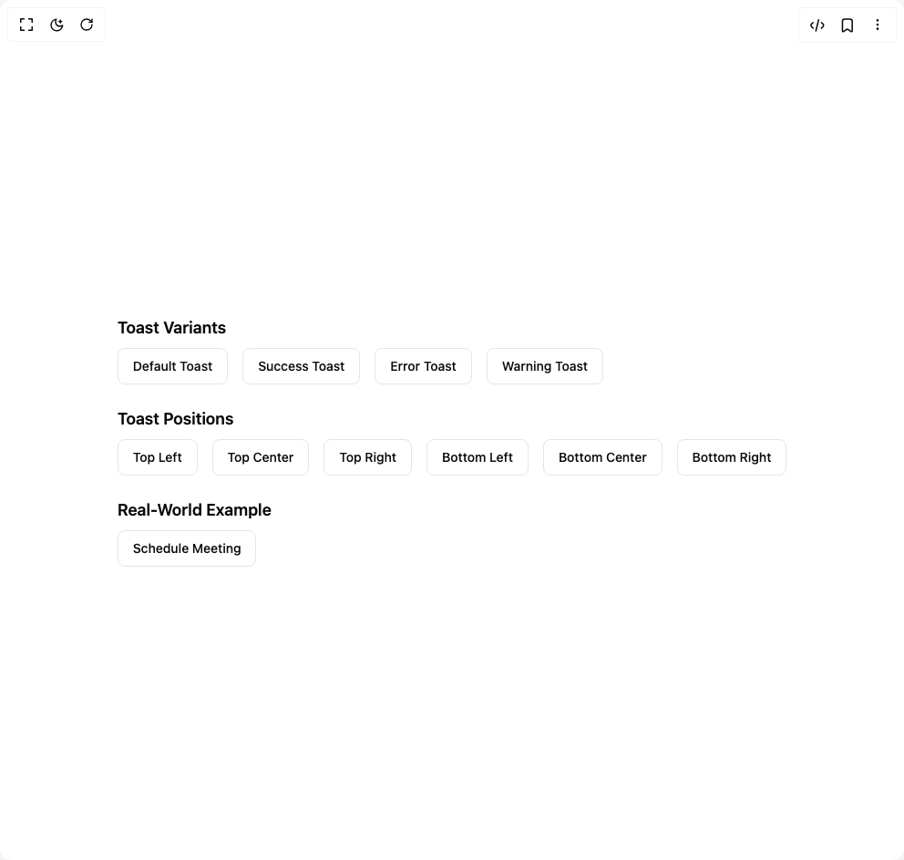

# Build Toast in BuilderStudio

> Build this component in our Agentic IDE: [BuilderStudio](https://builderstudio.dev).
>
> Join the BuilderStudio community on [Discord](https://discord.gg/QdWeSGCqfe) and [Reddit](https://reddit.com/r/builderstudio).



## Component

- Author group: `arunachalam0606`
- Component: `toast`
- Variant: `default`
- Rendered HTML snapshot: [`rendered.html`](rendered.html)

## BuilderStudio prompt

You are implementing a React component based on a component reference.

## Component identity

- Author: arunachalam0606
- Component slug: toast
- Demo slug: default
- Title: toast
- Description: 

## Goal

Recreate this component in a React + TypeScript + Tailwind CSS project. Preserve the visual layout, spacing, colors, border radius, shadows, interaction behavior, animation behavior, responsive behavior, and dark mode behavior shown in the rendered demo.

## Implementation requirements

- Use React and TypeScript.
- Use Tailwind CSS classes whenever possible.
- Keep the component self-contained unless the source files require helper components.
- If the source uses CSS variables, custom CSS, animations, or keyframes, include them.
- If the source uses external packages, list and use the required packages.
- Preserve accessibility attributes, button semantics, links, keyboard behavior, and ARIA attributes when visible in the source.
- Do not replace the component with a simplified placeholder.
- Return complete production-ready code.

## Dependencies

No reference metadata available.

## Rendered DOM snapshot

This is the rendered demo HTML extracted from the live preview. Use it to verify structure, class names, visible content, and layout.

```html
<div id="root"><div class="w-screen min-h-screen flex justify-center items-center"><div class="w-screen min-h-screen flex justify-center items-center"><div class="p-6 space-y-6"><section aria-label="Notifications alt+T" tabindex="-1" aria-live="polite" aria-relevant="additions text" aria-atomic="false"></section><div class="space-y-6"><section><h2 class="text-lg font-semibold mb-2">Toast Variants</h2><div class="flex flex-wrap gap-4"><button class="inline-flex items-center justify-center whitespace-nowrap rounded-md text-sm font-medium ring-offset-background transition-colors focus-visible:outline-none focus-visible:ring-2 focus-visible:ring-ring focus-visible:ring-offset-2 disabled:pointer-events-none disabled:opacity-50 border bg-background hover:text-accent-foreground h-10 px-4 py-2 border-border-600 text-foreground-600 hover:bg-default-600/10 dark:hover:bg-default-400/20">Default Toast</button><button class="inline-flex items-center justify-center whitespace-nowrap rounded-md text-sm font-medium ring-offset-background transition-colors focus-visible:outline-none focus-visible:ring-2 focus-visible:ring-ring focus-visible:ring-offset-2 disabled:pointer-events-none disabled:opacity-50 border bg-background hover:text-accent-foreground h-10 px-4 py-2 border-success-600 text-success-600 hover:bg-success-600/10 dark:hover:bg-success-400/20">Success Toast</button><button class="inline-flex items-center justify-center whitespace-nowrap rounded-md text-sm font-medium ring-offset-background transition-colors focus-visible:outline-none focus-visible:ring-2 focus-visible:ring-ring focus-visible:ring-offset-2 disabled:pointer-events-none disabled:opacity-50 border bg-background hover:text-accent-foreground h-10 px-4 py-2 border-error-600 text-error-600 hover:bg-error-600/10 dark:hover:bg-error-400/20">Error Toast</button><button class="inline-flex items-center justify-center whitespace-nowrap rounded-md text-sm font-medium ring-offset-background transition-colors focus-visible:outline-none focus-visible:ring-2 focus-visible:ring-ring focus-visible:ring-offset-2 disabled:pointer-events-none disabled:opacity-50 border bg-background hover:text-accent-foreground h-10 px-4 py-2 border-warning-600 text-warning-600 hover:bg-warning-600/10 dark:hover:bg-warning-400/20">Warning Toast</button></div></section><section><h2 class="text-lg font-semibold mb-2">Toast Positions</h2><div class="flex flex-wrap gap-4"><button class="inline-flex items-center justify-center whitespace-nowrap rounded-md text-sm font-medium ring-offset-background transition-colors focus-visible:outline-none focus-visible:ring-2 focus-visible:ring-ring focus-visible:ring-offset-2 disabled:pointer-events-none disabled:opacity-50 border bg-background hover:text-accent-foreground h-10 px-4 py-2 border-border text-foreground hover:bg-muted/10 dark:hover:bg-muted/20">Top Left</button><button class="inline-flex items-center justify-center whitespace-nowrap rounded-md text-sm font-medium ring-offset-background transition-colors focus-visible:outline-none focus-visible:ring-2 focus-visible:ring-ring focus-visible:ring-offset-2 disabled:pointer-events-none disabled:opacity-50 border bg-background hover:text-accent-foreground h-10 px-4 py-2 border-border text-foreground hover:bg-muted/10 dark:hover:bg-muted/20">Top Center</button><button class="inline-flex items-center justify-center whitespace-nowrap rounded-md text-sm font-medium ring-offset-background transition-colors focus-visible:outline-none focus-visible:ring-2 focus-visible:ring-ring focus-visible:ring-offset-2 disabled:pointer-events-none disabled:opacity-50 border bg-background hover:text-accent-foreground h-10 px-4 py-2 border-border text-foreground hover:bg-muted/10 dark:hover:bg-muted/20">Top Right</button><button class="inline-flex items-center justify-center whitespace-nowrap rounded-md text-sm font-medium ring-offset-background transition-colors focus-visible:outline-none focus-visible:ring-2 focus-visible:ring-ring focus-visible:ring-offset-2 disabled:pointer-events-none disabled:opacity-50 border bg-background hover:text-accent-foreground h-10 px-4 py-2 border-border text-foreground hover:bg-muted/10 dark:hover:bg-muted/20">Bottom Left</button><button class="inline-flex items-center justify-center whitespace-nowrap rounded-md text-sm font-medium ring-offset-background transition-colors focus-visible:outline-none focus-visible:ring-2 focus-visible:ring-ring focus-visible:ring-offset-2 disabled:pointer-events-none disabled:opacity-50 border bg-background hover:text-accent-foreground h-10 px-4 py-2 border-border text-foreground hover:bg-muted/10 dark:hover:bg-muted/20">Bottom Center</button><button class="inline-flex items-center justify-center whitespace-nowrap rounded-md text-sm font-medium ring-offset-background transition-colors focus-visible:outline-none focus-visible:ring-2 focus-visible:ring-ring focus-visible:ring-offset-2 disabled:pointer-events-none disabled:opacity-50 border bg-background hover:text-accent-foreground h-10 px-4 py-2 border-border text-foreground hover:bg-muted/10 dark:hover:bg-muted/20">Bottom Right</button></div></section><section><h2 class="text-lg font-semibold mb-2">Real‑World Example</h2><button class="inline-flex items-center justify-center whitespace-nowrap rounded-md text-sm font-medium ring-offset-background transition-colors focus-visible:outline-none focus-visible:ring-2 focus-visible:ring-ring focus-visible:ring-offset-2 disabled:pointer-events-none disabled:opacity-50 border bg-background hover:text-accent-foreground h-10 px-4 py-2 border-border text-foreground hover:bg-muted/10 dark:hover:bg-muted/20">Schedule Meeting</button></section></div></div></div></div></div>
```

## Reference source files

No reference source files were available.
