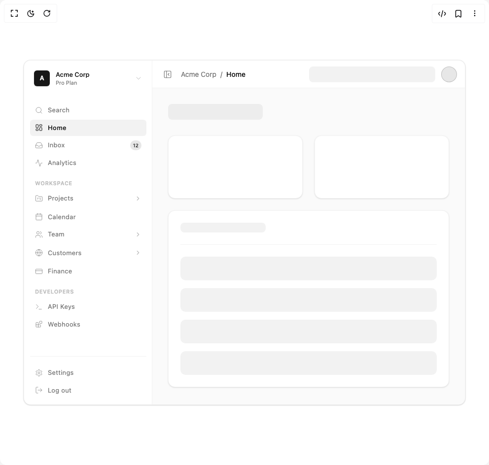

# Build Dashboard Sidebar in BuilderStudio

> Build this component in our Agentic IDE: [BuilderStudio](https://builderstudio.dev).
>
> Join the BuilderStudio community on [Discord](https://discord.gg/QdWeSGCqfe) and [Reddit](https://reddit.com/r/builderstudio).



## Component

- Author group: `arunjdass`
- Component: `dashboard-sidebar`
- Variant: `default`
- Rendered HTML snapshot: [`rendered.html`](rendered.html)

## BuilderStudio prompt

You are implementing a React component based on a component reference.

## Component identity

- Author: arunjdass
- Component slug: dashboard-sidebar
- Demo slug: default
- Title: dashboard-sidebar
- Description: 

## Goal

Recreate this component in a React + TypeScript + Tailwind CSS project. Preserve the visual layout, spacing, colors, border radius, shadows, interaction behavior, animation behavior, responsive behavior, and dark mode behavior shown in the rendered demo.

## Implementation requirements

- Use React and TypeScript.
- Use Tailwind CSS classes whenever possible.
- Keep the component self-contained unless the source files require helper components.
- If the source uses CSS variables, custom CSS, animations, or keyframes, include them.
- If the source uses external packages, list and use the required packages.
- Preserve accessibility attributes, button semantics, links, keyboard behavior, and ARIA attributes when visible in the source.
- Do not replace the component with a simplified placeholder.
- Return complete production-ready code.

## Dependencies

No reference metadata available.

## Rendered DOM snapshot

This is the rendered demo HTML extracted from the live preview. Use it to verify structure, class names, visible content, and layout.

```html
<div id="root"><div class="w-screen min-h-screen flex justify-center items-center"><div class="w-screen min-h-screen flex justify-center items-center"><div class="flex flex-col items-center justify-center w-full min-h-[700px] bg-background p-4 md:p-8"><div class="relative w-full max-w-4xl h-[700px] bg-card rounded-xl border border-border/50 flex overflow-hidden shadow-sm ring-1 ring-black/5 dark:ring-white/5"><div class="h-full transition-all duration-300 ease-in-out shrink-0 overflow-hidden bg-card/50 border-r border-border/50 w-[260px] opacity-100"><div class="flex flex-col w-[260px] h-full bg-card/50 border-r border-border/50 p-3 font-sans w-[260px] border-none bg-transparent"><div class="relative"><div class="flex items-center justify-between px-2 py-2 mb-4 rounded-lg hover:bg-black/5 dark:hover:bg-white/5 cursor-pointer transition-colors select-none group"><div class="flex items-center gap-3"><div class="w-8 h-8 rounded-[6px] bg-primary text-primary-foreground flex items-center justify-center font-semibold text-[13px] shadow-sm">A</div><div class="flex flex-col overflow-hidden"><span class="text-[13px] font-medium leading-none mb-1 text-foreground truncate max-w-[120px]">Acme Corp</span><span class="text-[11px] text-muted-foreground leading-none">Pro Plan</span></div></div><svg xmlns="http://www.w3.org/2000/svg" width="24" height="24" viewBox="0 0 24 24" fill="none" stroke="currentColor" stroke-width="1.5" stroke-linecap="round" stroke-linejoin="round" class="lucide lucide-chevron-down w-4 h-4 text-muted-foreground/50 group-hover:text-foreground/70 transition-colors shrink-0" aria-hidden="true"><path d="m6 9 6 6 6-6"></path></svg></div></div><div class="flex-1 overflow-y-auto [&amp;::-webkit-scrollbar]:hidden [-ms-overflow-style:none] [scrollbar-width:none] flex flex-col gap-4 mt-2"><div class="flex flex-col gap-0.5"><div class="flex flex-col w-full"><div class="group flex items-center justify-between px-2.5 py-[7px] rounded-[6px] cursor-pointer transition-all duration-200 select-none
          text-muted-foreground hover:bg-black/5 dark:hover:bg-white/5 hover:text-foreground/90
        " style="padding-left: 10px;"><div class="flex items-center gap-2.5"><svg xmlns="http://www.w3.org/2000/svg" width="24" height="24" viewBox="0 0 24 24" fill="none" stroke="currentColor" stroke-width="1.5" stroke-linecap="round" stroke-linejoin="round" class="lucide lucide-search w-[16px] h-[16px] transition-colors
              text-muted-foreground/70 group-hover:text-foreground/70" aria-hidden="true"><circle cx="11" cy="11" r="8"></circle><path d="m21 21-4.3-4.3"></path></svg><span class="text-[13px] tracking-wide truncate">Search</span></div><div class="flex items-center gap-2"><kbd class="hidden group-hover:inline-flex items-center justify-center h-5 px-1.5 text-[10px] font-medium font-mono text-muted-foreground/60 bg-background/50 border border-border/50 rounded-[4px] shadow-xs">⌘K</kbd></div></div></div><div class="flex flex-col w-full"><div class="group flex items-center justify-between px-2.5 py-[7px] rounded-[6px] cursor-pointer transition-all duration-200 select-none
          bg-black/5 dark:bg-white/10 text-foreground font-medium
        " style="padding-left: 10px;"><div class="flex items-center gap-2.5"><svg xmlns="http://www.w3.org/2000/svg" width="24" height="24" viewBox="0 0 24 24" fill="none" stroke="currentColor" stroke-width="1.5" stroke-linecap="round" stroke-linejoin="round" class="lucide lucide-layout-dashboard w-[16px] h-[16px] transition-colors
              text-foreground" aria-hidden="true"><rect width="7" height="9" x="3" y="3" rx="1"></rect><rect width="7" height="5" x="14" y="3" rx="1"></rect><rect width="7" height="9" x="14" y="12" rx="1"></rect><rect width="7" height="5" x="3" y="16" rx="1"></rect></svg><span class="text-[13px] tracking-wide truncate">Home</span></div><div class="flex items-center gap-2"></div></div></div><div class="flex flex-col w-full"><div class="group flex items-center justify-between px-2.5 py-[7px] rounded-[6px] cursor-pointer transition-all duration-200 select-none
          text-muted-foreground hover:bg-black/5 dark:hover:bg-white/5 hover:text-foreground/90
        " style="padding-left: 10px;"><div class="flex items-center gap-2.5"><svg xmlns="http://www.w3.org/2000/svg" width="24" height="24" viewBox="0 0 24 24" fill="none" stroke="currentColor" stroke-width="1.5" stroke-linecap="round" stroke-linejoin="round" class="lucide lucide-inbox w-[16px] h-[16px] transition-colors
              text-muted-foreground/70 group-hover:text-foreground/70" aria-hidden="true"><polyline points="22 12 16 12 14 15 10 15 8 12 2 12"></polyline><path d="M5.45 5.11 2 12v6a2 2 0 0 0 2 2h16a2 2 0 0 0 2-2v-6l-3.45-6.89A2 2 0 0 0 16.76 4H7.24a2 2 0 0 0-1.79 1.11z"></path></svg><span class="text-[13px] tracking-wide truncate">Inbox</span></div><div class="flex items-center gap-2"><span class="flex items-center justify-center min-w-[20px] h-5 px-1.5 text-[10px] font-medium rounded-full bg-primary/10 text-primary">12</span></div></div></div><div class="flex flex-col w-full"><div class="group flex items-center justify-between px-2.5 py-[7px] rounded-[6px] cursor-pointer transition-all duration-200 select-none
          text-muted-foreground hover:bg-black/5 dark:hover:bg-white/5 hover:text-foreground/90
        " style="padding-left: 10px;"><div class="flex items-center gap-2.5"><svg xmlns="http://www.w3.org/2000/svg" width="24" height="24" viewBox="0 0 24 24" fill="none" stroke="currentColor" stroke-width="1.5" stroke-linecap="round" stroke-linejoin="round" class="lucide lucide-activity w-[16px] h-[16px] transition-colors
              text-muted-foreground/70 group-hover:text-foreground/70" aria-hidden="true"><path d="M22 12h-2.48a2 2 0 0 0-1.93 1.46l-2.35 8.36a.25.25 0 0 1-.48 0L9.24 2.18a.25.25 0 0 0-.48 0l-2.35 8.36A2 2 0 0 1 4.49 12H2"></path></svg><span class="text-[13px] tracking-wide truncate">Analytics</span></div><div class="flex items-center gap-2"></div></div></div></div><div class="flex flex-col gap-0.5"><span class="px-2.5 mb-1 text-[11px] font-semibold tracking-wider text-muted-foreground/50 uppercase">Workspace</span><div class="flex flex-col w-full"><div class="group flex items-center justify-between px-2.5 py-[7px] rounded-[6px] cursor-pointer transition-all duration-200 select-none
          text-muted-foreground hover:bg-black/5 dark:hover:bg-white/5 hover:text-foreground/90
        " style="padding-left: 10px;"><div class="flex items-center gap-2.5"><svg xmlns="http://www.w3.org/2000/svg" width="24" height="24" viewBox="0 0 24 24" fill="none" stroke="currentColor" stroke-width="1.5" stroke-linecap="round" stroke-linejoin="round" class="lucide lucide-folder-kanban w-[16px] h-[16px] transition-colors
              text-muted-foreground/70 group-hover:text-foreground/70" aria-hidden="true"><path d="M4 20h16a2 2 0 0 0 2-2V8a2 2 0 0 0-2-2h-7.93a2 2 0 0 1-1.66-.9l-.82-1.2A2 2 0 0 0 7.93 3H4a2 2 0 0 0-2 2v13c0 1.1.9 2 2 2Z"></path><path d="M8 10v4"></path><path d="M12 10v2"></path><path d="M16 10v6"></path></svg><span class="text-[13px] tracking-wide truncate">Projects</span></div><div class="flex items-center gap-2"><svg xmlns="http://www.w3.org/2000/svg" width="24" height="24" viewBox="0 0 24 24" fill="none" stroke="currentColor" stroke-width="2" stroke-linecap="round" stroke-linejoin="round" class="lucide lucide-chevron-right w-3.5 h-3.5 text-muted-foreground/50 transition-transform duration-200" aria-hidden="true"><path d="m9 18 6-6-6-6"></path></svg></div></div><div class="grid transition-[grid-template-rows,opacity] duration-300 ease-in-out grid-rows-[0fr] opacity-0"><div class="overflow-hidden min-h-0 relative flex flex-col gap-0.5 mt-0.5"><div class="absolute top-0 bottom-0 border-l border-black/5 dark:border-white/5" style="left: 17.5px;"></div><div class="flex flex-col w-full"><div class="group flex items-center justify-between px-2.5 py-[7px] rounded-[6px] cursor-pointer transition-all duration-200 select-none
          text-muted-foreground hover:bg-black/5 dark:hover:bg-white/5 hover:text-foreground/90
        " style="padding-left: 22px;"><div class="flex items-center gap-2.5"><svg xmlns="http://www.w3.org/2000/svg" width="24" height="24" viewBox="0 0 24 24" fill="none" stroke="currentColor" stroke-width="1.5" stroke-linecap="round" stroke-linejoin="round" class="lucide lucide-hash w-[16px] h-[16px] transition-colors
              text-muted-foreground/70 group-hover:text-foreground/70" aria-hidden="true"><line x1="4" x2="20" y1="9" y2="9"></line><line x1="4" x2="20" y1="15" y2="15"></line><line x1="10" x2="8" y1="3" y2="21"></line><line x1="16" x2="14" y1="3" y2="21"></line></svg><span class="text-[13px] tracking-wide truncate">Active</span></div><div class="flex items-center gap-2"></div></div></div><div class="flex flex-col w-full"><div class="group flex items-center justify-between px-2.5 py-[7px] rounded-[6px] cursor-pointer transition-all duration-200 select-none
          text-muted-foreground hover:bg-black/5 dark:hover:bg-white/5 hover:text-foreground/90
        " style="padding-left: 22px;"><div class="flex items-center gap-2.5"><svg xmlns="http://www.w3.org/2000/svg" width="24" height="24" viewBox="0 0 24 24" fill="none" stroke="currentColor" stroke-width="1.5" stroke-linecap="round" stroke-linejoin="round" class="lucide lucide-hash w-[16px] h-[16px] transition-colors
              text-muted-foreground/70 group-hover:text-foreground/70" aria-hidden="true"><line x1="4" x2="20" y1="9" y2="9"></line><line x1="4" x2="20" y1="15" y2="15"></line><line x1="10" x2="8" y1="3" y2="21"></line><line x1="16" x2="14" y1="3" y2="21"></line></svg><span class="text-[13px] tracking-wide truncate">Archived</span></div><div class="flex items-center gap-2"></div></div></div></div></div></div><div class="flex flex-col w-full"><div class="group flex items-center justify-between px-2.5 py-[7px] rounded-[6px] cursor-pointer transition-all duration-200 select-none
          text-muted-foreground hover:bg-black/5 dark:hover:bg-white/5 hover:text-foreground/90
        " style="padding-left: 10px;"><div class="flex items-center gap-2.5"><svg xmlns="http://www.w3.org/2000/svg" width="24" height="24" viewBox="0 0 24 24" fill="none" stroke="currentColor" stroke-width="1.5" stroke-linecap="round" stroke-linejoin="round" class="lucide lucide-calendar w-[16px] h-[16px] transition-colors
              text-muted-foreground/70 group-hover:text-foreground/70" aria-hidden="true"><path d="M8 2v4"></path><path d="M16 2v4"></path><rect width="18" height="18" x="3" y="4" rx="2"></rect><path d="M3 10h18"></path></svg><span class="text-[13px] tracking-wide truncate">Calendar</span></div><div class="flex items-center gap-2"></div></div></div><div class="flex flex-col w-full"><div class="group flex items-center justify-between px-2.5 py-[7px] rounded-[6px] cursor-pointer transition-all duration-200 select-none
          text-muted-foreground hover:bg-black/5 dark:hover:bg-white/5 hover:text-foreground/90
        " style="padding-left: 10px;"><div class="flex items-center gap-2.5"><svg xmlns="http://www.w3.org/2000/svg" width="24" height="24" viewBox="0 0 24 24" fill="none" stroke="currentColor" stroke-width="1.5" stroke-linecap="round" stroke-linejoin="round" class="lucide lucide-users w-[16px] h-[16px] transition-colors
              text-muted-foreground/70 group-hover:text-foreground/70" aria-hidden="true"><path d="M16 21v-2a4 4 0 0 0-4-4H6a4 4 0 0 0-4 4v2"></path><circle cx="9" cy="7" r="4"></circle><path d="M22 21v-2a4 4 0 0 0-3-3.87"></path><path d="M16 3.13a4 4 0 0 1 0 7.75"></path></svg><span class="text-[13px] tracking-wide truncate">Team</span></div><div class="flex items-center gap-2"><svg xmlns="http://www.w3.org/2000/svg" width="24" height="24" viewBox="0 0 24 24" fill="none" stroke="currentColor" stroke-width="2" stroke-linecap="round" stroke-linejoin="round" class="lucide lucide-chevron-right w-3.5 h-3.5 text-muted-foreground/50 transition-transform duration-200" aria-hidden="true"><path d="m9 18 6-6-6-6"></path></svg></div></div><div class="grid transition-[grid-template-rows,opacity] duration-300 ease-in-out grid-rows-[0fr] opacity-0"><div class="overflow-hidden min-h-0 relative flex flex-col gap-0.5 mt-0.5"><div class="absolute top-0 bottom-0 border-l border-black/5 dark:border-white/5" style="left: 17.5px;"></div><div class="flex flex-col w-full"><div class="group flex items-center justify-between px-2.5 py-[7px] rounded-[6px] cursor-pointer transition-all duration-200 select-none
          text-muted-foreground hover:bg-black/5 dark:hover:bg-white/5 hover:text-foreground/90
        " style="padding-left: 22px;"><div class="flex items-center gap-2.5"><svg xmlns="http://www.w3.org/2000/svg" width="24" height="24" viewBox="0 0 24 24" fill="none" stroke="currentColor" stroke-width="1.5" stroke-linecap="round" stroke-linejoin="round" class="lucide lucide-hash w-[16px] h-[16px] transition-colors
              text-muted-foreground/70 group-hover:text-foreground/70" aria-hidden="true"><line x1="4" x2="20" y1="9" y2="9"></line><line x1="4" x2="20" y1="15" y2="15"></line><line x1="10" x2="8" y1="3" y2="21"></line><line x1="16" x2="14" y1="3" y2="21"></line></svg><span class="text-[13px] tracking-wide truncate">Designers</span></div><div class="flex items-center gap-2"></div></div></div><div class="flex flex-col w-full"><div class="group flex items-center justify-between px-2.5 py-[7px] rounded-[6px] cursor-pointer transition-all duration-200 select-none
          text-muted-foreground hover:bg-black/5 dark:hover:bg-white/5 hover:text-foreground/90
        " style="padding-left: 22px;"><div class="flex items-center gap-2.5"><svg xmlns="http://www.w3.org/2000/svg" width="24" height="24" viewBox="0 0 24 24" fill="none" stroke="currentColor" stroke-width="1.5" stroke-linecap="round" stroke-linejoin="round" class="lucide lucide-hash w-[16px] h-[16px] transition-colors
              text-muted-foreground/70 group-hover:text-foreground/70" aria-hidden="true"><line x1="4" x2="20" y1="9" y2="9"></line><line x1="4" x2="20" y1="15" y2="15"></line><line x1="10" x2="8" y1="3" y2="21"></line><line x1="16" x2="14" y1="3" y2="21"></line></svg><span class="text-[13px] tracking-wide truncate">Engineering</span></div><div class="flex items-center gap-2"></div></div></div><div class="flex flex-col w-full"><div class="group flex items-center justify-between px-2.5 py-[7px] rounded-[6px] cursor-pointer transition-all duration-200 select-none
          text-muted-foreground hover:bg-black/5 dark:hover:bg-white/5 hover:text-foreground/90
        " style="padding-left: 22px;"><div class="flex items-center gap-2.5"><svg xmlns="http://www.w3.org/2000/svg" width="24" height="24" viewBox="0 0 24 24" fill="none" stroke="currentColor" stroke-width="1.5" stroke-linecap="round" stroke-linejoin="round" class="lucide lucide-hash w-[16px] h-[16px] transition-colors
              text-muted-foreground/70 group-hover:text-foreground/70" aria-hidden="true"><line x1="4" x2="20" y1="9" y2="9"></line><line x1="4" x2="20" y1="15" y2="15"></line><line x1="10" x2="8" y1="3" y2="21"></line><line x1="16" x2="14" y1="3" y2="21"></line></svg><span class="text-[13px] tracking-wide truncate">Product</span></div><div class="flex items-center gap-2"></div></div></div></div></div></div><div class="flex flex-col w-full"><div class="group flex items-center justify-between px-2.5 py-[7px] rounded-[6px] cursor-pointer transition-all duration-200 select-none
          text-muted-foreground hover:bg-black/5 dark:hover:bg-white/5 hover:text-foreground/90
        " style="padding-left: 10px;"><div class="flex items-center gap-2.5"><svg xmlns="http://www.w3.org/2000/svg" width="24" height="24" viewBox="0 0 24 24" fill="none" stroke="currentColor" stroke-width="1.5" stroke-linecap="round" stroke-linejoin="round" class="lucide lucide-globe w-[16px] h-[16px] transition-colors
              text-muted-foreground/70 group-hover:text-foreground/70" aria-hidden="true"><circle cx="12" cy="12" r="10"></circle><path d="M12 2a14.5 14.5 0 0 0 0 20 14.5 14.5 0 0 0 0-20"></path><path d="M2 12h20"></path></svg><span class="text-[13px] tracking-wide truncate">Customers</span></div><div class="flex items-center gap-2"><svg xmlns="http://www.w3.org/2000/svg" width="24" height="24" viewBox="0 0 24 24" fill="none" stroke="currentColor" stroke-width="2" stroke-linecap="round" stroke-linejoin="round" class="lucide lucide-chevron-right w-3.5 h-3.5 text-muted-foreground/50 transition-transform duration-200" aria-hidden="true"><path d="m9 18 6-6-6-6"></path></svg></div></div><div class="grid transition-[grid-template-rows,opacity] duration-300 ease-in-out grid-rows-[0fr] opacity-0"><div class="overflow-hidden min-h-0 relative flex flex-col gap-0.5 mt-0.5"><div class="absolute top-0 bottom-0 border-l border-black/5 dark:border-white/5" style="left: 17.5px;"></div><div class="flex flex-col w-full"><div class="group flex items-center justify-between px-2.5 py-[7px] rounded-[6px] cursor-pointer transition-all duration-200 select-none
          text-muted-foreground hover:bg-black/5 dark:hover:bg-white/5 hover:text-foreground/90
        " style="padding-left: 22px;"><div class="flex items-center gap-2.5"><svg xmlns="http://www.w3.org/2000/svg" width="24" height="24" viewBox="0 0 24 24" fill="none" stroke="currentColor" stroke-width="1.5" stroke-linecap="round" stroke-linejoin="round" class="lucide lucide-hash w-[16px] h-[16px] transition-colors
              text-muted-foreground/70 group-hover:text-foreground/70" aria-hidden="true"><line x1="4" x2="20" y1="9" y2="9"></line><line x1="4" x2="20" y1="15" y2="15"></line><line x1="10" x2="8" y1="3" y2="21"></line><line x1="16" x2="14" y1="3" y2="21"></line></svg><span class="text-[13px] tracking-wide truncate">Enterprise</span></div><div class="flex items-center gap-2"></div></div></div><div class="flex flex-col w-full"><div class="group flex items-center justify-between px-2.5 py-[7px] rounded-[6px] cursor-pointer transition-all duration-200 select-none
          text-muted-foreground hover:bg-black/5 dark:hover:bg-white/5 hover:text-foreground/90
        " style="padding-left: 22px;"><div class="flex items-center gap-2.5"><svg xmlns="http://www.w3.org/2000/svg" width="24" height="24" viewBox="0 0 24 24" fill="none" stroke="currentColor" stroke-width="1.5" stroke-linecap="round" stroke-linejoin="round" class="lucide lucide-hash w-[16px] h-[16px] transition-colors
              text-muted-foreground/70 group-hover:text-foreground/70" aria-hidden="true"><line x1="4" x2="20" y1="9" y2="9"></line><line x1="4" x2="20" y1="15" y2="15"></line><line x1="10" x2="8" y1="3" y2="21"></line><line x1="16" x2="14" y1="3" y2="21"></line></svg><span class="text-[13px] tracking-wide truncate">SMB</span></div><div class="flex items-center gap-2"></div></div></div></div></div></div><div class="flex flex-col w-full"><div class="group flex items-center justify-between px-2.5 py-[7px] rounded-[6px] cursor-pointer transition-all duration-200 select-none
          text-muted-foreground hover:bg-black/5 dark:hover:bg-white/5 hover:text-foreground/90
        " style="padding-left: 10px;"><div class="flex items-center gap-2.5"><svg xmlns="http://www.w3.org/2000/svg" width="24" height="24" viewBox="0 0 24 24" fill="none" stroke="currentColor" stroke-width="1.5" stroke-linecap="round" stroke-linejoin="round" class="lucide lucide-credit-card w-[16px] h-[16px] transition-colors
              text-muted-foreground/70 group-hover:text-foreground/70" aria-hidden="true"><rect width="20" height="14" x="2" y="5" rx="2"></rect><line x1="2" x2="22" y1="10" y2="10"></line></svg><span class="text-[13px] tracking-wide truncate">Finance</span></div><div class="flex items-center gap-2"></div></div></div></div><div class="flex flex-col gap-0.5"><span class="px-2.5 mb-1 text-[11px] font-semibold tracking-wider text-muted-foreground/50 uppercase">Developers</span><div class="flex flex-col w-full"><div class="group flex items-center justify-between px-2.5 py-[7px] rounded-[6px] cursor-pointer transition-all duration-200 select-none
          text-muted-foreground hover:bg-black/5 dark:hover:bg-white/5 hover:text-foreground/90
        " style="padding-left: 10px;"><div class="flex items-center gap-2.5"><svg xmlns="http://www.w3.org/2000/svg" width="24" height="24" viewBox="0 0 24 24" fill="none" stroke="currentColor" stroke-width="1.5" stroke-linecap="round" stroke-linejoin="round" class="lucide lucide-terminal w-[16px] h-[16px] transition-colors
              text-muted-foreground/70 group-hover:text-foreground/70" aria-hidden="true"><polyline points="4 17 10 11 4 5"></polyline><line x1="12" x2="20" y1="19" y2="19"></line></svg><span class="text-[13px] tracking-wide truncate">API Keys</span></div><div class="flex items-center gap-2"></div></div></div><div class="flex flex-col w-full"><div class="group flex items-center justify-between px-2.5 py-[7px] rounded-[6px] cursor-pointer transition-all duration-200 select-none
          text-muted-foreground hover:bg-black/5 dark:hover:bg-white/5 hover:text-foreground/90
        " style="padding-left: 10px;"><div class="flex items-center gap-2.5"><svg xmlns="http://www.w3.org/2000/svg" width="24" height="24" viewBox="0 0 24 24" fill="none" stroke="currentColor" stroke-width="1.5" stroke-linecap="round" stroke-linejoin="round" class="lucide lucide-blocks w-[16px] h-[16px] transition-colors
              text-muted-foreground/70 group-hover:text-foreground/70" aria-hidden="true"><rect width="7" height="7" x="14" y="3" rx="1"></rect><path d="M10 21V8a1 1 0 0 0-1-1H4a1 1 0 0 0-1 1v12a1 1 0 0 0 1 1h12a1 1 0 0 0 1-1v-5a1 1 0 0 0-1-1H3"></path></svg><span class="text-[13px] tracking-wide truncate">Webhooks</span></div><div class="flex items-center gap-2"></div></div></div></div></div><div class="mt-auto pt-4 border-t border-border/50 flex flex-col gap-0.5"><div class="flex flex-col w-full"><div class="group flex items-center justify-between px-2.5 py-[7px] rounded-[6px] cursor-pointer transition-all duration-200 select-none
          text-muted-foreground hover:bg-black/5 dark:hover:bg-white/5 hover:text-foreground/90
        " style="padding-left: 10px;"><div class="flex items-center gap-2.5"><svg xmlns="http://www.w3.org/2000/svg" width="24" height="24" viewBox="0 0 24 24" fill="none" stroke="currentColor" stroke-width="1.5" stroke-linecap="round" stroke-linejoin="round" class="lucide lucide-settings w-[16px] h-[16px] transition-colors
              text-muted-foreground/70 group-hover:text-foreground/70" aria-hidden="true"><path d="M12.22 2h-.44a2 2 0 0 0-2 2v.18a2 2 0 0 1-1 1.73l-.43.25a2 2 0 0 1-2 0l-.15-.08a2 2 0 0 0-2.73.73l-.22.38a2 2 0 0 0 .73 2.73l.15.1a2 2 0 0 1 1 1.72v.51a2 2 0 0 1-1 1.74l-.15.09a2 2 0 0 0-.73 2.73l.22.38a2 2 0 0 0 2.73.73l.15-.08a2 2 0 0 1 2 0l.43.25a2 2 0 0 1 1 1.73V20a2 2 0 0 0 2 2h.44a2 2 0 0 0 2-2v-.18a2 2 0 0 1 1-1.73l.43-.25a2 2 0 0 1 2 0l.15.08a2 2 0 0 0 2.73-.73l.22-.39a2 2 0 0 0-.73-2.73l-.15-.08a2 2 0 0 1-1-1.74v-.5a2 2 0 0 1 1-1.74l.15-.09a2 2 0 0 0 .73-2.73l-.22-.38a2 2 0 0 0-2.73-.73l-.15.08a2 2 0 0 1-2 0l-.43-.25a2 2 0 0 1-1-1.73V4a2 2 0 0 0-2-2z"></path><circle cx="12" cy="12" r="3"></circle></svg><span class="text-[13px] tracking-wide truncate">Settings</span></div><div class="flex items-center gap-2"><kbd class="hidden group-hover:inline-flex items-center justify-center h-5 px-1.5 text-[10px] font-medium font-mono text-muted-foreground/60 bg-background/50 border border-border/50 rounded-[4px] shadow-xs">⌘,</kbd></div></div></div><div class="flex flex-col w-full"><div class="group flex items-center justify-between px-2.5 py-[7px] rounded-[6px] cursor-pointer transition-all duration-200 select-none
          text-muted-foreground hover:bg-black/5 dark:hover:bg-white/5 hover:text-foreground/90
        " style="padding-left: 10px;"><div class="flex items-center gap-2.5"><svg xmlns="http://www.w3.org/2000/svg" width="24" height="24" viewBox="0 0 24 24" fill="none" stroke="currentColor" stroke-width="1.5" stroke-linecap="round" stroke-linejoin="round" class="lucide lucide-log-out w-[16px] h-[16px] transition-colors
              text-muted-foreground/70 group-hover:text-foreground/70" aria-hidden="true"><path d="M9 21H5a2 2 0 0 1-2-2V5a2 2 0 0 1 2-2h4"></path><polyline points="16 17 21 12 16 7"></polyline><line x1="21" x2="9" y1="12" y2="12"></line></svg><span class="text-[13px] tracking-wide truncate">Log out</span></div><div class="flex items-center gap-2"></div></div></div></div></div></div><div class="flex-1 bg-black/[0.02] dark:bg-white/[0.02] flex flex-col min-w-0 transition-all duration-300"><div class="h-14 border-b border-border/50 flex items-center px-4 justify-between bg-card shrink-0"><div class="flex items-center gap-3"><button class="p-1.5 rounded-md text-muted-foreground hover:bg-black/5 dark:hover:bg-white/5 hover:text-foreground transition-colors"><svg xmlns="http://www.w3.org/2000/svg" width="24" height="24" viewBox="0 0 24 24" fill="none" stroke="currentColor" stroke-width="1.5" stroke-linecap="round" stroke-linejoin="round" class="lucide lucide-panel-left-close w-[18px] h-[18px]" aria-hidden="true"><rect width="18" height="18" x="3" y="3" rx="2"></rect><path d="M9 3v18"></path><path d="m16 15-3-3 3-3"></path></svg></button><div class="flex items-center gap-2 text-sm text-muted-foreground"><span class="truncate">Acme Corp</span><span>/</span><span class="font-medium text-foreground truncate">Home</span></div></div><div class="flex items-center gap-3"><div class="w-64 h-8 bg-black/5 dark:bg-white/5 rounded-md hidden md:block"></div><div class="w-8 h-8 bg-primary/10 rounded-full border border-primary/20"></div></div></div><div class="p-6 md:p-8 overflow-y-auto [&amp;::-webkit-scrollbar]:hidden [-ms-overflow-style:none] [scrollbar-width:none]"><div class="flex items-center justify-between mb-8"><div class="w-48 h-8 bg-black/5 dark:bg-white/5 rounded-md"></div></div><div class="grid grid-cols-1 md:grid-cols-2 gap-6 mb-6"><div class="h-32 bg-card rounded-xl border border-border/50 shadow-sm"></div><div class="h-32 bg-card rounded-xl border border-border/50 shadow-sm"></div></div><div class="w-full bg-card rounded-xl border border-border/50 shadow-sm p-6"><div class="w-1/3 h-5 bg-black/5 dark:bg-white/5 rounded-md mb-6"></div><div class="w-full h-[1px] bg-border/50 mb-6"></div><div class="flex flex-col gap-4"><div class="w-full h-12 bg-black/5 dark:bg-white/5 rounded-lg"></div><div class="w-full h-12 bg-black/5 dark:bg-white/5 rounded-lg"></div><div class="w-full h-12 bg-black/5 dark:bg-white/5 rounded-lg"></div><div class="w-full h-12 bg-black/5 dark:bg-white/5 rounded-lg"></div></div></div></div></div></div></div></div></div></div>
```

## Reference source files

No reference source files were available.
