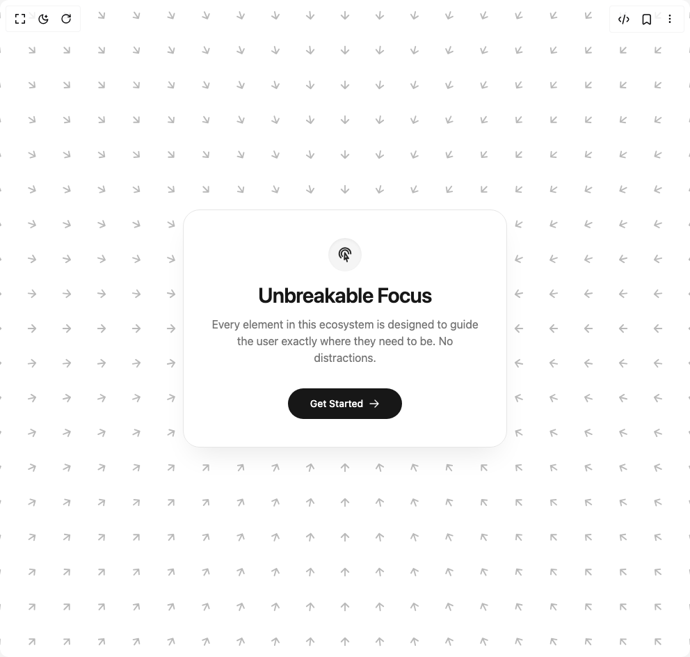

# Build Focus Hero in BuilderStudio

> Build this component in our Agentic IDE: [BuilderStudio](https://builderstudio.dev).
>
> Join the BuilderStudio community on [Discord](https://discord.gg/QdWeSGCqfe) and [Reddit](https://reddit.com/r/builderstudio).



## Component

- Author group: `arunjdass`
- Component: `focus-hero`
- Variant: `default`
- Rendered HTML snapshot: [`rendered.html`](rendered.html)

## BuilderStudio prompt

You are implementing a React component based on a component reference.

## Component identity

- Author: arunjdass
- Component slug: focus-hero
- Demo slug: default
- Title: focus-hero
- Description: 

## Goal

Recreate this component in a React + TypeScript + Tailwind CSS project. Preserve the visual layout, spacing, colors, border radius, shadows, interaction behavior, animation behavior, responsive behavior, and dark mode behavior shown in the rendered demo.

## Implementation requirements

- Use React and TypeScript.
- Use Tailwind CSS classes whenever possible.
- Keep the component self-contained unless the source files require helper components.
- If the source uses CSS variables, custom CSS, animations, or keyframes, include them.
- If the source uses external packages, list and use the required packages.
- Preserve accessibility attributes, button semantics, links, keyboard behavior, and ARIA attributes when visible in the source.
- Do not replace the component with a simplified placeholder.
- Return complete production-ready code.

## Dependencies

No reference metadata available.

## Rendered DOM snapshot

This is the rendered demo HTML extracted from the live preview. Use it to verify structure, class names, visible content, and layout.

```html
<div id="root"><div class="w-screen min-h-screen flex justify-center items-center"><div class="w-screen min-h-screen flex justify-center items-center"><div class="relative flex min-h-screen w-full items-center justify-center overflow-hidden bg-white dark:bg-neutral-950 selection:bg-neutral-900 selection:text-white dark:selection:bg-white dark:selection:text-neutral-900 transition-colors duration-500"><div class="pointer-events-none absolute inset-0 z-0 overflow-hidden"><div class="absolute text-neutral-900/30 dark:text-white/30" style="left: -54px; top: -78px; transform: translateX(-50%) translateY(-50%) rotate(45deg);"><svg width="18" height="18" viewBox="0 0 24 24" fill="none" stroke="currentColor" stroke-width="2.5" stroke-linecap="round" stroke-linejoin="round"><path d="M5 12h14M12 5l7 7-7 7"></path></svg></div><div class="absolute text-neutral-900/30 dark:text-white/30" style="left: -54px; top: -28px; transform: translateX(-50%) translateY(-50%) rotate(42.2737deg);"><svg width="18" height="18" viewBox="0 0 24 24" fill="none" stroke="currentColor" stroke-width="2.5" stroke-linecap="round" stroke-linejoin="round"><path d="M5 12h14M12 5l7 7-7 7"></path></svg></div><div class="absolute text-neutral-900/30 dark:text-white/30" style="left: -54px; top: 22px; transform: translateX(-50%) translateY(-50%) rotate(39.2894deg);"><svg width="18" height="18" viewBox="0 0 24 24" fill="none" stroke="currentColor" stroke-width="2.5" stroke-linecap="round" stroke-linejoin="round"><path d="M5 12h14M12 5l7 7-7 7"></path></svg></div><div class="absolute text-neutral-900/30 dark:text-white/30" style="left: -54px; top: 72px; transform: translateX(-50%) translateY(-50%) rotate(36.0274deg);"><svg width="18" height="18" viewBox="0 0 24 24" fill="none" stroke="currentColor" stroke-width="2.5" stroke-linecap="round" stroke-linejoin="round"><path d="M5 12h14M12 5l7 7-7 7"></path></svg></div><div class="absolute text-neutral-900/30 dark:text-white/30" style="left: -54px; top: 122px; transform: translateX(-50%) translateY(-50%) rotate(32.4712deg);"><svg width="18" height="18" viewBox="0 0 24 24" fill="none" stroke="currentColor" stroke-width="2.5" stroke-linecap="round" stroke-linejoin="round"><path d="M5 12h14M12 5l7 7-7 7"></path></svg></div><div class="absolute text-neutral-900/30 dark:text-white/30" style="left: -54px; top: 172px; transform: translateX(-50%) translateY(-50%) rotate(28.6105deg);"><svg width="18" height="18" viewBox="0 0 24 24" fill="none" stroke="currentColor" stroke-width="2.5" stroke-linecap="round" stroke-linejoin="round"><path d="M5 12h14M12 5l7 7-7 7"></path></svg></div><div class="absolute text-neutral-900/30 dark:text-white/30" style="left: -54px; top: 222px; transform: translateX(-50%) translateY(-50%) rotate(24.444deg);"><svg width="18" height="18" viewBox="0 0 24 24" fill="none" stroke="currentColor" stroke-width="2.5" stroke-linecap="round" stroke-linejoin="round"><path d="M5 12h14M12 5l7 7-7 7"></path></svg></div><div class="absolute text-neutral-900/30 dark:text-white/30" style="left: -54px; top: 272px; transform: translateX(-50%) translateY(-50%) rotate(19.9831deg);"><svg width="18" height="18" viewBox="0 0 24 24" fill="none" stroke="currentColor" stroke-width="2.5" stroke-linecap="round" stroke-linejoin="round"><path d="M5 12h14M12 5l7 7-7 7"></path></svg></div><div class="absolute text-neutral-900/30 dark:text-white/30" style="left: -54px; top: 322px; transform: translateX(-50%) translateY(-50%) rotate(15.2551deg);"><svg width="18" height="18" viewBox="0 0 24 24" fill="none" stroke="currentColor" stroke-width="2.5" stroke-linecap="round" stroke-linejoin="round"><path d="M5 12h14M12 5l7 7-7 7"></path></svg></div><div class="absolute text-neutral-900/30 dark:text-white/30" style="left: -54px; top: 372px; transform: translateX(-50%) translateY(-50%) rotate(10.3048deg);"><svg width="18" height="18" viewBox="0 0 24 24" fill="none" stroke="currentColor" stroke-width="2.5" stroke-linecap="round" stroke-linejoin="round"><path d="M5 12h14M12 5l7 7-7 7"></path></svg></div><div class="absolute text-neutral-900/30 dark:text-white/30" style="left: -54px; top: 422px; transform: translateX(-50%) translateY(-50%) rotate(5.19443deg);"><svg width="18" height="18" viewBox="0 0 24 24" fill="none" stroke="currentColor" stroke-width="2.5" stroke-linecap="round" stroke-linejoin="round"><path d="M5 12h14M12 5l7 7-7 7"></path></svg></div><div class="absolute text-neutral-900/30 dark:text-white/30" style="left: -54px; top: 472px; transform: translateX(-50%) translateY(-50%);"><svg width="18" height="18" viewBox="0 0 24 24" fill="none" stroke="currentColor" stroke-width="2.5" stroke-linecap="round" stroke-linejoin="round"><path d="M5 12h14M12 5l7 7-7 7"></path></svg></div><div class="absolute text-neutral-900/30 dark:text-white/30" style="left: -54px; top: 522px; transform: translateX(-50%) translateY(-50%) rotate(-5.19443deg);"><svg width="18" height="18" viewBox="0 0 24 24" fill="none" stroke="currentColor" stroke-width="2.5" stroke-linecap="round" stroke-linejoin="round"><path d="M5 12h14M12 5l7 7-7 7"></path></svg></div><div class="absolute text-neutral-900/30 dark:text-white/30" style="left: -54px; top: 572px; transform: translateX(-50%) translateY(-50%) rotate(-10.3048deg);"><svg width="18" height="18" viewBox="0 0 24 24" fill="none" stroke="currentColor" stroke-width="2.5" stroke-linecap="round" stroke-linejoin="round"><path d="M5 12h14M12 5l7 7-7 7"></path></svg></div><div class="absolute text-neutral-900/30 dark:text-white/30" style="left: -54px; top: 622px; transform: translateX(-50%) translateY(-50%) rotate(-15.2551deg);"><svg width="18" height="18" viewBox="0 0 24 24" fill="none" stroke="currentColor" stroke-width="2.5" stroke-linecap="round" stroke-linejoin="round"><path d="M5 12h14M12 5l7 7-7 7"></path></svg></div><div class="absolute text-neutral-900/30 dark:text-white/30" style="left: -54px; top: 672px; transform: translateX(-50%) translateY(-50%) rotate(-19.9831deg);"><svg width="18" height="18" viewBox="0 0 24 24" fill="none" stroke="currentColor" stroke-width="2.5" stroke-linecap="round" stroke-linejoin="round"><path d="M5 12h14M12 5l7 7-7 7"></path></svg></div><div class="absolute text-neutral-900/30 dark:text-white/30" style="left: -54px; top: 722px; transform: translateX(-50%) translateY(-50%) rotate(-24.444deg);"><svg width="18" height="18" viewBox="0 0 24 24" fill="none" stroke="currentColor" stroke-width="2.5" stroke-linecap="round" stroke-linejoin="round"><path d="M5 12h14M12 5l7 7-7 7"></path></svg></div><div class="absolute text-neutral-900/30 dark:text-white/30" style="left: -54px; top: 772px; transform: translateX(-50%) translateY(-50%) rotate(-28.6105deg);"><svg width="18" height="18" viewBox="0 0 24 24" fill="none" stroke="currentColor" stroke-width="2.5" stroke-linecap="round" stroke-linejoin="round"><path d="M5 12h14M12 5l7 7-7 7"></path></svg></div><div class="absolute text-neutral-900/30 dark:text-white/30" style="left: -54px; top: 822px; transform: translateX(-50%) translateY(-50%) rotate(-32.4712deg);"><svg width="18" height="18" viewBox="0 0 24 24" fill="none" stroke="currentColor" stroke-width="2.5" stroke-linecap="round" stroke-linejoin="round"><path d="M5 12h14M12 5l7 7-7 7"></path></svg></div><div class="absolute text-neutral-900/30 dark:text-white/30" style="left: -54px; top: 872px; transform: translateX(-50%) translateY(-50%) rotate(-36.0274deg);"><svg width="18" height="18" viewBox="0 0 24 24" fill="none" stroke="currentColor" stroke-width="2.5" stroke-linecap="round" stroke-linejoin="round"><path d="M5 12h14M12 5l7 7-7 7"></path></svg></div><div class="absolute text-neutral-900/30 dark:text-white/30" style="left: -54px; top: 922px; transform: translateX(-50%) translateY(-50%) rotate(-39.2894deg);"><svg width="18" height="18" viewBox="0 0 24 24" fill="none" stroke="currentColor" stroke-width="2.5" stroke-linecap="round" stroke-linejoin="round"><path d="M5 12h14M12 5l7 7-7 7"></path></svg></div><div class="absolute text-neutral-900/30 dark:text-white/30" style="left: -54px; top: 972px; transform: translateX(-50%) translateY(-50%) rotate(-42.2737deg);"><svg width="18" height="18" viewBox="0 0 24 24" fill="none" stroke="currentColor" stroke-width="2.5" stroke-linecap="round" stroke-linejoin="round"><path d="M5 12h14M12 5l7 7-7 7"></path></svg></div><div class="absolute text-neutral-900/30 dark:text-white/30" style="left: -54px; top: 1022px; transform: translateX(-50%) translateY(-50%) rotate(-45deg);"><svg width="18" height="18" viewBox="0 0 24 24" fill="none" stroke="currentColor" stroke-width="2.5" stroke-linecap="round" stroke-linejoin="round"><path d="M5 12h14M12 5l7 7-7 7"></path></svg></div><div class="absolute text-neutral-900/30 dark:text-white/30" style="left: -4px; top: -78px; transform: translateX(-50%) translateY(-50%) rotate(47.7263deg);"><svg width="18" height="18" viewBox="0 0 24 24" fill="none" stroke="currentColor" stroke-width="2.5" stroke-linecap="round" stroke-linejoin="round"><path d="M5 12h14M12 5l7 7-7 7"></path></svg></div><div class="absolute text-neutral-900/30 dark:text-white/30" style="left: -4px; top: -28px; transform: translateX(-50%) translateY(-50%) rotate(45deg);"><svg width="18" height="18" viewBox="0 0 24 24" fill="none" stroke="currentColor" stroke-width="2.5" stroke-linecap="round" stroke-linejoin="round"><path d="M5 12h14M12 5l7 7-7 7"></path></svg></div><div class="absolute text-neutral-900/30 dark:text-white/30" style="left: -4px; top: 22px; transform: translateX(-50%) translateY(-50%) rotate(41.9872deg);"><svg width="18" height="18" viewBox="0 0 24 24" fill="none" stroke="currentColor" stroke-width="2.5" stroke-linecap="round" stroke-linejoin="round"><path d="M5 12h14M12 5l7 7-7 7"></path></svg></div><div class="absolute text-neutral-900/30 dark:text-white/30" style="left: -4px; top: 72px; transform: translateX(-50%) translateY(-50%) rotate(38.6598deg);"><svg width="18" height="18" viewBox="0 0 24 24" fill="none" stroke="currentColor" stroke-width="2.5" stroke-linecap="round" stroke-linejoin="round"><path d="M5 12h14M12 5l7 7-7 7"></path></svg></div><div class="absolute text-neutral-900/30 dark:text-white/30" style="left: -4px; top: 122px; transform: translateX(-50%) translateY(-50%) rotate(34.992deg);"><svg width="18" height="18" viewBox="0 0 24 24" fill="none" stroke="currentColor" stroke-width="2.5" stroke-linecap="round" stroke-linejoin="round"><path d="M5 12h14M12 5l7 7-7 7"></path></svg></div><div class="absolute text-neutral-900/30 dark:text-white/30" style="left: -4px; top: 172px; transform: translateX(-50%) translateY(-50%) rotate(30.9638deg);"><svg width="18" height="18" viewBox="0 0 24 24" fill="none" stroke="currentColor" stroke-width="2.5" stroke-linecap="round" stroke-linejoin="round"><path d="M5 12h14M12 5l7 7-7 7"></path></svg></div><div class="absolute text-neutral-900/30 dark:text-white/30" style="left: -4px; top: 222px; transform: translateX(-50%) translateY(-50%) rotate(26.5651deg);"><svg width="18" height="18" viewBox="0 0 24 24" fill="none" stroke="currentColor" stroke-width="2.5" stroke-linecap="round" stroke-linejoin="round"><path d="M5 12h14M12 5l7 7-7 7"></path></svg></div><div class="absolute text-neutral-900/30 dark:text-white/30" style="left: -4px; top: 272px; transform: translateX(-50%) translateY(-50%) rotate(21.8014deg);"><svg width="18" height="18" viewBox="0 0 24 24" fill="none" stroke="currentColor" stroke-width="2.5" stroke-linecap="round" stroke-linejoin="round"><path d="M5 12h14M12 5l7 7-7 7"></path></svg></div><div class="absolute text-neutral-900/30 dark:text-white/30" style="left: -4px; top: 322px; transform: translateX(-50%) translateY(-50%) rotate(16.6992deg);"><svg width="18" height="18" viewBox="0 0 24 24" fill="none" stroke="currentColor" stroke-width="2.5" stroke-linecap="round" stroke-linejoin="round"><path d="M5 12h14M12 5l7 7-7 7"></path></svg></div><div class="absolute text-neutral-900/30 dark:text-white/30" style="left: -4px; top: 372px; transform: translateX(-50%) translateY(-50%) rotate(11.3099deg);"><svg width="18" height="18" viewBox="0 0 24 24" fill="none" stroke="currentColor" stroke-width="2.5" stroke-linecap="round" stroke-linejoin="round"><path d="M5 12h14M12 5l7 7-7 7"></path></svg></div><div class="absolute text-neutral-900/30 dark:text-white/30" style="left: -4px; top: 422px; transform: translateX(-50%) translateY(-50%) rotate(5.71059deg);"><svg width="18" height="18" viewBox="0 0 24 24" fill="none" stroke="currentColor" stroke-width="2.5" stroke-linecap="round" stroke-linejoin="round"><path d="M5 12h14M12 5l7 7-7 7"></path></svg></div><div class="absolute text-neutral-900/30 dark:text-white/30" style="left: -4px; top: 472px; transform: translateX(-50%) translateY(-50%);"><svg width="18" height="18" viewBox="0 0 24 24" fill="none" stroke="currentColor" stroke-width="2.5" stroke-linecap="round" stroke-linejoin="round"><path d="M5 12h14M12 5l7 7-7 7"></path></svg></div><div class="absolute text-neutral-900/30 dark:text-white/30" style="left: -4px; top: 522px; transform: translateX(-50%) translateY(-50%) rotate(-5.71059deg);"><svg width="18" height="18" viewBox="0 0 24 24" fill="none" stroke="currentColor" stroke-width="2.5" stroke-linecap="round" stroke-linejoin="round"><path d="M5 12h14M12 5l7 7-7 7"></path></svg></div><div class="absolute text-neutral-900/30 dark:text-white/30" style="left: -4px; top: 572px; transform: translateX(-50%) translateY(-50%) rotate(-11.3099deg);"><svg width="18" height="18" viewBox="0 0 24 24" fill="none" stroke="currentColor" stroke-width="2.5" stroke-linecap="round" stroke-linejoin="round"><path d="M5 12h14M12 5l7 7-7 7"></path></svg></div><div class="absolute text-neutral-900/30 dark:text-white/30" style="left: -4px; top: 622px; transform: translateX(-50%) translateY(-50%) rotate(-16.6992deg);"><svg width="18" height="18" viewBox="0 0 24 24" fill="none" stroke="currentColor" stroke-width="2.5" stroke-linecap="round" stroke-linejoin="round"><path d="M5 12h14M12 5l7 7-7 7"></path></svg></div><div class="absolute text-neutral-900/30 dark:text-white/30" style="left: -4px; top: 672px; transform: translateX(-50%) translateY(-50%) rotate(-21.8014deg);"><svg width="18" height="18" viewBox="0 0 24 24" fill="none" stroke="currentColor" stroke-width="2.5" stroke-linecap="round" stroke-linejoin="round"><path d="M5 12h14M12 5l7 7-7 7"></path></svg></div><div class="absolute text-neutral-900/30 dark:text-white/30" style="left: -4px; top: 722px; transform: translateX(-50%) translateY(-50%) rotate(-26.5651deg);"><svg width="18" height="18" viewBox="0 0 24 24" fill="none" stroke="currentColor" stroke-width="2.5" stroke-linecap="round" stroke-linejoin="round"><path d="M5 12h14M12 5l7 7-7 7"></path></svg></div><div class="absolute text-neutral-900/30 dark:text-white/30" style="left: -4px; top: 772px; transform: translateX(-50%) translateY(-50%) rotate(-30.9638deg);"><svg width="18" height="18" viewBox="0 0 24 24" fill="none" stroke="currentColor" stroke-width="2.5" stroke-linecap="round" stroke-linejoin="round"><path d="M5 12h14M12 5l7 7-7 7"></path></svg></div><div class="absolute text-neutral-900/30 dark:text-white/30" style="left: -4px; top: 822px; transform: translateX(-50%) translateY(-50%) rotate(-34.992deg);"><svg width="18" height="18" viewBox="0 0 24 24" fill="none" stroke="currentColor" stroke-width="2.5" stroke-linecap="round" stroke-linejoin="round"><path d="M5 12h14M12 5l7 7-7 7"></path></svg></div><div class="absolute text-neutral-900/30 dark:text-white/30" style="left: -4px; top: 872px; transform: translateX(-50%) translateY(-50%) rotate(-38.6598deg);"><svg width="18" height="18" viewBox="0 0 24 24" fill="none" stroke="currentColor" stroke-width="2.5" stroke-linecap="round" stroke-linejoin="round"><path d="M5 12h14M12 5l7 7-7 7"></path></svg></div><div class="absolute text-neutral-900/30 dark:text-white/30" style="left: -4px; top: 922px; transform: translateX(-50%) translateY(-50%) rotate(-41.9872deg);"><svg width="18" height="18" viewBox="0 0 24 24" fill="none" stroke="currentColor" stroke-width="2.5" stroke-linecap="round" stroke-linejoin="round"><path d="M5 12h14M12 5l7 7-7 7"></path></svg></div><div class="absolute text-neutral-900/30 dark:text-white/30" style="left: -4px; top: 972px; transform: translateX(-50%) translateY(-50%) rotate(-45deg);"><svg width="18" height="18" viewBox="0 0 24 24" fill="none" stroke="currentColor" stroke-width="2.5" stroke-linecap="round" stroke-linejoin="round"><path d="M5 12h14M12 5l7 7-7 7"></path></svg></div><div class="absolute text-neutral-900/30 dark:text-white/30" style="left: -4px; top: 1022px; transform: translateX(-50%) translateY(-50%) rotate(-47.7263deg);"><svg width="18" height="18" viewBox="0 0 24 24" fill="none" stroke="currentColor" stroke-width="2.5" stroke-linecap="round" stroke-linejoin="round"><path d="M5 12h14M12 5l7 7-7 7"></path></svg></div><div class="absolute text-neutral-900/30 dark:text-white/30" style="left: 46px; top: -78px; transform: translateX(-50%) translateY(-50%) rotate(50.7106deg);"><svg width="18" height="18" viewBox="0 0 24 24" fill="none" stroke="currentColor" stroke-width="2.5" stroke-linecap="round" stroke-linejoin="round"><path d="M5 12h14M12 5l7 7-7 7"></path></svg></div><div class="absolute text-neutral-900/30 dark:text-white/30" style="left: 46px; top: -28px; transform: translateX(-50%) translateY(-50%) rotate(48.0128deg);"><svg width="18" height="18" viewBox="0 0 24 24" fill="none" stroke="currentColor" stroke-width="2.5" stroke-linecap="round" stroke-linejoin="round"><path d="M5 12h14M12 5l7 7-7 7"></path></svg></div><div class="absolute text-neutral-900/30 dark:text-white/30" style="left: 46px; top: 22px; transform: translateX(-50%) translateY(-50%) rotate(45deg);"><svg width="18" height="18" viewBox="0 0 24 24" fill="none" stroke="currentColor" stroke-width="2.5" stroke-linecap="round" stroke-linejoin="round"><path d="M5 12h14M12 5l7 7-7 7"></path></svg></div><div class="absolute text-neutral-900/30 dark:text-white/30" style="left: 46px; top: 72px; transform: translateX(-50%) translateY(-50%) rotate(41.6335deg);"><svg width="18" height="18" viewBox="0 0 24 24" fill="none" stroke="currentColor" stroke-width="2.5" stroke-linecap="round" stroke-linejoin="round"><path d="M5 12h14M12 5l7 7-7 7"></path></svg></div><div class="absolute text-neutral-900/30 dark:text-white/30" style="left: 46px; top: 122px; transform: translateX(-50%) translateY(-50%) rotate(37.875deg);"><svg width="18" height="18" viewBox="0 0 24 24" fill="none" stroke="currentColor" stroke-width="2.5" stroke-linecap="round" stroke-linejoin="round"><path d="M5 12h14M12 5l7 7-7 7"></path></svg></div><div class="absolute text-neutral-900/30 dark:text-white/30" style="left: 46px; top: 172px; transform: translateX(-50%) translateY(-50%) rotate(33.6901deg);"><svg width="18" height="18" viewBox="0 0 24 24" fill="none" stroke="currentColor" stroke-width="2.5" stroke-linecap="round" stroke-linejoin="round"><path d="M5 12h14M12 5l7 7-7 7"></path></svg></div><div class="absolute text-neutral-900/30 dark:text-white/30" style="left: 46px; top: 222px; transform: translateX(-50%) translateY(-50%) rotate(29.0546deg);"><svg width="18" height="18" viewBox="0 0 24 24" fill="none" stroke="currentColor" stroke-width="2.5" stroke-linecap="round" stroke-linejoin="round"><path d="M5 12h14M12 5l7 7-7 7"></path></svg></div><div class="absolute text-neutral-900/30 dark:text-white/30" style="left: 46px; top: 272px; transform: translateX(-50%) translateY(-50%) rotate(23.9625deg);"><svg width="18" height="18" viewBox="0 0 24 24" fill="none" stroke="currentColor" stroke-width="2.5" stroke-linecap="round" stroke-linejoin="round"><path d="M5 12h14M12 5l7 7-7 7"></path></svg></div><div class="absolute text-neutral-900/30 dark:text-white/30" style="left: 46px; top: 322px; transform: translateX(-50%) translateY(-50%) rotate(18.4349deg);"><svg width="18" height="18" viewBox="0 0 24 24" fill="none" stroke="currentColor" stroke-width="2.5" stroke-linecap="round" stroke-linejoin="round"><path d="M5 12h14M12 5l7 7-7 7"></path></svg></div><div class="absolute text-neutral-900/30 dark:text-white/30" style="left: 46px; top: 372px; transform: translateX(-50%) translateY(-50%) rotate(12.5288deg);"><svg width="18" height="18" viewBox="0 0 24 24" fill="none" stroke="currentColor" stroke-width="2.5" stroke-linecap="round" stroke-linejoin="round"><path d="M5 12h14M12 5l7 7-7 7"></path></svg></div><div class="absolute text-neutral-900/30 dark:text-white/30" style="left: 46px; top: 422px; transform: translateX(-50%) translateY(-50%) rotate(6.34019deg);"><svg width="18" height="18" viewBox="0 0 24 24" fill="none" stroke="currentColor" stroke-width="2.5" stroke-linecap="round" stroke-linejoin="round"><path d="M5 12h14M12 5l7 7-7 7"></path></svg></div><div class="absolute text-neutral-900/30 dark:text-white/30" style="left: 46px; top: 472px; transform: translateX(-50%) translateY(-50%);"><svg width="18" height="18" viewBox="0 0 24 24" fill="none" stroke="currentColor" stroke-width="2.5" stroke-linecap="round" stroke-linejoin="round"><path d="M5 12h14M12 5l7 7-7 7"></path></svg></div><div class="absolute text-neutral-900/30 dark:text-white/30" style="left: 46px; top: 522px; transform: translateX(-50%) translateY(-50%) rotate(-6.34019deg);"><svg width="18" height="18" viewBox="0 0 24 24" fill="none" stroke="currentColor" stroke-width="2.5" stroke-linecap="round" stroke-linejoin="round"><path d="M5 12h14M12 5l7 7-7 7"></path></svg></div><div class="absolute text-neutral-900/30 dark:text-white/30" style="left: 46px; top: 572px; transform: translateX(-50%) translateY(-50%) rotate(-12.5288deg);"><svg width="18" height="18" viewBox="0 0 24 24" fill="none" stroke="currentColor" stroke-width="2.5" stroke-linecap="round" stroke-linejoin="round"><path d="M5 12h14M12 5l7 7-7 7"></path></svg></div><div class="absolute text-neutral-900/30 dark:text-white/30" style="left: 46px; top: 622px; transform: translateX(-50%) translateY(-50%) rotate(-18.4349deg);"><svg width="18" height="18" viewBox="0 0 24 24" fill="none" stroke="currentColor" stroke-width="2.5" stroke-linecap="round" stroke-linejoin="round"><path d="M5 12h14M12 5l7 7-7 7"></path></svg></div><div class="absolute text-neutral-900/30 dark:text-white/30" style="left: 46px; top: 672px; transform: translateX(-50%) translateY(-50%) rotate(-23.9625deg);"><svg width="18" height="18" viewBox="0 0 24 24" fill="none" stroke="currentColor" stroke-width="2.5" stroke-linecap="round" stroke-linejoin="round"><path d="M5 12h14M12 5l7 7-7 7"></path></svg></div><div class="absolute text-neutral-900/30 dark:text-white/30" style="left: 46px; top: 722px; transform: translateX(-50%) translateY(-50%) rotate(-29.0546deg);"><svg width="18" height="18" viewBox="0 0 24 24" fill="none" stroke="currentColor" stroke-width="2.5" stroke-linecap="round" stroke-linejoin="round"><path d="M5 12h14M12 5l7 7-7 7"></path></svg></div><div class="absolute text-neutral-900/30 dark:text-white/30" style="left: 46px; top: 772px; transform: translateX(-50%) translateY(-50%) rotate(-33.6901deg);"><svg width="18" height="18" viewBox="0 0 24 24" fill="none" stroke="currentColor" stroke-width="2.5" stroke-linecap="round" stroke-linejoin="round"><path d="M5 12h14M12 5l7 7-7 7"></path></svg></div><div class="absolute text-neutral-900/30 dark:text-white/30" style="left: 46px; top: 822px; transform: translateX(-50%) translateY(-50%) rotate(-37.875deg);"><svg width="18" height="18" viewBox="0 0 24 24" fill="none" stroke="currentColor" stroke-width="2.5" stroke-linecap="round" stroke-linejoin="round"><path d="M5 12h14M12 5l7 7-7 7"></path></svg></div><div class="absolute text-neutral-900/30 dark:text-white/30" style="left: 46px; top: 872px; transform: translateX(-50%) translateY(-50%) rotate(-41.6335deg);"><svg width="18" height="18" viewBox="0 0 24 24" fill="none" stroke="currentColor" stroke-width="2.5" stroke-linecap="round" stroke-linejoin="round"><path d="M5 12h14M12 5l7 7-7 7"></path></svg></div><div class="absolute text-neutral-900/30 dark:text-white/30" style="left: 46px; top: 922px; transform: translateX(-50%) translateY(-50%) rotate(-45deg);"><svg width="18" height="18" viewBox="0 0 24 24" fill="none" stroke="currentColor" stroke-width="2.5" stroke-linecap="round" stroke-linejoin="round"><path d="M5 12h14M12 5l7 7-7 7"></path></svg></div><div class="absolute text-neutral-900/30 dark:text-white/30" style="left: 46px; top: 972px; transform: translateX(-50%) translateY(-50%) rotate(-48.0128deg);"><svg width="18" height="18" viewBox="0 0 24 24" fill="none" stroke="currentColor" stroke-width="2.5" stroke-linecap="round" stroke-linejoin="round"><path d="M5 12h14M12 5l7 7-7 7"></path></svg></div><div class="absolute text-neutral-900/30 dark:text-white/30" style="left: 46px; top: 1022px; transform: translateX(-50%) translateY(-50%) rotate(-50.7106deg);"><svg width="18" height="18" viewBox="0 0 24 24" fill="none" stroke="currentColor" stroke-width="2.5" stroke-linecap="round" stroke-linejoin="round"><path d="M5 12h14M12 5l7 7-7 7"></path></svg></div><div class="absolute text-neutral-900/30 dark:text-white/30" style="left: 96px; top: -78px; transform: translateX(-50%) translateY(-50%) rotate(53.9726deg);"><svg width="18" height="18" viewBox="0 0 24 24" fill="none" stroke="currentColor" stroke-width="2.5" stroke-linecap="round" stroke-linejoin="round"><path d="M5 12h14M12 5l7 7-7 7"></path></svg></div><div class="absolute text-neutral-900/30 dark:text-white/30" style="left: 96px; top: -28px; transform: translateX(-50%) translateY(-50%) rotate(51.3402deg);"><svg width="18" height="18" viewBox="0 0 24 24" fill="none" stroke="currentColor" stroke-width="2.5" stroke-linecap="round" stroke-linejoin="round"><path d="M5 12h14M12 5l7 7-7 7"></path></svg></div><div class="absolute text-neutral-900/30 dark:text-white/30" style="left: 96px; top: 22px; transform: translateX(-50%) translateY(-50%) rotate(48.3665deg);"><svg width="18" height="18" viewBox="0 0 24 24" fill="none" stroke="currentColor" stroke-width="2.5" stroke-linecap="round" stroke-linejoin="round"><path d="M5 12h14M12 5l7 7-7 7"></path></svg></div><div class="absolute text-neutral-900/30 dark:text-white/30" style="left: 96px; top: 72px; transform: translateX(-50%) translateY(-50%) rotate(45deg);"><svg width="18" height="18" viewBox="0 0 24 24" fill="none" stroke="currentColor" stroke-width="2.5" stroke-linecap="round" stroke-linejoin="round"><path d="M5 12h14M12 5l7 7-7 7"></path></svg></div><div class="absolute text-neutral-900/30 dark:text-white/30" style="left: 96px; top: 122px; transform: translateX(-50%) translateY(-50%) rotate(41.1859deg);"><svg width="18" height="18" viewBox="0 0 24 24" fill="none" stroke="currentColor" stroke-width="2.5" stroke-linecap="round" stroke-linejoin="round"><path d="M5 12h14M12 5l7 7-7 7"></path></svg></div><div class="absolute text-neutral-900/30 dark:text-white/30" style="left: 96px; top: 172px; transform: translateX(-50%) translateY(-50%) rotate(36.8699deg);"><svg width="18" height="18" viewBox="0 0 24 24" fill="none" stroke="currentColor" stroke-width="2.5" stroke-linecap="round" stroke-linejoin="round"><path d="M5 12h14M12 5l7 7-7 7"></path></svg></div><div class="absolute text-neutral-900/30 dark:text-white/30" style="left: 96px; top: 222px; transform: translateX(-50%) translateY(-50%) rotate(32.0054deg);"><svg width="18" height="18" viewBox="0 0 24 24" fill="none" stroke="currentColor" stroke-width="2.5" stroke-linecap="round" stroke-linejoin="round"><path d="M5 12h14M12 5l7 7-7 7"></path></svg></div><div class="absolute text-neutral-900/30 dark:text-white/30" style="left: 96px; top: 272px; transform: translateX(-50%) translateY(-50%) rotate(26.5651deg);"><svg width="18" height="18" viewBox="0 0 24 24" fill="none" stroke="currentColor" stroke-width="2.5" stroke-linecap="round" stroke-linejoin="round"><path d="M5 12h14M12 5l7 7-7 7"></path></svg></div><div class="absolute text-neutral-900/30 dark:text-white/30" style="left: 96px; top: 322px; transform: translateX(-50%) translateY(-50%) rotate(20.556deg);"><svg width="18" height="18" viewBox="0 0 24 24" fill="none" stroke="currentColor" stroke-width="2.5" stroke-linecap="round" stroke-linejoin="round"><path d="M5 12h14M12 5l7 7-7 7"></path></svg></div><div class="absolute text-neutral-900/30 dark:text-white/30" style="left: 96px; top: 372px; transform: translateX(-50%) translateY(-50%) rotate(14.0362deg);"><svg width="18" height="18" viewBox="0 0 24 24" fill="none" stroke="currentColor" stroke-width="2.5" stroke-linecap="round" stroke-linejoin="round"><path d="M5 12h14M12 5l7 7-7 7"></path></svg></div><div class="absolute text-neutral-900/30 dark:text-white/30" style="left: 96px; top: 422px; transform: translateX(-50%) translateY(-50%) rotate(7.12502deg);"><svg width="18" height="18" viewBox="0 0 24 24" fill="none" stroke="currentColor" stroke-width="2.5" stroke-linecap="round" stroke-linejoin="round"><path d="M5 12h14M12 5l7 7-7 7"></path></svg></div><div class="absolute text-neutral-900/30 dark:text-white/30" style="left: 96px; top: 472px; transform: translateX(-50%) translateY(-50%);"><svg width="18" height="18" viewBox="0 0 24 24" fill="none" stroke="currentColor" stroke-width="2.5" stroke-linecap="round" stroke-linejoin="round"><path d="M5 12h14M12 5l7 7-7 7"></path></svg></div><div class="absolute text-neutral-900/30 dark:text-white/30" style="left: 96px; top: 522px; transform: translateX(-50%) translateY(-50%) rotate(-7.12502deg);"><svg width="18" height="18" viewBox="0 0 24 24" fill="none" stroke="currentColor" stroke-width="2.5" stroke-linecap="round" stroke-linejoin="round"><path d="M5 12h14M12 5l7 7-7 7"></path></svg></div><div class="absolute text-neutral-900/30 dark:text-white/30" style="left: 96px; top: 572px; transform: translateX(-50%) translateY(-50%) rotate(-14.0362deg);"><svg width="18" height="18" viewBox="0 0 24 24" fill="none" stroke="currentColor" stroke-width="2.5" stroke-linecap="round" stroke-linejoin="round"><path d="M5 12h14M12 5l7 7-7 7"></path></svg></div><div class="absolute text-neutral-900/30 dark:text-white/30" style="left: 96px; top: 622px; transform: translateX(-50%) translateY(-50%) rotate(-20.556deg);"><svg width="18" height="18" viewBox="0 0 24 24" fill="none" stroke="currentColor" stroke-width="2.5" stroke-linecap="round" stroke-linejoin="round"><path d="M5 12h14M12 5l7 7-7 7"></path></svg></div><div class="absolute text-neutral-900/30 dark:text-white/30" style="left: 96px; top: 672px; transform: translateX(-50%) translateY(-50%) rotate(-26.5651deg);"><svg width="18" height="18" viewBox="0 0 24 24" fill="none" stroke="currentColor" stroke-width="2.5" stroke-linecap="round" stroke-linejoin="round"><path d="M5 12h14M12 5l7 7-7 7"></path></svg></div><div class="absolute text-neutral-900/30 dark:text-white/30" style="left: 96px; top: 722px; transform: translateX(-50%) translateY(-50%) rotate(-32.0054deg);"><svg width="18" height="18" viewBox="0 0 24 24" fill="none" stroke="currentColor" stroke-width="2.5" stroke-linecap="round" stroke-linejoin="round"><path d="M5 12h14M12 5l7 7-7 7"></path></svg></div><div class="absolute text-neutral-900/30 dark:text-white/30" style="left: 96px; top: 772px; transform: translateX(-50%) translateY(-50%) rotate(-36.8699deg);"><svg width="18" height="18" viewBox="0 0 24 24" fill="none" stroke="currentColor" stroke-width="2.5" stroke-linecap="round" stroke-linejoin="round"><path d="M5 12h14M12 5l7 7-7 7"></path></svg></div><div class="absolute text-neutral-900/30 dark:text-white/30" style="left: 96px; top: 822px; transform: translateX(-50%) translateY(-50%) rotate(-41.1859deg);"><svg width="18" height="18" viewBox="0 0 24 24" fill="none" stroke="currentColor" stroke-width="2.5" stroke-linecap="round" stroke-linejoin="round"><path d="M5 12h14M12 5l7 7-7 7"></path></svg></div><div class="absolute text-neutral-900/30 dark:text-white/30" style="left: 96px; top: 872px; transform: translateX(-50%) translateY(-50%) rotate(-45deg);"><svg width="18" height="18" viewBox="0 0 24 24" fill="none" stroke="currentColor" stroke-width="2.5" stroke-linecap="round" stroke-linejoin="round"><path d="M5 12h14M12 5l7 7-7 7"></path></svg></div><div class="absolute text-neutral-900/30 dark:text-white/30" style="left: 96px; top: 922px; transform: translateX(-50%) translateY(-50%) rotate(-48.3665deg);"><svg width="18" height="18" viewBox="0 0 24 24" fill="none" stroke="currentColor" stroke-width="2.5" stroke-linecap="round" stroke-linejoin="round"><path d="M5 12h14M12 5l7 7-7 7"></path></svg></div><div class="absolute text-neutral-900/30 dark:text-white/30" style="left: 96px; top: 972px; transform: translateX(-50%) translateY(-50%) rotate(-51.3402deg);"><svg width="18" height="18" viewBox="0 0 24 24" fill="none" stroke="currentColor" stroke-width="2.5" stroke-linecap="round" stroke-linejoin="round"><path d="M5 12h14M12 5l7 7-7 7"></path></svg></div><div class="absolute text-neutral-900/30 dark:text-white/30" style="left: 96px; top: 1022px; transform: translateX(-50%) translateY(-50%) rotate(-53.9726deg);"><svg width="18" height="18" viewBox="0 0 24 24" fill="none" stroke="currentColor" stroke-width="2.5" stroke-linecap="round" stroke-linejoin="round"><path d="M5 12h14M12 5l7 7-7 7"></path></svg></div><div class="absolute text-neutral-900/30 dark:text-white/30" style="left: 146px; top: -78px; transform: translateX(-50%) translateY(-50%) rotate(57.5288deg);"><svg width="18" height="18" viewBox="0 0 24 24" fill="none" stroke="currentColor" stroke-width="2.5" stroke-linecap="round" stroke-linejoin="round"><path d="M5 12h14M12 5l7 7-7 7"></path></svg></div><div class="absolute text-neutral-900/30 dark:text-white/30" style="left: 146px; top: -28px; transform: translateX(-50%) translateY(-50%) rotate(55.008deg);"><svg width="18" height="18" viewBox="0 0 24 24" fill="none" stroke="currentColor" stroke-width="2.5" stroke-linecap="round" stroke-linejoin="round"><path d="M5 12h14M12 5l7 7-7 7"></path></svg></div><div class="absolute text-neutral-900/30 dark:text-white/30" style="left: 146px; top: 22px; transform: translateX(-50%) translateY(-50%) rotate(52.125deg);"><svg width="18" height="18" viewBox="0 0 24 24" fill="none" stroke="currentColor" stroke-width="2.5" stroke-linecap="round" stroke-linejoin="round"><path d="M5 12h14M12 5l7 7-7 7"></path></svg></div><div class="absolute text-neutral-900/30 dark:text-white/30" style="left: 146px; top: 72px; transform: translateX(-50%) translateY(-50%) rotate(48.8141deg);"><svg width="18" height="18" viewBox="0 0 24 24" fill="none" stroke="currentColor" stroke-width="2.5" stroke-linecap="round" stroke-linejoin="round"><path d="M5 12h14M12 5l7 7-7 7"></path></svg></div><div class="absolute text-neutral-900/30 dark:text-white/30" style="left: 146px; top: 122px; transform: translateX(-50%) translateY(-50%) rotate(45deg);"><svg width="18" height="18" viewBox="0 0 24 24" fill="none" stroke="currentColor" stroke-width="2.5" stroke-linecap="round" stroke-linejoin="round"><path d="M5 12h14M12 5l7 7-7 7"></path></svg></div><div class="absolute text-neutral-900/30 dark:text-white/30" style="left: 146px; top: 172px; transform: translateX(-50%) translateY(-50%) rotate(40.6013deg);"><svg width="18" height="18" viewBox="0 0 24 24" fill="none" stroke="currentColor" stroke-width="2.5" stroke-linecap="round" stroke-linejoin="round"><path d="M5 12h14M12 5l7 7-7 7"></path></svg></div><div class="absolute text-neutral-900/30 dark:text-white/30" style="left: 146px; top: 222px; transform: translateX(-50%) translateY(-50%) rotate(35.5377deg);"><svg width="18" height="18" viewBox="0 0 24 24" fill="none" stroke="currentColor" stroke-width="2.5" stroke-linecap="round" stroke-linejoin="round"><path d="M5 12h14M12 5l7 7-7 7"></path></svg></div><div class="absolute text-neutral-900/30 dark:text-white/30" style="left: 146px; top: 272px; transform: translateX(-50%) translateY(-50%) rotate(29.7449deg);"><svg width="18" height="18" viewBox="0 0 24 24" fill="none" stroke="currentColor" stroke-width="2.5" stroke-linecap="round" stroke-linejoin="round"><path d="M5 12h14M12 5l7 7-7 7"></path></svg></div><div class="absolute text-neutral-900/30 dark:text-white/30" style="left: 146px; top: 322px; transform: translateX(-50%) translateY(-50%) rotate(23.1986deg);"><svg width="18" height="18" viewBox="0 0 24 24" fill="none" stroke="currentColor" stroke-width="2.5" stroke-linecap="round" stroke-linejoin="round"><path d="M5 12h14M12 5l7 7-7 7"></path></svg></div><div class="absolute text-neutral-900/30 dark:text-white/30" style="left: 146px; top: 372px; transform: translateX(-50%) translateY(-50%) rotate(15.9454deg);"><svg width="18" height="18" viewBox="0 0 24 24" fill="none" stroke="currentColor" stroke-width="2.5" stroke-linecap="round" stroke-linejoin="round"><path d="M5 12h14M12 5l7 7-7 7"></path></svg></div><div class="absolute text-neutral-900/30 dark:text-white/30" style="left: 146px; top: 422px; transform: translateX(-50%) translateY(-50%) rotate(8.1301deg);"><svg width="18" height="18" viewBox="0 0 24 24" fill="none" stroke="currentColor" stroke-width="2.5" stroke-linecap="round" stroke-linejoin="round"><path d="M5 12h14M12 5l7 7-7 7"></path></svg></div><div class="absolute text-neutral-900/30 dark:text-white/30" style="left: 146px; top: 472px; transform: translateX(-50%) translateY(-50%);"><svg width="18" height="18" viewBox="0 0 24 24" fill="none" stroke="currentColor" stroke-width="2.5" stroke-linecap="round" stroke-linejoin="round"><path d="M5 12h14M12 5l7 7-7 7"></path></svg></div><div class="absolute text-neutral-900/30 dark:text-white/30" style="left: 146px; top: 522px; transform: translateX(-50%) translateY(-50%) rotate(-8.1301deg);"><svg width="18" height="18" viewBox="0 0 24 24" fill="none" stroke="currentColor" stroke-width="2.5" stroke-linecap="round" stroke-linejoin="round"><path d="M5 12h14M12 5l7 7-7 7"></path></svg></div><div class="absolute text-neutral-900/30 dark:text-white/30" style="left: 146px; top: 572px; transform: translateX(-50%) translateY(-50%) rotate(-15.9454deg);"><svg width="18" height="18" viewBox="0 0 24 24" fill="none" stroke="currentColor" stroke-width="2.5" stroke-linecap="round" stroke-linejoin="round"><path d="M5 12h14M12 5l7 7-7 7"></path></svg></div><div class="absolute text-neutral-900/30 dark:text-white/30" style="left: 146px; top: 622px; transform: translateX(-50%) translateY(-50%) rotate(-23.1986deg);"><svg width="18" height="18" viewBox="0 0 24 24" fill="none" stroke="currentColor" stroke-width="2.5" stroke-linecap="round" stroke-linejoin="round"><path d="M5 12h14M12 5l7 7-7 7"></path></svg></div><div class="absolute text-neutral-900/30 dark:text-white/30" style="left: 146px; top: 672px; transform: translateX(-50%) translateY(-50%) rotate(-29.7449deg);"><svg width="18" height="18" viewBox="0 0 24 24" fill="none" stroke="currentColor" stroke-width="2.5" stroke-linecap="round" stroke-linejoin="round"><path d="M5 12h14M12 5l7 7-7 7"></path></svg></div><div class="absolute text-neutral-900/30 dark:text-white/30" style="left: 146px; top: 722px; transform: translateX(-50%) translateY(-50%) rotate(-35.5377deg);"><svg width="18" height="18" viewBox="0 0 24 24" fill="none" stroke="currentColor" stroke-width="2.5" stroke-linecap="round" stroke-linejoin="round"><path d="M5 12h14M12 5l7 7-7 7"></path></svg></div><div class="absolute text-neutral-900/30 dark:text-white/30" style="left: 146px; top: 772px; transform: translateX(-50%) translateY(-50%) rotate(-40.6013deg);"><svg width="18" height="18" viewBox="0 0 24 24" fill="none" stroke="currentColor" stroke-width="2.5" stroke-linecap="round" stroke-linejoin="round"><path d="M5 12h14M12 5l7 7-7 7"></path></svg></div><div class="absolute text-neutral-900/30 dark:text-white/30" style="left: 146px; top: 822px; transform: translateX(-50%) translateY(-50%) rotate(-45deg);"><svg width="18" height="18" viewBox="0 0 24 24" fill="none" stroke="currentColor" stroke-width="2.5" stroke-linecap="round" stroke-linejoin="round"><path d="M5 12h14M12 5l7 7-7 7"></path></svg></div><div class="absolute text-neutral-900/30 dark:text-white/30" style="left: 146px; top: 872px; transform: translateX(-50%) translateY(-50%) rotate(-48.8141deg);"><svg width="18" height="18" viewBox="0 0 24 24" fill="none" stroke="currentColor" stroke-width="2.5" stroke-linecap="round" stroke-linejoin="round"><path d="M5 12h14M12 5l7 7-7 7"></path></svg></div><div class="absolute text-neutral-900/30 dark:text-white/30" style="left: 146px; top: 922px; transform: translateX(-50%) translateY(-50%) rotate(-52.125deg);"><svg width="18" height="18" viewBox="0 0 24 24" fill="none" stroke="currentColor" stroke-width="2.5" stroke-linecap="round" stroke-linejoin="round"><path d="M5 12h14M12 5l7 7-7 7"></path></svg></div><div class="absolute text-neutral-900/30 dark:text-white/30" style="left: 146px; top: 972px; transform: translateX(-50%) translateY(-50%) rotate(-55.008deg);"><svg width="18" height="18" viewBox="0 0 24 24" fill="none" stroke="currentColor" stroke-width="2.5" stroke-linecap="round" stroke-linejoin="round"><path d="M5 12h14M12 5l7 7-7 7"></path></svg></div><div class="absolute text-neutral-900/30 dark:text-white/30" style="left: 146px; top: 1022px; transform: translateX(-50%) translateY(-50%) rotate(-57.5288deg);"><svg width="18" height="18" viewBox="0 0 24 24" fill="none" stroke="currentColor" stroke-width="2.5" stroke-linecap="round" stroke-linejoin="round"><path d="M5 12h14M12 5l7 7-7 7"></path></svg></div><div class="absolute text-neutral-900/30 dark:text-white/30" style="left: 196px; top: -78px; transform: translateX(-50%) translateY(-50%) rotate(61.3895deg);"><svg width="18" height="18" viewBox="0 0 24 24" fill="none" stroke="currentColor" stroke-width="2.5" stroke-linecap="round" stroke-linejoin="round"><path d="M5 12h14M12 5l7 7-7 7"></path></svg></div><div class="absolute text-neutral-900/30 dark:text-white/30" style="left: 196px; top: -28px; transform: translateX(-50%) translateY(-50%) rotate(59.0362deg);"><svg width="18" height="18" viewBox="0 0 24 24" fill="none" stroke="currentColor" stroke-width="2.5" stroke-linecap="round" stroke-linejoin="round"><path d="M5 12h14M12 5l7 7-7 7"></path></svg></div><div class="absolute text-neutral-900/30 dark:text-white/30" style="left: 196px; top: 22px; transform: translateX(-50%) translateY(-50%) rotate(56.3099deg);"><svg width="18" height="18" viewBox="0 0 24 24" fill="none" stroke="currentColor" stroke-width="2.5" stroke-linecap="round" stroke-linejoin="round"><path d="M5 12h14M12 5l7 7-7 7"></path></svg></div><div class="absolute text-neutral-900/30 dark:text-white/30" style="left: 196px; top: 72px; transform: translateX(-50%) translateY(-50%) rotate(53.1301deg);"><svg width="18" height="18" viewBox="0 0 24 24" fill="none" stroke="currentColor" stroke-width="2.5" stroke-linecap="round" stroke-linejoin="round"><path d="M5 12h14M12 5l7 7-7 7"></path></svg></div><div class="absolute text-neutral-900/30 dark:text-white/30" style="left: 196px; top: 122px; transform: translateX(-50%) translateY(-50%) rotate(49.3987deg);"><svg width="18" height="18" viewBox="0 0 24 24" fill="none" stroke="currentColor" stroke-width="2.5" stroke-linecap="round" stroke-linejoin="round"><path d="M5 12h14M12 5l7 7-7 7"></path></svg></div><div class="absolute text-neutral-900/30 dark:text-white/30" style="left: 196px; top: 172px; transform: translateX(-50%) translateY(-50%) rotate(45deg);"><svg width="18" height="18" viewBox="0 0 24 24" fill="none" stroke="currentColor" stroke-width="2.5" stroke-linecap="round" stroke-linejoin="round"><path d="M5 12h14M12 5l7 7-7 7"></path></svg></div><div class="absolute text-neutral-900/30 dark:text-white/30" style="left: 196px; top: 222px; transform: translateX(-50%) translateY(-50%) rotate(39.8056deg);"><svg width="18" height="18" viewBox="0 0 24 24" fill="none" stroke="currentColor" stroke-width="2.5" stroke-linecap="round" stroke-linejoin="round"><path d="M5 12h14M12 5l7 7-7 7"></path></svg></div><div class="absolute text-neutral-900/30 dark:text-white/30" style="left: 196px; top: 272px; transform: translateX(-50%) translateY(-50%) rotate(33.6901deg);"><svg width="18" height="18" viewBox="0 0 24 24" fill="none" stroke="currentColor" stroke-width="2.5" stroke-linecap="round" stroke-linejoin="round"><path d="M5 12h14M12 5l7 7-7 7"></path></svg></div><div class="absolute text-neutral-900/30 dark:text-white/30" style="left: 196px; top: 322px; transform: translateX(-50%) translateY(-50%) rotate(26.5651deg);"><svg width="18" height="18" viewBox="0 0 24 24" fill="none" stroke="currentColor" stroke-width="2.5" stroke-linecap="round" stroke-linejoin="round"><path d="M5 12h14M12 5l7 7-7 7"></path></svg></div><div class="absolute text-neutral-900/30 dark:text-white/30" style="left: 196px; top: 372px; transform: translateX(-50%) translateY(-50%) rotate(18.4349deg);"><svg width="18" height="18" viewBox="0 0 24 24" fill="none" stroke="currentColor" stroke-width="2.5" stroke-linecap="round" stroke-linejoin="round"><path d="M5 12h14M12 5l7 7-7 7"></path></svg></div><div class="absolute text-neutral-900/30 dark:text-white/30" style="left: 196px; top: 422px; transform: translateX(-50%) translateY(-50%) rotate(9.46232deg);"><svg width="18" height="18" viewBox="0 0 24 24" fill="none" stroke="currentColor" stroke-width="2.5" stroke-linecap="round" stroke-linejoin="round"><path d="M5 12h14M12 5l7 7-7 7"></path></svg></div><div class="absolute text-neutral-900/30 dark:text-white/30" style="left: 196px; top: 472px; transform: translateX(-50%) translateY(-50%);"><svg width="18" height="18" viewBox="0 0 24 24" fill="none" stroke="currentColor" stroke-width="2.5" stroke-linecap="round" stroke-linejoin="round"><path d="M5 12h14M12 5l7 7-7 7"></path></svg></div><div class="absolute text-neutral-900/30 dark:text-white/30" style="left: 196px; top: 522px; transform: translateX(-50%) translateY(-50%) rotate(-9.46232deg);"><svg width="18" height="18" viewBox="0 0 24 24" fill="none" stroke="currentColor" stroke-width="2.5" stroke-linecap="round" stroke-linejoin="round"><path d="M5 12h14M12 5l7 7-7 7"></path></svg></div><div class="absolute text-neutral-900/30 dark:text-white/30" style="left: 196px; top: 572px; transform: translateX(-50%) translateY(-50%) rotate(-18.4349deg);"><svg width="18" height="18" viewBox="0 0 24 24" fill="none" stroke="currentColor" stroke-width="2.5" stroke-linecap="round" stroke-linejoin="round"><path d="M5 12h14M12 5l7 7-7 7"></path></svg></div><div class="absolute text-neutral-900/30 dark:text-white/30" style="left: 196px; top: 622px; transform: translateX(-50%) translateY(-50%) rotate(-26.5651deg);"><svg width="18" height="18" viewBox="0 0 24 24" fill="none" stroke="currentColor" stroke-width="2.5" stroke-linecap="round" stroke-linejoin="round"><path d="M5 12h14M12 5l7 7-7 7"></path></svg></div><div class="absolute text-neutral-900/30 dark:text-white/30" style="left: 196px; top: 672px; transform: translateX(-50%) translateY(-50%) rotate(-33.6901deg);"><svg width="18" height="18" viewBox="0 0 24 24" fill="none" stroke="currentColor" stroke-width="2.5" stroke-linecap="round" stroke-linejoin="round"><path d="M5 12h14M12 5l7 7-7 7"></path></svg></div><div class="absolute text-neutral-900/30 dark:text-white/30" style="left: 196px; top: 722px; transform: translateX(-50%) translateY(-50%) rotate(-39.8056deg);"><svg width="18" height="18" viewBox="0 0 24 24" fill="none" stroke="currentColor" stroke-width="2.5" stroke-linecap="round" stroke-linejoin="round"><path d="M5 12h14M12 5l7 7-7 7"></path></svg></div><div class="absolute text-neutral-900/30 dark:text-white/30" style="left: 196px; top: 772px; transform: translateX(-50%) translateY(-50%) rotate(-45deg);"><svg width="18" height="18" viewBox="0 0 24 24" fill="none" stroke="currentColor" stroke-width="2.5" stroke-linecap="round" stroke-linejoin="round"><path d="M5 12h14M12 5l7 7-7 7"></path></svg></div><div class="absolute text-neutral-900/30 dark:text-white/30" style="left: 196px; top: 822px; transform: translateX(-50%) translateY(-50%) rotate(-49.3987deg);"><svg width="18" height="18" viewBox="0 0 24 24" fill="none" stroke="currentColor" stroke-width="2.5" stroke-linecap="round" stroke-linejoin="round"><path d="M5 12h14M12 5l7 7-7 7"></path></svg></div><div class="absolute text-neutral-900/30 dark:text-white/30" style="left: 196px; top: 872px; transform: translateX(-50%) translateY(-50%) rotate(-53.1301deg);"><svg width="18" height="18" viewBox="0 0 24 24" fill="none" stroke="currentColor" stroke-width="2.5" stroke-linecap="round" stroke-linejoin="round"><path d="M5 12h14M12 5l7 7-7 7"></path></svg></div><div class="absolute text-neutral-900/30 dark:text-white/30" style="left: 196px; top: 922px; transform: translateX(-50%) translateY(-50%) rotate(-56.3099deg);"><svg width="18" height="18" viewBox="0 0 24 24" fill="none" stroke="currentColor" stroke-width="2.5" stroke-linecap="round" stroke-linejoin="round"><path d="M5 12h14M12 5l7 7-7 7"></path></svg></div><div class="absolute text-neutral-900/30 dark:text-white/30" style="left: 196px; top: 972px; transform: translateX(-50%) translateY(-50%) rotate(-59.0362deg);"><svg width="18" height="18" viewBox="0 0 24 24" fill="none" stroke="currentColor" stroke-width="2.5" stroke-linecap="round" stroke-linejoin="round"><path d="M5 12h14M12 5l7 7-7 7"></path></svg></div><div class="absolute text-neutral-900/30 dark:text-white/30" style="left: 196px; top: 1022px; transform: translateX(-50%) translateY(-50%) rotate(-61.3895deg);"><svg width="18" height="18" viewBox="0 0 24 24" fill="none" stroke="currentColor" stroke-width="2.5" stroke-linecap="round" stroke-linejoin="round"><path d="M5 12h14M12 5l7 7-7 7"></path></svg></div><div class="absolute text-neutral-900/30 dark:text-white/30" style="left: 246px; top: -78px; transform: translateX(-50%) translateY(-50%) rotate(65.556deg);"><svg width="18" height="18" viewBox="0 0 24 24" fill="none" stroke="currentColor" stroke-width="2.5" stroke-linecap="round" stroke-linejoin="round"><path d="M5 12h14M12 5l7 7-7 7"></path></svg></div><div class="absolute text-neutral-900/30 dark:text-white/30" style="left: 246px; top: -28px; transform: translateX(-50%) translateY(-50%) rotate(63.4349deg);"><svg width="18" height="18" viewBox="0 0 24 24" fill="none" stroke="currentColor" stroke-width="2.5" stroke-linecap="round" stroke-linejoin="round"><path d="M5 12h14M12 5l7 7-7 7"></path></svg></div><div class="absolute text-neutral-900/30 dark:text-white/30" style="left: 246px; top: 22px; transform: translateX(-50%) translateY(-50%) rotate(60.9454deg);"><svg width="18" height="18" viewBox="0 0 24 24" fill="none" stroke="currentColor" stroke-width="2.5" stroke-linecap="round" stroke-linejoin="round"><path d="M5 12h14M12 5l7 7-7 7"></path></svg></div><div class="absolute text-neutral-900/30 dark:text-white/30" style="left: 246px; top: 72px; transform: translateX(-50%) translateY(-50%) rotate(57.9946deg);"><svg width="18" height="18" viewBox="0 0 24 24" fill="none" stroke="currentColor" stroke-width="2.5" stroke-linecap="round" stroke-linejoin="round"><path d="M5 12h14M12 5l7 7-7 7"></path></svg></div><div class="absolute text-neutral-900/30 dark:text-white/30" style="left: 246px; top: 122px; transform: translateX(-50%) translateY(-50%) rotate(54.4623deg);"><svg width="18" height="18" viewBox="0 0 24 24" fill="none" stroke="currentColor" stroke-width="2.5" stroke-linecap="round" stroke-linejoin="round"><path d="M5 12h14M12 5l7 7-7 7"></path></svg></div><div class="absolute text-neutral-900/30 dark:text-white/30" style="left: 246px; top: 172px; transform: translateX(-50%) translateY(-50%) rotate(50.1944deg);"><svg width="18" height="18" viewBox="0 0 24 24" fill="none" stroke="currentColor" stroke-width="2.5" stroke-linecap="round" stroke-linejoin="round"><path d="M5 12h14M12 5l7 7-7 7"></path></svg></div><div class="absolute text-neutral-900/30 dark:text-white/30" style="left: 246px; top: 222px; transform: translateX(-50%) translateY(-50%) rotate(45deg);"><svg width="18" height="18" viewBox="0 0 24 24" fill="none" stroke="currentColor" stroke-width="2.5" stroke-linecap="round" stroke-linejoin="round"><path d="M5 12h14M12 5l7 7-7 7"></path></svg></div><div class="absolute text-neutral-900/30 dark:text-white/30" style="left: 246px; top: 272px; transform: translateX(-50%) translateY(-50%) rotate(38.6598deg);"><svg width="18" height="18" viewBox="0 0 24 24" fill="none" stroke="currentColor" stroke-width="2.5" stroke-linecap="round" stroke-linejoin="round"><path d="M5 12h14M12 5l7 7-7 7"></path></svg></div><div class="absolute text-neutral-900/30 dark:text-white/30" style="left: 246px; top: 322px; transform: translateX(-50%) translateY(-50%) rotate(30.9638deg);"><svg width="18" height="18" viewBox="0 0 24 24" fill="none" stroke="currentColor" stroke-width="2.5" stroke-linecap="round" stroke-linejoin="round"><path d="M5 12h14M12 5l7 7-7 7"></path></svg></div><div class="absolute text-neutral-900/30 dark:text-white/30" style="left: 246px; top: 372px; transform: translateX(-50%) translateY(-50%) rotate(21.8014deg);"><svg width="18" height="18" viewBox="0 0 24 24" fill="none" stroke="currentColor" stroke-width="2.5" stroke-linecap="round" stroke-linejoin="round"><path d="M5 12h14M12 5l7 7-7 7"></path></svg></div><div class="absolute text-neutral-900/30 dark:text-white/30" style="left: 246px; top: 422px; transform: translateX(-50%) translateY(-50%) rotate(11.3099deg);"><svg width="18" height="18" viewBox="0 0 24 24" fill="none" stroke="currentColor" stroke-width="2.5" stroke-linecap="round" stroke-linejoin="round"><path d="M5 12h14M12 5l7 7-7 7"></path></svg></div><div class="absolute text-neutral-900/30 dark:text-white/30" style="left: 246px; top: 472px; transform: translateX(-50%) translateY(-50%);"><svg width="18" height="18" viewBox="0 0 24 24" fill="none" stroke="currentColor" stroke-width="2.5" stroke-linecap="round" stroke-linejoin="round"><path d="M5 12h14M12 5l7 7-7 7"></path></svg></div><div class="absolute text-neutral-900/30 dark:text-white/30" style="left: 246px; top: 522px; transform: translateX(-50%) translateY(-50%) rotate(-11.3099deg);"><svg width="18" height="18" viewBox="0 0 24 24" fill="none" stroke="currentColor" stroke-width="2.5" stroke-linecap="round" stroke-linejoin="round"><path d="M5 12h14M12 5l7 7-7 7"></path></svg></div><div class="absolute text-neutral-900/30 dark:text-white/30" style="left: 246px; top: 572px; transform: translateX(-50%) translateY(-50%) rotate(-21.8014deg);"><svg width="18" height="18" viewBox="0 0 24 24" fill="none" stroke="currentColor" stroke-width="2.5" stroke-linecap="round" stroke-linejoin="round"><path d="M5 12h14M12 5l7 7-7 7"></path></svg></div><div class="absolute text-neutral-900/30 dark:text-white/30" style="left: 246px; top: 622px; transform: translateX(-50%) translateY(-50%) rotate(-30.9638deg);"><svg width="18" height="18" viewBox="0 0 24 24" fill="none" stroke="currentColor" stroke-width="2.5" stroke-linecap="round" stroke-linejoin="round"><path d="M5 12h14M12 5l7 7-7 7"></path></svg></div><div class="absolute text-neutral-900/30 dark:text-white/30" style="left: 246px; top: 672px; transform: translateX(-50%) translateY(-50%) rotate(-38.6598deg);"><svg width="18" height="18" viewBox="0 0 24 24" fill="none" stroke="currentColor" stroke-width="2.5" stroke-linecap="round" stroke-linejoin="round"><path d="M5 12h14M12 5l7 7-7 7"></path></svg></div><div class="absolute text-neutral-900/30 dark:text-white/30" style="left: 246px; top: 722px; transform: translateX(-50%) translateY(-50%) rotate(-45deg);"><svg width="18" height="18" viewBox="0 0 24 24" fill="none" stroke="currentColor" stroke-width="2.5" stroke-linecap="round" stroke-linejoin="round"><path d="M5 12h14M12 5l7 7-7 7"></path></svg></div><div class="absolute text-neutral-900/30 dark:text-white/30" style="left: 246px; top: 772px; transform: translateX(-50%) translateY(-50%) rotate(-50.1944deg);"><svg width="18" height="18" viewBox="0 0 24 24" fill="none" stroke="currentColor" stroke-width="2.5" stroke-linecap="round" stroke-linejoin="round"><path d="M5 12h14M12 5l7 7-7 7"></path></svg></div><div class="absolute text-neutral-900/30 dark:text-white/30" style="left: 246px; top: 822px; transform: translateX(-50%) translateY(-50%) rotate(-54.4623deg);"><svg width="18" height="18" viewBox="0 0 24 24" fill="none" stroke="currentColor" stroke-width="2.5" stroke-linecap="round" stroke-linejoin="round"><path d="M5 12h14M12 5l7 7-7 7"></path></svg></div><div class="absolute text-neutral-900/30 dark:text-white/30" style="left: 246px; top: 872px; transform: translateX(-50%) translateY(-50%) rotate(-57.9946deg);"><svg width="18" height="18" viewBox="0 0 24 24" fill="none" stroke="currentColor" stroke-width="2.5" stroke-linecap="round" stroke-linejoin="round"><path d="M5 12h14M12 5l7 7-7 7"></path></svg></div><div class="absolute text-neutral-900/30 dark:text-white/30" style="left: 246px; top: 922px; transform: translateX(-50%) translateY(-50%) rotate(-60.9454deg);"><svg width="18" height="18" viewBox="0 0 24 24" fill="none" stroke="currentColor" stroke-width="2.5" stroke-linecap="round" stroke-linejoin="round"><path d="M5 12h14M12 5l7 7-7 7"></path></svg></div><div class="absolute text-neutral-900/30 dark:text-white/30" style="left: 246px; top: 972px; transform: translateX(-50%) translateY(-50%) rotate(-63.4349deg);"><svg width="18" height="18" viewBox="0 0 24 24" fill="none" stroke="currentColor" stroke-width="2.5" stroke-linecap="round" stroke-linejoin="round"><path d="M5 12h14M12 5l7 7-7 7"></path></svg></div><div class="absolute text-neutral-900/30 dark:text-white/30" style="left: 246px; top: 1022px; transform: translateX(-50%) translateY(-50%) rotate(-65.556deg);"><svg width="18" height="18" viewBox="0 0 24 24" fill="none" stroke="currentColor" stroke-width="2.5" stroke-linecap="round" stroke-linejoin="round"><path d="M5 12h14M12 5l7 7-7 7"></path></svg></div><div class="absolute text-neutral-900/30 dark:text-white/30" style="left: 296px; top: -78px; transform: translateX(-50%) translateY(-50%) rotate(70.0169deg);"><svg width="18" height="18" viewBox="0 0 24 24" fill="none" stroke="currentColor" stroke-width="2.5" stroke-linecap="round" stroke-linejoin="round"><path d="M5 12h14M12 5l7 7-7 7"></path></svg></div><div class="absolute text-neutral-900/30 dark:text-white/30" style="left: 296px; top: -28px; transform: translateX(-50%) translateY(-50%) rotate(68.1986deg);"><svg width="18" height="18" viewBox="0 0 24 24" fill="none" stroke="currentColor" stroke-width="2.5" stroke-linecap="round" stroke-linejoin="round"><path d="M5 12h14M12 5l7 7-7 7"></path></svg></div><div class="absolute text-neutral-900/30 dark:text-white/30" style="left: 296px; top: 22px; transform: translateX(-50%) translateY(-50%) rotate(66.0375deg);"><svg width="18" height="18" viewBox="0 0 24 24" fill="none" stroke="currentColor" stroke-width="2.5" stroke-linecap="round" stroke-linejoin="round"><path d="M5 12h14M12 5l7 7-7 7"></path></svg></div><div class="absolute text-neutral-900/30 dark:text-white/30" style="left: 296px; top: 72px; transform: translateX(-50%) translateY(-50%) rotate(63.4349deg);"><svg width="18" height="18" viewBox="0 0 24 24" fill="none" stroke="currentColor" stroke-width="2.5" stroke-linecap="round" stroke-linejoin="round"><path d="M5 12h14M12 5l7 7-7 7"></path></svg></div><div class="absolute text-neutral-900/30 dark:text-white/30" style="left: 296px; top: 122px; transform: translateX(-50%) translateY(-50%) rotate(60.2551deg);"><svg width="18" height="18" viewBox="0 0 24 24" fill="none" stroke="currentColor" stroke-width="2.5" stroke-linecap="round" stroke-linejoin="round"><path d="M5 12h14M12 5l7 7-7 7"></path></svg></div><div class="absolute text-neutral-900/30 dark:text-white/30" style="left: 296px; top: 172px; transform: translateX(-50%) translateY(-50%) rotate(56.3099deg);"><svg width="18" height="18" viewBox="0 0 24 24" fill="none" stroke="currentColor" stroke-width="2.5" stroke-linecap="round" stroke-linejoin="round"><path d="M5

[TRUNCATED: original length 191211 characters]
```

## Reference source files

No reference source files were available.
