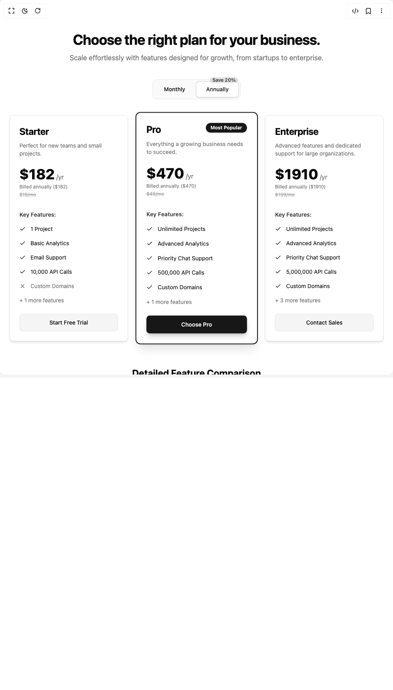

# Build Pricing Card in BuilderStudio

> Build this component in our Agentic IDE: [BuilderStudio](https://builderstudio.dev).
>
> Join the BuilderStudio community on [Discord](https://discord.gg/QdWeSGCqfe) and [Reddit](https://reddit.com/r/builderstudio).



## Component

- Author group: `authenticui`
- Component: `pricing-card`
- Variant: `default`
- Rendered HTML snapshot: [`rendered.html`](rendered.html)

## BuilderStudio prompt

You are implementing a React component based on a component reference.

## Component identity

- Author: authenticui
- Component slug: pricing-card
- Demo slug: default
- Title: pricing-card
- Description: 

## Goal

Recreate this component in a React + TypeScript + Tailwind CSS project. Preserve the visual layout, spacing, colors, border radius, shadows, interaction behavior, animation behavior, responsive behavior, and dark mode behavior shown in the rendered demo.

## Implementation requirements

- Use React and TypeScript.
- Use Tailwind CSS classes whenever possible.
- Keep the component self-contained unless the source files require helper components.
- If the source uses CSS variables, custom CSS, animations, or keyframes, include them.
- If the source uses external packages, list and use the required packages.
- Preserve accessibility attributes, button semantics, links, keyboard behavior, and ARIA attributes when visible in the source.
- Do not replace the component with a simplified placeholder.
- Return complete production-ready code.

## Dependencies

No reference metadata available.

## Rendered DOM snapshot

This is the rendered demo HTML extracted from the live preview. Use it to verify structure, class names, visible content, and layout.

```html
<div id="root"><div class="w-screen min-h-screen flex justify-center items-center"><div class="w-screen min-h-screen flex justify-center items-center"><div class="min-h-screen bg-background text-foreground"><div class="w-full py-12 md:py-20 max-w-7xl mx-auto px-4 sm:px-6 lg:px-8"><header class="text-center mb-10"><h2 class="text-3xl sm:text-4xl font-bold tracking-tight text-foreground">Choose the right plan for your business.</h2><p class="mt-3 text-lg text-muted-foreground max-w-2xl mx-auto">Scale effortlessly with features designed for growth, from startups to enterprise.</p></header><div class="flex justify-center mb-10 mt-2"><div role="group" dir="ltr" class="flex items-center justify-center gap-1 border rounded-lg p-1 bg-muted/50 dark:bg-muted/30" aria-label="Select billing cycle" tabindex="0" style="outline: none;"><button type="button" data-state="off" role="radio" aria-checked="false" class="inline-flex items-center justify-center ring-offset-background hover:bg-muted hover:text-muted-foreground focus-visible:outline-none focus-visible:ring-2 focus-visible:ring-ring focus-visible:ring-offset-2 disabled:pointer-events-none disabled:opacity-50 data-[state=on]:text-accent-foreground bg-transparent h-10 px-6 py-1.5 text-sm font-medium data-[state=on]:bg-background data-[state=on]:shadow-sm data-[state=on]:border data-[state=on]:ring-1 data-[state=on]:ring-ring/20 rounded-md transition-colors" aria-label="Monthly Billing" tabindex="-1" data-radix-collection-item="">Monthly</button><button type="button" data-state="on" role="radio" aria-checked="true" class="inline-flex items-center justify-center ring-offset-background hover:bg-muted hover:text-muted-foreground focus-visible:outline-none focus-visible:ring-2 focus-visible:ring-ring focus-visible:ring-offset-2 disabled:pointer-events-none disabled:opacity-50 data-[state=on]:text-accent-foreground bg-transparent h-10 px-6 py-1.5 text-sm font-medium data-[state=on]:bg-background data-[state=on]:shadow-sm data-[state=on]:border data-[state=on]:ring-1 data-[state=on]:ring-ring/20 rounded-md transition-colors relative" aria-label="Annual Billing" tabindex="-1" data-radix-collection-item="">Annually<span class="absolute -top-3 right-0 text-xs font-semibold text-primary/80 dark:text-primary/70 bg-primary/10 dark:bg-primary/20 px-1.5 rounded-full whitespace-nowrap">Save 20%</span></button></div></div><section aria-labelledby="pricing-plans"><div class="grid gap-8 md:grid-cols-3 md:gap-6 lg:gap-8"><div class="rounded-lg border bg-card text-card-foreground flex flex-col transition-all duration-300 shadow-md hover:shadow-lg dark:hover:shadow-white/10"><div class="flex flex-col space-y-1.5 p-6 pb-4"><div class="flex justify-between items-start"><h3 class="tracking-tight text-2xl font-bold">Starter</h3></div><p class="text-muted-foreground text-sm mt-1">Perfect for new teams and small projects.</p><div class="mt-4"><p class="text-4xl font-extrabold text-foreground">$182<span class="text-base font-normal text-muted-foreground ml-1">/yr</span></p><p class="text-xs text-muted-foreground mt-1">Billed annually ($182)</p><p class="text-xs text-muted-foreground line-through opacity-70 mt-1">$19/mo</p></div></div><div class="flex-grow p-6 pt-0"><h4 class="text-sm font-semibold mb-2 mt-4 text-foreground/80">Key Features:</h4><ul class="list-none space-y-0"><li class="flex items-start space-x-3 py-2"><svg xmlns="http://www.w3.org/2000/svg" width="24" height="24" viewBox="0 0 24 24" fill="none" stroke="currentColor" stroke-width="2" stroke-linecap="round" stroke-linejoin="round" class="lucide lucide-check h-4 w-4 flex-shrink-0 mt-0.5 text-primary" aria-hidden="true"><path d="M20 6 9 17l-5-5"></path></svg><span class="text-sm text-foreground">1 Project</span></li><li class="flex items-start space-x-3 py-2"><svg xmlns="http://www.w3.org/2000/svg" width="24" height="24" viewBox="0 0 24 24" fill="none" stroke="currentColor" stroke-width="2" stroke-linecap="round" stroke-linejoin="round" class="lucide lucide-check h-4 w-4 flex-shrink-0 mt-0.5 text-primary" aria-hidden="true"><path d="M20 6 9 17l-5-5"></path></svg><span class="text-sm text-foreground">Basic Analytics</span></li><li class="flex items-start space-x-3 py-2"><svg xmlns="http://www.w3.org/2000/svg" width="24" height="24" viewBox="0 0 24 24" fill="none" stroke="currentColor" stroke-width="2" stroke-linecap="round" stroke-linejoin="round" class="lucide lucide-check h-4 w-4 flex-shrink-0 mt-0.5 text-primary" aria-hidden="true"><path d="M20 6 9 17l-5-5"></path></svg><span class="text-sm text-foreground">Email Support</span></li><li class="flex items-start space-x-3 py-2"><svg xmlns="http://www.w3.org/2000/svg" width="24" height="24" viewBox="0 0 24 24" fill="none" stroke="currentColor" stroke-width="2" stroke-linecap="round" stroke-linejoin="round" class="lucide lucide-check h-4 w-4 flex-shrink-0 mt-0.5 text-primary" aria-hidden="true"><path d="M20 6 9 17l-5-5"></path></svg><span class="text-sm text-foreground">10,000 API Calls</span></li><li class="flex items-start space-x-3 py-2"><svg xmlns="http://www.w3.org/2000/svg" width="24" height="24" viewBox="0 0 24 24" fill="none" stroke="currentColor" stroke-width="2" stroke-linecap="round" stroke-linejoin="round" class="lucide lucide-x h-4 w-4 flex-shrink-0 mt-0.5 text-muted-foreground" aria-hidden="true"><path d="M18 6 6 18"></path><path d="m6 6 12 12"></path></svg><span class="text-sm text-muted-foreground">Custom Domains</span></li><li class="text-sm text-muted-foreground mt-2">+ 1 more features</li></ul></div><div class="flex items-center p-6 pt-0"><button class="inline-flex items-center justify-center whitespace-nowrap text-sm font-medium ring-offset-background focus-visible:outline-none focus-visible:ring-2 focus-visible:ring-ring focus-visible:ring-offset-2 disabled:pointer-events-none disabled:opacity-50 h-11 rounded-md px-8 w-full transition-all duration-200 bg-muted text-foreground hover:bg-muted/80 border border-input" aria-label="Select Starter plan for 182 /yr">Start Free Trial</button></div></div><div class="rounded-lg border bg-card text-card-foreground flex flex-col transition-all duration-300 hover:shadow-lg dark:hover:shadow-white/10 ring-2 ring-primary dark:ring-primary/80 shadow-xl dark:shadow-primary/20 transform md:scale-[1.02] hover:scale-[1.04]"><div class="flex flex-col space-y-1.5 p-6 pb-4"><div class="flex justify-between items-start"><h3 class="tracking-tight text-2xl font-bold">Pro</h3><span class="text-xs font-semibold px-3 py-1 bg-primary text-primary-foreground rounded-full">Most Popular</span></div><p class="text-muted-foreground text-sm mt-1">Everything a growing business needs to succeed.</p><div class="mt-4"><p class="text-4xl font-extrabold text-foreground">$470<span class="text-base font-normal text-muted-foreground ml-1">/yr</span></p><p class="text-xs text-muted-foreground mt-1">Billed annually ($470)</p><p class="text-xs text-muted-foreground line-through opacity-70 mt-1">$49/mo</p></div></div><div class="flex-grow p-6 pt-0"><h4 class="text-sm font-semibold mb-2 mt-4 text-foreground/80">Key Features:</h4><ul class="list-none space-y-0"><li class="flex items-start space-x-3 py-2"><svg xmlns="http://www.w3.org/2000/svg" width="24" height="24" viewBox="0 0 24 24" fill="none" stroke="currentColor" stroke-width="2" stroke-linecap="round" stroke-linejoin="round" class="lucide lucide-check h-4 w-4 flex-shrink-0 mt-0.5 text-primary" aria-hidden="true"><path d="M20 6 9 17l-5-5"></path></svg><span class="text-sm text-foreground">Unlimited Projects</span></li><li class="flex items-start space-x-3 py-2"><svg xmlns="http://www.w3.org/2000/svg" width="24" height="24" viewBox="0 0 24 24" fill="none" stroke="currentColor" stroke-width="2" stroke-linecap="round" stroke-linejoin="round" class="lucide lucide-check h-4 w-4 flex-shrink-0 mt-0.5 text-primary" aria-hidden="true"><path d="M20 6 9 17l-5-5"></path></svg><span class="text-sm text-foreground">Advanced Analytics</span></li><li class="flex items-start space-x-3 py-2"><svg xmlns="http://www.w3.org/2000/svg" width="24" height="24" viewBox="0 0 24 24" fill="none" stroke="currentColor" stroke-width="2" stroke-linecap="round" stroke-linejoin="round" class="lucide lucide-check h-4 w-4 flex-shrink-0 mt-0.5 text-primary" aria-hidden="true"><path d="M20 6 9 17l-5-5"></path></svg><span class="text-sm text-foreground">Priority Chat Support</span></li><li class="flex items-start space-x-3 py-2"><svg xmlns="http://www.w3.org/2000/svg" width="24" height="24" viewBox="0 0 24 24" fill="none" stroke="currentColor" stroke-width="2" stroke-linecap="round" stroke-linejoin="round" class="lucide lucide-check h-4 w-4 flex-shrink-0 mt-0.5 text-primary" aria-hidden="true"><path d="M20 6 9 17l-5-5"></path></svg><span class="text-sm text-foreground">500,000 API Calls</span></li><li class="flex items-start space-x-3 py-2"><svg xmlns="http://www.w3.org/2000/svg" width="24" height="24" viewBox="0 0 24 24" fill="none" stroke="currentColor" stroke-width="2" stroke-linecap="round" stroke-linejoin="round" class="lucide lucide-check h-4 w-4 flex-shrink-0 mt-0.5 text-primary" aria-hidden="true"><path d="M20 6 9 17l-5-5"></path></svg><span class="text-sm text-foreground">Custom Domains</span></li><li class="text-sm text-muted-foreground mt-2">+ 1 more features</li></ul></div><div class="flex items-center p-6 pt-0"><button class="inline-flex items-center justify-center whitespace-nowrap text-sm font-medium ring-offset-background focus-visible:outline-none focus-visible:ring-2 focus-visible:ring-ring focus-visible:ring-offset-2 disabled:pointer-events-none disabled:opacity-50 h-11 rounded-md px-8 w-full transition-all duration-200 bg-primary hover:bg-primary/90 text-primary-foreground shadow-lg shadow-primary/20 dark:shadow-primary/40" aria-label="Select Pro plan for 470 /yr">Choose Pro</button></div></div><div class="rounded-lg border bg-card text-card-foreground flex flex-col transition-all duration-300 shadow-md hover:shadow-lg dark:hover:shadow-white/10"><div class="flex flex-col space-y-1.5 p-6 pb-4"><div class="flex justify-between items-start"><h3 class="tracking-tight text-2xl font-bold">Enterprise</h3></div><p class="text-muted-foreground text-sm mt-1">Advanced features and dedicated support for large organizations.</p><div class="mt-4"><p class="text-4xl font-extrabold text-foreground">$1910<span class="text-base font-normal text-muted-foreground ml-1">/yr</span></p><p class="text-xs text-muted-foreground mt-1">Billed annually ($1910)</p><p class="text-xs text-muted-foreground line-through opacity-70 mt-1">$199/mo</p></div></div><div class="flex-grow p-6 pt-0"><h4 class="text-sm font-semibold mb-2 mt-4 text-foreground/80">Key Features:</h4><ul class="list-none space-y-0"><li class="flex items-start space-x-3 py-2"><svg xmlns="http://www.w3.org/2000/svg" width="24" height="24" viewBox="0 0 24 24" fill="none" stroke="currentColor" stroke-width="2" stroke-linecap="round" stroke-linejoin="round" class="lucide lucide-check h-4 w-4 flex-shrink-0 mt-0.5 text-primary" aria-hidden="true"><path d="M20 6 9 17l-5-5"></path></svg><span class="text-sm text-foreground">Unlimited Projects</span></li><li class="flex items-start space-x-3 py-2"><svg xmlns="http://www.w3.org/2000/svg" width="24" height="24" viewBox="0 0 24 24" fill="none" stroke="currentColor" stroke-width="2" stroke-linecap="round" stroke-linejoin="round" class="lucide lucide-check h-4 w-4 flex-shrink-0 mt-0.5 text-primary" aria-hidden="true"><path d="M20 6 9 17l-5-5"></path></svg><span class="text-sm text-foreground">Advanced Analytics</span></li><li class="flex items-start space-x-3 py-2"><svg xmlns="http://www.w3.org/2000/svg" width="24" height="24" viewBox="0 0 24 24" fill="none" stroke="currentColor" stroke-width="2" stroke-linecap="round" stroke-linejoin="round" class="lucide lucide-check h-4 w-4 flex-shrink-0 mt-0.5 text-primary" aria-hidden="true"><path d="M20 6 9 17l-5-5"></path></svg><span class="text-sm text-foreground">Priority Chat Support</span></li><li class="flex items-start space-x-3 py-2"><svg xmlns="http://www.w3.org/2000/svg" width="24" height="24" viewBox="0 0 24 24" fill="none" stroke="currentColor" stroke-width="2" stroke-linecap="round" stroke-linejoin="round" class="lucide lucide-check h-4 w-4 flex-shrink-0 mt-0.5 text-primary" aria-hidden="true"><path d="M20 6 9 17l-5-5"></path></svg><span class="text-sm text-foreground">5,000,000 API Calls</span></li><li class="flex items-start space-x-3 py-2"><svg xmlns="http://www.w3.org/2000/svg" width="24" height="24" viewBox="0 0 24 24" fill="none" stroke="currentColor" stroke-width="2" stroke-linecap="round" stroke-linejoin="round" class="lucide lucide-check h-4 w-4 flex-shrink-0 mt-0.5 text-primary" aria-hidden="true"><path d="M20 6 9 17l-5-5"></path></svg><span class="text-sm text-foreground">Custom Domains</span></li><li class="text-sm text-muted-foreground mt-2">+ 3 more features</li></ul></div><div class="flex items-center p-6 pt-0"><button class="inline-flex items-center justify-center whitespace-nowrap text-sm font-medium ring-offset-background focus-visible:outline-none focus-visible:ring-2 focus-visible:ring-ring focus-visible:ring-offset-2 disabled:pointer-events-none disabled:opacity-50 h-11 rounded-md px-8 w-full transition-all duration-200 bg-muted text-foreground hover:bg-muted/80 border border-input" aria-label="Select Enterprise plan for 1910 /yr">Contact Sales</button></div></div></div></section><section aria-label="Feature Comparison Table" class="mt-16"><h3 class="text-2xl font-bold mb-6 hidden md:block text-center text-foreground">Detailed Feature Comparison</h3><div class="mt-16 hidden md:block border rounded-lg overflow-x-auto shadow-sm dark:border-border/50"><table class="min-w-full divide-y divide-border/80 dark:divide-border/50"><thead><tr class="bg-muted/30 dark:bg-muted/20"><th scope="col" class="px-6 py-4 text-left text-sm font-semibold text-foreground/80 w-[200px] whitespace-nowrap">Feature</th><th scope="col" class="px-6 py-4 text-center text-sm font-semibold text-foreground/80 whitespace-nowrap">Starter</th><th scope="col" class="px-6 py-4 text-center text-sm font-semibold text-foreground/80 whitespace-nowrap bg-primary/10 dark:bg-primary/20">Pro</th><th scope="col" class="px-6 py-4 text-center text-sm font-semibold text-foreground/80 whitespace-nowrap">Enterprise</th></tr></thead><tbody class="divide-y divide-border/80 dark:divide-border/50 bg-background/90"><tr class="transition-colors hover:bg-accent/20 dark:hover:bg-accent/10 bg-background"><td class="px-6 py-3 text-left text-sm font-medium text-foreground/90 whitespace-nowrap">1 Project</td><td class="px-6 py-3 text-center transition-all duration-150"><svg xmlns="http://www.w3.org/2000/svg" width="24" height="24" viewBox="0 0 24 24" fill="none" stroke="currentColor" stroke-width="2" stroke-linecap="round" stroke-linejoin="round" class="lucide lucide-check h-5 w-5 mx-auto text-primary" aria-hidden="true"><path d="M20 6 9 17l-5-5"></path></svg></td><td class="px-6 py-3 text-center transition-all duration-150 bg-primary/5 dark:bg-primary/10"><svg xmlns="http://www.w3.org/2000/svg" width="24" height="24" viewBox="0 0 24 24" fill="none" stroke="currentColor" stroke-width="2" stroke-linecap="round" stroke-linejoin="round" class="lucide lucide-x h-5 w-5 mx-auto text-muted-foreground/70" aria-hidden="true"><path d="M18 6 6 18"></path><path d="m6 6 12 12"></path></svg></td><td class="px-6 py-3 text-center transition-all duration-150"><svg xmlns="http://www.w3.org/2000/svg" width="24" height="24" viewBox="0 0 24 24" fill="none" stroke="currentColor" stroke-width="2" stroke-linecap="round" stroke-linejoin="round" class="lucide lucide-x h-5 w-5 mx-auto text-muted-foreground/70" aria-hidden="true"><path d="M18 6 6 18"></path><path d="m6 6 12 12"></path></svg></td></tr><tr class="transition-colors hover:bg-accent/20 dark:hover:bg-accent/10 bg-muted/10 dark:bg-muted/5"><td class="px-6 py-3 text-left text-sm font-medium text-foreground/90 whitespace-nowrap">Basic Analytics</td><td class="px-6 py-3 text-center transition-all duration-150"><svg xmlns="http://www.w3.org/2000/svg" width="24" height="24" viewBox="0 0 24 24" fill="none" stroke="currentColor" stroke-width="2" stroke-linecap="round" stroke-linejoin="round" class="lucide lucide-check h-5 w-5 mx-auto text-primary" aria-hidden="true"><path d="M20 6 9 17l-5-5"></path></svg></td><td class="px-6 py-3 text-center transition-all duration-150 bg-primary/5 dark:bg-primary/10"><svg xmlns="http://www.w3.org/2000/svg" width="24" height="24" viewBox="0 0 24 24" fill="none" stroke="currentColor" stroke-width="2" stroke-linecap="round" stroke-linejoin="round" class="lucide lucide-x h-5 w-5 mx-auto text-muted-foreground/70" aria-hidden="true"><path d="M18 6 6 18"></path><path d="m6 6 12 12"></path></svg></td><td class="px-6 py-3 text-center transition-all duration-150"><svg xmlns="http://www.w3.org/2000/svg" width="24" height="24" viewBox="0 0 24 24" fill="none" stroke="currentColor" stroke-width="2" stroke-linecap="round" stroke-linejoin="round" class="lucide lucide-x h-5 w-5 mx-auto text-muted-foreground/70" aria-hidden="true"><path d="M18 6 6 18"></path><path d="m6 6 12 12"></path></svg></td></tr><tr class="transition-colors hover:bg-accent/20 dark:hover:bg-accent/10 bg-background"><td class="px-6 py-3 text-left text-sm font-medium text-foreground/90 whitespace-nowrap">Email Support</td><td class="px-6 py-3 text-center transition-all duration-150"><svg xmlns="http://www.w3.org/2000/svg" width="24" height="24" viewBox="0 0 24 24" fill="none" stroke="currentColor" stroke-width="2" stroke-linecap="round" stroke-linejoin="round" class="lucide lucide-check h-5 w-5 mx-auto text-primary" aria-hidden="true"><path d="M20 6 9 17l-5-5"></path></svg></td><td class="px-6 py-3 text-center transition-all duration-150 bg-primary/5 dark:bg-primary/10"><svg xmlns="http://www.w3.org/2000/svg" width="24" height="24" viewBox="0 0 24 24" fill="none" stroke="currentColor" stroke-width="2" stroke-linecap="round" stroke-linejoin="round" class="lucide lucide-x h-5 w-5 mx-auto text-muted-foreground/70" aria-hidden="true"><path d="M18 6 6 18"></path><path d="m6 6 12 12"></path></svg></td><td class="px-6 py-3 text-center transition-all duration-150"><svg xmlns="http://www.w3.org/2000/svg" width="24" height="24" viewBox="0 0 24 24" fill="none" stroke="currentColor" stroke-width="2" stroke-linecap="round" stroke-linejoin="round" class="lucide lucide-x h-5 w-5 mx-auto text-muted-foreground/70" aria-hidden="true"><path d="M18 6 6 18"></path><path d="m6 6 12 12"></path></svg></td></tr><tr class="transition-colors hover:bg-accent/20 dark:hover:bg-accent/10 bg-muted/10 dark:bg-muted/5"><td class="px-6 py-3 text-left text-sm font-medium text-foreground/90 whitespace-nowrap">10,000 API Calls</td><td class="px-6 py-3 text-center transition-all duration-150"><svg xmlns="http://www.w3.org/2000/svg" width="24" height="24" viewBox="0 0 24 24" fill="none" stroke="currentColor" stroke-width="2" stroke-linecap="round" stroke-linejoin="round" class="lucide lucide-check h-5 w-5 mx-auto text-primary" aria-hidden="true"><path d="M20 6 9 17l-5-5"></path></svg></td><td class="px-6 py-3 text-center transition-all duration-150 bg-primary/5 dark:bg-primary/10"><svg xmlns="http://www.w3.org/2000/svg" width="24" height="24" viewBox="0 0 24 24" fill="none" stroke="currentColor" stroke-width="2" stroke-linecap="round" stroke-linejoin="round" class="lucide lucide-x h-5 w-5 mx-auto text-muted-foreground/70" aria-hidden="true"><path d="M18 6 6 18"></path><path d="m6 6 12 12"></path></svg></td><td class="px-6 py-3 text-center transition-all duration-150"><svg xmlns="http://www.w3.org/2000/svg" width="24" height="24" viewBox="0 0 24 24" fill="none" stroke="currentColor" stroke-width="2" stroke-linecap="round" stroke-linejoin="round" class="lucide lucide-x h-5 w-5 mx-auto text-muted-foreground/70" aria-hidden="true"><path d="M18 6 6 18"></path><path d="m6 6 12 12"></path></svg></td></tr><tr class="transition-colors hover:bg-accent/20 dark:hover:bg-accent/10 bg-background"><td class="px-6 py-3 text-left text-sm font-medium text-foreground/90 whitespace-nowrap">Custom Domains</td><td class="px-6 py-3 text-center transition-all duration-150"><svg xmlns="http://www.w3.org/2000/svg" width="24" height="24" viewBox="0 0 24 24" fill="none" stroke="currentColor" stroke-width="2" stroke-linecap="round" stroke-linejoin="round" class="lucide lucide-x h-5 w-5 mx-auto text-muted-foreground/70" aria-hidden="true"><path d="M18 6 6 18"></path><path d="m6 6 12 12"></path></svg></td><td class="px-6 py-3 text-center transition-all duration-150 bg-primary/5 dark:bg-primary/10"><svg xmlns="http://www.w3.org/2000/svg" width="24" height="24" viewBox="0 0 24 24" fill="none" stroke="currentColor" stroke-width="2" stroke-linecap="round" stroke-linejoin="round" class="lucide lucide-check h-5 w-5 mx-auto text-primary" aria-hidden="true"><path d="M20 6 9 17l-5-5"></path></svg></td><td class="px-6 py-3 text-center transition-all duration-150"><svg xmlns="http://www.w3.org/2000/svg" width="24" height="24" viewBox="0 0 24 24" fill="none" stroke="currentColor" stroke-width="2" stroke-linecap="round" stroke-linejoin="round" class="lucide lucide-check h-5 w-5 mx-auto text-primary" aria-hidden="true"><path d="M20 6 9 17l-5-5"></path></svg></td></tr><tr class="transition-colors hover:bg-accent/20 dark:hover:bg-accent/10 bg-muted/10 dark:bg-muted/5"><td class="px-6 py-3 text-left text-sm font-medium text-foreground/90 whitespace-nowrap">Dedicated Account Manager</td><td class="px-6 py-3 text-center transition-all duration-150"><svg xmlns="http://www.w3.org/2000/svg" width="24" height="24" viewBox="0 0 24 24" fill="none" stroke="currentColor" stroke-width="2" stroke-linecap="round" stroke-linejoin="round" class="lucide lucide-x h-5 w-5 mx-auto text-muted-foreground/70" aria-hidden="true"><path d="M18 6 6 18"></path><path d="m6 6 12 12"></path></svg></td><td class="px-6 py-3 text-center transition-all duration-150 bg-primary/5 dark:bg-primary/10"><svg xmlns="http://www.w3.org/2000/svg" width="24" height="24" viewBox="0 0 24 24" fill="none" stroke="currentColor" stroke-width="2" stroke-linecap="round" stroke-linejoin="round" class="lucide lucide-x h-5 w-5 mx-auto text-muted-foreground/70" aria-hidden="true"><path d="M18 6 6 18"></path><path d="m6 6 12 12"></path></svg></td><td class="px-6 py-3 text-center transition-all duration-150"><svg xmlns="http://www.w3.org/2000/svg" width="24" height="24" viewBox="0 0 24 24" fill="none" stroke="currentColor" stroke-width="2" stroke-linecap="round" stroke-linejoin="round" class="lucide lucide-check h-5 w-5 mx-auto text-primary" aria-hidden="true"><path d="M20 6 9 17l-5-5"></path></svg></td></tr><tr class="transition-colors hover:bg-accent/20 dark:hover:bg-accent/10 bg-background"><td class="px-6 py-3 text-left text-sm font-medium text-foreground/90 whitespace-nowrap">Unlimited Projects</td><td class="px-6 py-3 text-center transition-all duration-150"><svg xmlns="http://www.w3.org/2000/svg" width="24" height="24" viewBox="0 0 24 24" fill="none" stroke="currentColor" stroke-width="2" stroke-linecap="round" stroke-linejoin="round" class="lucide lucide-x h-5 w-5 mx-auto text-muted-foreground/70" aria-hidden="true"><path d="M18 6 6 18"></path><path d="m6 6 12 12"></path></svg></td><td class="px-6 py-3 text-center transition-all duration-150 bg-primary/5 dark:bg-primary/10"><svg xmlns="http://www.w3.org/2000/svg" width="24" height="24" viewBox="0 0 24 24" fill="none" stroke="currentColor" stroke-width="2" stroke-linecap="round" stroke-linejoin="round" class="lucide lucide-check h-5 w-5 mx-auto text-primary" aria-hidden="true"><path d="M20 6 9 17l-5-5"></path></svg></td><td class="px-6 py-3 text-center transition-all duration-150"><svg xmlns="http://www.w3.org/2000/svg" width="24" height="24" viewBox="0 0 24 24" fill="none" stroke="currentColor" stroke-width="2" stroke-linecap="round" stroke-linejoin="round" class="lucide lucide-check h-5 w-5 mx-auto text-primary" aria-hidden="true"><path d="M20 6 9 17l-5-5"></path></svg></td></tr><tr class="transition-colors hover:bg-accent/20 dark:hover:bg-accent/10 bg-muted/10 dark:bg-muted/5"><td class="px-6 py-3 text-left text-sm font-medium text-foreground/90 whitespace-nowrap">Advanced Analytics</td><td class="px-6 py-3 text-center transition-all duration-150"><svg xmlns="http://www.w3.org/2000/svg" width="24" height="24" viewBox="0 0 24 24" fill="none" stroke="currentColor" stroke-width="2" stroke-linecap="round" stroke-linejoin="round" class="lucide lucide-x h-5 w-5 mx-auto text-muted-foreground/70" aria-hidden="true"><path d="M18 6 6 18"></path><path d="m6 6 12 12"></path></svg></td><td class="px-6 py-3 text-center transition-all duration-150 bg-primary/5 dark:bg-primary/10"><svg xmlns="http://www.w3.org/2000/svg" width="24" height="24" viewBox="0 0 24 24" fill="none" stroke="currentColor" stroke-width="2" stroke-linecap="round" stroke-linejoin="round" class="lucide lucide-check h-5 w-5 mx-auto text-primary" aria-hidden="true"><path d="M20 6 9 17l-5-5"></path></svg></td><td class="px-6 py-3 text-center transition-all duration-150"><svg xmlns="http://www.w3.org/2000/svg" width="24" height="24" viewBox="0 0 24 24" fill="none" stroke="currentColor" stroke-width="2" stroke-linecap="round" stroke-linejoin="round" class="lucide lucide-check h-5 w-5 mx-auto text-primary" aria-hidden="true"><path d="M20 6 9 17l-5-5"></path></svg></td></tr><tr class="transition-colors hover:bg-accent/20 dark:hover:bg-accent/10 bg-background"><td class="px-6 py-3 text-left text-sm font-medium text-foreground/90 whitespace-nowrap">Priority Chat Support</td><td class="px-6 py-3 text-center transition-all duration-150"><svg xmlns="http://www.w3.org/2000/svg" width="24" height="24" viewBox="0 0 24 24" fill="none" stroke="currentColor" stroke-width="2" stroke-linecap="round" stroke-linejoin="round" class="lucide lucide-x h-5 w-5 mx-auto text-muted-foreground/70" aria-hidden="true"><path d="M18 6 6 18"></path><path d="m6 6 12 12"></path></svg></td><td class="px-6 py-3 text-center transition-all duration-150 bg-primary/5 dark:bg-primary/10"><svg xmlns="http://www.w3.org/2000/svg" width="24" height="24" viewBox="0 0 24 24" fill="none" stroke="currentColor" stroke-width="2" stroke-linecap="round" stroke-linejoin="round" class="lucide lucide-check h-5 w-5 mx-auto text-primary" aria-hidden="true"><path d="M20 6 9 17l-5-5"></path></svg></td><td class="px-6 py-3 text-center transition-all duration-150"><svg xmlns="http://www.w3.org/2000/svg" width="24" height="24" viewBox="0 0 24 24" fill="none" stroke="currentColor" stroke-width="2" stroke-linecap="round" stroke-linejoin="round" class="lucide lucide-check h-5 w-5 mx-auto text-primary" aria-hidden="true"><path d="M20 6 9 17l-5-5"></path></svg></td></tr><tr class="transition-colors hover:bg-accent/20 dark:hover:bg-accent/10 bg-muted/10 dark:bg-muted/5"><td class="px-6 py-3 text-left text-sm font-medium text-foreground/90 whitespace-nowrap">500,000 API Calls</td><td class="px-6 py-3 text-center transition-all duration-150"><svg xmlns="http://www.w3.org/2000/svg" width="24" height="24" viewBox="0 0 24 24" fill="none" stroke="currentColor" stroke-width="2" stroke-linecap="round" stroke-linejoin="round" class="lucide lucide-x h-5 w-5 mx-auto text-muted-foreground/70" aria-hidden="true"><path d="M18 6 6 18"></path><path d="m6 6 12 12"></path></svg></td><td class="px-6 py-3 text-center transition-all duration-150 bg-primary/5 dark:bg-primary/10"><svg xmlns="http://www.w3.org/2000/svg" width="24" height="24" viewBox="0 0 24 24" fill="none" stroke="currentColor" stroke-width="2" stroke-linecap="round" stroke-linejoin="round" class="lucide lucide-check h-5 w-5 mx-auto text-primary" aria-hidden="true"><path d="M20 6 9 17l-5-5"></path></svg></td><td class="px-6 py-3 text-center transition-all duration-150"><svg xmlns="http://www.w3.org/2000/svg" width="24" height="24" viewBox="0 0 24 24" fill="none" stroke="currentColor" stroke-width="2" stroke-linecap="round" stroke-linejoin="round" class="lucide lucide-x h-5 w-5 mx-auto text-muted-foreground/70" aria-hidden="true"><path d="M18 6 6 18"></path><path d="m6 6 12 12"></path></svg></td></tr><tr class="transition-colors hover:bg-accent/20 dark:hover:bg-accent/10 bg-background"><td class="px-6 py-3 text-left text-sm font-medium text-foreground/90 whitespace-nowrap">SLAs and Uptime Guarantees</td><td class="px-6 py-3 text-center transition-all duration-150"><svg xmlns="http://www.w3.org/2000/svg" width="24" height="24" viewBox="0 0 24 24" fill="none" stroke="currentColor" stroke-width="2" stroke-linecap="round" stroke-linejoin="round" class="lucide lucide-x h-5 w-5 mx-auto text-muted-foreground/70" aria-hidden="true"><path d="M18 6 6 18"></path><path d="m6 6 12 12"></path></svg></td><td class="px-6 py-3 text-center transition-all duration-150 bg-primary/5 dark:bg-primary/10"><svg xmlns="http://www.w3.org/2000/svg" width="24" height="24" viewBox="0 0 24 24" fill="none" stroke="currentColor" stroke-width="2" stroke-linecap="round" stroke-linejoin="round" class="lucide lucide-x h-5 w-5 mx-auto text-muted-foreground/70" aria-hidden="true"><path d="M18 6 6 18"></path><path d="m6 6 12 12"></path></svg></td><td class="px-6 py-3 text-center transition-all duration-150"><svg xmlns="http://www.w3.org/2000/svg" width="24" height="24" viewBox="0 0 24 24" fill="none" stroke="currentColor" stroke-width="2" stroke-linecap="round" stroke-linejoin="round" class="lucide lucide-check h-5 w-5 mx-auto text-primary" aria-hidden="true"><path d="M20 6 9 17l-5-5"></path></svg></td></tr><tr class="transition-colors hover:bg-accent/20 dark:hover:bg-accent/10 bg-muted/10 dark:bg-muted/5"><td class="px-6 py-3 text-left text-sm font-medium text-foreground/90 whitespace-nowrap">5,000,000 API Calls</td><td class="px-6 py-3 text-center transition-all duration-150"><svg xmlns="http://www.w3.org/2000/svg" width="24" height="24" viewBox="0 0 24 24" fill="none" stroke="currentColor" stroke-width="2" stroke-linecap="round" stroke-linejoin="round" class="lucide lucide-x h-5 w-5 mx-auto text-muted-foreground/70" aria-hidden="true"><path d="M18 6 6 18"></path><path d="m6 6 12 12"></path></svg></td><td class="px-6 py-3 text-center transition-all duration-150 bg-primary/5 dark:bg-primary/10"><svg xmlns="http://www.w3.org/2000/svg" width="24" height="24" viewBox="0 0 24 24" fill="none" stroke="currentColor" stroke-width="2" stroke-linecap="round" stroke-linejoin="round" class="lucide lucide-x h-5 w-5 mx-auto text-muted-foreground/70" aria-hidden="true"><path d="M18 6 6 18"></path><path d="m6 6 12 12"></path></svg></td><td class="px-6 py-3 text-center transition-all duration-150"><svg xmlns="http://www.w3.org/2000/svg" width="24" height="24" viewBox="0 0 24 24" fill="none" stroke="currentColor" stroke-width="2" stroke-linecap="round" stroke-linejoin="round" class="lucide lucide-check h-5 w-5 mx-auto text-primary" aria-hidden="true"><path d="M20 6 9 17l-5-5"></path></svg></td></tr><tr class="transition-colors hover:bg-accent/20 dark:hover:bg-accent/10 bg-background"><td class="px-6 py-3 text-left text-sm font-medium text-foreground/90 whitespace-nowrap">Single Sign-On (SSO)</td><td class="px-6 py-3 text-center transition-all duration-150"><svg xmlns="http://www.w3.org/2000/svg" width="24" height="24" viewBox="0 0 24 24" fill="none" stroke="currentColor" stroke-width="2" stroke-linecap="round" stroke-linejoin="round" class="lucide lucide-x h-5 w-5 mx-auto text-muted-foreground/70" aria-hidden="true"><path d="M18 6 6 18"></path><path d="m6 6 12 12"></path></svg></td><td class="px-6 py-3 text-center transition-all duration-150 bg-primary/5 dark:bg-primary/10"><svg xmlns="http://www.w3.org/2000/svg" width="24" height="24" viewBox="0 0 24 24" fill="none" stroke="currentColor" stroke-width="2" stroke-linecap="round" stroke-linejoin="round" class="lucide lucide-x h-5 w-5 mx-auto text-muted-foreground/70" aria-hidden="true"><path d="M18 6 6 18"></path><path d="m6 6 12 12"></path></svg></td><td class="px-6 py-3 text-center transition-all duration-150"><svg xmlns="http://www.w3.org/2000/svg" width="24" height="24" viewBox="0 0 24 24" fill="none" stroke="currentColor" stroke-width="2" stroke-linecap="round" stroke-linejoin="round" class="lucide lucide-check h-5 w-5 mx-auto text-primary" aria-hidden="true"><path d="M20 6 9 17l-5-5"></path></svg></td></tr></tbody></table></div></section></div></div></div></div></div>
```

## Reference source files

No reference source files were available.
