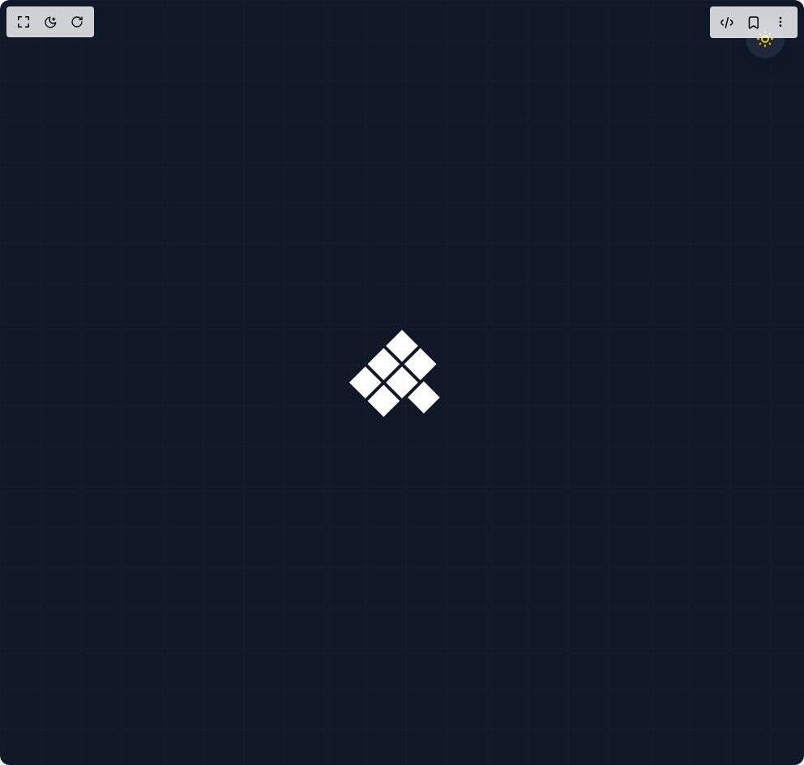

# Build Animated Loader 1 in BuilderStudio

> Build this component in our Agentic IDE: [BuilderStudio](https://builderstudio.dev).
>
> Join the BuilderStudio community on [Discord](https://discord.gg/QdWeSGCqfe) and [Reddit](https://reddit.com/r/builderstudio).



## Component

- Author group: `avanishverma4`
- Component: `animated-loader-1`
- Variant: `default`
- Rendered HTML snapshot: [`rendered.html`](rendered.html)

## BuilderStudio prompt

You are implementing a React component based on a component reference.

## Component identity

- Author: avanishverma4
- Component slug: animated-loader-1
- Demo slug: default
- Title: animated-loader-1
- Description: 

## Goal

Recreate this component in a React + TypeScript + Tailwind CSS project. Preserve the visual layout, spacing, colors, border radius, shadows, interaction behavior, animation behavior, responsive behavior, and dark mode behavior shown in the rendered demo.

## Implementation requirements

- Use React and TypeScript.
- Use Tailwind CSS classes whenever possible.
- Keep the component self-contained unless the source files require helper components.
- If the source uses CSS variables, custom CSS, animations, or keyframes, include them.
- If the source uses external packages, list and use the required packages.
- Preserve accessibility attributes, button semantics, links, keyboard behavior, and ARIA attributes when visible in the source.
- Do not replace the component with a simplified placeholder.
- Return complete production-ready code.

## Dependencies

No reference metadata available.

## Rendered DOM snapshot

This is the rendered demo HTML extracted from the live preview. Use it to verify structure, class names, visible content, and layout.

```html
<div id="root"><div class="w-screen min-h-screen flex justify-center items-center"><div class="w-screen min-h-screen flex justify-center items-center"><div class="w-full min-h-screen flex items-center justify-center relative overflow-hidden transition-colors duration-300 bg-gray-900"><div class="absolute inset-0 bg-grid opacity-20"></div><button class="absolute top-6 right-6 z-20 p-3 rounded-full transition-all duration-300 bg-gray-800 hover:bg-gray-700 shadow-lg"><svg class="w-6 h-6 text-yellow-400" fill="none" stroke="currentColor" viewBox="0 0 24 24"><path stroke-linecap="round" stroke-linejoin="round" stroke-width="2" d="M12 3v1m0 16v1m9-9h-1M4 12H3m15.364 6.364l-.707-.707M6.343 6.343l-.707-.707m12.728 0l-.707.707M6.343 17.657l-.707.707M16 12a4 4 0 11-8 0 4 4 0 018 0z"></path></svg></button><div class="relative w-24 h-24 rotate-45 z-10"><div class="absolute top-0 left-0 w-7 h-7 m-0.5 animate-square bg-white" style="animation-delay: 0s;"></div><div class="absolute top-0 left-0 w-7 h-7 m-0.5 animate-square bg-white" style="animation-delay: -1.42857s;"></div><div class="absolute top-0 left-0 w-7 h-7 m-0.5 animate-square bg-white" style="animation-delay: -2.85714s;"></div><div class="absolute top-0 left-0 w-7 h-7 m-0.5 animate-square bg-white" style="animation-delay: -4.28571s;"></div><div class="absolute top-0 left-0 w-7 h-7 m-0.5 animate-square bg-white" style="animation-delay: -5.71429s;"></div><div class="absolute top-0 left-0 w-7 h-7 m-0.5 animate-square bg-white" style="animation-delay: -7.14286s;"></div><div class="absolute top-0 left-0 w-7 h-7 m-0.5 animate-square bg-white" style="animation-delay: -8.57143s;"></div></div><style>
        .bg-grid {
          background-image: 
            linear-gradient(rgba(255, 255, 255, 0.1) 1px, transparent 1px),
            linear-gradient(90deg, rgba(255, 255, 255, 0.1) 1px, transparent 1px);
          background-size: 50px 50px;
        }
        
        @keyframes square-animation {
          0% {
            left: 0;
            top: 0;
          }
          10.5% {
            left: 0;
            top: 0;
          }
          12.5% {
            left: 32px;
            top: 0;
          }
          23% {
            left: 32px;
            top: 0;
          }
          25% {
            left: 64px;
            top: 0;
          }
          35.5% {
            left: 64px;
            top: 0;
          }
          37.5% {
            left: 64px;
            top: 32px;
          }
          48% {
            left: 64px;
            top: 32px;
          }
          50% {
            left: 32px;
            top: 32px;
          }
          60.5% {
            left: 32px;
            top: 32px;
          }
          62.5% {
            left: 32px;
            top: 64px;
          }
          73% {
            left: 32px;
            top: 64px;
          }
          75% {
            left: 0;
            top: 64px;
          }
          85.5% {
            left: 0;
            top: 64px;
          }
          87.5% {
            left: 0;
            top: 32px;
          }
          98% {
            left: 0;
            top: 32px;
          }
          100% {
            left: 0;
            top: 0;
          }
        }
        
        .animate-square {
          animation: square-animation 10s ease-in-out infinite both;
        }
      </style></div></div></div></div>
```

## Reference source files

No reference source files were available.
