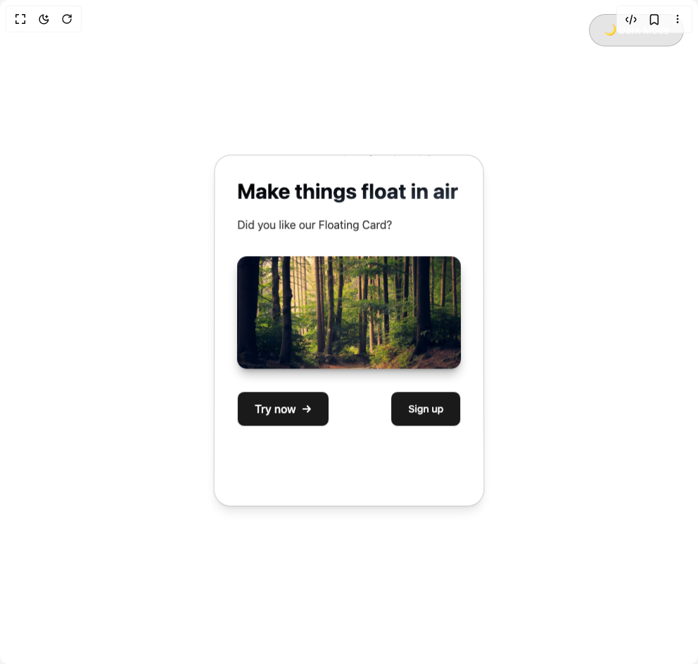

# Build Floating Card in BuilderStudio

> Build this component in our Agentic IDE: [BuilderStudio](https://builderstudio.dev).
>
> Join the BuilderStudio community on [Discord](https://discord.gg/QdWeSGCqfe) and [Reddit](https://reddit.com/r/builderstudio).



## Component

- Author group: `avanishverma4`
- Component: `floating-card`
- Variant: `default`
- Rendered HTML snapshot: [`rendered.html`](rendered.html)

## BuilderStudio prompt

You are implementing a React component based on a component reference.

## Component identity

- Author: avanishverma4
- Component slug: floating-card
- Demo slug: default
- Title: floating-card
- Description: 

## Goal

Recreate this component in a React + TypeScript + Tailwind CSS project. Preserve the visual layout, spacing, colors, border radius, shadows, interaction behavior, animation behavior, responsive behavior, and dark mode behavior shown in the rendered demo.

## Implementation requirements

- Use React and TypeScript.
- Use Tailwind CSS classes whenever possible.
- Keep the component self-contained unless the source files require helper components.
- If the source uses CSS variables, custom CSS, animations, or keyframes, include them.
- If the source uses external packages, list and use the required packages.
- Preserve accessibility attributes, button semantics, links, keyboard behavior, and ARIA attributes when visible in the source.
- Do not replace the component with a simplified placeholder.
- Return complete production-ready code.

## Dependencies

No reference metadata available.

## Rendered DOM snapshot

This is the rendered demo HTML extracted from the live preview. Use it to verify structure, class names, visible content, and layout.

```html
<div id="root"><div class="w-screen min-h-screen flex justify-center items-center"><div class="w-screen min-h-screen flex justify-center items-center"><div class="w-screen min-h-screen transition-all duration-300 bg-white"><button class="fixed top-5 right-5 px-5 py-3 rounded-full backdrop-blur-md transition-all duration-300 text-sm font-medium hover:scale-105 z-50 bg-black/10 border border-black/20 text-white hover:bg-black/15">🌙 Dark Mode</button><div class="flex justify-center items-center min-h-screen p-4 sm:p-6 lg:p-8"><div class="perspective-1000" style="perspective: 1000px;"><div class="relative w-80 sm:w-96 lg:w-[28rem] h-auto min-h-[500px] p-6 sm:p-8 rounded-3xl backdrop-blur-3xl cursor-pointer transition-all duration-500 transform-gpu preserve-3d bg-white border border-black/20 text-black shadow-lg shadow-black/10" style="transform: translateY(0px) rotateX(0deg) rotateY(0deg) scale(1); animation: 6s ease-in-out 0s infinite normal none running float;"><div class="absolute inset-0 rounded-3xl overflow-hidden pointer-events-none"><div class="absolute w-0.5 h-0.5 rounded-full bg-black/40" style="left: 93.5241%; opacity: 0.598909; animation: 4.92079s linear 0s infinite normal none running particleFloat;"></div><div class="absolute w-0.5 h-0.5 rounded-full bg-black/40" style="left: 29.9493%; opacity: 0.415019; animation: 4.47728s linear 0s infinite normal none running particleFloat;"></div><div class="absolute w-0.5 h-0.5 rounded-full bg-black/40" style="left: 57.7452%; opacity: 0.348002; animation: 3.84512s linear 0s infinite normal none running particleFloat;"></div><div class="absolute w-0.5 h-0.5 rounded-full bg-black/40" style="left: 79.5368%; opacity: 0.557258; animation: 4.5105s linear 0s infinite normal none running particleFloat;"></div><div class="absolute w-0.5 h-0.5 rounded-full bg-black/40" style="left: 75.9677%; opacity: 0.400877; animation: 2.69284s linear 0s infinite normal none running particleFloat;"></div><div class="absolute w-0.5 h-0.5 rounded-full bg-black/40" style="left: 47.8737%; opacity: 0.481714; animation: 4.96678s linear 0s infinite normal none running particleFloat;"></div><div class="absolute w-0.5 h-0.5 rounded-full bg-black/40" style="left: 76.4853%; opacity: 0.668608; animation: 4.30336s linear 0s infinite normal none running particleFloat;"></div><div class="absolute w-0.5 h-0.5 rounded-full bg-black/40" style="left: 66.662%; opacity: 0.613205; animation: 3.21052s linear 0s infinite normal none running particleFloat;"></div><div class="absolute w-0.5 h-0.5 rounded-full bg-black/40" style="left: 82.3263%; opacity: 0.382867; animation: 3.60704s linear 0s infinite normal none running particleFloat;"></div><div class="absolute w-0.5 h-0.5 rounded-full bg-black/40" style="left: 86.4319%; opacity: 0.534371; animation: 3.32119s linear 0s infinite normal none running particleFloat;"></div><div class="absolute w-0.5 h-0.5 rounded-full bg-black/40" style="left: 11.1274%; opacity: 0.669586; animation: 2.18777s linear 0s infinite normal none running particleFloat;"></div><div class="absolute w-0.5 h-0.5 rounded-full bg-black/40" style="left: 27.2423%; opacity: 0.552436; animation: 4.59262s linear 0s infinite normal none running particleFloat;"></div></div><div class="relative z-10 h-full flex flex-col"><h1 class="text-2xl sm:text-3xl lg:text-4xl font-bold mb-3 sm:mb-4 leading-tight bg-gradient-to-br bg-clip-text text-transparent from-black to-gray-700">Make things float in air</h1><p class="text-sm sm:text-base opacity-80 mb-6 sm:mb-8 leading-relaxed">Did you like our Floating Card?</p><div class="mt-auto flex justify-between sm:gap-4"><button class="flex items-center justify-center gap-2 px-4 sm:px-6 py-2 sm:py-3 text-sm sm:text-base font-medium transition-all duration-300 hover:translate-x-1 hover:opacity-80 bg-[#1a1a1a] border border-white text-white rounded-lg">Try now<span class="transition-transform duration-300 group-hover:translate-x-1">→</span></button><button class="px-4 sm:px-6 py-2 sm:py-3 text-sm font-medium transition-all duration-300 hover:scale-105 bg-[#1a1a1a] border border-white text-white rounded-lg">Sign up</button></div></div></div></div></div><style>
        @keyframes float {
          0%,
          100% {
            transform: translateY(0px) rotateX(0deg);
          }
          50% {
            transform: translateY(-10px) rotateX(2deg);
          }
        }

        @keyframes particleFloat {
          0% {
            transform: translateY(100%) scale(0);
            opacity: 0;
          }
          10% {
            opacity: 1;
          }
          90% {
            opacity: 1;
          }
          100% {
            transform: translateY(-100%) scale(1);
            opacity: 0;
          }
        }

        @keyframes ripple {
          0% {
            transform: scale(0);
            opacity: 1;
          }
          100% {
            transform: scale(4);
            opacity: 0;
          }
        }

        /* Responsive breakpoints */
        @media (max-width: 640px) {
          .perspective-1000 > div {
            width: 20rem;
            min-height: 28rem;
          }
        }

        @media (max-width: 480px) {
          .perspective-1000 > div {
            width: 18rem;
            min-height: 26rem;
            padding: 1.5rem;
          }
        }
      </style></div></div></div></div>
```

## Reference source files

No reference source files were available.
