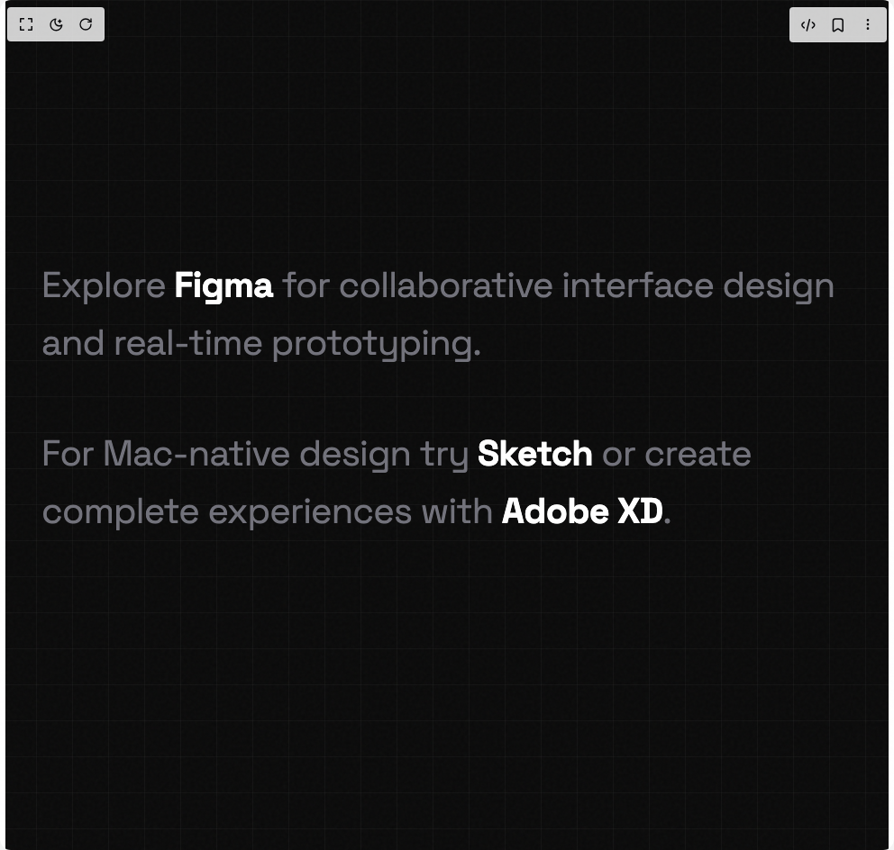

# Build Hover Image Preview in BuilderStudio

> Build this component in our Agentic IDE: [BuilderStudio](https://builderstudio.dev).
>
> Join the BuilderStudio community on [Discord](https://discord.gg/QdWeSGCqfe) and [Reddit](https://reddit.com/r/builderstudio).



## Component

- Author group: `avanishverma4`
- Component: `hover-image-preview`
- Variant: `default`
- Rendered HTML snapshot: [`rendered.html`](rendered.html)

## BuilderStudio prompt

You are implementing a React component based on a component reference.

## Component identity

- Author: avanishverma4
- Component slug: hover-image-preview
- Demo slug: default
- Title: hover-image-preview
- Description: 

## Goal

Recreate this component in a React + TypeScript + Tailwind CSS project. Preserve the visual layout, spacing, colors, border radius, shadows, interaction behavior, animation behavior, responsive behavior, and dark mode behavior shown in the rendered demo.

## Implementation requirements

- Use React and TypeScript.
- Use Tailwind CSS classes whenever possible.
- Keep the component self-contained unless the source files require helper components.
- If the source uses CSS variables, custom CSS, animations, or keyframes, include them.
- If the source uses external packages, list and use the required packages.
- Preserve accessibility attributes, button semantics, links, keyboard behavior, and ARIA attributes when visible in the source.
- Do not replace the component with a simplified placeholder.
- Return complete production-ready code.

## Dependencies

No reference metadata available.

## Rendered DOM snapshot

This is the rendered demo HTML extracted from the live preview. Use it to verify structure, class names, visible content, and layout.

```html
<div id="root"><div class="w-screen min-h-screen flex justify-center items-center"><div class="w-screen min-h-screen flex justify-center items-center"><style>
        /* Import Space Grotesk font */
        @import url('https://fonts.googleapis.com/css2?family=Space+Grotesk:wght@400;700&display=swap');
        
        /* Main container styles */
        .hover-preview-container {
          min-height: 100vh;
          background: #0a0a0a;
          display: flex;
          align-items: center;
          justify-content: center;
          padding: 40px;
          font-family: 'Space Grotesk', sans-serif;
          overflow-x: hidden;
          position: relative;
        }
        
        /* Orthogonal grid background */
        .grid-background {
          position: fixed;
          inset: 0;
          z-index: 0;
          pointer-events: none;
          background-image: 
            linear-gradient(to right, rgba(255, 255, 255, 0.03) 1px, transparent 1px),
            linear-gradient(to bottom, rgba(255, 255, 255, 0.03) 1px, transparent 1px);
          background-size: 40px 40px;
        }
        
        /* Noise texture overlay */
        .noise-overlay {
          position: fixed;
          inset: 0;
          z-index: 50;
          opacity: 0.03;
          pointer-events: none;
          background-image: url("data:image/svg+xml,%3Csvg viewBox='0 0 256 256' xmlns='http://www.w3.org/2000/svg'%3E%3Cfilter id='noise'%3E%3CfeTurbulence type='fractalNoise' baseFrequency='0.9' numOctaves='4' stitchTiles='stitch'/%3E%3C/filter%3E%3Crect width='100%25' height='100%25' filter='url(%23noise)'/%3E%3C/svg%3E");
        }
        
        /* Ambient glow effect */
        .ambient-glow {
          position: fixed;
          width: 600px;
          height: 600px;
          border-radius: 50%;
          background: radial-gradient(circle, rgba(239, 68, 68, 0.08) 0%, transparent 70%);
          pointer-events: none;
          z-index: -1;
          top: 50%;
          left: 50%;
          transform: translate(-50%, -50%);
          animation: pulse 8s ease-in-out infinite;
        }
        
        @keyframes pulse {
          0%, 100% { 
            opacity: 0.5; 
            transform: translate(-50%, -50%) scale(1); 
          }
          50% { 
            opacity: 0.8; 
            transform: translate(-50%, -50%) scale(1.1); 
          }
        }
        
        /* Content container */
        .content-container {
          position: relative;
          z-index: 10;
          width: 100%;
          max-width: 900px;
        }
        
        /* Text block styles */
        .text-block {
          font-size: clamp(1.5rem, 4vw, 2.5rem);
          line-height: 1.6;
          color: #71717a;
          font-weight: 400;
          letter-spacing: -0.02em;
        }
        
        .text-block p {
          margin-bottom: 1.5em;
          opacity: 0;
        }
        
        /* Fade up animations for paragraphs */
        .text-block p:nth-child(1) {
          animation: fadeUp 0.8s ease forwards 0.2s;
        }
        
        .text-block p:nth-child(2) {
          animation: fadeUp 0.8s ease forwards 0.4s;
        }
        
        .text-block p:nth-child(3) {
          animation: fadeUp 0.8s ease forwards 0.6s;
        }
        
        @keyframes fadeUp {
          from {
            opacity: 0;
            transform: translateY(30px);
          }
          to {
            opacity: 1;
            transform: translateY(0);
          }
        }
        
        /* Hover link styles with rainbow gradient */
        .hover-link {
          color: #ffffff;
          font-weight: 700;
          cursor: pointer;
          position: relative;
          display: inline-block;
          transition: color 0.3s ease;
        }
        
        .hover-link::after {
          content: '';
          position: absolute;
          bottom: 0;
          left: 0;
          width: 0;
          height: 2px;
          background: linear-gradient(90deg, 
            #ef4444,  /* red */
            #eab308,  /* yellow */
            #22c55e,  /* green */
            #3b82f6,  /* blue */
            #a855f7   /* purple */
          );
          transition: width 0.4s cubic-bezier(0.25, 0.46, 0.45, 0.94);
        }
        
        .hover-link:hover::after {
          width: 100%;
        }
        
        /* Preview card styles */
        .preview-card {
          position: fixed;
          pointer-events: none;
          z-index: 1000;
          opacity: 0;
          transform: translateY(10px) scale(0.95);
          transition: opacity 0.25s ease, transform 0.25s cubic-bezier(0.34, 1.56, 0.64, 1);
          will-change: transform, opacity;
        }
        
        .preview-card.visible {
          opacity: 1;
          transform: translateY(0) scale(1);
        }
        
        .preview-card-inner {
          background: rgba(26, 26, 26, 0.9);
          border-radius: 16px;
          padding: 8px;
          box-shadow: 
            0 25px 50px -12px rgba(0, 0, 0, 0.8),
            0 0 0 1px rgba(255, 255, 255, 0.1),
            0 0 60px rgba(239, 68, 68, 0.1);
          overflow: hidden;
          backdrop-filter: blur(10px);
        }
        
        .preview-card-image {
          width: 288px;
          height: auto;
          border-radius: 12px;
          display: block;
        }
        
        .preview-card-title {
          padding: 12px 8px 8px;
          font-size: 0.875rem;
          color: #ffffff;
          font-weight: 600;
        }
        
        .preview-card-subtitle {
          padding: 0 8px 8px;
          font-size: 0.75rem;
          color: #71717a;
        }
        
        /* Responsive design */
        @media (max-width: 768px) {
          .hover-preview-container {
            padding: 20px;
          }
          
          .text-block {
            font-size: clamp(1.25rem, 5vw, 1.75rem);
          }
          
          .preview-card-image {
            width: 240px;
          }
        }
      </style><div class="hover-preview-container"><div class="grid-background"></div><div class="noise-overlay"></div><div class="ambient-glow"></div><div class="content-container"><div class="text-block"><p>Explore <span class="hover-link">Figma</span> for collaborative interface design and real-time prototyping.</p><p>For Mac-native design try <span class="hover-link">Sketch</span> or create complete experiences with <span class="hover-link">Adobe XD</span>.</p></div></div></div></div></div></div>
```

## Reference source files

No reference source files were available.
