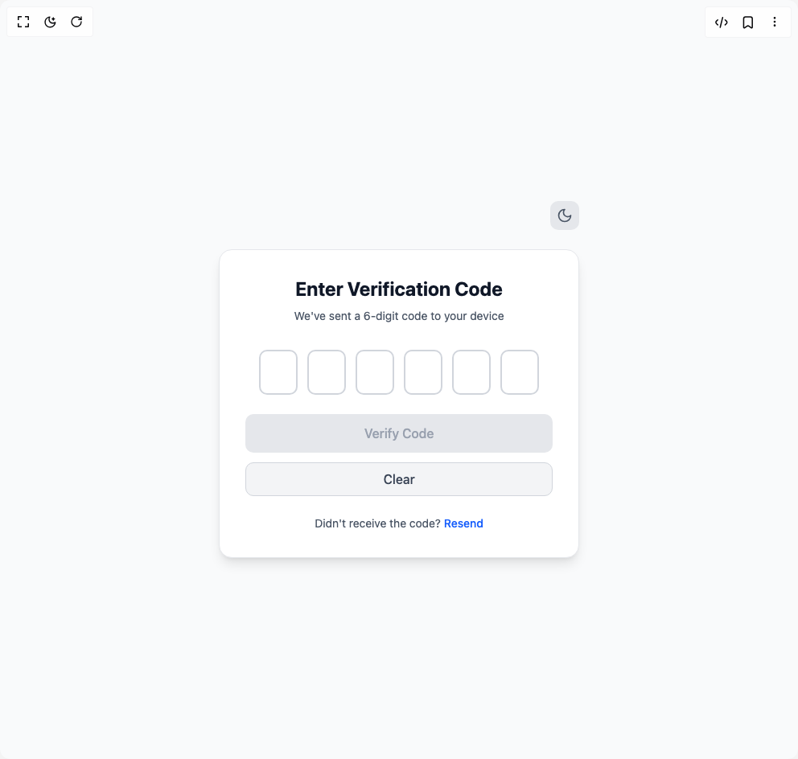

# Build Otp Input in BuilderStudio

> Build this component in our Agentic IDE: [BuilderStudio](https://builderstudio.dev).
>
> Join the BuilderStudio community on [Discord](https://discord.gg/QdWeSGCqfe) and [Reddit](https://reddit.com/r/builderstudio).



## Component

- Author group: `avanishverma4`
- Component: `otp-input`
- Variant: `default`
- Rendered HTML snapshot: [`rendered.html`](rendered.html)

## BuilderStudio prompt

You are implementing a React component based on a component reference.

## Component identity

- Author: avanishverma4
- Component slug: otp-input
- Demo slug: default
- Title: otp-input
- Description: 

## Goal

Recreate this component in a React + TypeScript + Tailwind CSS project. Preserve the visual layout, spacing, colors, border radius, shadows, interaction behavior, animation behavior, responsive behavior, and dark mode behavior shown in the rendered demo.

## Implementation requirements

- Use React and TypeScript.
- Use Tailwind CSS classes whenever possible.
- Keep the component self-contained unless the source files require helper components.
- If the source uses CSS variables, custom CSS, animations, or keyframes, include them.
- If the source uses external packages, list and use the required packages.
- Preserve accessibility attributes, button semantics, links, keyboard behavior, and ARIA attributes when visible in the source.
- Do not replace the component with a simplified placeholder.
- Return complete production-ready code.

## Dependencies

No reference metadata available.

## Rendered DOM snapshot

This is the rendered demo HTML extracted from the live preview. Use it to verify structure, class names, visible content, and layout.

```html
<div id="root"><div class="w-screen min-h-screen flex justify-center items-center"><div class="w-screen min-h-screen flex justify-center items-center"><div class="bg-gray-50 text-gray-900 min-h-screen w-full flex items-center justify-center p-4 transition-colors duration-200"><div class="w-full max-w-md"><div class="flex justify-end mb-6"><button class="bg-gray-200 hover:bg-gray-300 text-gray-600 p-2 rounded-lg transition-colors duration-200" aria-label="Toggle theme"><svg xmlns="http://www.w3.org/2000/svg" width="20" height="20" viewBox="0 0 24 24" fill="none" stroke="currentColor" stroke-width="2" stroke-linecap="round" stroke-linejoin="round" class="lucide lucide-moon" aria-hidden="true"><path d="M12 3a6 6 0 0 0 9 9 9 9 0 1 1-9-9Z"></path></svg></button></div><div class="bg-white border-gray-200 shadow-lg rounded-2xl border p-8 transition-colors duration-200"><div class="text-center mb-8"><h1 class="text-2xl font-bold mb-2">Enter Verification Code</h1><p class="text-sm text-gray-600">We've sent a 6-digit code to your device</p></div><div class="flex justify-center gap-3 mb-6"><input class="
                  w-12 h-14 text-center text-xl font-semibold rounded-lg border-2 transition-all duration-200
                  focus:outline-none focus:ring-2 focus:ring-offset-2
                  bg-white border-gray-300 text-gray-900 focus:border-blue-500 focus:ring-blue-500
                  focus:ring-offset-white
                " maxlength="1" autocomplete="off" type="text" value=""><input class="
                  w-12 h-14 text-center text-xl font-semibold rounded-lg border-2 transition-all duration-200
                  focus:outline-none focus:ring-2 focus:ring-offset-2
                  bg-white border-gray-300 text-gray-900 focus:border-blue-500 focus:ring-blue-500
                  focus:ring-offset-white
                " maxlength="1" autocomplete="off" type="text" value=""><input class="
                  w-12 h-14 text-center text-xl font-semibold rounded-lg border-2 transition-all duration-200
                  focus:outline-none focus:ring-2 focus:ring-offset-2
                  bg-white border-gray-300 text-gray-900 focus:border-blue-500 focus:ring-blue-500
                  focus:ring-offset-white
                " maxlength="1" autocomplete="off" type="text" value=""><input class="
                  w-12 h-14 text-center text-xl font-semibold rounded-lg border-2 transition-all duration-200
                  focus:outline-none focus:ring-2 focus:ring-offset-2
                  bg-white border-gray-300 text-gray-900 focus:border-blue-500 focus:ring-blue-500
                  focus:ring-offset-white
                " maxlength="1" autocomplete="off" type="text" value=""><input class="
                  w-12 h-14 text-center text-xl font-semibold rounded-lg border-2 transition-all duration-200
                  focus:outline-none focus:ring-2 focus:ring-offset-2
                  bg-white border-gray-300 text-gray-900 focus:border-blue-500 focus:ring-blue-500
                  focus:ring-offset-white
                " maxlength="1" autocomplete="off" type="text" value=""><input class="
                  w-12 h-14 text-center text-xl font-semibold rounded-lg border-2 transition-all duration-200
                  focus:outline-none focus:ring-2 focus:ring-offset-2
                  bg-white border-gray-300 text-gray-900 focus:border-blue-500 focus:ring-blue-500
                  focus:ring-offset-white
                " maxlength="1" autocomplete="off" type="text" value=""></div><div class="space-y-3"><button disabled="" class="
                w-full py-3 px-4 rounded-lg font-medium transition-all duration-200
                bg-gray-200 text-gray-400 cursor-not-allowed
              ">Verify Code</button><div class="flex gap-2"><button class="flex-1 py-2 px-4 rounded-lg font-medium border transition-colors duration-200 bg-gray-100 hover:bg-gray-200 text-gray-700 border-gray-300">Clear</button></div></div><div class="mt-6 text-center"><p class="text-sm text-gray-600">Didn't receive the code? <button class="font-medium text-blue-600 hover:text-blue-500 transition-colors">Resend</button></p></div></div></div></div></div></div></div>
```

## Reference source files

No reference source files were available.
