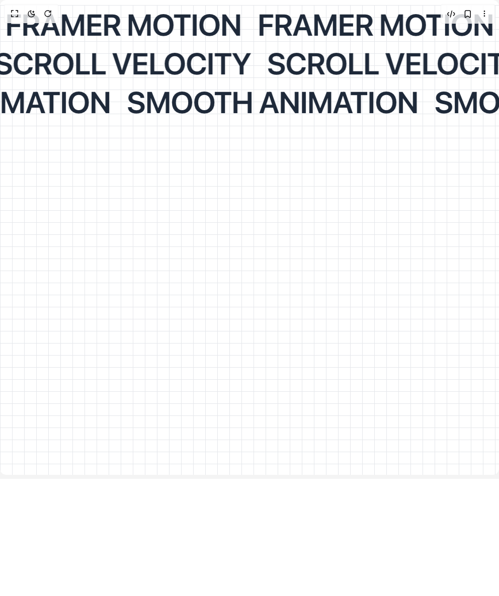

# Build Parallax Text Scroll in BuilderStudio

> Build this component in our Agentic IDE: [BuilderStudio](https://builderstudio.dev).
>
> Join the BuilderStudio community on [Discord](https://discord.gg/QdWeSGCqfe) and [Reddit](https://reddit.com/r/builderstudio).



## Component

- Author group: `avanishverma4`
- Component: `parallax-text-scroll`
- Variant: `default`
- Rendered HTML snapshot: [`rendered.html`](rendered.html)

## BuilderStudio prompt

You are implementing a React component based on a component reference.

## Component identity

- Author: avanishverma4
- Component slug: parallax-text-scroll
- Demo slug: default
- Title: parallax-text-scroll
- Description: 

## Goal

Recreate this component in a React + TypeScript + Tailwind CSS project. Preserve the visual layout, spacing, colors, border radius, shadows, interaction behavior, animation behavior, responsive behavior, and dark mode behavior shown in the rendered demo.

## Implementation requirements

- Use React and TypeScript.
- Use Tailwind CSS classes whenever possible.
- Keep the component self-contained unless the source files require helper components.
- If the source uses CSS variables, custom CSS, animations, or keyframes, include them.
- If the source uses external packages, list and use the required packages.
- Preserve accessibility attributes, button semantics, links, keyboard behavior, and ARIA attributes when visible in the source.
- Do not replace the component with a simplified placeholder.
- Return complete production-ready code.

## Dependencies

No reference metadata available.

## Rendered DOM snapshot

This is the rendered demo HTML extracted from the live preview. Use it to verify structure, class names, visible content, and layout.

```html
<div id="root"><div class="w-screen min-h-screen flex justify-center items-center"><div class="w-screen min-h-screen flex justify-center items-center"><div class="w-full min-h-screen bg-white text-gray-800 font-sans antialiased overflow-auto flex flex-col justify-center mt-[10px]" style="background-image: linear-gradient(to right, rgb(229, 231, 235) 1px, transparent 1px), linear-gradient(rgb(229, 231, 235) 1px, transparent 1px); background-size: 24px 24px;"><section class="py-2 relative"><div class="overflow-hidden -tracking-wider leading-[0.8] m-0 whitespace-nowrap flex flex-nowrap mt-[1px]"><div class="font-semibold uppercase text-6xl flex whitespace-nowrap flex-nowrap will-change-transform" style="transform: translateX(-24.187%);"><span class="block mr-8">Framer Motion </span><span class="block mr-8">Framer Motion </span><span class="block mr-8">Framer Motion </span><span class="block mr-8">Framer Motion </span></div></div></section><section class="py-2 relative"><div class="overflow-hidden -tracking-wider leading-[0.8] m-0 whitespace-nowrap flex flex-nowrap mt-[1px]"><div class="font-semibold uppercase text-6xl flex whitespace-nowrap flex-nowrap will-change-transform" style="transform: translateX(-25.813%);"><span class="block mr-8">Scroll Velocity </span><span class="block mr-8">Scroll Velocity </span><span class="block mr-8">Scroll Velocity </span><span class="block mr-8">Scroll Velocity </span></div></div></section><section class="py-2 relative"><div class="overflow-hidden -tracking-wider leading-[0.8] m-0 whitespace-nowrap flex flex-nowrap mt-[1px]"><div class="font-semibold uppercase text-6xl flex whitespace-nowrap flex-nowrap will-change-transform" style="transform: translateX(-39.5122%);"><span class="block mr-8">Smooth Animation </span><span class="block mr-8">Smooth Animation </span><span class="block mr-8">Smooth Animation </span><span class="block mr-8">Smooth Animation </span></div></div></section><div class="h-screen"></div></div></div></div></div>
```

## Reference source files

No reference source files were available.
