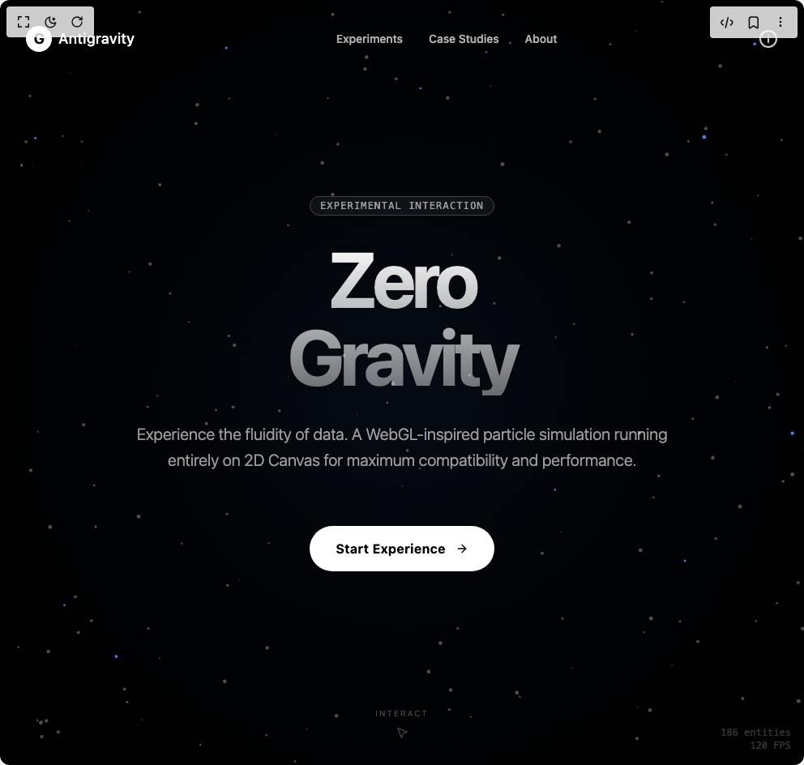

# Build Particle Effect For Hero in BuilderStudio

> Build this component in our Agentic IDE: [BuilderStudio](https://builderstudio.dev).
>
> Join the BuilderStudio community on [Discord](https://discord.gg/QdWeSGCqfe) and [Reddit](https://reddit.com/r/builderstudio).



## Component

- Author group: `avanishverma4`
- Component: `particle-effect-for-hero`
- Variant: `default`
- Rendered HTML snapshot: [`rendered.html`](rendered.html)

## BuilderStudio prompt

You are implementing a React component based on a component reference.

## Component identity

- Author: avanishverma4
- Component slug: particle-effect-for-hero
- Demo slug: default
- Title: particle-effect-for-hero
- Description: 

## Goal

Recreate this component in a React + TypeScript + Tailwind CSS project. Preserve the visual layout, spacing, colors, border radius, shadows, interaction behavior, animation behavior, responsive behavior, and dark mode behavior shown in the rendered demo.

## Implementation requirements

- Use React and TypeScript.
- Use Tailwind CSS classes whenever possible.
- Keep the component self-contained unless the source files require helper components.
- If the source uses CSS variables, custom CSS, animations, or keyframes, include them.
- If the source uses external packages, list and use the required packages.
- Preserve accessibility attributes, button semantics, links, keyboard behavior, and ARIA attributes when visible in the source.
- Do not replace the component with a simplified placeholder.
- Return complete production-ready code.

## Dependencies

No reference metadata available.

## Rendered DOM snapshot

This is the rendered demo HTML extracted from the live preview. Use it to verify structure, class names, visible content, and layout.

```html
<div id="root"><div class="w-screen min-h-screen flex justify-center items-center"><div class="w-screen min-h-screen flex justify-center items-center"><div class="relative w-full h-screen bg-black overflow-hidden selection:bg-blue-500 selection:text-white"><div class="absolute inset-0 z-0 overflow-hidden bg-black cursor-crosshair"><canvas class="block w-full h-full" width="992" height="944" style="width: 992px; height: 944px;"></canvas><div class="absolute bottom-4 right-4 pointer-events-none text-xs text-white/20 font-mono text-right"><p>186 entities</p><p>115 FPS</p></div></div><nav class="absolute top-0 left-0 w-full z-20 flex justify-between items-center p-6 md:p-8"><div class="flex items-center space-x-2"><div class="w-8 h-8 bg-white rounded-full flex items-center justify-center"><span class="font-bold text-black text-lg">G</span></div><span class="text-white font-medium tracking-wide text-lg">Antigravity</span></div><div class="hidden md:flex space-x-8 text-sm font-medium text-white/70"><a href="#" class="hover:text-white transition-colors">Experiments</a><a href="#" class="hover:text-white transition-colors">Case Studies</a><a href="#" class="hover:text-white transition-colors">About</a></div><button class="text-white/80 hover:text-white transition-colors"><svg xmlns="http://www.w3.org/2000/svg" width="24" height="24" viewBox="0 0 24 24" fill="none" stroke="currentColor" stroke-width="2" stroke-linecap="round" stroke-linejoin="round" class="lucide lucide-info" aria-hidden="true"><circle cx="12" cy="12" r="10"></circle><path d="M12 16v-4"></path><path d="M12 8h.01"></path></svg></button></nav><div class="absolute inset-0 z-10 flex flex-col items-center justify-center pointer-events-none px-4"><div class="max-w-4xl w-full text-center space-y-8"><div class="inline-block animate-fade-in-up"><span class="py-1 px-3 border border-white/20 rounded-full text-xs font-mono text-white/60 tracking-widest uppercase bg-white/5 backdrop-blur-sm">Experimental Interaction</span></div><h1 class="text-6xl md:text-8xl lg:text-9xl font-bold text-transparent bg-clip-text bg-gradient-to-b from-white to-white/40 tracking-tighter mix-blend-difference">Zero<br>Gravity</h1><p class="max-w-2xl mx-auto text-lg md:text-xl text-white/60 font-light leading-relaxed">Experience the fluidity of data. A WebGL-inspired particle simulation running entirely on 2D Canvas for maximum compatibility and performance.</p><div class="pt-8 pointer-events-auto"><button class="group relative inline-flex items-center gap-3 px-8 py-4 bg-white text-black rounded-full font-bold tracking-wide overflow-hidden transition-transform hover:scale-105 active:scale-95"><span class="relative z-10">Start Experience</span><svg xmlns="http://www.w3.org/2000/svg" width="24" height="24" viewBox="0 0 24 24" fill="none" stroke="currentColor" stroke-width="2" stroke-linecap="round" stroke-linejoin="round" class="lucide lucide-arrow-right w-4 h-4 relative z-10 group-hover:translate-x-1 transition-transform" aria-hidden="true"><path d="M5 12h14"></path><path d="m12 5 7 7-7 7"></path></svg><div class="absolute inset-0 bg-blue-500 transform scale-x-0 group-hover:scale-x-100 transition-transform origin-left duration-300 ease-out opacity-10"></div></button></div></div></div><div class="absolute bottom-8 left-1/2 -translate-x-1/2 flex flex-col items-center gap-2 text-white/30 animate-pulse pointer-events-none"><span class="text-[10px] uppercase tracking-[0.2em]">Interact</span><svg xmlns="http://www.w3.org/2000/svg" width="16" height="16" viewBox="0 0 24 24" fill="none" stroke="currentColor" stroke-width="2" stroke-linecap="round" stroke-linejoin="round" class="lucide lucide-mouse-pointer2 lucide-mouse-pointer-2" aria-hidden="true"><path d="M4.037 4.688a.495.495 0 0 1 .651-.651l16 6.5a.5.5 0 0 1-.063.947l-6.124 1.58a2 2 0 0 0-1.438 1.435l-1.579 6.126a.5.5 0 0 1-.947.063z"></path></svg></div></div></div></div></div>
```

## Reference source files

No reference source files were available.
