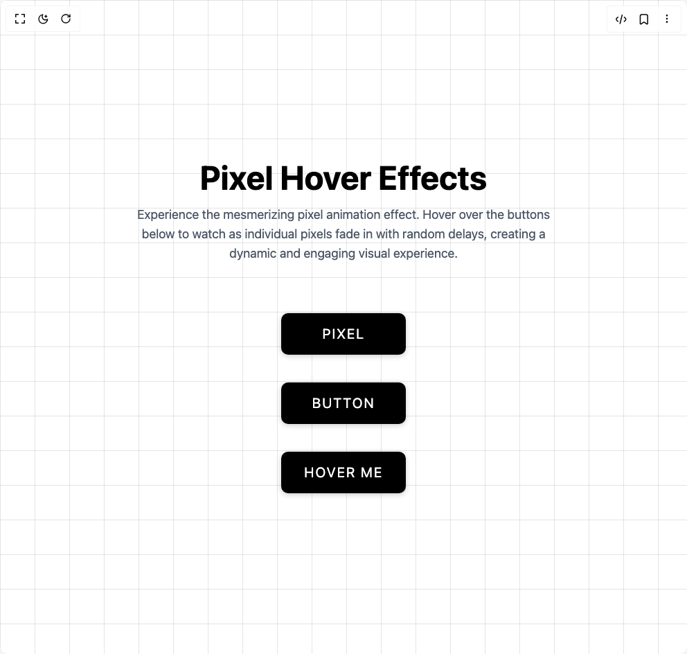

# Build Pixel Hover Effect in BuilderStudio

> Build this component in our Agentic IDE: [BuilderStudio](https://builderstudio.dev).
>
> Join the BuilderStudio community on [Discord](https://discord.gg/QdWeSGCqfe) and [Reddit](https://reddit.com/r/builderstudio).



## Component

- Author group: `avanishverma4`
- Component: `pixel-hover-effect`
- Variant: `default`
- Rendered HTML snapshot: [`rendered.html`](rendered.html)

## BuilderStudio prompt

You are implementing a React component based on a component reference.

## Component identity

- Author: avanishverma4
- Component slug: pixel-hover-effect
- Demo slug: default
- Title: pixel-hover-effect
- Description: 

## Goal

Recreate this component in a React + TypeScript + Tailwind CSS project. Preserve the visual layout, spacing, colors, border radius, shadows, interaction behavior, animation behavior, responsive behavior, and dark mode behavior shown in the rendered demo.

## Implementation requirements

- Use React and TypeScript.
- Use Tailwind CSS classes whenever possible.
- Keep the component self-contained unless the source files require helper components.
- If the source uses CSS variables, custom CSS, animations, or keyframes, include them.
- If the source uses external packages, list and use the required packages.
- Preserve accessibility attributes, button semantics, links, keyboard behavior, and ARIA attributes when visible in the source.
- Do not replace the component with a simplified placeholder.
- Return complete production-ready code.

## Dependencies

No reference metadata available.

## Rendered DOM snapshot

This is the rendered demo HTML extracted from the live preview. Use it to verify structure, class names, visible content, and layout.

```html
<div id="root"><div class="w-screen min-h-screen flex justify-center items-center"><div class="w-screen min-h-screen flex justify-center items-center"><div class="w-full min-h-screen bg-white flex flex-col items-center justify-center gap-10 relative overflow-hidden"><div class="grid-background"></div><div class="text-center mb-8 z-10"><h1 class="text-5xl font-bold text-black mb-4">Pixel Hover Effects</h1><p class="text-gray-600 text-lg max-w-2xl px-4">Experience the mesmerizing pixel animation effect. Hover over the buttons below to watch as individual pixels fade in with random delays, creating a dynamic and engaging visual experience.</p></div><style>
        .grid-background {
          position: absolute;
          top: 0;
          left: 0;
          width: 100%;
          height: 100%;
          background-image: 
            linear-gradient(rgba(0, 0, 0, 0.1) 1px, transparent 1px),
            linear-gradient(90deg, rgba(0, 0, 0, 0.1) 1px, transparent 1px);
          background-size: 50px 50px;
          z-index: 0;
        }

        .pixel-btn {
          position: relative;
          width: 180px;
          height: 60px;
          border: none;
          outline: none;
          color: #fff;
          background: #000;
          cursor: pointer;
          font-size: 1.25em;
          letter-spacing: 0.1em;
          font-weight: 400;
          text-transform: uppercase;
          border-radius: 10px;
          box-shadow: 0 2px 8px rgba(0, 0, 0, 0.2);
          transition: box-shadow 0.3s ease;
        }

        .pixel-btn:hover {
          box-shadow: 0 4px 12px rgba(0, 0, 0, 0.3);
        }

        .pixel-container {
          position: absolute;
          top: 0;
          left: 0;
          width: 100%;
          height: 100%;
          z-index: 1;
          pointer-events: none;
          border-radius: 10px;
          overflow: hidden;
        }

        .pixel {
          position: absolute;
          width: 10px;
          height: 10px;
          pointer-events: none;
          background: var(--clr);
          border: 1px solid rgba(0, 0, 0, 0.25);
          opacity: 0;
          transition: opacity 0.5s ease;
        }

        .pixel-btn:hover .pixel {
          opacity: 1;
        }
      </style><button class="pixel-btn"><span class="relative z-10">Pixel</span><div class="pixel-container" style="--clr: #ff5722;"><div class="pixel" style="left: 0px; top: 0px; transition-delay: 0.964705s;"></div><div class="pixel" style="left: 10px; top: 0px; transition-delay: 0.997972s;"></div><div class="pixel" style="left: 20px; top: 0px; transition-delay: 0.562738s;"></div><div class="pixel" style="left: 30px; top: 0px; transition-delay: 0.0431675s;"></div><div class="pixel" style="left: 40px; top: 0px; transition-delay: 0.658872s;"></div><div class="pixel" style="left: 50px; top: 0px; transition-delay: 0.652038s;"></div><div class="pixel" style="left: 60px; top: 0px; transition-delay: 0.327785s;"></div><div class="pixel" style="left: 70px; top: 0px; transition-delay: 0.133794s;"></div><div class="pixel" style="left: 80px; top: 0px; transition-delay: 0.659922s;"></div><div class="pixel" style="left: 90px; top: 0px; transition-delay: 0.162009s;"></div><div class="pixel" style="left: 100px; top: 0px; transition-delay: 0.423412s;"></div><div class="pixel" style="left: 110px; top: 0px; transition-delay: 0.486544s;"></div><div class="pixel" style="left: 120px; top: 0px; transition-delay: 0.759459s;"></div><div class="pixel" style="left: 130px; top: 0px; transition-delay: 0.145187s;"></div><div class="pixel" style="left: 140px; top: 0px; transition-delay: 0.268693s;"></div><div class="pixel" style="left: 150px; top: 0px; transition-delay: 0.764825s;"></div><div class="pixel" style="left: 160px; top: 0px; transition-delay: 0.942175s;"></div><div class="pixel" style="left: 170px; top: 0px; transition-delay: 0.870742s;"></div><div class="pixel" style="left: 0px; top: 10px; transition-delay: 0.827001s;"></div><div class="pixel" style="left: 10px; top: 10px; transition-delay: 0.724039s;"></div><div class="pixel" style="left: 20px; top: 10px; transition-delay: 0.659606s;"></div><div class="pixel" style="left: 30px; top: 10px; transition-delay: 0.67132s;"></div><div class="pixel" style="left: 40px; top: 10px; transition-delay: 0.114688s;"></div><div class="pixel" style="left: 50px; top: 10px; transition-delay: 0.104865s;"></div><div class="pixel" style="left: 60px; top: 10px; transition-delay: 0.9761s;"></div><div class="pixel" style="left: 70px; top: 10px; transition-delay: 0.796374s;"></div><div class="pixel" style="left: 80px; top: 10px; transition-delay: 0.760398s;"></div><div class="pixel" style="left: 90px; top: 10px; transition-delay: 0.272987s;"></div><div class="pixel" style="left: 100px; top: 10px; transition-delay: 0.671097s;"></div><div class="pixel" style="left: 110px; top: 10px; transition-delay: 0.261369s;"></div><div class="pixel" style="left: 120px; top: 10px; transition-delay: 0.876937s;"></div><div class="pixel" style="left: 130px; top: 10px; transition-delay: 0.909455s;"></div><div class="pixel" style="left: 140px; top: 10px; transition-delay: 0.0914754s;"></div><div class="pixel" style="left: 150px; top: 10px; transition-delay: 0.000957714s;"></div><div class="pixel" style="left: 160px; top: 10px; transition-delay: 0.305028s;"></div><div class="pixel" style="left: 170px; top: 10px; transition-delay: 0.474444s;"></div><div class="pixel" style="left: 0px; top: 20px; transition-delay: 0.087096s;"></div><div class="pixel" style="left: 10px; top: 20px; transition-delay: 0.242158s;"></div><div class="pixel" style="left: 20px; top: 20px; transition-delay: 0.653894s;"></div><div class="pixel" style="left: 30px; top: 20px; transition-delay: 0.729801s;"></div><div class="pixel" style="left: 40px; top: 20px; transition-delay: 0.306285s;"></div><div class="pixel" style="left: 50px; top: 20px; transition-delay: 0.467946s;"></div><div class="pixel" style="left: 60px; top: 20px; transition-delay: 0.988238s;"></div><div class="pixel" style="left: 70px; top: 20px; transition-delay: 0.117025s;"></div><div class="pixel" style="left: 80px; top: 20px; transition-delay: 0.845616s;"></div><div class="pixel" style="left: 90px; top: 20px; transition-delay: 0.0223587s;"></div><div class="pixel" style="left: 100px; top: 20px; transition-delay: 0.324459s;"></div><div class="pixel" style="left: 110px; top: 20px; transition-delay: 0.384311s;"></div><div class="pixel" style="left: 120px; top: 20px; transition-delay: 0.61425s;"></div><div class="pixel" style="left: 130px; top: 20px; transition-delay: 0.0803559s;"></div><div class="pixel" style="left: 140px; top: 20px; transition-delay: 0.62912s;"></div><div class="pixel" style="left: 150px; top: 20px; transition-delay: 0.31627s;"></div><div class="pixel" style="left: 160px; top: 20px; transition-delay: 0.0265966s;"></div><div class="pixel" style="left: 170px; top: 20px; transition-delay: 0.168653s;"></div><div class="pixel" style="left: 0px; top: 30px; transition-delay: 0.328744s;"></div><div class="pixel" style="left: 10px; top: 30px; transition-delay: 0.794107s;"></div><div class="pixel" style="left: 20px; top: 30px; transition-delay: 0.637155s;"></div><div class="pixel" style="left: 30px; top: 30px; transition-delay: 0.509284s;"></div><div class="pixel" style="left: 40px; top: 30px; transition-delay: 0.893416s;"></div><div class="pixel" style="left: 50px; top: 30px; transition-delay: 0.210668s;"></div><div class="pixel" style="left: 60px; top: 30px; transition-delay: 0.327112s;"></div><div class="pixel" style="left: 70px; top: 30px; transition-delay: 0.476278s;"></div><div class="pixel" style="left: 80px; top: 30px; transition-delay: 0.237191s;"></div><div class="pixel" style="left: 90px; top: 30px; transition-delay: 0.0882921s;"></div><div class="pixel" style="left: 100px; top: 30px; transition-delay: 0.814999s;"></div><div class="pixel" style="left: 110px; top: 30px; transition-delay: 0.725493s;"></div><div class="pixel" style="left: 120px; top: 30px; transition-delay: 0.119364s;"></div><div class="pixel" style="left: 130px; top: 30px; transition-delay: 0.487488s;"></div><div class="pixel" style="left: 140px; top: 30px; transition-delay: 0.784331s;"></div><div class="pixel" style="left: 150px; top: 30px; transition-delay: 0.488702s;"></div><div class="pixel" style="left: 160px; top: 30px; transition-delay: 0.879802s;"></div><div class="pixel" style="left: 170px; top: 30px; transition-delay: 0.190216s;"></div><div class="pixel" style="left: 0px; top: 40px; transition-delay: 0.89593s;"></div><div class="pixel" style="left: 10px; top: 40px; transition-delay: 0.246686s;"></div><div class="pixel" style="left: 20px; top: 40px; transition-delay: 0.760881s;"></div><div class="pixel" style="left: 30px; top: 40px; transition-delay: 0.179798s;"></div><div class="pixel" style="left: 40px; top: 40px; transition-delay: 0.277532s;"></div><div class="pixel" style="left: 50px; top: 40px; transition-delay: 0.9649s;"></div><div class="pixel" style="left: 60px; top: 40px; transition-delay: 0.640546s;"></div><div class="pixel" style="left: 70px; top: 40px; transition-delay: 0.92648s;"></div><div class="pixel" style="left: 80px; top: 40px; transition-delay: 0.725252s;"></div><div class="pixel" style="left: 90px; top: 40px; transition-delay: 0.137243s;"></div><div class="pixel" style="left: 100px; top: 40px; transition-delay: 0.0377323s;"></div><div class="pixel" style="left: 110px; top: 40px; transition-delay: 0.717083s;"></div><div class="pixel" style="left: 120px; top: 40px; transition-delay: 0.157203s;"></div><div class="pixel" style="left: 130px; top: 40px; transition-delay: 0.0318339s;"></div><div class="pixel" style="left: 140px; top: 40px; transition-delay: 0.452274s;"></div><div class="pixel" style="left: 150px; top: 40px; transition-delay: 0.549363s;"></div><div class="pixel" style="left: 160px; top: 40px; transition-delay: 0.93471s;"></div><div class="pixel" style="left: 170px; top: 40px; transition-delay: 0.335366s;"></div><div class="pixel" style="left: 0px; top: 50px; transition-delay: 0.878405s;"></div><div class="pixel" style="left: 10px; top: 50px; transition-delay: 0.441974s;"></div><div class="pixel" style="left: 20px; top: 50px; transition-delay: 0.451722s;"></div><div class="pixel" style="left: 30px; top: 50px; transition-delay: 0.628183s;"></div><div class="pixel" style="left: 40px; top: 50px; transition-delay: 0.264194s;"></div><div class="pixel" style="left: 50px; top: 50px; transition-delay: 0.751581s;"></div><div class="pixel" style="left: 60px; top: 50px; transition-delay: 0.514351s;"></div><div class="pixel" style="left: 70px; top: 50px; transition-delay: 0.953528s;"></div><div class="pixel" style="left: 80px; top: 50px; transition-delay: 0.0540609s;"></div><div class="pixel" style="left: 90px; top: 50px; transition-delay: 0.475183s;"></div><div class="pixel" style="left: 100px; top: 50px; transition-delay: 0.193354s;"></div><div class="pixel" style="left: 110px; top: 50px; transition-delay: 0.96031s;"></div><div class="pixel" style="left: 120px; top: 50px; transition-delay: 0.836837s;"></div><div class="pixel" style="left: 130px; top: 50px; transition-delay: 0.422942s;"></div><div class="pixel" style="left: 140px; top: 50px; transition-delay: 0.501922s;"></div><div class="pixel" style="left: 150px; top: 50px; transition-delay: 0.253528s;"></div><div class="pixel" style="left: 160px; top: 50px; transition-delay: 0.709261s;"></div><div class="pixel" style="left: 170px; top: 50px; transition-delay: 0.210961s;"></div></div></button><button class="pixel-btn"><span class="relative z-10">Button</span><div class="pixel-container" style="--clr: #03a9f4;"><div class="pixel" style="left: 0px; top: 0px; transition-delay: 0.128357s;"></div><div class="pixel" style="left: 10px; top: 0px; transition-delay: 0.0530449s;"></div><div class="pixel" style="left: 20px; top: 0px; transition-delay: 0.60336s;"></div><div class="pixel" style="left: 30px; top: 0px; transition-delay: 0.524333s;"></div><div class="pixel" style="left: 40px; top: 0px; transition-delay: 0.360959s;"></div><div class="pixel" style="left: 50px; top: 0px; transition-delay: 0.718156s;"></div><div class="pixel" style="left: 60px; top: 0px; transition-delay: 0.530924s;"></div><div class="pixel" style="left: 70px; top: 0px; transition-delay: 0.173819s;"></div><div class="pixel" style="left: 80px; top: 0px; transition-delay: 0.927608s;"></div><div class="pixel" style="left: 90px; top: 0px; transition-delay: 0.104292s;"></div><div class="pixel" style="left: 100px; top: 0px; transition-delay: 0.726281s;"></div><div class="pixel" style="left: 110px; top: 0px; transition-delay: 0.308775s;"></div><div class="pixel" style="left: 120px; top: 0px; transition-delay: 0.705457s;"></div><div class="pixel" style="left: 130px; top: 0px; transition-delay: 0.0918202s;"></div><div class="pixel" style="left: 140px; top: 0px; transition-delay: 0.146485s;"></div><div class="pixel" style="left: 150px; top: 0px; transition-delay: 0.127515s;"></div><div class="pixel" style="left: 160px; top: 0px; transition-delay: 0.875672s;"></div><div class="pixel" style="left: 170px; top: 0px; transition-delay: 0.175862s;"></div><div class="pixel" style="left: 0px; top: 10px; transition-delay: 0.690266s;"></div><div class="pixel" style="left: 10px; top: 10px; transition-delay: 0.273938s;"></div><div class="pixel" style="left: 20px; top: 10px; transition-delay: 0.578099s;"></div><div class="pixel" style="left: 30px; top: 10px; transition-delay: 0.174582s;"></div><div class="pixel" style="left: 40px; top: 10px; transition-delay: 0.311981s;"></div><div class="pixel" style="left: 50px; top: 10px; transition-delay: 0.232646s;"></div><div class="pixel" style="left: 60px; top: 10px; transition-delay: 0.595403s;"></div><div class="pixel" style="left: 70px; top: 10px; transition-delay: 0.847704s;"></div><div class="pixel" style="left: 80px; top: 10px; transition-delay: 0.0808478s;"></div><div class="pixel" style="left: 90px; top: 10px; transition-delay: 0.853946s;"></div><div class="pixel" style="left: 100px; top: 10px; transition-delay: 0.910855s;"></div><div class="pixel" style="left: 110px; top: 10px; transition-delay: 0.163837s;"></div><div class="pixel" style="left: 120px; top: 10px; transition-delay: 0.20764s;"></div><div class="pixel" style="left: 130px; top: 10px; transition-delay: 0.587621s;"></div><div class="pixel" style="left: 140px; top: 10px; transition-delay: 0.0899505s;"></div><div class="pixel" style="left: 150px; top: 10px; transition-delay: 0.964122s;"></div><div class="pixel" style="left: 160px; top: 10px; transition-delay: 0.861861s;"></div><div class="pixel" style="left: 170px; top: 10px; transition-delay: 0.272303s;"></div><div class="pixel" style="left: 0px; top: 20px; transition-delay: 0.139204s;"></div><div class="pixel" style="left: 10px; top: 20px; transition-delay: 0.701569s;"></div><div class="pixel" style="left: 20px; top: 20px; transition-delay: 0.647188s;"></div><div class="pixel" style="left: 30px; top: 20px; transition-delay: 0.314611s;"></div><div class="pixel" style="left: 40px; top: 20px; transition-delay: 0.992426s;"></div><div class="pixel" style="left: 50px; top: 20px; transition-delay: 0.129982s;"></div><div class="pixel" style="left: 60px; top: 20px; transition-delay: 0.630581s;"></div><div class="pixel" style="left: 70px; top: 20px; transition-delay: 0.991427s;"></div><div class="pixel" style="left: 80px; top: 20px; transition-delay: 0.783683s;"></div><div class="pixel" style="left: 90px; top: 20px; transition-delay: 0.332453s;"></div><div class="pixel" style="left: 100px; top: 20px; transition-delay: 0.933268s;"></div><div class="pixel" style="left: 110px; top: 20px; transition-delay: 0.165914s;"></div><div class="pixel" style="left: 120px; top: 20px; transition-delay: 0.312707s;"></div><div class="pixel" style="left: 130px; top: 20px; transition-delay: 0.162039s;"></div><div class="pixel" style="left: 140px; top: 20px; transition-delay: 0.723232s;"></div><div class="pixel" style="left: 150px; top: 20px; transition-delay: 0.711814s;"></div><div class="pixel" style="left: 160px; top: 20px; transition-delay: 0.418742s;"></div><div class="pixel" style="left: 170px; top: 20px; transition-delay: 0.37492s;"></div><div class="pixel" style="left: 0px; top: 30px; transition-delay: 0.896905s;"></div><div class="pixel" style="left: 10px; top: 30px; transition-delay: 0.848507s;"></div><div class="pixel" style="left: 20px; top: 30px; transition-delay: 0.433987s;"></div><div class="pixel" style="left: 30px; top: 30px; transition-delay: 0.554882s;"></div><div class="pixel" style="left: 40px; top: 30px; transition-delay: 0.945875s;"></div><div class="pixel" style="left: 50px; top: 30px; transition-delay: 0.155043s;"></div><div class="pixel" style="left: 60px; top: 30px; transition-delay: 0.990176s;"></div><div class="pixel" style="left: 70px; top: 30px; transition-delay: 0.998224s;"></div><div class="pixel" style="left: 80px; top: 30px; transition-delay: 0.681253s;"></div><div class="pixel" style="left: 90px; top: 30px; transition-delay: 0.901589s;"></div><div class="pixel" style="left: 100px; top: 30px; transition-delay: 0.393175s;"></div><div class="pixel" style="left: 110px; top: 30px; transition-delay: 0.396234s;"></div><div class="pixel" style="left: 120px; top: 30px; transition-delay: 0.223123s;"></div><div class="pixel" style="left: 130px; top: 30px; transition-delay: 0.2339s;"></div><div class="pixel" style="left: 140px; top: 30px; transition-delay: 0.952888s;"></div><div class="pixel" style="left: 150px; top: 30px; transition-delay: 0.328243s;"></div><div class="pixel" style="left: 160px; top: 30px; transition-delay: 0.765591s;"></div><div class="pixel" style="left: 170px; top: 30px; transition-delay: 0.891511s;"></div><div class="pixel" style="left: 0px; top: 40px; transition-delay: 0.0443344s;"></div><div class="pixel" style="left: 10px; top: 40px; transition-delay: 0.280707s;"></div><div class="pixel" style="left: 20px; top: 40px; transition-delay: 0.72941s;"></div><div class="pixel" style="left: 30px; top: 40px; transition-delay: 0.530569s;"></div><div class="pixel" style="left: 40px; top: 40px; transition-delay: 0.14649s;"></div><div class="pixel" style="left: 50px; top: 40px; transition-delay: 0.850277s;"></div><div class="pixel" style="left: 60px; top: 40px; transition-delay: 0.84055s;"></div><div class="pixel" style="left: 70px; top: 40px; transition-delay: 0.915047s;"></div><div class="pixel" style="left: 80px; top: 40px; transition-delay: 0.665822s;"></div><div class="pixel" style="left: 90px; top: 40px; transition-delay: 0.237707s;"></div><div class="pixel" style="left: 100px; top: 40px; transition-delay: 0.417022s;"></div><div class="pixel" style="left: 110px; top: 40px; transition-delay: 0.35557s;"></div><div class="pixel" style="left: 120px; top: 40px; transition-delay: 0.404652s;"></div><div class="pixel" style="left: 130px; top: 40px; transition-delay: 0.482265s;"></div><div class="pixel" style="left: 140px; top: 40px; transition-delay: 0.448385s;"></div><div class="pixel" style="left: 150px; top: 40px; transition-delay: 0.458583s;"></div><div class="pixel" style="left: 160px; top: 40px; transition-delay: 0.878158s;"></div><div class="pixel" style="left: 170px; top: 40px; transition-delay: 0.44267s;"></div><div class="pixel" style="left: 0px; top: 50px; transition-delay: 0.593422s;"></div><div class="pixel" style="left: 10px; top: 50px; transition-delay: 0.414017s;"></div><div class="pixel" style="left: 20px; top: 50px; transition-delay: 0.393552s;"></div><div class="pixel" style="left: 30px; top: 50px; transition-delay: 0.419734s;"></div><div class="pixel" style="left: 40px; top: 50px; transition-delay: 0.359422s;"></div><div class="pixel" style="left: 50px; top: 50px; transition-delay: 0.290453s;"></div><div class="pixel" style="left: 60px; top: 50px; transition-delay: 0.130382s;"></div><div class="pixel" style="left: 70px; top: 50px; transition-delay: 0.332909s;"></div><div class="pixel" style="left: 80px; top: 50px; transition-delay: 0.0545199s;"></div><div class="pixel" style="left: 90px; top: 50px; transition-delay: 0.013875s;"></div><div class="pixel" style="left: 100px; top: 50px; transition-delay: 0.165932s;"></div><div class="pixel" style="left: 110px; top: 50px; transition-delay: 0.431662s;"></div><div class="pixel" style="left: 120px; top: 50px; transition-delay: 0.431948s;"></div><div class="pixel" style="left: 130px; top: 50px; transition-delay: 0.27933s;"></div><div class="pixel" style="left: 140px; top: 50px; transition-delay: 0.74062s;"></div><div class="pixel" style="left: 150px; top: 50px; transition-delay: 0.140211s;"></div><div class="pixel" style="left: 160px; top: 50px; transition-delay: 0.576854s;"></div><div class="pixel" style="left: 170px; top: 50px; transition-delay: 0.96058s;"></div></div></button><button class="pixel-btn"><span class="relative z-10">Hover Me</span><div class="pixel-container" style="--clr: #4caf50;"><div class="pixel" style="left: 0px; top: 0px; transition-delay: 0.73957s;"></div><div class="pixel" style="left: 10px; top: 0px; transition-delay: 0.896798s;"></div><div class="pixel" style="left: 20px; top: 0px; transition-delay: 0.27131s;"></div><div class="pixel" style="left: 30px; top: 0px; transition-delay: 0.691911s;"></div><div class="pixel" style="left: 40px; top: 0px; transition-delay: 0.915875s;"></div><div class="pixel" style="left: 50px; top: 0px; transition-delay: 0.872601s;"></div><div class="pixel" style="left: 60px; top: 0px; transition-delay: 0.961135s;"></div><div class="pixel" style="left: 70px; top: 0px; transition-delay: 0.30175s;"></div><div class="pixel" style="left: 80px; top: 0px; transition-delay: 0.438113s;"></div><div class="pixel" style="left: 90px; top: 0px; transition-delay: 0.431054s;"></div><div class="pixel" style="left: 100px; top: 0px; transition-delay: 0.391205s;"></div><div class="pixel" style="left: 110px; top: 0px; transition-delay: 0.270826s;"></div><div class="pixel" style="left: 120px; top: 0px; transition-delay: 0.877229s;"></div><div class="pixel" style="left: 130px; top: 0px; transition-delay: 0.0171643s;"></div><div class="pixel" style="left: 140px; top: 0px; transition-delay: 0.113818s;"></div><div class="pixel" style="left: 150px; top: 0px; transition-delay: 0.151803s;"></div><div class="pixel" style="left: 160px; top: 0px; transition-delay: 0.485315s;"></div><div class="pixel" style="left: 170px; top: 0px; transition-delay: 0.855816s;"></div><div class="pixel" style="left: 0px; top: 10px; transition-delay: 0.846492s;"></div><div class="pixel" style="left: 10px; top: 10px; transition-delay: 0.541684s;"></div><div class="pixel" style="left: 20px; top: 10px; transition-delay: 0.0139519s;"></div><div class="pixel" style="left: 30px; top: 10px; transition-delay: 0.0440379s;"></div><div class="pixel" style="left: 40px; top: 10px; transition-delay: 0.136253s;"></div><div class="pixel" style="left: 50px; top: 10px; transition-delay: 0.359785s;"></div><div class="pixel" style="left: 60px; top: 10px; transition-delay: 0.49603s;"></div><div class="pixel" style="left: 70px; top: 10px; transition-delay: 0.359885s;"></div><div class="pixel" style="left: 80px; top: 10px; transition-delay: 0.229162s;"></div><div class="pixel" style="left: 90px; top: 10px; transition-delay: 0.56102s;"></div><div class="pixel" style="left: 100px; top: 10px; transition-delay: 0.301959s;"></div><div class="pixel" style="left: 110px; top: 10px; transition-delay: 0.51076s;"></div><div class="pixel" style="left: 120px; top: 10px; transition-delay: 0.934339s;"></div><div class="pixel" style="left: 130px; top: 10px; transition-delay: 0.267101s;"></div><div class="pixel" style="left: 140px; top: 10px; transition-delay: 0.206096s;"></div><div class="pixel" style="left: 150px; top: 10px; transition-delay: 0.393832s;"></div><div class="pixel" style="left: 160px; top: 10px; transition-delay: 0.929579s;"></div><div class="pixel" style="left: 170px; top: 10px; transition-delay: 0.109221s;"></div><div class="pixel" style="left: 0px; top: 20px; transition-delay: 0.748621s;"></div><div class="pixel" style="left: 10px; top: 20px; transition-delay: 0.71127s;"></div><div class="pixel" style="left: 20px; top: 20px; transition-delay: 0.457644s;"></div><div class="pixel" style="left: 30px; top: 20px; transition-delay: 0.673713s;"></div><div class="pixel" style="left: 40px; top: 20px; transition-delay: 0.257141s;"></div><div class="pixel" style="left: 50px; top: 20px; transition-delay: 0.789759s;"></div><div class="pixel" style="left: 60px; top: 20px; transition-delay: 0.706373s;"></div><div class="pixel" style="left: 70px; top: 20px; transition-delay: 0.840902s;"></div><div class="pixel" style="left: 80px; top: 20px; transition-delay: 0.464567s;"></div><div class="pixel" style="left: 90px; top: 20px; transition-delay: 0.933501s;"></div><div class="pixel" style="left: 100px; top: 20px; transition-delay: 0.199493s;"></div><div class="pixel" style="left: 110px; top: 20px; transition-delay: 0.892119s;"></div><div class="pixel" style="left: 120px; top: 20px; transition-delay: 0.297s;"></div><div class="pixel" style="left: 130px; top: 20px; transition-delay: 0.472425s;"></div><div class="pixel" style="left: 140px; top: 20px; transition-delay: 0.165619s;"></div><div class="pixel" style="left: 150px; top: 20px; transition-delay: 0.622393s;"></div><div class="pixel" style="left: 160px; top: 20px; transition-delay: 0.156028s;"></div><div class="pixel" style="left: 170px; top: 20px; transition-delay: 0.427469s;"></div><div class="pixel" style="left: 0px; top: 30px; transition-delay: 0.0332209s;"></div><div class="pixel" style="left: 10px; top: 30px; transition-delay: 0.0170325s;"></div><div class="pixel" style="left: 20px; top: 30px; transition-delay: 0.153714s;"></div><div class="pixel" style="left: 30px; top: 30px; transition-delay: 0.183723s;"></div><div class="pixel" style="left: 40px; top: 30px; transition-delay: 0.64366s;"></div><div class="pixel" style="left: 50px; top: 30px; transition-delay: 0.153124s;"></div><div class="pixel" style="left: 60px; top: 30px; transition-delay: 0.787566s;"></div><div class="pixel" style="left: 70px; top: 30px; transition-delay: 0.644971s;"></div><div class="pixel" style="left: 80px; top: 30px; transition-delay: 0.228765s;"></div><div class="pixel" style="left: 90px; top: 30px; transition-delay: 0.049354s;"></div><div class="pixel" style="left: 100px; top: 30px; transition-delay: 0.500011s;"></div><div class="pixel" style="left: 110px; top: 30px; transition-delay: 0.636699s;"></div><div class="pixel" style="left: 120px; top: 30px; transition-delay: 0.0338708s;"></div><div class="pixel" style="left: 130px; top: 30px; transition-delay: 0.220649s;"></div><div class="pixel" style="left: 140px; top: 30px; transition-delay: 0.913422s;"></div><div class="pixel" style="left: 150px; top: 30px; transition-delay: 0.60941s;"></div><div class="pixel" style="left: 160px; top: 30px; transition-delay: 0.373151s;"></div><div class="pixel" style="left: 170px; top: 30px; transition-delay: 0.79607s;"></div><div class="pixel" style="left: 0px; top: 40px; transition-delay: 0.82376s;"></div><div class="pixel" style="left: 10px; top: 40px; transition-delay: 0.75126s;"></div><div class="pixel" style="left: 20px; top: 40px; transition-delay: 0.327457s;"></div><div class="pixel" style="left: 30px; top: 40px; transition-delay: 0.586667s;"></div><div class="pixel" style="left: 40px; top: 40px; transition-delay: 0.9659s;"></div><div class="pixel" style="left: 50px; top: 40px; transition-delay: 0.398049s;"></div><div class="pixel" style="left: 60px; top: 40px; transition-delay: 0.741002s;"></div><div class="pixel" style="left: 70px; top: 40px; transition-delay: 0.201653s;"></div><div class="pixel" style="left: 80px; top: 40px; transition-delay: 0.617638s;"></div><div class="pixel" style="left: 90px; top: 40px; transition-delay: 0.437547s;"></div><div class="pixel" style="left: 100px; top: 40px; transition-delay: 0.748563s;"></div><div class="pixel" style="left: 110px; top: 40px; transition-delay: 0.732156s;"></div><div class="pixel" style="left: 120px; top: 40px; transition-delay: 0.0866252s;"></div><div class="pixel" style="left: 130px; top: 40px; transition-delay: 0.958108s;"></div><div class="pixel" style="left: 140px; top: 40px; transition-delay: 0.0258593s;"></div><div class="pixel" style="left: 150px; top: 40px; transition-delay: 0.338417s;"></div><div class="pixel" style="left: 160px; top: 40px; transition-delay: 0.882636s;"></div><div class="pixel" style="left: 170px; top: 40px; transition-delay: 0.428387s;"></div><div class="pixel" style="left: 0px; top: 50px; transition-delay: 0.577643s;"></div><div class="pixel" style="left: 10px; top: 50px; transition-delay: 0.632845s;"></div><div class="pixel" style="left: 20px; top: 50px; transition-delay: 0.588402s;"></div><div class="pixel" style="left: 30px; top: 50px; transition-delay: 0.916233s;"></div><div class="pixel" style="left: 40px; top: 50px; transition-delay: 0.106277s;"></div><div class="pixel" style="left: 50px; top: 50px; transition-delay: 0.113779s;"></div><div class="pixel" style="left: 60px; top: 50px; transition-delay: 0.840467s;"></div><div class="pixel" style="left: 70px; top: 50px; transition-delay: 0.536829s;"></div><div class="pixel" style="left: 80px; top: 50px; transition-delay: 0.23273s;"></div><div class="pixel" style="left: 90px; top: 50px; transition-delay: 0.723154s;"></div><div class="pixel" style="left: 100px; top: 50px; transition-delay: 0.103204s;"></div><div class="pixel" style="left: 110px; top: 50px; transition-delay: 0.957741s;"></div><div class="pixel" style="left: 120px; top: 50px; transition-delay: 0.203479s;"></div><div class="pixel" style="left: 130px; top: 50px; transition-delay: 0.555866s;"></div><div class="pixel" style="left: 140px; top: 50px; transition-delay: 0.0162303s;"></div><div class="pixel" style="left: 150px; top: 50px; transition-delay: 0.876431s;"></div><div class="pixel" style="left: 160px; top: 50px; transition-delay: 0.93572s;"></div><div class="pixel" style="left: 170px; top: 50px; transition-delay: 0.440316s;"></div></div></button></div></div></div></div>
```

## Reference source files

No reference source files were available.
