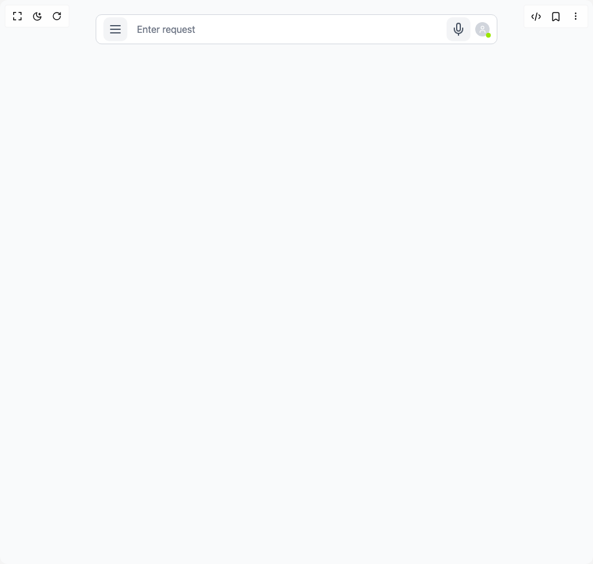

# Build Search Interface in BuilderStudio

> Build this component in our Agentic IDE: [BuilderStudio](https://builderstudio.dev).
>
> Join the BuilderStudio community on [Discord](https://discord.gg/QdWeSGCqfe) and [Reddit](https://reddit.com/r/builderstudio).



## Component

- Author group: `avanishverma4`
- Component: `search-interface`
- Variant: `default`
- Rendered HTML snapshot: [`rendered.html`](rendered.html)

## BuilderStudio prompt

You are implementing a React component based on a component reference.

## Component identity

- Author: avanishverma4
- Component slug: search-interface
- Demo slug: default
- Title: search-interface
- Description: 

## Goal

Recreate this component in a React + TypeScript + Tailwind CSS project. Preserve the visual layout, spacing, colors, border radius, shadows, interaction behavior, animation behavior, responsive behavior, and dark mode behavior shown in the rendered demo.

## Implementation requirements

- Use React and TypeScript.
- Use Tailwind CSS classes whenever possible.
- Keep the component self-contained unless the source files require helper components.
- If the source uses CSS variables, custom CSS, animations, or keyframes, include them.
- If the source uses external packages, list and use the required packages.
- Preserve accessibility attributes, button semantics, links, keyboard behavior, and ARIA attributes when visible in the source.
- Do not replace the component with a simplified placeholder.
- Return complete production-ready code.

## Dependencies

No reference metadata available.

## Rendered DOM snapshot

This is the rendered demo HTML extracted from the live preview. Use it to verify structure, class names, visible content, and layout.

```html
<div id="root"><div class="w-screen min-h-screen flex justify-center items-center"><div class="w-screen min-h-screen flex justify-center items-center"><div class="w-full p-6 bg-gray-50 dark:bg-gray-900 min-h-screen relative"><div class="w-full max-w-2xl mx-auto space-y-4"><div class="relative flex items-center bg-white dark:bg-gray-800 border border-gray-300 dark:border-gray-600 rounded-lg"><div class="pl-3"><button class="p-2 rounded-lg transition-colors  bg-gray-100 hover:bg-gray-200 dark:bg-gray-700 dark:hover:bg-gray-600"><svg xmlns="http://www.w3.org/2000/svg" width="24" height="24" viewBox="0 0 24 24" fill="none" stroke="currentColor" stroke-width="2" stroke-linecap="round" stroke-linejoin="round" class="lucide lucide-menu text-gray-600 dark:text-gray-400" aria-hidden="true"><line x1="4" x2="20" y1="12" y2="12"></line><line x1="4" x2="20" y1="6" y2="6"></line><line x1="4" x2="20" y1="18" y2="18"></line></svg></button></div><input id="search" placeholder="Enter request" class="flex-1 px-4 py-3 bg-transparent border-none outline-none text-gray-900 dark:text-gray-100 placeholder-gray-500 dark:placeholder-gray-400" type="text" value="" name="search"><div class="pr-3 flex items-center gap-2"><button class="p-2 rounded-lg transition-colors  bg-gray-100 hover:bg-gray-200 dark:bg-gray-700 dark:hover:bg-gray-600"><svg xmlns="http://www.w3.org/2000/svg" width="24" height="24" viewBox="0 0 24 24" fill="none" stroke="currentColor" stroke-width="2" stroke-linecap="round" stroke-linejoin="round" class="lucide lucide-mic text-gray-600 dark:text-gray-400" aria-hidden="true"><path d="M12 2a3 3 0 0 0-3 3v7a3 3 0 0 0 6 0V5a3 3 0 0 0-3-3Z"></path><path d="M19 10v2a7 7 0 0 1-14 0v-2"></path><line x1="12" x2="12" y1="19" y2="22"></line></svg></button><div class="relative"><div class="bg-gray-300 dark:bg-gray-600 flex items-center justify-center text-white" style="width: 24px; height: 24px; border-radius: 50%;"><svg xmlns="http://www.w3.org/2000/svg" width="14.399999999999999" height="14.399999999999999" viewBox="0 0 24 24" fill="none" stroke="currentColor" stroke-width="2" stroke-linecap="round" stroke-linejoin="round" class="lucide lucide-user" aria-hidden="true"><path d="M19 21v-2a4 4 0 0 0-4-4H9a4 4 0 0 0-4 4v2"></path><circle cx="12" cy="7" r="4"></circle></svg></div><div class="absolute -bottom-0.5 -right-0.5 w-2 h-2 rounded-full bg-lime-400"></div></div></div></div></div></div></div></div></div>
```

## Reference source files

No reference source files were available.
