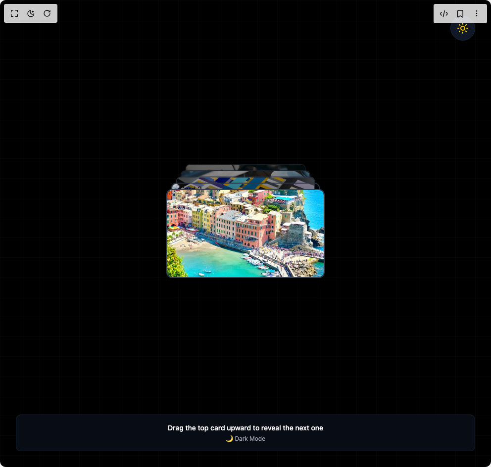

# Build Stack Card in BuilderStudio

> Build this component in our Agentic IDE: [BuilderStudio](https://builderstudio.dev).
>
> Join the BuilderStudio community on [Discord](https://discord.gg/QdWeSGCqfe) and [Reddit](https://reddit.com/r/builderstudio).



## Component

- Author group: `avanishverma4`
- Component: `stack-card`
- Variant: `default`
- Rendered HTML snapshot: [`rendered.html`](rendered.html)

## BuilderStudio prompt

You are implementing a React component based on a component reference.

## Component identity

- Author: avanishverma4
- Component slug: stack-card
- Demo slug: default
- Title: stack-card
- Description: 

## Goal

Recreate this component in a React + TypeScript + Tailwind CSS project. Preserve the visual layout, spacing, colors, border radius, shadows, interaction behavior, animation behavior, responsive behavior, and dark mode behavior shown in the rendered demo.

## Implementation requirements

- Use React and TypeScript.
- Use Tailwind CSS classes whenever possible.
- Keep the component self-contained unless the source files require helper components.
- If the source uses CSS variables, custom CSS, animations, or keyframes, include them.
- If the source uses external packages, list and use the required packages.
- Preserve accessibility attributes, button semantics, links, keyboard behavior, and ARIA attributes when visible in the source.
- Do not replace the component with a simplified placeholder.
- Return complete production-ready code.

## Dependencies

No reference metadata available.

## Rendered DOM snapshot

This is the rendered demo HTML extracted from the live preview. Use it to verify structure, class names, visible content, and layout.

```html
<div id="root"><div class="w-screen min-h-screen flex justify-center items-center"><div class="w-screen min-h-screen flex justify-center items-center"><div class="w-full h-screen flex items-center justify-center bg-black transition-all duration-300 relative overflow-hidden"><svg class="absolute inset-0 w-full h-full opacity-10 transition-opacity duration-300" xmlns="http://www.w3.org/2000/svg"><defs><pattern id="grid" width="40" height="40" patternUnits="userSpaceOnUse"><path d="M 40 0 L 0 0 0 40" fill="none" stroke="#ffffff" stroke-width="0.5"></path></pattern></defs><rect width="100%" height="100%" fill="url(#grid)"></rect></svg><button class="absolute top-8 right-8 p-3 rounded-full bg-gray-900 hover:bg-gray-800 border border-gray-800 transition-colors duration-200 z-20" tabindex="0"><svg xmlns="http://www.w3.org/2000/svg" width="24" height="24" viewBox="0 0 24 24" fill="none" stroke="currentColor" stroke-width="2" stroke-linecap="round" stroke-linejoin="round" class="lucide lucide-sun w-6 h-6 text-yellow-400" aria-hidden="true"><circle cx="12" cy="12" r="4"></circle><path d="M12 2v2"></path><path d="M12 20v2"></path><path d="m4.93 4.93 1.41 1.41"></path><path d="m17.66 17.66 1.41 1.41"></path><path d="M2 12h2"></path><path d="M20 12h2"></path><path d="m6.34 17.66-1.41 1.41"></path><path d="m19.07 4.93-1.41 1.41"></path></svg></button><div class="relative w-80 aspect-video overflow-visible z-10"><ul class="relative w-full h-full m-0 p-0"><li class="absolute w-full h-full list-none overflow-hidden border-2 border-gray-700" draggable="false" style="border-radius: 12px; cursor: grab; touch-action: pan-x; box-shadow: rgba(0, 0, 0, 0.6) 0px 20px 40px; user-select: none; top: 0%; filter: brightness(1); z-index: 5; transform: none;"></li><li class="absolute w-full h-full list-none overflow-hidden border-2 border-gray-700" style="border-radius: 12px; cursor: auto; touch-action: none; box-shadow: rgba(0, 0, 0, 0.3) 0px 10px 20px; top: -10%; filter: brightness(0.85); z-index: 4; transform: scale(0.94);"></li><li class="absolute w-full h-full list-none overflow-hidden border-2 border-gray-700" style="border-radius: 12px; cursor: auto; touch-action: none; box-shadow: rgba(0, 0, 0, 0.3) 0px 10px 20px; top: -20%; filter: brightness(0.7); z-index: 3; transform: scale(0.88);"></li><li class="absolute w-full h-full list-none overflow-hidden border-2 border-gray-700" style="border-radius: 12px; cursor: auto; touch-action: none; box-shadow: rgba(0, 0, 0, 0.3) 0px 10px 20px; top: -30%; filter: brightness(0.55); z-index: 2; transform: scale(0.82);"></li><li class="absolute w-full h-full list-none overflow-hidden border-2 border-gray-700" style="border-radius: 12px; cursor: auto; touch-action: none; box-shadow: rgba(0, 0, 0, 0.3) 0px 10px 20px; top: -40%; filter: brightness(0.4); z-index: 1; transform: scale(0.76);"></li></ul></div><div class="absolute bottom-8 left-8 right-8 text-center px-6 py-4 rounded-lg border bg-gray-900/50 border-gray-800 backdrop-blur-sm transition-all duration-300 z-20"><p class="text-white text-sm font-medium">Drag the top card upward to reveal the next one</p><p class="text-gray-400 text-xs mt-1">🌙 Dark Mode</p></div></div></div></div></div>
```

## Reference source files

No reference source files were available.
