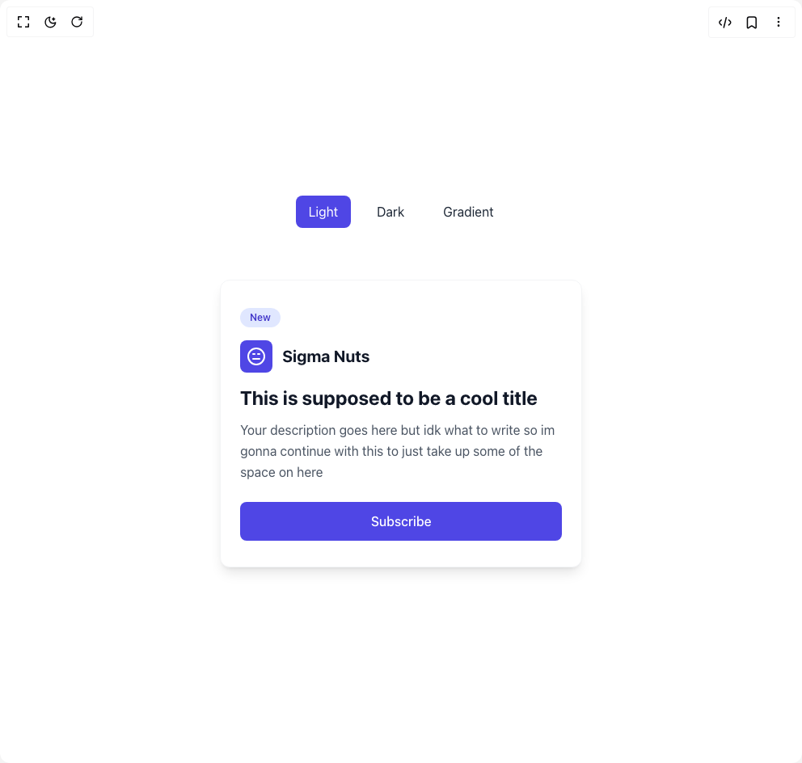

# Build Cta Card 1 in BuilderStudio

> Build this component in our Agentic IDE: [BuilderStudio](https://builderstudio.dev).
>
> Join the BuilderStudio community on [Discord](https://discord.gg/QdWeSGCqfe) and [Reddit](https://reddit.com/r/builderstudio).



## Component

- Author group: `axorax`
- Component: `cta-card-1`
- Variant: `default`
- Rendered HTML snapshot: [`rendered.html`](rendered.html)

## BuilderStudio prompt

You are implementing a React component based on a component reference.

## Component identity

- Author: axorax
- Component slug: cta-card-1
- Demo slug: default
- Title: cta-card-1
- Description: 

## Goal

Recreate this component in a React + TypeScript + Tailwind CSS project. Preserve the visual layout, spacing, colors, border radius, shadows, interaction behavior, animation behavior, responsive behavior, and dark mode behavior shown in the rendered demo.

## Implementation requirements

- Use React and TypeScript.
- Use Tailwind CSS classes whenever possible.
- Keep the component self-contained unless the source files require helper components.
- If the source uses CSS variables, custom CSS, animations, or keyframes, include them.
- If the source uses external packages, list and use the required packages.
- Preserve accessibility attributes, button semantics, links, keyboard behavior, and ARIA attributes when visible in the source.
- Do not replace the component with a simplified placeholder.
- Return complete production-ready code.

## Dependencies

No reference metadata available.

## Rendered DOM snapshot

This is the rendered demo HTML extracted from the live preview. Use it to verify structure, class names, visible content, and layout.

```html
<div id="root"><div class="relative flex items-center justify-center h-screen w-full m-auto p-16 bg-background text-foreground"><div class="absolute lab-bg inset-0 size-full"><div class="absolute inset-0 bg-[radial-gradient(#00000021_1px,transparent_1px)] dark:bg-[radial-gradient(#ffffff22_1px,transparent_1px)]"></div></div><div class="flex w-full justify-center relative"><div class="min-h-screen flex flex-col items-center justify-center p-6"><div class="max-w-4xl w-full mb-8"><div class="flex justify-center mb-8 space-x-4"><button class="px-4 py-2 rounded-lg transition-colors bg-indigo-600 text-white">Light</button><button class="px-4 py-2 rounded-lg transition-colors bg-white text-gray-800 hover:bg-gray-200">Dark</button><button class="px-4 py-2 rounded-lg transition-colors bg-white text-gray-800 hover:bg-gray-200">Gradient</button></div></div><div class="w-full flex justify-center"><div class="max-w-md mx-auto rounded-xl shadow-lg hover:shadow-xl transition-all duration-300 overflow-hidden bg-white border border-gray-100"><div class="px-6 py-8"><span class="inline-block mb-4 px-3 py-1 text-xs font-semibold rounded-full text-indigo-700 bg-indigo-100">New</span><div class="flex items-center mb-4"><div class="p-2 rounded-lg mr-3 bg-indigo-600"><svg xmlns="http://www.w3.org/2000/svg" width="24" height="24" viewBox="0 0 24 24" fill="none" stroke="currentColor" stroke-width="2" stroke-linecap="round" stroke-linejoin="round" class="lucide lucide-annoyed w-6 h-6 text-white" aria-hidden="true"><circle cx="12" cy="12" r="10"></circle><path d="M8 15h8"></path><path d="M8 9h2"></path><path d="M14 9h2"></path></svg></div><h3 class="text-xl font-bold text-gray-900">Sigma Nuts</h3></div><h2 class="text-2xl font-bold mb-3 leading-tight text-gray-900">This is supposed to be a cool title</h2><p class="mb-6 leading-relaxed text-gray-600">Your description goes here but idk what to write so im gonna continue with this to just take up some of the space on here</p><a href="https://www.youtube.com/@axorax" class="w-full inline-flex items-center justify-center px-5 py-3 font-medium rounded-lg transition-colors duration-200 text-center bg-indigo-600 hover:bg-indigo-700 text-white">Subscribe</a></div></div></div></div></div></div></div>
```

## Reference source files

No reference source files were available.
