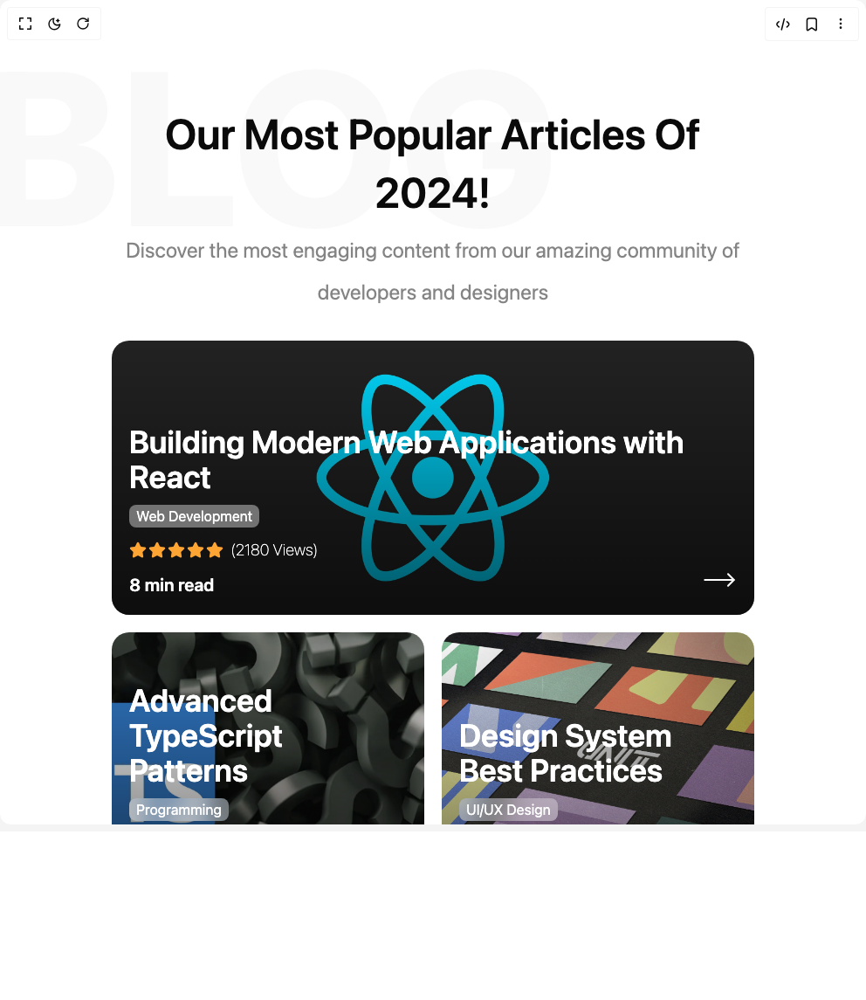

# Build Blog Posts in BuilderStudio

> Build this component in our Agentic IDE: [BuilderStudio](https://builderstudio.dev).
>
> Join the BuilderStudio community on [Discord](https://discord.gg/QdWeSGCqfe) and [Reddit](https://reddit.com/r/builderstudio).



## Component

- Author group: `aymanch-03`
- Component: `blog-posts`
- Variant: `default`
- Rendered HTML snapshot: [`rendered.html`](rendered.html)

## BuilderStudio prompt

You are implementing a React component based on a component reference.

## Component identity

- Author: aymanch-03
- Component slug: blog-posts
- Demo slug: default
- Title: blog-posts
- Description: 

## Goal

Recreate this component in a React + TypeScript + Tailwind CSS project. Preserve the visual layout, spacing, colors, border radius, shadows, interaction behavior, animation behavior, responsive behavior, and dark mode behavior shown in the rendered demo.

## Implementation requirements

- Use React and TypeScript.
- Use Tailwind CSS classes whenever possible.
- Keep the component self-contained unless the source files require helper components.
- If the source uses CSS variables, custom CSS, animations, or keyframes, include them.
- If the source uses external packages, list and use the required packages.
- Preserve accessibility attributes, button semantics, links, keyboard behavior, and ARIA attributes when visible in the source.
- Do not replace the component with a simplified placeholder.
- Return complete production-ready code.

## Dependencies

No reference metadata available.

## Rendered DOM snapshot

This is the rendered demo HTML extracted from the live preview. Use it to verify structure, class names, visible content, and layout.

```html
<div id="root"><div class="w-screen min-h-screen flex justify-center items-center"><div class="w-screen min-h-screen flex justify-center items-center"><section class="container relative my-20 py-10 mx-auto px-4 mb-16"><h1 class="text-center text-4xl font-semibold capitalize !leading-[1.4] md:text-5xl lg:text-6xl mb-2">Our Most Popular Articles of 2024!</h1><span class="absolute -top-10 -z-50 select-none text-[180px] font-extrabold leading-[1] md:text-[250px] lg:text-[400px] text-foreground/[0.025] -left-[18%]">BLOG</span><p class="mx-auto max-w-[800px] text-center text-xl !leading-[2] text-foreground/50 md:text-2xl mb-8">Discover the most engaging content from our amazing community of developers and designers</p><div class="grid h-auto grid-cols-1 gap-5 md:h-[650px] md:grid-cols-2 lg:grid-cols-[1fr_0.5fr]"><div class="group relative flex size-full cursor-pointer flex-col justify-end overflow-hidden rounded-[20px] bg-cover bg-center bg-no-repeat p-5 text-white max-md:h-[300px] transition-all duration-300 hover:scale-[0.98] hover:rotate-[0.3deg] col-span-1 row-span-1 md:col-span-2 md:row-span-2 lg:col-span-1" style="background-image: url(&quot;https://cdn.hashnode.com/res/hashnode/image/upload/v1606610166355/JW-defpGk.jpeg?w=1600&amp;h=840&amp;fit=crop&amp;crop=entropy&amp;auto=compress,format&amp;format=webp&quot;);"><div class="absolute inset-0 -z-0 h-[130%] w-full bg-gradient-to-t from-black/80 to-transparent transition-all duration-500 group-hover:h-full"></div><article class="relative z-0 flex items-end"><div class="flex flex-1 flex-col gap-3"><h1 class="text-3xl font-semibold md:text-4xl">Building Modern Web Applications with React</h1><div class="flex flex-col gap-3"><span class="text-base capitalize py-px px-2 rounded-md bg-white/40 w-fit text-white backdrop-blur-md">Web Development</span><div class="flex items-center gap-2"><div class="flex items-center gap-0.5"><svg xmlns="http://www.w3.org/2000/svg" width="20" height="20" viewBox="0 0 24 24" fill="#ffa534" stroke="#ffa534" stroke-width="2" stroke-linecap="round" stroke-linejoin="round" class="lucide lucide-star" aria-hidden="true"><path d="M11.525 2.295a.53.53 0 0 1 .95 0l2.31 4.679a2.123 2.123 0 0 0 1.595 1.16l5.166.756a.53.53 0 0 1 .294.904l-3.736 3.638a2.123 2.123 0 0 0-.611 1.878l.882 5.14a.53.53 0 0 1-.771.56l-4.618-2.428a2.122 2.122 0 0 0-1.973 0L6.396 21.01a.53.53 0 0 1-.77-.56l.881-5.139a2.122 2.122 0 0 0-.611-1.879L2.16 9.795a.53.53 0 0 1 .294-.906l5.165-.755a2.122 2.122 0 0 0 1.597-1.16z"></path></svg><svg xmlns="http://www.w3.org/2000/svg" width="20" height="20" viewBox="0 0 24 24" fill="#ffa534" stroke="#ffa534" stroke-width="2" stroke-linecap="round" stroke-linejoin="round" class="lucide lucide-star" aria-hidden="true"><path d="M11.525 2.295a.53.53 0 0 1 .95 0l2.31 4.679a2.123 2.123 0 0 0 1.595 1.16l5.166.756a.53.53 0 0 1 .294.904l-3.736 3.638a2.123 2.123 0 0 0-.611 1.878l.882 5.14a.53.53 0 0 1-.771.56l-4.618-2.428a2.122 2.122 0 0 0-1.973 0L6.396 21.01a.53.53 0 0 1-.77-.56l.881-5.139a2.122 2.122 0 0 0-.611-1.879L2.16 9.795a.53.53 0 0 1 .294-.906l5.165-.755a2.122 2.122 0 0 0 1.597-1.16z"></path></svg><svg xmlns="http://www.w3.org/2000/svg" width="20" height="20" viewBox="0 0 24 24" fill="#ffa534" stroke="#ffa534" stroke-width="2" stroke-linecap="round" stroke-linejoin="round" class="lucide lucide-star" aria-hidden="true"><path d="M11.525 2.295a.53.53 0 0 1 .95 0l2.31 4.679a2.123 2.123 0 0 0 1.595 1.16l5.166.756a.53.53 0 0 1 .294.904l-3.736 3.638a2.123 2.123 0 0 0-.611 1.878l.882 5.14a.53.53 0 0 1-.771.56l-4.618-2.428a2.122 2.122 0 0 0-1.973 0L6.396 21.01a.53.53 0 0 1-.77-.56l.881-5.139a2.122 2.122 0 0 0-.611-1.879L2.16 9.795a.53.53 0 0 1 .294-.906l5.165-.755a2.122 2.122 0 0 0 1.597-1.16z"></path></svg><svg xmlns="http://www.w3.org/2000/svg" width="20" height="20" viewBox="0 0 24 24" fill="#ffa534" stroke="#ffa534" stroke-width="2" stroke-linecap="round" stroke-linejoin="round" class="lucide lucide-star" aria-hidden="true"><path d="M11.525 2.295a.53.53 0 0 1 .95 0l2.31 4.679a2.123 2.123 0 0 0 1.595 1.16l5.166.756a.53.53 0 0 1 .294.904l-3.736 3.638a2.123 2.123 0 0 0-.611 1.878l.882 5.14a.53.53 0 0 1-.771.56l-4.618-2.428a2.122 2.122 0 0 0-1.973 0L6.396 21.01a.53.53 0 0 1-.77-.56l.881-5.139a2.122 2.122 0 0 0-.611-1.879L2.16 9.795a.53.53 0 0 1 .294-.906l5.165-.755a2.122 2.122 0 0 0 1.597-1.16z"></path></svg><svg xmlns="http://www.w3.org/2000/svg" width="20" height="20" viewBox="0 0 24 24" fill="#ffa534" stroke="#ffa534" stroke-width="2" stroke-linecap="round" stroke-linejoin="round" class="lucide lucide-star" aria-hidden="true"><path d="M11.525 2.295a.53.53 0 0 1 .95 0l2.31 4.679a2.123 2.123 0 0 0 1.595 1.16l5.166.756a.53.53 0 0 1 .294.904l-3.736 3.638a2.123 2.123 0 0 0-.611 1.878l.882 5.14a.53.53 0 0 1-.771.56l-4.618-2.428a2.122 2.122 0 0 0-1.973 0L6.396 21.01a.53.53 0 0 1-.77-.56l.881-5.139a2.122 2.122 0 0 0-.611-1.879L2.16 9.795a.53.53 0 0 1 .294-.906l5.165-.755a2.122 2.122 0 0 0 1.597-1.16z"></path></svg></div><span class="text-lg font-thin">(2180 Views)</span></div><div class="text-xl font-semibold">8 min read</div></div></div><svg xmlns="http://www.w3.org/2000/svg" width="40" height="40" viewBox="0 0 24 24" fill="none" stroke="white" stroke-width="1.25" stroke-linecap="round" stroke-linejoin="round" class="lucide lucide-move-right transition-all duration-300 group-hover:translate-x-2" aria-hidden="true"><path d="M18 8L22 12L18 16"></path><path d="M2 12H22"></path></svg></article></div><div class="group relative row-span-1 flex size-full cursor-pointer flex-col justify-end overflow-hidden rounded-[20px] bg-cover bg-center bg-no-repeat p-5 text-white max-md:h-[300px] transition-all duration-300 hover:scale-[0.98] hover:rotate-[0.3deg]" style="background-image: url(&quot;https://b3496788.smushcdn.com/3496788/wp-content/uploads/2023/09/Why-Typescript-Blog-Header-Image.jpg?lossy=0&amp;strip=1&amp;webp=1&quot;);"><div class="absolute inset-0 -z-0 h-[130%] w-full bg-gradient-to-t from-black/80 to-transparent transition-all duration-500 group-hover:h-full"></div><article class="relative z-0 flex items-end"><div class="flex flex-1 flex-col gap-3"><h1 class="text-3xl font-semibold md:text-4xl">Advanced TypeScript Patterns</h1><div class="flex flex-col gap-3"><span class="text-base capitalize py-px px-2 rounded-md bg-white/40 w-fit text-white backdrop-blur-md">Programming</span><div class="flex items-center gap-2"><div class="flex items-center gap-0.5"><svg xmlns="http://www.w3.org/2000/svg" width="20" height="20" viewBox="0 0 24 24" fill="#ffa534" stroke="#ffa534" stroke-width="2" stroke-linecap="round" stroke-linejoin="round" class="lucide lucide-star" aria-hidden="true"><path d="M11.525 2.295a.53.53 0 0 1 .95 0l2.31 4.679a2.123 2.123 0 0 0 1.595 1.16l5.166.756a.53.53 0 0 1 .294.904l-3.736 3.638a2.123 2.123 0 0 0-.611 1.878l.882 5.14a.53.53 0 0 1-.771.56l-4.618-2.428a2.122 2.122 0 0 0-1.973 0L6.396 21.01a.53.53 0 0 1-.77-.56l.881-5.139a2.122 2.122 0 0 0-.611-1.879L2.16 9.795a.53.53 0 0 1 .294-.906l5.165-.755a2.122 2.122 0 0 0 1.597-1.16z"></path></svg><svg xmlns="http://www.w3.org/2000/svg" width="20" height="20" viewBox="0 0 24 24" fill="#ffa534" stroke="#ffa534" stroke-width="2" stroke-linecap="round" stroke-linejoin="round" class="lucide lucide-star" aria-hidden="true"><path d="M11.525 2.295a.53.53 0 0 1 .95 0l2.31 4.679a2.123 2.123 0 0 0 1.595 1.16l5.166.756a.53.53 0 0 1 .294.904l-3.736 3.638a2.123 2.123 0 0 0-.611 1.878l.882 5.14a.53.53 0 0 1-.771.56l-4.618-2.428a2.122 2.122 0 0 0-1.973 0L6.396 21.01a.53.53 0 0 1-.77-.56l.881-5.139a2.122 2.122 0 0 0-.611-1.879L2.16 9.795a.53.53 0 0 1 .294-.906l5.165-.755a2.122 2.122 0 0 0 1.597-1.16z"></path></svg><svg xmlns="http://www.w3.org/2000/svg" width="20" height="20" viewBox="0 0 24 24" fill="#ffa534" stroke="#ffa534" stroke-width="2" stroke-linecap="round" stroke-linejoin="round" class="lucide lucide-star" aria-hidden="true"><path d="M11.525 2.295a.53.53 0 0 1 .95 0l2.31 4.679a2.123 2.123 0 0 0 1.595 1.16l5.166.756a.53.53 0 0 1 .294.904l-3.736 3.638a2.123 2.123 0 0 0-.611 1.878l.882 5.14a.53.53 0 0 1-.771.56l-4.618-2.428a2.122 2.122 0 0 0-1.973 0L6.396 21.01a.53.53 0 0 1-.77-.56l.881-5.139a2.122 2.122 0 0 0-.611-1.879L2.16 9.795a.53.53 0 0 1 .294-.906l5.165-.755a2.122 2.122 0 0 0 1.597-1.16z"></path></svg><svg xmlns="http://www.w3.org/2000/svg" width="20" height="20" viewBox="0 0 24 24" fill="#ffa534" stroke="#ffa534" stroke-width="2" stroke-linecap="round" stroke-linejoin="round" class="lucide lucide-star" aria-hidden="true"><path d="M11.525 2.295a.53.53 0 0 1 .95 0l2.31 4.679a2.123 2.123 0 0 0 1.595 1.16l5.166.756a.53.53 0 0 1 .294.904l-3.736 3.638a2.123 2.123 0 0 0-.611 1.878l.882 5.14a.53.53 0 0 1-.771.56l-4.618-2.428a2.122 2.122 0 0 0-1.973 0L6.396 21.01a.53.53 0 0 1-.77-.56l.881-5.139a2.122 2.122 0 0 0-.611-1.879L2.16 9.795a.53.53 0 0 1 .294-.906l5.165-.755a2.122 2.122 0 0 0 1.597-1.16z"></path></svg><svg xmlns="http://www.w3.org/2000/svg" width="20" height="20" viewBox="0 0 24 24" fill="#B9B8B8aa" stroke="#B9B8B8aa" stroke-width="2" stroke-linecap="round" stroke-linejoin="round" class="lucide lucide-star" aria-hidden="true"><path d="M11.525 2.295a.53.53 0 0 1 .95 0l2.31 4.679a2.123 2.123 0 0 0 1.595 1.16l5.166.756a.53.53 0 0 1 .294.904l-3.736 3.638a2.123 2.123 0 0 0-.611 1.878l.882 5.14a.53.53 0 0 1-.771.56l-4.618-2.428a2.122 2.122 0 0 0-1.973 0L6.396 21.01a.53.53 0 0 1-.77-.56l.881-5.139a2.122 2.122 0 0 0-.611-1.879L2.16 9.795a.53.53 0 0 1 .294-.906l5.165-.755a2.122 2.122 0 0 0 1.597-1.16z"></path></svg></div><span class="text-lg font-thin">(1456 Views)</span></div><div class="text-xl font-semibold">12 min read</div></div></div><svg xmlns="http://www.w3.org/2000/svg" width="40" height="40" viewBox="0 0 24 24" fill="none" stroke="white" stroke-width="1.25" stroke-linecap="round" stroke-linejoin="round" class="lucide lucide-move-right transition-all duration-300 group-hover:translate-x-2" aria-hidden="true"><path d="M18 8L22 12L18 16"></path><path d="M2 12H22"></path></svg></article></div><div class="group relative row-span-1 flex size-full cursor-pointer flex-col justify-end overflow-hidden rounded-[20px] bg-cover bg-center bg-no-repeat p-5 text-white max-md:h-[300px] transition-all duration-300 hover:scale-[0.98] hover:rotate-[0.3deg]" style="background-image: url(&quot;https://designsystems.international/static/993656f22f7ded64cbf68ca8c5a40554/2d41a/unit-backgrounds.jpg&quot;);"><div class="absolute inset-0 -z-0 h-[130%] w-full bg-gradient-to-t from-black/80 to-transparent transition-all duration-500 group-hover:h-full"></div><article class="relative z-0 flex items-end"><div class="flex flex-1 flex-col gap-3"><h1 class="text-3xl font-semibold md:text-4xl">Design System Best Practices</h1><div class="flex flex-col gap-3"><span class="text-base capitalize py-px px-2 rounded-md bg-white/40 w-fit text-white backdrop-blur-md">UI/UX Design</span><div class="flex items-center gap-2"><div class="flex items-center gap-0.5"><svg xmlns="http://www.w3.org/2000/svg" width="20" height="20" viewBox="0 0 24 24" fill="#ffa534" stroke="#ffa534" stroke-width="2" stroke-linecap="round" stroke-linejoin="round" class="lucide lucide-star" aria-hidden="true"><path d="M11.525 2.295a.53.53 0 0 1 .95 0l2.31 4.679a2.123 2.123 0 0 0 1.595 1.16l5.166.756a.53.53 0 0 1 .294.904l-3.736 3.638a2.123 2.123 0 0 0-.611 1.878l.882 5.14a.53.53 0 0 1-.771.56l-4.618-2.428a2.122 2.122 0 0 0-1.973 0L6.396 21.01a.53.53 0 0 1-.77-.56l.881-5.139a2.122 2.122 0 0 0-.611-1.879L2.16 9.795a.53.53 0 0 1 .294-.906l5.165-.755a2.122 2.122 0 0 0 1.597-1.16z"></path></svg><svg xmlns="http://www.w3.org/2000/svg" width="20" height="20" viewBox="0 0 24 24" fill="#ffa534" stroke="#ffa534" stroke-width="2" stroke-linecap="round" stroke-linejoin="round" class="lucide lucide-star" aria-hidden="true"><path d="M11.525 2.295a.53.53 0 0 1 .95 0l2.31 4.679a2.123 2.123 0 0 0 1.595 1.16l5.166.756a.53.53 0 0 1 .294.904l-3.736 3.638a2.123 2.123 0 0 0-.611 1.878l.882 5.14a.53.53 0 0 1-.771.56l-4.618-2.428a2.122 2.122 0 0 0-1.973 0L6.396 21.01a.53.53 0 0 1-.77-.56l.881-5.139a2.122 2.122 0 0 0-.611-1.879L2.16 9.795a.53.53 0 0 1 .294-.906l5.165-.755a2.122 2.122 0 0 0 1.597-1.16z"></path></svg><svg xmlns="http://www.w3.org/2000/svg" width="20" height="20" viewBox="0 0 24 24" fill="#ffa534" stroke="#ffa534" stroke-width="2" stroke-linecap="round" stroke-linejoin="round" class="lucide lucide-star" aria-hidden="true"><path d="M11.525 2.295a.53.53 0 0 1 .95 0l2.31 4.679a2.123 2.123 0 0 0 1.595 1.16l5.166.756a.53.53 0 0 1 .294.904l-3.736 3.638a2.123 2.123 0 0 0-.611 1.878l.882 5.14a.53.53 0 0 1-.771.56l-4.618-2.428a2.122 2.122 0 0 0-1.973 0L6.396 21.01a.53.53 0 0 1-.77-.56l.881-5.139a2.122 2.122 0 0 0-.611-1.879L2.16 9.795a.53.53 0 0 1 .294-.906l5.165-.755a2.122 2.122 0 0 0 1.597-1.16z"></path></svg><svg xmlns="http://www.w3.org/2000/svg" width="20" height="20" viewBox="0 0 24 24" fill="#ffa534" stroke="#ffa534" stroke-width="2" stroke-linecap="round" stroke-linejoin="round" class="lucide lucide-star" aria-hidden="true"><path d="M11.525 2.295a.53.53 0 0 1 .95 0l2.31 4.679a2.123 2.123 0 0 0 1.595 1.16l5.166.756a.53.53 0 0 1 .294.904l-3.736 3.638a2.123 2.123 0 0 0-.611 1.878l.882 5.14a.53.53 0 0 1-.771.56l-4.618-2.428a2.122 2.122 0 0 0-1.973 0L6.396 21.01a.53.53 0 0 1-.77-.56l.881-5.139a2.122 2.122 0 0 0-.611-1.879L2.16 9.795a.53.53 0 0 1 .294-.906l5.165-.755a2.122 2.122 0 0 0 1.597-1.16z"></path></svg><svg xmlns="http://www.w3.org/2000/svg" width="20" height="20" viewBox="0 0 24 24" fill="#B9B8B8aa" stroke="#B9B8B8aa" stroke-width="2" stroke-linecap="round" stroke-linejoin="round" class="lucide lucide-star" aria-hidden="true"><path d="M11.525 2.295a.53.53 0 0 1 .95 0l2.31 4.679a2.123 2.123 0 0 0 1.595 1.16l5.166.756a.53.53 0 0 1 .294.904l-3.736 3.638a2.123 2.123 0 0 0-.611 1.878l.882 5.14a.53.53 0 0 1-.771.56l-4.618-2.428a2.122 2.122 0 0 0-1.973 0L6.396 21.01a.53.53 0 0 1-.77-.56l.881-5.139a2.122 2.122 0 0 0-.611-1.879L2.16 9.795a.53.53 0 0 1 .294-.906l5.165-.755a2.122 2.122 0 0 0 1.597-1.16z"></path></svg></div><span class="text-lg font-thin">(987 Views)</span></div><div class="text-xl font-semibold">6 min read</div></div></div><svg xmlns="http://www.w3.org/2000/svg" width="40" height="40" viewBox="0 0 24 24" fill="none" stroke="white" stroke-width="1.25" stroke-linecap="round" stroke-linejoin="round" class="lucide lucide-move-right transition-all duration-300 group-hover:translate-x-2" aria-hidden="true"><path d="M18 8L22 12L18 16"></path><path d="M2 12H22"></path></svg></article></div></div></section></div></div></div>
```

## Reference source files

No reference source files were available.
