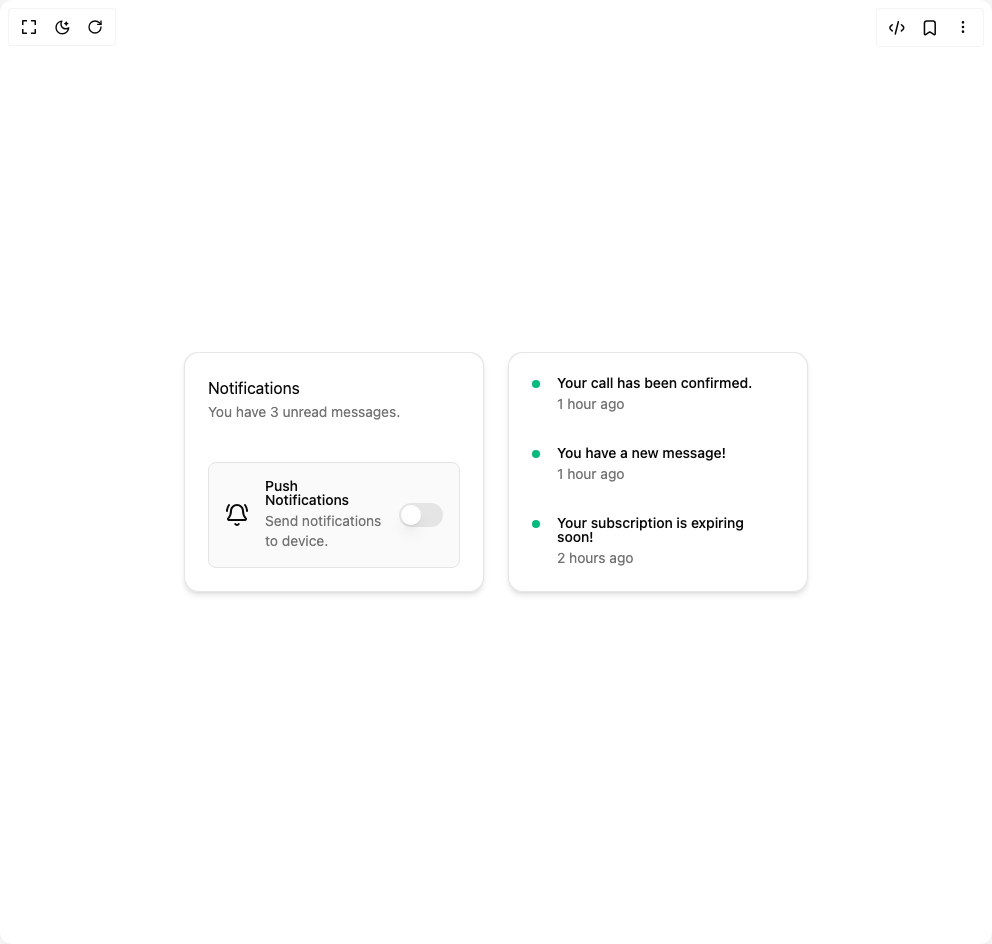

# Build Cursor Cards in BuilderStudio

> Build this component in our Agentic IDE: [BuilderStudio](https://builderstudio.dev).
>
> Join the BuilderStudio community on [Discord](https://discord.gg/QdWeSGCqfe) and [Reddit](https://reddit.com/r/builderstudio).



## Component

- Author group: `badtzx0`
- Component: `cursor-cards`
- Variant: `default`
- Rendered HTML snapshot: [`rendered.html`](rendered.html)

## BuilderStudio prompt

You are implementing a React component based on a component reference.

## Component identity

- Author: badtzx0
- Component slug: cursor-cards
- Demo slug: default
- Title: cursor-cards
- Description: 

## Goal

Recreate this component in a React + TypeScript + Tailwind CSS project. Preserve the visual layout, spacing, colors, border radius, shadows, interaction behavior, animation behavior, responsive behavior, and dark mode behavior shown in the rendered demo.

## Implementation requirements

- Use React and TypeScript.
- Use Tailwind CSS classes whenever possible.
- Keep the component self-contained unless the source files require helper components.
- If the source uses CSS variables, custom CSS, animations, or keyframes, include them.
- If the source uses external packages, list and use the required packages.
- Preserve accessibility attributes, button semantics, links, keyboard behavior, and ARIA attributes when visible in the source.
- Do not replace the component with a simplified placeholder.
- Return complete production-ready code.

## Dependencies

No reference metadata available.

## Rendered DOM snapshot

This is the rendered demo HTML extracted from the live preview. Use it to verify structure, class names, visible content, and layout.

```html
<div id="root"><div class="w-screen min-h-screen flex justify-center items-center"><div class="w-screen min-h-screen flex justify-center items-center"><div><div class="relative flex gap-6"><div class="group relative h-auto w-[300px] rounded-xl p-6 shadow-md"><div class="pointer-events-none absolute inset-0 rounded-[inherit]" style="background: radial-gradient(200px at -200px -200px, rgb(147, 197, 253), rgb(37, 99, 235), rgb(229, 229, 229) 100%);"></div><div class="absolute inset-px rounded-[inherit] bg-white dark:bg-black"></div><div class="pointer-events-none absolute inset-px rounded-[inherit] opacity-0 transition-opacity duration-300" style="opacity: 0; background: radial-gradient(200px at -200px -200px, rgba(255, 255, 255, 0.063), transparent 100%);"></div><div class="relative"><div class="flex flex-col"><h3 class="text-foreground">Notifications</h3><p class="text-muted-foreground mt-0.5 text-sm">You have 3 unread messages.</p><div class="mt-10 flex items-center space-x-4 rounded-md border bg-neutral-50 p-4 dark:bg-neutral-950"><svg xmlns="http://www.w3.org/2000/svg" width="24" height="24" viewBox="0 0 24 24" fill="none" stroke="currentColor" stroke-width="2" stroke-linecap="round" stroke-linejoin="round" class="lucide lucide-bell-ring" aria-hidden="true"><path d="M10.268 21a2 2 0 0 0 3.464 0"></path><path d="M22 8c0-2.3-.8-4.3-2-6"></path><path d="M3.262 15.326A1 1 0 0 0 4 17h16a1 1 0 0 0 .74-1.673C19.41 13.956 18 12.499 18 8A6 6 0 0 0 6 8c0 4.499-1.411 5.956-2.738 7.326"></path><path d="M4 2C2.8 3.7 2 5.7 2 8"></path></svg><div class="flex-1 space-y-1"><p class="text-sm leading-none font-medium">Push Notifications</p><p class="text-muted-foreground text-sm">Send notifications to device.</p></div><button type="button" role="switch" aria-checked="false" data-state="unchecked" value="on" class="peer inline-flex h-6 w-11 shrink-0 cursor-pointer items-center rounded-full border-2 border-transparent transition-colors focus-visible:outline-none focus-visible:ring-2 focus-visible:ring-ring focus-visible:ring-offset-2 focus-visible:ring-offset-background disabled:cursor-not-allowed disabled:opacity-50 data-[state=checked]:bg-primary data-[state=unchecked]:bg-input"><span data-state="unchecked" class="pointer-events-none block h-5 w-5 rounded-full bg-background shadow-lg ring-0 transition-transform data-[state=checked]:translate-x-5 data-[state=unchecked]:translate-x-0"></span></button></div></div></div></div><div class="group relative h-auto w-[300px] rounded-xl p-6 shadow-md"><div class="pointer-events-none absolute inset-0 rounded-[inherit]" style="background: radial-gradient(200px at -200px -200px, rgb(147, 197, 253), rgb(37, 99, 235), rgb(229, 229, 229) 100%);"></div><div class="absolute inset-px rounded-[inherit] bg-white dark:bg-black"></div><div class="pointer-events-none absolute inset-px rounded-[inherit] opacity-0 transition-opacity duration-300" style="opacity: 0; background: radial-gradient(200px at -200px -200px, rgba(255, 255, 255, 0.063), transparent 100%);"></div><div class="relative"><div class="flex h-full flex-col justify-between"><div class="mb-4 grid grid-cols-[25px_1fr] items-start pb-4 last:mb-0 last:pb-0"><span class="flex h-2 w-2 translate-y-1 rounded-full bg-emerald-500"></span><div class="space-y-1"><p class="text-sm leading-none font-medium">Your call has been confirmed.</p><p class="text-muted-foreground text-sm">1 hour ago</p></div></div><div class="mb-4 grid grid-cols-[25px_1fr] items-start pb-4 last:mb-0 last:pb-0"><span class="flex h-2 w-2 translate-y-1 rounded-full bg-emerald-500"></span><div class="space-y-1"><p class="text-sm leading-none font-medium">You have a new message!</p><p class="text-muted-foreground text-sm">1 hour ago</p></div></div><div class="mb-4 grid grid-cols-[25px_1fr] items-start pb-4 last:mb-0 last:pb-0"><span class="flex h-2 w-2 translate-y-1 rounded-full bg-emerald-500"></span><div class="space-y-1"><p class="text-sm leading-none font-medium">Your subscription is expiring soon!</p><p class="text-muted-foreground text-sm">2 hours ago</p></div></div></div></div></div></div></div></div></div></div>
```

## Reference source files

No reference source files were available.
