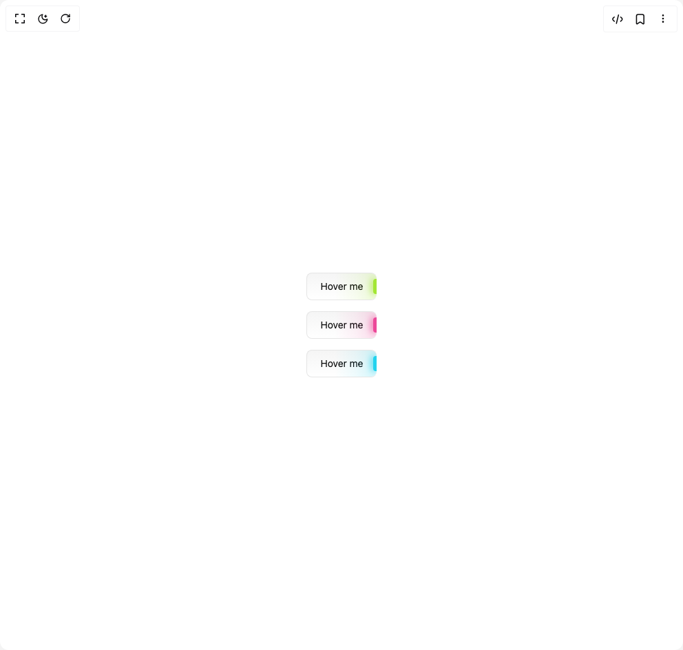

# Build Glowing Button in BuilderStudio

> Build this component in our Agentic IDE: [BuilderStudio](https://builderstudio.dev).
>
> Join the BuilderStudio community on [Discord](https://discord.gg/QdWeSGCqfe) and [Reddit](https://reddit.com/r/builderstudio).



## Component

- Author group: `badtzx0`
- Component: `glowing-button`
- Variant: `default`
- Rendered HTML snapshot: [`rendered.html`](rendered.html)

## BuilderStudio prompt

You are implementing a React component based on a component reference.

## Component identity

- Author: badtzx0
- Component slug: glowing-button
- Demo slug: default
- Title: glowing-button
- Description: 

## Goal

Recreate this component in a React + TypeScript + Tailwind CSS project. Preserve the visual layout, spacing, colors, border radius, shadows, interaction behavior, animation behavior, responsive behavior, and dark mode behavior shown in the rendered demo.

## Implementation requirements

- Use React and TypeScript.
- Use Tailwind CSS classes whenever possible.
- Keep the component self-contained unless the source files require helper components.
- If the source uses CSS variables, custom CSS, animations, or keyframes, include them.
- If the source uses external packages, list and use the required packages.
- Preserve accessibility attributes, button semantics, links, keyboard behavior, and ARIA attributes when visible in the source.
- Do not replace the component with a simplified placeholder.
- Return complete production-ready code.

## Dependencies

No reference metadata available.

## Rendered DOM snapshot

This is the rendered demo HTML extracted from the live preview. Use it to verify structure, class names, visible content, and layout.

```html
<div id="root"><div class="flex flex-col gap-4 w-full h-screen justify-center items-center"><button class="w-min h-10 !px-5 text-sm rounded-md border flex items-center justify-center relative transition-colors overflow-hidden bg-gradient-to-t border-r-0 duration-200 whitespace-nowrap from-background to-muted text-foreground hover:text-muted-foreground border-border after:inset-0 after:absolute after:rounded-[inherit] after:bg-gradient-to-r after:from-transparent after:from-40% after:via-[var(--glow-color-via)] after:to-[var(--glow-color-to)] after:via-70% after:shadow-[hsl(var(--foreground)/0.15)_0px_1px_0px_inset] before:absolute before:w-[5px] hover:before:translate-x-full before:transition-all before:duration-200 before:h-[60%] before:bg-[var(--glow-color)] before:right-0 before:rounded-l before:shadow-[-2px_0_10px_var(--glow-color)] z-10" style="--glow-color: rgba(163, 230, 53, 1); --glow-color-via: rgba(163, 230, 53, 0.075); --glow-color-to: rgba(163, 230, 53, 0.2);">Hover me</button><button class="w-min h-10 !px-5 text-sm rounded-md border flex items-center justify-center relative transition-colors overflow-hidden bg-gradient-to-t border-r-0 duration-200 whitespace-nowrap from-background to-muted text-foreground hover:text-muted-foreground border-border after:inset-0 after:absolute after:rounded-[inherit] after:bg-gradient-to-r after:from-transparent after:from-40% after:via-[var(--glow-color-via)] after:to-[var(--glow-color-to)] after:via-70% after:shadow-[hsl(var(--foreground)/0.15)_0px_1px_0px_inset] before:absolute before:w-[5px] hover:before:translate-x-full before:transition-all before:duration-200 before:h-[60%] before:bg-[var(--glow-color)] before:right-0 before:rounded-l before:shadow-[-2px_0_10px_var(--glow-color)] z-10" style="--glow-color: rgba(236, 72, 153, 1); --glow-color-via: rgba(236, 72, 153, 0.075); --glow-color-to: rgba(236, 72, 153, 0.2);">Hover me</button><button class="w-min h-10 !px-5 text-sm rounded-md border flex items-center justify-center relative transition-colors overflow-hidden bg-gradient-to-t border-r-0 duration-200 whitespace-nowrap from-background to-muted text-foreground hover:text-muted-foreground border-border after:inset-0 after:absolute after:rounded-[inherit] after:bg-gradient-to-r after:from-transparent after:from-40% after:via-[var(--glow-color-via)] after:to-[var(--glow-color-to)] after:via-70% after:shadow-[hsl(var(--foreground)/0.15)_0px_1px_0px_inset] before:absolute before:w-[5px] hover:before:translate-x-full before:transition-all before:duration-200 before:h-[60%] before:bg-[var(--glow-color)] before:right-0 before:rounded-l before:shadow-[-2px_0_10px_var(--glow-color)] z-10" style="--glow-color: rgba(34, 211, 238, 1); --glow-color-via: rgba(34, 211, 238, 0.075); --glow-color-to: rgba(34, 211, 238, 0.2);">Hover me</button></div></div>
```

## Reference source files

No reference source files were available.
