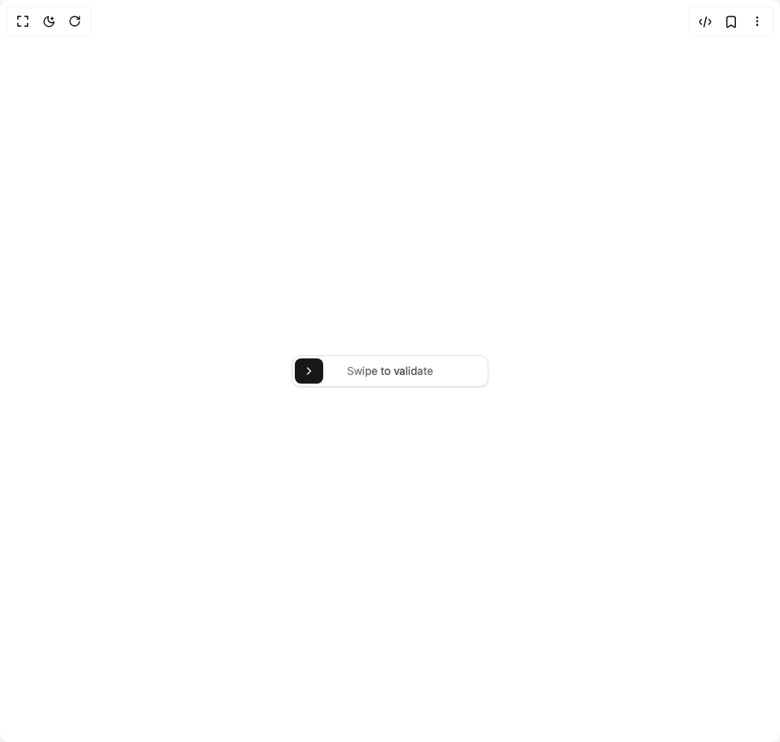

# Build Swipe Button in BuilderStudio

> Build this component in our Agentic IDE: [BuilderStudio](https://builderstudio.dev).
>
> Join the BuilderStudio community on [Discord](https://discord.gg/QdWeSGCqfe) and [Reddit](https://reddit.com/r/builderstudio).



## Component

- Author group: `badtzx0`
- Component: `swipe-button`
- Variant: `default`
- Rendered HTML snapshot: [`rendered.html`](rendered.html)

## BuilderStudio prompt

You are implementing a React component based on a component reference.

## Component identity

- Author: badtzx0
- Component slug: swipe-button
- Demo slug: default
- Title: swipe-button
- Description: 

## Goal

Recreate this component in a React + TypeScript + Tailwind CSS project. Preserve the visual layout, spacing, colors, border radius, shadows, interaction behavior, animation behavior, responsive behavior, and dark mode behavior shown in the rendered demo.

## Implementation requirements

- Use React and TypeScript.
- Use Tailwind CSS classes whenever possible.
- Keep the component self-contained unless the source files require helper components.
- If the source uses CSS variables, custom CSS, animations, or keyframes, include them.
- If the source uses external packages, list and use the required packages.
- Preserve accessibility attributes, button semantics, links, keyboard behavior, and ARIA attributes when visible in the source.
- Do not replace the component with a simplified placeholder.
- Return complete production-ready code.

## Dependencies

No reference metadata available.

## Rendered DOM snapshot

This is the rendered demo HTML extracted from the live preview. Use it to verify structure, class names, visible content, and layout.

```html
<div id="root"><div class="w-screen min-h-screen flex justify-center items-center"><div class="w-screen min-h-screen flex justify-center items-center"><div><div class="relative h-10 w-[250px] overflow-hidden rounded-lg border border-neutral-200 bg-white shadow-sm dark:border-neutral-800 dark:bg-neutral-900 transition-colors duration-200" role="button" aria-label="Swipe to validate"><button class="absolute rounded-md bg-neutral-900 text-white dark:bg-white dark:text-neutral-900 flex items-center justify-center cursor-grab active:cursor-grabbing shadow-sm transition-all duration-300 hover:bg-neutral-800 dark:hover:bg-neutral-100 focus-visible:ring-2 focus-visible:ring-neutral-400 focus-visible:ring-offset-2 focus-visible:outline-none dark:focus-visible:ring-neutral-600 dark:focus-visible:ring-offset-neutral-900 disabled:pointer-events-none" aria-label="Swipe to validate" style="width: 36px; height: calc(100% - 6px); left: 3px; top: 3px; transform: translateX(0px); transition: 0.3s;"><svg xmlns="http://www.w3.org/2000/svg" width="24" height="24" viewBox="0 0 24 24" fill="none" stroke="currentColor" stroke-width="2" stroke-linecap="round" stroke-linejoin="round" class="lucide lucide-chevron-right h-4 w-4" aria-hidden="true"><path d="m9 18 6-6-6-6"></path></svg></button><div class="flex h-full w-full items-center justify-center"><span class="pointer-events-none mx-auto max-w-md text-sm text-neutral-600/70 dark:text-neutral-400/70 animate-swipe-button-text [background-size:var(--swipe-button-text-width)_100%] bg-clip-text [background-position:0_0] bg-no-repeat select-none [transition:background-position_1s_cubic-bezier(.4,0,.2,1)_infinite] bg-gradient-to-r from-transparent via-black/80 via-50% to-transparent dark:via-white/80" style="--swipe-button-text-width: 130px;">Swipe to validate</span></div></div></div></div></div></div>
```

## Reference source files

No reference source files were available.
