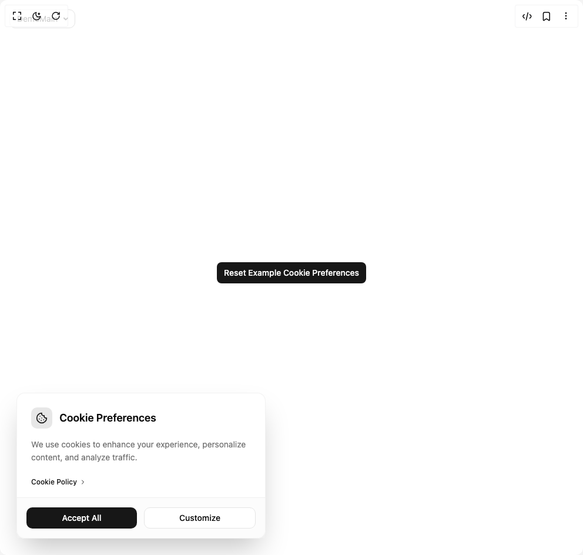

# Build Cookie Consent in BuilderStudio

> Build this component in our Agentic IDE: [BuilderStudio](https://builderstudio.dev).
>
> Join the BuilderStudio community on [Discord](https://discord.gg/QdWeSGCqfe) and [Reddit](https://reddit.com/r/builderstudio).



## Component

- Author group: `bankkroll`
- Component: `cookie-consent`
- Variant: `default`
- Rendered HTML snapshot: [`rendered.html`](rendered.html)

## BuilderStudio prompt

You are implementing a React component based on a component reference.

## Component identity

- Author: bankkroll
- Component slug: cookie-consent
- Demo slug: default
- Title: cookie-consent
- Description: 

## Goal

Recreate this component in a React + TypeScript + Tailwind CSS project. Preserve the visual layout, spacing, colors, border radius, shadows, interaction behavior, animation behavior, responsive behavior, and dark mode behavior shown in the rendered demo.

## Implementation requirements

- Use React and TypeScript.
- Use Tailwind CSS classes whenever possible.
- Keep the component self-contained unless the source files require helper components.
- If the source uses CSS variables, custom CSS, animations, or keyframes, include them.
- If the source uses external packages, list and use the required packages.
- Preserve accessibility attributes, button semantics, links, keyboard behavior, and ARIA attributes when visible in the source.
- Do not replace the component with a simplified placeholder.
- Return complete production-ready code.

## Dependencies

No reference metadata available.

## Rendered DOM snapshot

This is the rendered demo HTML extracted from the live preview. Use it to verify structure, class names, visible content, and layout.

```html
<div id="root"><div class="fixed top-4 left-4 z-10"><select class="appearance-none h-8 max-w-[200px] text-sm leading-tight rounded-lg pl-3 pr-7 py-0 border bg-background focus:outline-none focus:ring-0"><option value="default_DemoMain">DemoMain</option></select><div class="absolute top-1/2 transform -translate-y-1/2 right-2 pointer-events-none"><svg class="w-4 h-4 fill-current" viewBox="0 0 20 20"><path d="M5.516 7.548c.436-.446 1.043-.48 1.576 0L10 10.405l2.908-2.857c.533-.48 1.14-.446 1.576 0 .436.445.408 1.197 0 1.615l-3.734 3.705c-.533.534-1.39.534-1.923 0l-3.734-3.705c-.408-.418-.436-1.17 0-1.615z"></path></svg></div></div><div class="w-screen min-h-screen flex justify-center items-center"><div class="w-full max-w-7xl mx-auto px-4 py-12"><div class="flex justify-center mb-4"><button class="inline-flex items-center justify-center whitespace-nowrap text-sm font-medium ring-offset-background transition-colors focus-visible:outline-none focus-visible:ring-2 focus-visible:ring-ring focus-visible:ring-offset-2 disabled:pointer-events-none disabled:opacity-50 bg-primary text-primary-foreground hover:bg-primary/90 h-9 rounded-md px-3">Reset Example Cookie Preferences</button></div><div class="fixed bottom-0 left-0 right-0 sm:left-4 sm:bottom-4 z-50 w-full sm:max-w-md custom-cookie-banner" style="opacity: 1; transform: none;"><div class="m-3 bg-card/95 backdrop-blur-lg border border-border/50 rounded-xl shadow-2xl"><div class="flex items-center gap-3 p-6 pb-4"><div class="bg-primary/10 p-2 rounded-lg"><svg xmlns="http://www.w3.org/2000/svg" width="24" height="24" viewBox="0 0 24 24" fill="none" stroke="currentColor" stroke-width="2" stroke-linecap="round" stroke-linejoin="round" class="lucide lucide-cookie h-5 w-5 text-primary" aria-hidden="true"><path d="M12 2a10 10 0 1 0 10 10 4 4 0 0 1-5-5 4 4 0 0 1-5-5"></path><path d="M8.5 8.5v.01"></path><path d="M16 15.5v.01"></path><path d="M12 12v.01"></path><path d="M11 17v.01"></path><path d="M7 14v.01"></path></svg></div><h2 class="text-lg font-semibold">Cookie Preferences</h2></div><div class="px-6 pb-4"><p class="text-sm text-muted-foreground leading-relaxed mb-4">We use cookies to enhance your experience, personalize content, and analyze traffic.</p><a href="/privacy-policy" class="text-xs inline-flex items-center text-primary hover:underline group font-medium transition-colors">Cookie Policy<svg xmlns="http://www.w3.org/2000/svg" width="24" height="24" viewBox="0 0 24 24" fill="none" stroke="currentColor" stroke-width="2" stroke-linecap="round" stroke-linejoin="round" class="lucide lucide-chevron-right h-3 w-3 ml-1 transition-transform group-hover:translate-x-0.5" aria-hidden="true"><path d="m9 18 6-6-6-6"></path></svg></a></div><div class="p-4 flex flex-col sm:flex-row gap-3 border-t border-border/50 bg-muted/30"><button class="inline-flex items-center justify-center whitespace-nowrap font-medium ring-offset-background focus-visible:outline-none focus-visible:ring-2 focus-visible:ring-ring focus-visible:ring-offset-2 disabled:pointer-events-none disabled:opacity-50 bg-primary text-primary-foreground hover:bg-primary/90 px-3 w-full sm:flex-1 h-9 rounded-lg text-sm transition-all hover:shadow-md">Accept All</button><button class="inline-flex items-center justify-center whitespace-nowrap font-medium ring-offset-background focus-visible:outline-none focus-visible:ring-2 focus-visible:ring-ring focus-visible:ring-offset-2 disabled:pointer-events-none disabled:opacity-50 border border-input bg-background hover:bg-accent hover:text-accent-foreground px-3 w-full sm:flex-1 h-9 rounded-lg text-sm transition-all hover:shadow-md">Customize</button></div></div></div></div></div></div>
```

## Reference source files

No reference source files were available.
